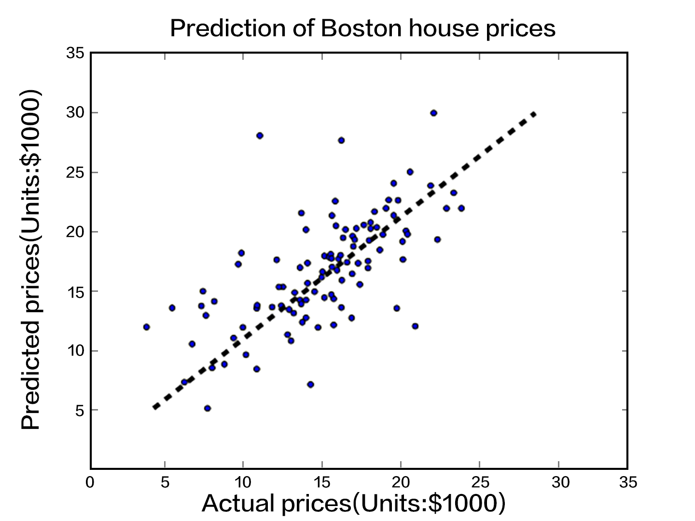
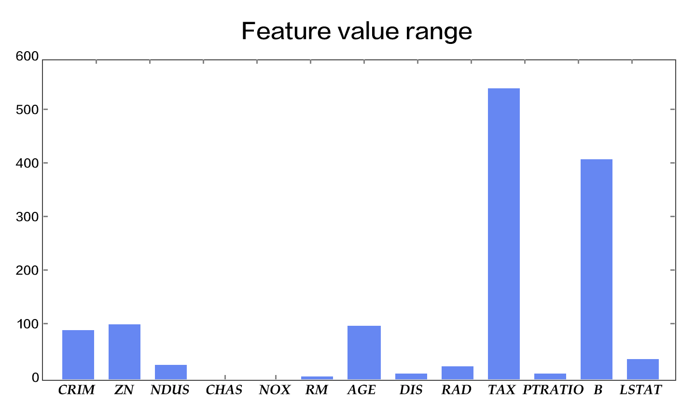
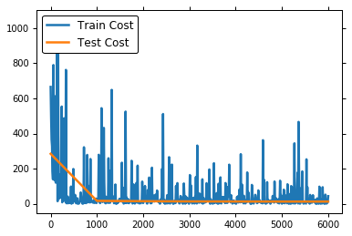

# Linear Regression

Let us begin the tutorial with a classical problem called Linear Regression \[[1](#References)\]. In this chapter, we will train a model from a realistic dataset to predict home prices. Some important concepts in Machine Learning will be covered through this example.

The source code for this tutorial lives on [book/fit_a_line](https://github.com/PaddlePaddle/book/tree/develop/01.fit_a_line). For instructions on getting started with PaddlePaddle, see [PaddlePaddle installation guide](https://github.com/PaddlePaddle/book/blob/develop/README.md#running-the-book).

## Problem Setup

Suppose we have a dataset of $n$ real estate properties. Each real estate property will be referred to as **homes** in this chapter for clarity.

Each home is associated with $d$ attributes. The attributes describe characteristics such as the number of rooms in the home, the number of schools or hospitals in the neighborhood, and the traffic condition nearby.

In our problem setup, the attribute $x_{i,j}$ denotes the $j$th characteristic of the $i$th home. In addition, $y_i$ denotes the price of the $i$th home. Our task is to predict $y_i$ given a set of attributes $\{x_{i,1}, ..., x_{i,d}\}$. We assume that the price of a home is a linear combination of all of its attributes, namely,

$$y_i = \omega_1x_{i,1} + \omega_2x_{i,2} + \ldots + \omega_dx_{i,d} + b,  i=1,\ldots,n$$

where $\vec{\omega}$ and $b$ are the model parameters we want to estimate. Once they are learned, we will be able to predict the price of a home, given the attributes associated with it. We call this model **Linear Regression**. In other words, we want to regress a value against several values linearly. In practice, a linear model is often too simplistic to capture the real relationships between the variables. Yet, because Linear Regression is easy to train and analyze, it has been applied to a large number of real problems. As a result, it is an important topic in many classic Statistical Learning and Machine Learning textbooks \[[2,3,4](#References)\].

## Results Demonstration
We first show the result of our model. The dataset [UCI Housing Data Set](https://archive.ics.uci.edu/ml/datasets/Housing) is used to train a linear model to predict the home prices in Boston. The figure below shows the predictions the model makes for some home prices. The $X$-axis represents the median value of the prices of similar homes within a bin, while the $Y$-axis represents the home value our linear model predicts. The dotted line represents points where $X=Y$. When reading the diagram, the closer the point is to the dotted line, better the model's prediction.
<p align="center">
    <br/>
    Figure 1. Predicted Value V.S. Actual Value
</p>

## Model Overview

### Model Definition

In the UCI Housing Data Set, there are 13 home attributes $\{x_{i,j}\}$ that are related to the median home price $y_i$, which we aim to predict. Thus, our model can be written as:

$$\hat{Y} = \omega_1X_{1} + \omega_2X_{2} + \ldots + \omega_{13}X_{13} + b$$

where $\hat{Y}$ is the predicted value used to differentiate from actual value $Y$. The model learns parameters $\omega_1, \ldots, \omega_{13}, b$, where the entries of $\vec{\omega}$ are **weights** and $b$ is **bias**.

Now we need an objective to optimize, so that the learned parameters can make $\hat{Y}$ as close to $Y$ as possible. Let's refer to the concept of [Loss Function (Cost Function)](https://en.wikipedia.org/wiki/Loss_function). A loss function must output a non-negative value, given any pair of the actual value $y_i$ and the predicted value $\hat{y_i}$. This value reflects the magnitutude of the model error.

For Linear Regression, the most common loss function is [Mean Square Error (MSE)](https://en.wikipedia.org/wiki/Mean_squared_error) which has the following form:

$$MSE=\frac{1}{n}\sum_{i=1}^{n}{(\hat{Y_i}-Y_i)}^2$$

That is, for a dataset of size $n$, MSE is the average value of the the prediction sqaure errors.

### Training Process

After setting up our model, there are several major steps to go through to train it:
1. Initialize the parameters including the weights $\vec{\omega}$ and the bias $b$. For example, we can set their mean values as $0$s, and their standard deviations as $1$s.
2. Feedforward. Evaluate the network output and compute the corresponding loss.
3. [Backpropagate](https://en.wikipedia.org/wiki/Backpropagation) the errors. The errors will be propagated from the output layer back to the input layer, during which the model parameters will be updated with the corresponding errors.
4. Repeat steps 2~3, until the loss is below a predefined threshold or the maximum number of epochs is reached.

## Dataset

### An Introduction of the Dataset

The UCI housing dataset has 506 instances. Each instance describes the attributes of a house in surburban Boston.  The attributes are explained below:

| Attribute Name | Characteristic | Data Type |
| ------| ------ | ------ |
| CRIM | per capita crime rate by town | Continuous|
| ZN | proportion of residential land zoned for lots over 25,000 sq.ft. | Continuous |
| INDUS | proportion of non-retail business acres per town | Continuous |
| CHAS | Charles River dummy variable | Discrete, 1 if tract bounds river; 0 otherwise|
| NOX | nitric oxides concentration (parts per 10 million) | Continuous |
| RM | average number of rooms per dwelling | Continuous |
| AGE | proportion of owner-occupied units built prior to 1940 | Continuous |
| DIS | weighted distances to five Boston employment centres | Continuous |
| RAD | index of accessibility to radial highways | Continuous |
| TAX | full-value property-tax rate per \$10,000 | Continuous |
| PTRATIO | pupil-teacher ratio by town | Continuous |
| B | 1000(Bk - 0.63)^2 where Bk is the proportion of blacks by town | Continuous |
| LSTAT | % lower status of the population | Continuous |
| MEDV | Median value of owner-occupied homes in $1000's | Continuous |

The last entry is the median home price.

### Preprocessing

#### Continuous and Discrete Data

We define a feature vector of length 13 for each home, where each entry corresponds to an attribute. Our first observation is that, among the 13 dimensions, there are 12 continuous dimensions and 1 discrete dimension.

Note that although a discrete value is also written as numeric values such as 0, 1, or 2, its meaning differs from a continuous value drastically.  The linear difference between two discrete values has no meaning. For example, suppose $0$, $1$, and $2$ are used to represent colors *Red*, *Green*, and *Blue* respectively. Judging from the numeric representation of these colors, *Red* differs more from *Blue* than it does from *Green*. Yet in actuality, it is not true that extent to which the color *Blue* is different from *Red* is greater than the extent to which *Green* is different from *Red*. Therefore, when handling a discrete feature that has $d$ possible values, we usually convert it to $d$ new features where each feature takes a binary value, $0$ or $1$, indicating whether the original value is absent or present. Alternatively, the discrete features can be mapped onto a continuous multi-dimensional vector through an embedding table. For our problem here, because CHAS itself is a binary discrete value, we do not need to do any preprocessing.

#### Feature Normalization

We also observe a huge difference among the value ranges of the 13 features (Figure 2). For instance, the values of feature *B* fall in $[0.32, 396.90]$, whereas those of feature *NOX* has a range of $[0.3850, 0.8170]$. An effective optimization would require data normalization. The goal of data normalization is to scale the values of each feature into roughly the same range, perhaps $[-0.5, 0.5]$. Here, we adopt a popular normalization technique where we subtract the mean value from the feature value and divide the result by the width of the original range.

There are at least three reasons for [Feature Normalization](https://en.wikipedia.org/wiki/Feature_scaling) (Feature Scaling):
- A value range that is too large or too small might cause floating number overflow or underflow during computation.
- Different value ranges might result in varying *importances* of different features to the model (at least in the beginning of the training process). This assumption about the data is often unreasonable, making the optimization difficult, which in turn results in increased training time.
- Many machine learning techniques or models (e.g., *L1/L2 regularization* and *Vector Space Model*) assumes that all the features have roughly zero means and their value ranges are similar.

<p align="center">
    <br/>
    Figure 2. The value ranges of the features
</p>

#### Prepare Training and Test Sets

We split the dataset in two, one for adjusting the model parameters, namely, for training the model, and the other for testing. The model error on the former is called the **training error**, and the error on the latter is called the **test error**. Our goal in training a model is to find the statistical dependency between the outputs and the inputs, so that we can predict outputs given new inputs. As a result, the test error reflects the performance of the model better than the training error does. We consider two things when deciding the ratio of the training set to the test set: 1) More training data will decrease the variance of the parameter estimation, yielding more reliable models; 2) More test data will decrease the variance of the test error, yielding more reliable test errors. One standard split ratio is $8:2$.

When training complex models, we usually have one more split: the validation set. Complex models usually have [Hyperparameters](https://en.wikipedia.org/wiki/Hyperparameter_optimization) that need to be set before the training process, such as the number of layers in the network. Because hyperparameters are not part of the model parameters, they cannot be trained using the same loss function. Thus we will try several sets of hyperparameters to train several models and cross-validate them on the validation set to pick the best one; finally, the selected trained model is tested on the test set. Because our model is relatively simple, we will omit this validation process.

## Training

`fit_a_line/trainer.py` demonstrates the training using [PaddlePaddle](http://paddlepaddle.org).

### Datafeeder Configuration

Our program starts with importing necessary packages:

```python
import paddle
import paddle.fluid as fluid
import numpy
from __future__ import print_function
try:
    from paddle.fluid.contrib.trainer import *
    from paddle.fluid.contrib.inferencer import *
except ImportError:
    print(
        "In the fluid 1.0, the trainer and inferencer are moving to paddle.fluid.contrib",
        file=sys.stderr)
    from paddle.fluid.trainer import *
    from paddle.fluid.inferencer import *

```

We encapsulated the [UCI Housing Data Set](https://archive.ics.uci.edu/ml/datasets/Housing) in our Python module `uci_housing`.  This module can

1. download the dataset to `~/.cache/paddle/dataset/uci_housing/housing.data`, if you haven't yet, and
2.  [preprocess](#preprocessing) the dataset.


We define data feeders for test and train. The feeder reads a `BATCH_SIZE` of data each time and feed them to the training/testing process. If the user wants some randomness on the data order, she can define both a `BATCH_SIZE` and a `buf_size`. That way the datafeeder will yield the first `BATCH_SIZE` data out of a shuffle of the first `buf_size` data.

```python
BATCH_SIZE = 20

train_reader = paddle.batch(
    paddle.reader.shuffle(
        paddle.dataset.uci_housing.train(), buf_size=500),
    batch_size=BATCH_SIZE)

test_reader = paddle.batch(
    paddle.reader.shuffle(
        paddle.dataset.uci_housing.test(), buf_size=500),
    batch_size=BATCH_SIZE)
```

### Train Program Configuration

`train_program` sets up the network structure of this current training model. For linear regression, it is simply a fully connected layer from the input to the output. More complex structures like CNN and RNN will be introduced in later chapters. The `train_program` must return an avg_loss as its first returned parameter because it is needed in backpropagation.

```python
def train_program():
    y = fluid.layers.data(name='y', shape=[1], dtype='float32')

    # feature vector of length 13
    x = fluid.layers.data(name='x', shape=[13], dtype='float32')
    y_predict = fluid.layers.fc(input=x, size=1, act=None)

    loss = fluid.layers.square_error_cost(input=y_predict, label=y)
    avg_loss = fluid.layers.mean(loss)

    return avg_loss
```

### Optimizer Function Configuration

In the following `SGD` optimizer, `learning_rate` specifies the learning rate in the optimization procedure.

```python
def optimizer_program():
    return fluid.optimizer.SGD(learning_rate=0.001)
```

### Specify Place

Specify your training environment, you should specify if the training is on CPU or GPU.

```python
use_cuda = False
place = fluid.CUDAPlace(0) if use_cuda else fluid.CPUPlace()
```

### Create Trainer

The trainer will take the `train_program` as input.

```python
trainer = Trainer(
    train_func=train_program,
    place=place,
    optimizer_func=optimizer_program)
```

### Feeding Data

PaddlePaddle provides the
[reader mechanism](https://github.com/PaddlePaddle/Paddle/tree/develop/doc/design/reader)
for loading the training data. A reader may return multiple columns, and we need a Python dictionary to specify the mapping from column index to data layers.

```python
feed_order=['x', 'y']
```

Moreover, an event handler is provided to print the training progress:

```python
# Specify the directory to save the parameters
params_dirname = "fit_a_line.inference.model"


train_title = "Train cost"
test_title = "Test cost"

step = 0

# event_handler prints training and testing info
def event_handler(event):
    global step
    if isinstance(event, EndStepEvent):
        if step % 10 == 0:   # record a train cost every 10 batches
            print("%s, Step %d, Cost %f" % (train_title, step, event.metrics[0]))

        if step % 100 == 0:  # record a test cost every 100 batches
            test_metrics = trainer.test(
                reader=test_reader, feed_order=feed_order)
            print("%s, Step %d, Cost %f" % (test_title, step, test_metrics[0]))
            if test_metrics[0] < 10.0:
                # If the accuracy is good enough, we can stop the training.
                print('loss is less than 10.0, stop')
                trainer.stop()
        step += 1

    if isinstance(event, EndEpochEvent):
        if event.epoch % 10 == 0:
            # We can save the trained parameters for the inferences later
            if params_dirname is not None:
                trainer.save_params(params_dirname)

```

### Start Training

We now can start training by calling `trainer.train()`.

```python
%matplotlib inline

# The training could take up to a few minutes.
trainer.train(
    reader=train_reader,
    num_epochs=100,
    event_handler=event_handler,
    feed_order=feed_order)

```



## Inference

Initialize the Inferencer with the inference_program and the params_dirname, which is where we saved our params

### Setup the Inference Program

Similar to the trainer.train, the Inferencer needs to take an inference_program to do inference.
Prune the train_program to only have the y_predict.

```python
def inference_program():
    x = fluid.layers.data(name='x', shape=[13], dtype='float32')
    y_predict = fluid.layers.fc(input=x, size=1, act=None)
    return y_predict
```

### Infer

Inferencer will load the trained model from `params_dirname` and use it to infer the unseen data.

```python
inferencer = Inferencer(
    infer_func=inference_program, param_path=params_dirname, place=place)

batch_size = 10
test_reader = paddle.batch(paddle.dataset.uci_housing.test(),batch_size=batch_size)
test_data = next(test_reader())
test_x = numpy.array([data[0] for data in test_data]).astype("float32")
test_y = numpy.array([data[1] for data in test_data]).astype("float32")

results = inferencer.infer({'x': test_x})

print("infer results: (House Price)")
for idx, val in enumerate(results[0]):
    print("%d: %.2f" % (idx, val))

print("\nground truth:")
for idx, val in enumerate(test_y):
    print("%d: %.2f" % (idx, val))
```

## Summary

This chapter introduces *Linear Regression* and how to train and test this model with PaddlePaddle, using the UCI Housing Data Set. Because a large number of more complex models and techniques are derived from linear regression, it is important to understand its underlying theory and limitation.

## References

1. https://en.wikipedia.org/wiki/Linear_regression
2. Friedman J, Hastie T, Tibshirani R. The elements of statistical learning[M]. Springer, Berlin: Springer series in statistics, 2001.
3. Murphy K P. Machine learning: a probabilistic perspective[M]. MIT press, 2012.
4. Bishop C M. Pattern recognition[J]. Machine Learning, 2006, 128.

<br/>
This tutorial is contributed by <a xmlns:cc="http://creativecommons.org/ns#" href="http://book.paddlepaddle.org" property="cc:attributionName" rel="cc:attributionURL">PaddlePaddle</a>, and licensed under a <a rel="license" href="http://creativecommons.org/licenses/by-sa/4.0/">Creative Commons Attribution-ShareAlike 4.0 International License</a>.
