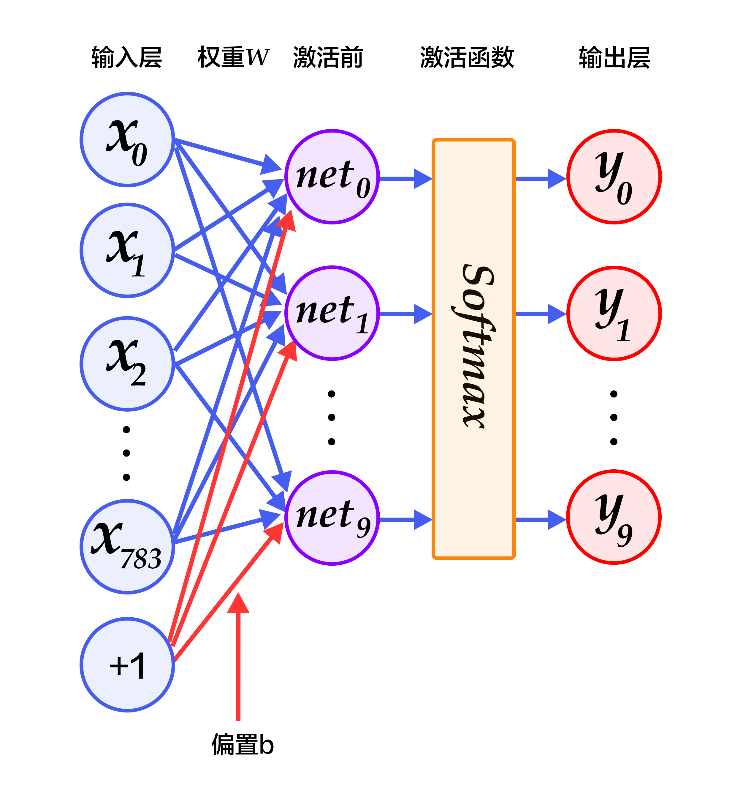
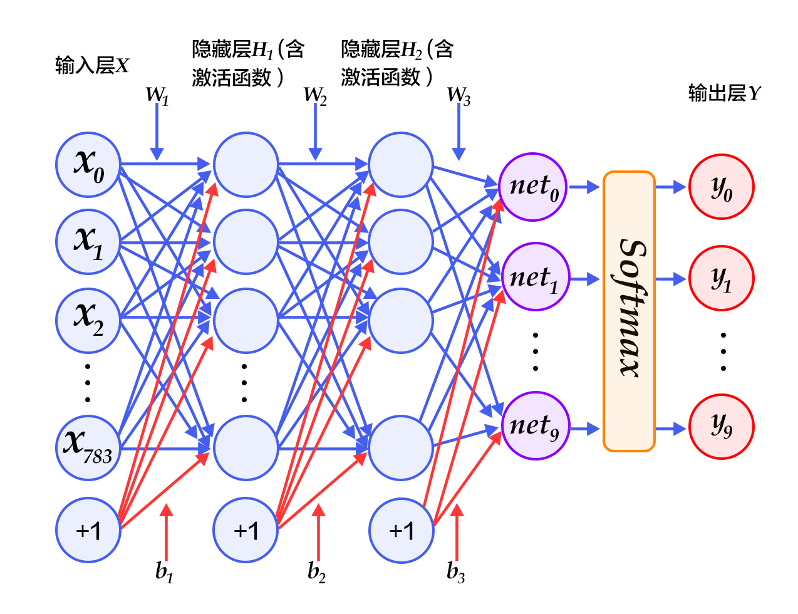
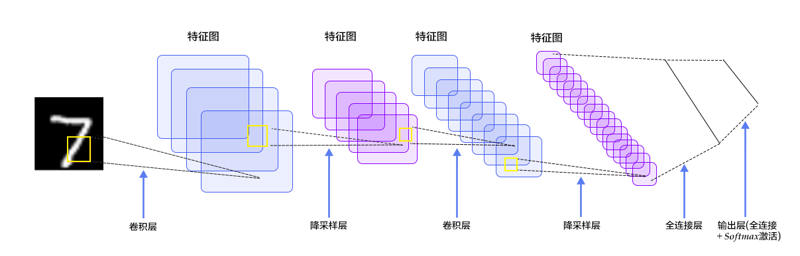
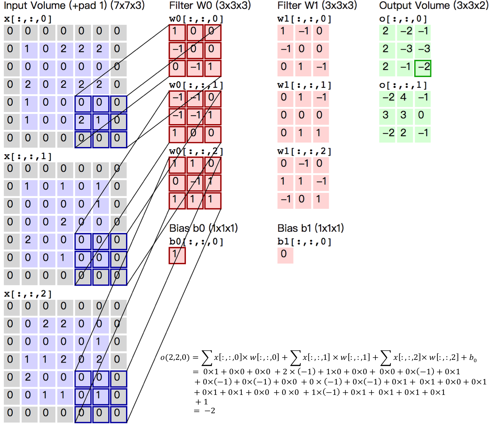
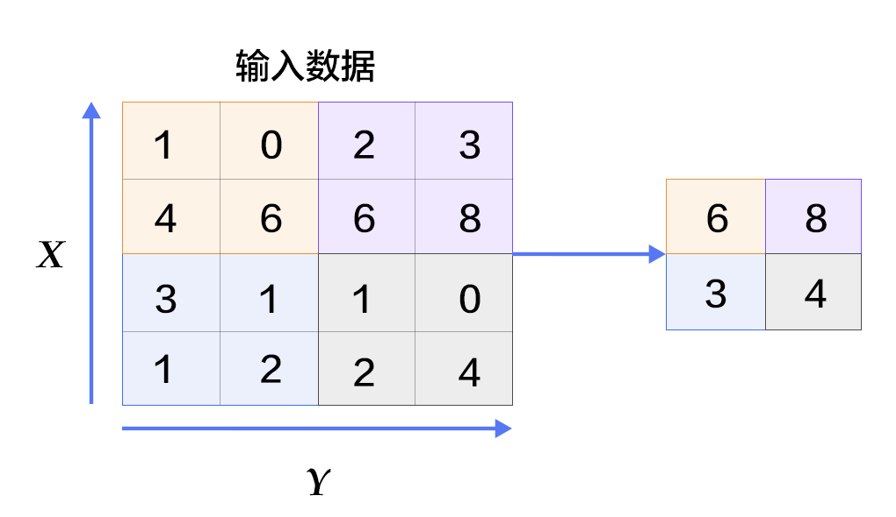

# 识别数字

本教程源代码目录在[book/recognize_digits](https://github.com/PaddlePaddle/book/tree/develop/02.recognize_digits)， 初次使用请参考PaddlePaddle[安装教程](https://github.com/PaddlePaddle/book/blob/develop/README.cn.md#运行这本书)，更多内容请参考本教程的[视频课堂](http://bit.baidu.com/course/detail/id/167.html)。

## 背景介绍
当我们学习编程的时候，编写的第一个程序一般是实现打印"Hello World"。而机器学习（或深度学习）的入门教程，一般都是 [MNIST](http://yann.lecun.com/exdb/mnist/) 数据库上的手写识别问题。原因是手写识别属于典型的图像分类问题，比较简单，同时MNIST数据集也很完备。MNIST数据集作为一个简单的计算机视觉数据集，包含一系列如图1所示的手写数字图片和对应的标签。图片是28x28的像素矩阵，标签则对应着0~9的10个数字。每张图片都经过了大小归一化和居中处理。

<p align="center">
<br/>
图1. MNIST图片示例
</p>

MNIST数据集是从 [NIST](https://www.nist.gov/srd/nist-special-database-19) 的Special Database 3（SD-3）和Special Database 1（SD-1）构建而来。由于SD-3是由美国人口调查局的员工进行标注，SD-1是由美国高中生进行标注，因此SD-3比SD-1更干净也更容易识别。Yann LeCun等人从SD-1和SD-3中各取一半作为MNIST的训练集（60000条数据）和测试集（10000条数据），其中训练集来自250位不同的标注员，此外还保证了训练集和测试集的标注员是不完全相同的。

Yann LeCun早先在手写字符识别上做了很多研究，并在研究过程中提出了卷积神经网络（Convolutional Neural Network），大幅度地提高了手写字符的识别能力，也因此成为了深度学习领域的奠基人之一。如今的深度学习领域，卷积神经网络占据了至关重要的地位，从最早Yann LeCun提出的简单LeNet，到如今ImageNet大赛上的优胜模型VGGNet、GoogLeNet、ResNet等（请参见[图像分类](https://github.com/PaddlePaddle/book/tree/develop/03.image_classification) 教程），人们在图像分类领域，利用卷积神经网络得到了一系列惊人的结果。

有很多算法在MNIST上进行实验。1998年，LeCun分别用单层线性分类器、多层感知器（Multilayer Perceptron, MLP）和多层卷积神经网络LeNet进行实验，使得测试集上的误差不断下降（从12%下降到0.7%）\[[1](#参考文献)\]。此后，科学家们又基于K近邻（K-Nearest Neighbors）算法\[[2](#参考文献)\]、支持向量机（SVM）\[[3](#参考文献)\]、神经网络\[[4-7](#参考文献)\]和Boosting方法\[[8](#参考文献)\]等做了大量实验，并采用多种预处理方法（如去除歪曲、去噪、模糊等）来提高识别的准确率。

本教程中，我们从简单的模型Softmax回归开始，带大家入门手写字符识别，并逐步进行模型优化。


## 模型概览

基于MNIST数据训练一个分类器，在介绍本教程使用的三个基本图像分类网络前，我们先给出一些定义：
- $X$是输入：MNIST图片是$28\times28$ 的二维图像，为了进行计算，我们将其转化为$784$维向量，即$X=\left ( x_0, x_1, \dots, x_{783} \right )$。
- $Y$是输出：分类器的输出是10类数字（0-9），即$Y=\left ( y_0, y_1, \dots, y_9 \right )$，每一维$y_i$代表图片分类为第$i$类数字的概率。
- $L$是图片的真实标签：$L=\left ( l_0, l_1, \dots, l_9 \right )$也是10维，但只有一维为1，其他都为0。

### Softmax回归(Softmax Regression)

最简单的Softmax回归模型是先将输入层经过一个全连接层得到的特征，然后直接通过softmax 函数进行多分类\[[9](#参考文献)\]。

输入层的数据$X$传到输出层，在激活操作之前，会乘以相应的权重 $W$ ，并加上偏置变量 $b$ ，具体如下：

$$ y_i = \text{softmax}(\sum_j W_{i,j}x_j + b_i) $$

其中 $ \text{softmax}(x_i) = \frac{e^{x_i}}{\sum_j e^{x_j}} $

对于有 $N$ 个类别的多分类问题，指定 $N$ 个输出节点，$N$ 维结果向量经过softmax将归一化为 $N$ 个[0,1]范围内的实数值，分别表示该样本属于这 $N$ 个类别的概率。此处的 $y_i$ 即对应该图片为数字 $i$ 的预测概率。

在分类问题中，我们一般采用交叉熵代价损失函数（cross entropy），公式如下：

$$  \text{crossentropy}(label, y) = -\sum_i label_ilog(y_i) $$

图2为softmax回归的网络图，图中权重用蓝线表示、偏置用红线表示、+1代表偏置参数的系数为1。

<p align="center">
<br/>
图2. softmax回归网络结构图<br/>
</p>

### 多层感知器(Multilayer Perceptron, MLP)

Softmax回归模型采用了最简单的两层神经网络，即只有输入层和输出层，因此其拟合能力有限。为了达到更好的识别效果，我们考虑在输入层和输出层中间加上若干个隐藏层\[[10](#参考文献)\]。

1.  经过第一个隐藏层，可以得到 $ H_1 = \phi(W_1X + b_1) $，其中$\phi$代表激活函数，常见的有sigmoid、tanh或ReLU等函数。
2.  经过第二个隐藏层，可以得到 $ H_2 = \phi(W_2H_1 + b_2) $。
3.  最后，再经过输出层，得到的$Y=\text{softmax}(W_3H_2 + b_3)$，即为最后的分类结果向量。


图3为多层感知器的网络结构图，图中权重用蓝线表示、偏置用红线表示、+1代表偏置参数的系数为1。

<p align="center">
<br/>
图3. 多层感知器网络结构图<br/>
</p>

### 卷积神经网络(Convolutional Neural Network, CNN)

在多层感知器模型中，将图像展开成一维向量输入到网络中，忽略了图像的位置和结构信息，而卷积神经网络能够更好的利用图像的结构信息。[LeNet-5](http://yann.lecun.com/exdb/lenet/)是一个较简单的卷积神经网络。图4显示了其结构：输入的二维图像，先经过两次卷积层到池化层，再经过全连接层，最后使用softmax分类作为输出层。下面我们主要介绍卷积层和池化层。

<p align="center">
<br/>
图4. LeNet-5卷积神经网络结构<br/>
</p>

#### 卷积层

卷积层是卷积神经网络的核心基石。在图像识别里我们提到的卷积是二维卷积，即离散二维滤波器（也称作卷积核）与二维图像做卷积操作，简单的讲是二维滤波器滑动到二维图像上所有位置，并在每个位置上与该像素点及其领域像素点做内积。卷积操作被广泛应用与图像处理领域，不同卷积核可以提取不同的特征，例如边沿、线性、角等特征。在深层卷积神经网络中，通过卷积操作可以提取出图像低级到复杂的特征。

<p align="center">
<br/>
图5. 卷积层图片<br/>
</p>

图5给出一个卷积计算过程的示例图，输入图像大小为$H=5,W=5,D=3$，即$5 \times 5$大小的3通道（RGB，也称作深度）彩色图像。这个示例图中包含两（用$K$表示）组卷积核，即图中滤波器$W_0$和$W_1$。在卷积计算中，通常对不同的输入通道采用不同的卷积核，如图示例中每组卷积核包含（$D=3）$个$3 \times 3$（用$F \times F$表示）大小的卷积核。另外，这个示例中卷积核在图像的水平方向（$W$方向）和垂直方向（$H$方向）的滑动步长为2（用$S$表示）；对输入图像周围各填充1（用$P$表示）个0，即图中输入层原始数据为蓝色部分，灰色部分是进行了大小为1的扩展，用0来进行扩展。经过卷积操作得到输出为$3 \times 3 \times 2$（用$H_{o} \times W_{o} \times K$表示）大小的特征图，即$3 \times 3$大小的2通道特征图，其中$H_o$计算公式为：$H_o = (H - F + 2 \times P)/S + 1$，$W_o$同理。 而输出特征图中的每个像素，是每组滤波器与输入图像每个特征图的内积再求和，再加上偏置$b_o$，偏置通常对于每个输出特征图是共享的。输出特征图$o[:,:,0]$中的最后一个$-2$计算如图5右下角公式所示。

在卷积操作中卷积核是可学习的参数，经过上面示例介绍，每层卷积的参数大小为$D \times F \times F \times K$。在多层感知器模型中，神经元通常是全部连接，参数较多。而卷积层的参数较少，这也是由卷积层的主要特性即局部连接和共享权重所决定。

- 局部连接：每个神经元仅与输入神经元的一块区域连接，这块局部区域称作感受野（receptive field）。在图像卷积操作中，即神经元在空间维度（spatial dimension，即上图示例H和W所在的平面）是局部连接，但在深度上是全部连接。对于二维图像本身而言，也是局部像素关联较强。这种局部连接保证了学习后的过滤器能够对于局部的输入特征有最强的响应。局部连接的思想，也是受启发于生物学里面的视觉系统结构，视觉皮层的神经元就是局部接受信息的。

- 权重共享：计算同一个深度切片的神经元时采用的滤波器是共享的。例如图4中计算$o[:,:,0]$的每个每个神经元的滤波器均相同，都为$W_0$，这样可以很大程度上减少参数。共享权重在一定程度上讲是有意义的，例如图片的底层边缘特征与特征在图中的具体位置无关。但是在一些场景中是无意的，比如输入的图片是人脸，眼睛和头发位于不同的位置，希望在不同的位置学到不同的特征 (参考[斯坦福大学公开课]( http://cs231n.github.io/convolutional-networks/))。请注意权重只是对于同一深度切片的神经元是共享的，在卷积层，通常采用多组卷积核提取不同特征，即对应不同深度切片的特征，不同深度切片的神经元权重是不共享。另外，偏重对同一深度切片的所有神经元都是共享的。

通过介绍卷积计算过程及其特性，可以看出卷积是线性操作，并具有平移不变性（shift-invariant），平移不变性即在图像每个位置执行相同的操作。卷积层的局部连接和权重共享使得需要学习的参数大大减小，这样也有利于训练较大卷积神经网络。

#### 池化层

<p align="center">
<br/>
图6. 池化层图片<br/>
</p>

池化是非线性下采样的一种形式，主要作用是通过减少网络的参数来减小计算量，并且能够在一定程度上控制过拟合。通常在卷积层的后面会加上一个池化层。池化包括最大池化、平均池化等。其中最大池化是用不重叠的矩形框将输入层分成不同的区域，对于每个矩形框的数取最大值作为输出层，如图6所示。

更详细的关于卷积神经网络的具体知识可以参考[斯坦福大学公开课]( http://cs231n.github.io/convolutional-networks/ )和[图像分类](https://github.com/PaddlePaddle/book/blob/develop/image_classification/README.md)教程。

### 常见激活函数介绍  
- sigmoid激活函数： $ f(x) = sigmoid(x) = \frac{1}{1+e^{-x}} $

- tanh激活函数： $ f(x) = tanh(x) = \frac{e^x-e^{-x}}{e^x+e^{-x}} $

  实际上，tanh函数只是规模变化的sigmoid函数，将sigmoid函数值放大2倍之后再向下平移1个单位：tanh(x) = 2sigmoid(2x) - 1 。

- ReLU激活函数： $ f(x) = max(0, x) $

更详细的介绍请参考[维基百科激活函数](https://en.wikipedia.org/wiki/Activation_function)。

## 数据介绍

PaddlePaddle在API中提供了自动加载[MNIST](http://yann.lecun.com/exdb/mnist/)数据的模块`paddle.dataset.mnist`。加载后的数据位于`/home/username/.cache/paddle/dataset/mnist`下：


|    文件名称          |       说明              |
|----------------------|-------------------------|
|train-images-idx3-ubyte|  训练数据图片，60,000条数据 |
|train-labels-idx1-ubyte|  训练数据标签，60,000条数据 |
|t10k-images-idx3-ubyte |  测试数据图片，10,000条数据 |
|t10k-labels-idx1-ubyte |  测试数据标签，10,000条数据 |

## 配置说明

首先，加载PaddlePaddle的V2 api包。

```python
import paddle.v2 as paddle
```
其次，定义三个不同的分类器：

- Softmax回归：只通过一层简单的以softmax为激活函数的全连接层，就可以得到分类的结果。

```python
def softmax_regression(img):
    predict = paddle.layer.fc(input=img,
                              size=10,
                              act=paddle.activation.Softmax())
    return predict
```
- 多层感知器：下面代码实现了一个含有两个隐藏层（即全连接层）的多层感知器。其中两个隐藏层的激活函数均采用ReLU，输出层的激活函数用Softmax。

```python
def multilayer_perceptron(img):
    # 第一个全连接层，激活函数为ReLU
    hidden1 = paddle.layer.fc(input=img, size=128, act=paddle.activation.Relu())
    # 第二个全连接层，激活函数为ReLU
    hidden2 = paddle.layer.fc(input=hidden1,
                              size=64,
                              act=paddle.activation.Relu())
    # 以softmax为激活函数的全连接输出层，输出层的大小必须为数字的个数10
    predict = paddle.layer.fc(input=hidden2,
                              size=10,
                              act=paddle.activation.Softmax())
    return predict
```
- 卷积神经网络LeNet-5: 输入的二维图像，首先经过两次卷积层到池化层，再经过全连接层，最后使用以softmax为激活函数的全连接层作为输出层。

```python
def convolutional_neural_network(img):
    # 第一个卷积-池化层
    conv_pool_1 = paddle.networks.simple_img_conv_pool(
        input=img,
        filter_size=5,
        num_filters=20,
        num_channel=1,
        pool_size=2,
        pool_stride=2,
        act=paddle.activation.Relu())
    # 第二个卷积-池化层
    conv_pool_2 = paddle.networks.simple_img_conv_pool(
        input=conv_pool_1,
        filter_size=5,
        num_filters=50,
        num_channel=20,
        pool_size=2,
        pool_stride=2,
        act=paddle.activation.Relu())
    # 以softmax为激活函数的全连接输出层，输出层的大小必须为数字的个数10
    predict = paddle.layer.fc(input=conv_pool_2,
                              size=10,
                              act=paddle.activation.Softmax())
    return predict
```

接着，通过`layer.data`调用来获取数据，然后调用分类器（这里我们提供了三个不同的分类器）得到分类结果。训练时，对该结果计算其损失函数，分类问题常常选择交叉熵损失函数。

```python
# 该模型运行在单个CPU上
paddle.init(use_gpu=False, trainer_count=1)

images = paddle.layer.data(
    name='pixel', type=paddle.data_type.dense_vector(784))
label = paddle.layer.data(
    name='label', type=paddle.data_type.integer_value(10))

# predict = softmax_regression(images) # Softmax回归
# predict = multilayer_perceptron(images) #多层感知器
predict = convolutional_neural_network(images) #LeNet5卷积神经网络

cost = paddle.layer.classification_cost(input=predict, label=label)
```

然后，指定训练相关的参数。
- 训练方法（optimizer)： 代表训练过程在更新权重时采用动量优化器 `Momentum` ，其中参数0.9代表动量优化每次保持前一次速度的0.9倍。
- 训练速度（learning_rate）： 迭代的速度，与网络的训练收敛速度有关系。
- 正则化（regularization）： 是防止网络过拟合的一种手段，此处采用L2正则化。

```python
parameters = paddle.parameters.create(cost)

optimizer = paddle.optimizer.Momentum(
    learning_rate=0.1 / 128.0,
    momentum=0.9,
    regularization=paddle.optimizer.L2Regularization(rate=0.0005 * 128))

trainer = paddle.trainer.SGD(cost=cost,
                             parameters=parameters,
                             update_equation=optimizer)
```

下一步，我们开始训练过程。`paddle.dataset.movielens.train()`和`paddle.dataset.movielens.test()`分别做训练和测试数据集。这两个函数各自返回一个reader——PaddlePaddle中的reader是一个Python函数，每次调用的时候返回一个Python yield generator。

下面`shuffle`是一个reader decorator，它接受一个reader A，返回另一个reader B —— reader B 每次读入`buffer_size`条训练数据到一个buffer里，然后随机打乱其顺序，并且逐条输出。

`batch`是一个特殊的decorator，它的输入是一个reader，输出是一个batched reader —— 在PaddlePaddle里，一个reader每次yield一条训练数据，而一个batched reader每次yield一个minibatch。

`event_handler_plot`可以用来在训练过程中画图如下：


```python
from paddle.v2.plot import Ploter

train_title = "Train cost"
test_title = "Test cost"
cost_ploter = Ploter(train_title, test_title)

step = 0

# event_handler to plot a figure
def event_handler_plot(event):
    global step
    if isinstance(event, paddle.event.EndIteration):
        if step % 100 == 0:
            cost_ploter.append(train_title, step, event.cost)
            cost_ploter.plot()
        step += 1
    if isinstance(event, paddle.event.EndPass):
        # save parameters
        with open('params_pass_%d.tar' % event.pass_id, 'w') as f:
            trainer.save_parameter_to_tar(f)

        result = trainer.test(reader=paddle.batch(
            paddle.dataset.mnist.test(), batch_size=128))
        cost_ploter.append(test_title, step, result.cost)
```

`event_handler` 用来在训练过程中输出训练结果
```python
lists = []

def event_handler(event):
    if isinstance(event, paddle.event.EndIteration):
        if event.batch_id % 100 == 0:
            print "Pass %d, Batch %d, Cost %f, %s" % (
                event.pass_id, event.batch_id, event.cost, event.metrics)
    if isinstance(event, paddle.event.EndPass):
        # save parameters
        with open('params_pass_%d.tar' % event.pass_id, 'w') as f:
            trainer.save_parameter_to_tar(f)

        result = trainer.test(reader=paddle.batch(
            paddle.dataset.mnist.test(), batch_size=128))
        print "Test with Pass %d, Cost %f, %s\n" % (
            event.pass_id, result.cost, result.metrics)
        lists.append((event.pass_id, result.cost,
                      result.metrics['classification_error_evaluator']))
```

```python
trainer.train(
    reader=paddle.batch(
        paddle.reader.shuffle(
            paddle.dataset.mnist.train(), buf_size=8192),
        batch_size=128),
    event_handler=event_handler_plot,
    num_passes=5)
```

训练过程是完全自动的，event_handler里打印的日志类似如下所示：

```
# Pass 0, Batch 0, Cost 2.780790, {'classification_error_evaluator': 0.9453125}
# Pass 0, Batch 100, Cost 0.635356, {'classification_error_evaluator': 0.2109375}
# Pass 0, Batch 200, Cost 0.326094, {'classification_error_evaluator': 0.1328125}
# Pass 0, Batch 300, Cost 0.361920, {'classification_error_evaluator': 0.1015625}
# Pass 0, Batch 400, Cost 0.410101, {'classification_error_evaluator': 0.125}
# Test with Pass 0, Cost 0.326659, {'classification_error_evaluator': 0.09470000118017197}
```

训练之后，检查模型的预测准确度。用 MNIST 训练的时候，一般 softmax回归模型的分类准确率为约为 92.34%，多层感知器为97.66%，卷积神经网络可以达到 99.20%。


## 应用模型

可以使用训练好的模型对手写体数字图片进行分类，下面程序展示了如何使用paddle.infer接口进行推断。

```python
from PIL import Image
import numpy as np
import os
def load_image(file):
    im = Image.open(file).convert('L')
    im = im.resize((28, 28), Image.ANTIALIAS)
    im = np.array(im).astype(np.float32).flatten()
    im = im / 255.0 * 2.0 - 1.0
    return im

test_data = []
cur_dir = os.getcwd()
test_data.append((load_image(cur_dir + '/image/infer_3.png'),))

probs = paddle.infer(
    output_layer=predict, parameters=parameters, input=test_data)
lab = np.argsort(-probs) # probs and lab are the results of one batch data
print "Label of image/infer_3.png is: %d" % lab[0][0]
```

## 总结

本教程的softmax回归、多层感知器和卷积神经网络是最基础的深度学习模型，后续章节中复杂的神经网络都是从它们衍生出来的，因此这几个模型对之后的学习大有裨益。同时，我们也观察到从最简单的softmax回归变换到稍复杂的卷积神经网络的时候，MNIST数据集上的识别准确率有了大幅度的提升，原因是卷积层具有局部连接和共享权重的特性。在之后学习新模型的时候，希望大家也要深入到新模型相比原模型带来效果提升的关键之处。此外，本教程还介绍了PaddlePaddle模型搭建的基本流程，从dataprovider的编写、网络层的构建，到最后的训练和预测。对这个流程熟悉以后，大家就可以用自己的数据，定义自己的网络模型，并完成自己的训练和预测任务了。

## 参考文献

1. LeCun, Yann, Léon Bottou, Yoshua Bengio, and Patrick Haffner. ["Gradient-based learning applied to document recognition."](http://ieeexplore.ieee.org/abstract/document/726791/) Proceedings of the IEEE 86, no. 11 (1998): 2278-2324.
2. Wejéus, Samuel. ["A Neural Network Approach to Arbitrary SymbolRecognition on Modern Smartphones."](http://www.diva-portal.org/smash/record.jsf?pid=diva2%3A753279&dswid=-434) (2014).
3. Decoste, Dennis, and Bernhard Schölkopf. ["Training invariant support vector machines."](http://link.springer.com/article/10.1023/A:1012454411458) Machine learning 46, no. 1-3 (2002): 161-190.
4. Simard, Patrice Y., David Steinkraus, and John C. Platt. ["Best Practices for Convolutional Neural Networks Applied to Visual Document Analysis."](http://citeseerx.ist.psu.edu/viewdoc/download?doi=10.1.1.160.8494&rep=rep1&type=pdf) In ICDAR, vol. 3, pp. 958-962. 2003.
5. Salakhutdinov, Ruslan, and Geoffrey E. Hinton. ["Learning a Nonlinear Embedding by Preserving Class Neighbourhood Structure."](http://www.jmlr.org/proceedings/papers/v2/salakhutdinov07a/salakhutdinov07a.pdf) In AISTATS, vol. 11. 2007.
6. Cireşan, Dan Claudiu, Ueli Meier, Luca Maria Gambardella, and Jürgen Schmidhuber. ["Deep, big, simple neural nets for handwritten digit recognition."](http://www.mitpressjournals.org/doi/abs/10.1162/NECO_a_00052) Neural computation 22, no. 12 (2010): 3207-3220.
7. Deng, Li, Michael L. Seltzer, Dong Yu, Alex Acero, Abdel-rahman Mohamed, and Geoffrey E. Hinton. ["Binary coding of speech spectrograms using a deep auto-encoder."](http://citeseerx.ist.psu.edu/viewdoc/download?doi=10.1.1.185.1908&rep=rep1&type=pdf) In Interspeech, pp. 1692-1695. 2010.
8. Kégl, Balázs, and Róbert Busa-Fekete. ["Boosting products of base classifiers."](http://dl.acm.org/citation.cfm?id=1553439) In Proceedings of the 26th Annual International Conference on Machine Learning, pp. 497-504. ACM, 2009.
9. Rosenblatt, Frank. ["The perceptron: A probabilistic model for information storage and organization in the brain."](http://psycnet.apa.org/journals/rev/65/6/386/) Psychological review 65, no. 6 (1958): 386.
10. Bishop, Christopher M. ["Pattern recognition."](http://users.isr.ist.utl.pt/~wurmd/Livros/school/Bishop%20-%20Pattern%20Recognition%20And%20Machine%20Learning%20-%20Springer%20%202006.pdf) Machine Learning 128 (2006): 1-58.

<br/>
<a rel="license" href="http://creativecommons.org/licenses/by-sa/4.0/"></a><br /><span xmlns:dct="http://purl.org/dc/terms/" href="http://purl.org/dc/dcmitype/Text" property="dct:title" rel="dct:type">本教程</span> 由 <a xmlns:cc="http://creativecommons.org/ns#" href="http://book.paddlepaddle.org" property="cc:attributionName" rel="cc:attributionURL">PaddlePaddle</a> 创作，采用 <a rel="license" href="http://creativecommons.org/licenses/by-sa/4.0/">知识共享 署名-相同方式共享 4.0 国际 许可协议</a>进行许可。
