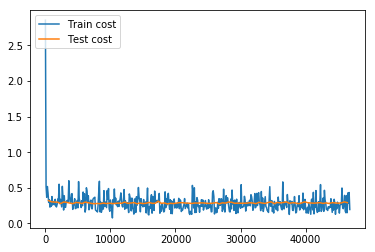

# Recognize Digits

The source code of this tutorial is in [book/recognize_digits](https://github.com/PaddlePaddle/book/tree/develop/02.recognize_digits). For new users, please refer to [Running This Book](https://github.com/PaddlePaddle/book/blob/develop/README.md#running-the-book) .

## Background
When we learning programming, the first program we write is generally to implement printing “Hello World”. But the tutorial of machine learning or deep learning for the beginner is usually handwriting recognition on the [MNIST](http://yann.lecun.com/exdb/mnist/) database. Because handwriting recognition is a typical classification problem, relatively simple and the MNIST dataset is complete. MNIST dataset as a simple computer vision dataset contains a series of pictures and corresponding labels of handwriting digits. The picture is a 28x28 pixel matrix, and the label corresponds to 10 numbers from 0 to 9. Each picture has been normalized in size and centered in the position.

<p align="center">
<br/>
Figure 1. Example of a MNIST picture
</p>

MNIST dataset is created from [NIST](https://www.nist.gov/srd/nist-special-database-19) Special Database 3（SD-3) and Special Database 1（SD-1). Because SD-3 is labeled by stuff of US Census Bureau and SD-1 is labeled by US high school students, so SD-3 is clearer and easier to be recognized than SD-1. Yann LeCun et al. pick half of SD-1 and half of SD-3 as train dataset (60000 data) and test dataset (10000 data).250 annotators labeled the training set, thus guaranteed that there wasn't a complete overlap of annotators of training set and test set.

MNIST attracts scholars to train model based on the dataset. In 1998, LeCun conducted experiments respectively using Single layer classifier, Multilayer Perceptron and Multilayer convolutional neural network LeNet, constantly decreasing the error on test dataset ( from 12% to 0.7%)\[[1](#References)\]。 In the process of research, LeCun, the pioneer in the field of deep learning, came up with Convolutional Neural Network, largely improving the performance of handwriting recognition. After that, researchers take a large number of experiments based on K-Nearest Neighbors algorithm\[[2](#References)\], SVM\[[3](#References)\], Neural Network\[[4-7](#References)\] and Boosting method\[[8](#References)\] and so on, with multiple pre-processing methods(like distortion removal, noise removal, and blurring) to upgrade accuracy of recognition.

Convolutional Neural Network plays an important role in the field of deep learning now. From simple LeNet proposed by Yann LeCun in early days to model VGGNet, GoogleNet, ResNet and so on in the ImageNet competition (please refer to [Image Classification](https://github.com/PaddlePaddle/book/tree/develop/03.image_classification) tutorial ), we have gain a serious of great achievements with convolutional neural network in the field of image classification.


In this tutorial, starting from simple Softmax regression model, we help you learn about handwriting recognition and introduce you how to upgrade model and how to use MLP and CNN to optimize recognition result.


## Exploration of Models

To train a classifier based on MNIST dataset, before the introduction of three basic image classification networks used in this tutorial, we first give some definitions:

- $X$ is the input: the MNIST image is a two-dimensional image of $28\times28$. For the calculation, we transform it into a $784$ dimensional vector, ie $X=\left ( x_0, x_1, \dots, x_{783} \right )$.

- $Y$ is the output: the output of the classifier is number (0-9), ie $Y=\left ( y_0, y_1, \dots, y_9 \right )$, and each dimension $y_i$ represents the probability of image classification as $i$th number.

- $Label$ is the actual label of the picture: $Label=\left ( l_0, l_1, \dots, l_9 \right ) $ is also 10 dimensions, but only one dimension represents 1, and the rest is 0. For example, if the number on an image is 2, its label is $(0,0,1,0, \dots, 0)$

### Softmax Regression

The simplest Softmax regression model is to get features with input layer passing through a fully connected layer and then compute and ouput probabilities of multiple classifications directly via Softmax function \[[9](#references)\].

The data of the input layer $X$ is passed to the output layer. The input $X$ is multiplied by weights $W$ and then added to the bias $b$ to generate activations:

$$ y_i = \text{softmax}(\sum_j W_{i,j}x_j + b_i) $$

where $ \text{softmax}(x_i) = \frac{e^{x_i}}{\sum_j e^{x_j}} $

Figure 2 is a network of softmax regression, in which weights are represented by blue lines, bias are represented by red lines, and +1 indicates that the bias is $1$.

<p align="center">
<br/>
Figure 2. Softmax regression network structure <br/>
</p>

For an $N$-class classification problem with $N$ output nodes, Softmax normalizes the resulting $N$ dimensional vector so that each of its entries falls in the range $[0,1]\in {R}$, representing the probability that the sample belongs to a certain category. Here $y_i$ denotes the predicted probability that an image is of number $i$.

In the classification problem, we usually use cross-entropy loss, the formula is as follows:

$$  L_{cross-entropy}(label, y) = -\sum_i label_ilog(y_i) $$


### Multilayer Perceptron

The Softmax regression model uses the simplest two-layer neural network, which contains only the input layer and the output layer, so its performance is limited. In order to achieve better recognition, we consider adding several hidden layers \[[10](#references)\] between the input and output layer.

1.In the first hidden layer, you can get $ H_1 = \phi(W_1X + b_1) $, where $\phi$ represents the activation function. And common functions are [sigmoid, tanh or ReLU](#common activation functions).
2.In the second hidden layer, you can get $ H_2 = \phi(W_2H_1 + b_2) $.
3.Finally, in the output layer, you can get $Y=\text{softmax}(W_3H_2 + b_3)$, that is the final classification result vector.


Figure 3 is a network structure of a multi-layer perceptron, in which weights are represented by blue lines, bias are represented by red lines, and +1 indicates that the bias is $1$.

<p align="center">
<br/>
Figure 3. Multilayer perceptron network structure <br/>
</p>

### Convolutional Neural Network

In the multi-layer perceptron model, an image is expanded into a one-dimensional vector and input into the network, ignoring its position and structure information. And the convolutional neural network can better utilize the structure information of the image. [LeNet-5](http://yann.lecun.com/exdb/lenet/) is a relatively simple convolutional neural network. Figure 4 shows the structure: the input two-dimensional image, first through the two convolutional layers to the pooling layer, then through the fully connected layer, and finally using the softmax as the output layer. Below we mainly introduce the convolutional layer and the pooling layer.

<p align="center">
<br/>
Figure 4. LeNet-5 convolutional neural network structure<br/>
</p>

#### Convolutional Layer

Convolutional Layer is the core of convolutional neural network. The convolution we mentioned in image recognition is a two-dimensional convolution, that is, a discrete two-dimensional filter (also called a convolutional kernel) and a two-dimensional image for convoluting. In short, the two-dimensional filter slides to all positions on two-dimensional images and dot product is taken for this pixel and its domain pixel at each position. Convolution operations are widely used in the field of image processing. Different convolutional kernels can extract different features, such as edges, lines, and angles. In deep convolutional neural networks, low-level to complex image features can be extracted by convolution operation.

<p align="center">
<br/>
Figure 5. Convolutional Layer Picture <br/>
</p>

Figure 5 shows an example of the process of computing convolution with input image in size of $H=5, W=5, D=3$, ie $5 \times 5$ size of 3 channel (RGB, also known as depth) color image.

This example contains two (denoted by $K$) groups of convolutional kernels, i.e. $Filter W_0$ and $Filter W_1$ in the figure. In convolution calculation, different convolutional kernels are usually used for different input channels. In the example, each set of convolutional kernels contains ($D=3$) $3\times 3$ (indicated by $F \times F$) convolutional kernel. In addition, the stride of convolutional kernel in horizontal and vertical direction of image is 2 (indicated by $S$); Pad 1 (represented by $P$) 0 in the four directions of input image, that is, the input layer raw data in the figure is the blue part, and the gray part is expanded with 0 in the size of 1. The convolution operation yields a feature map of the size of $3 \times 3 \times 2$ (represented by $H_{o} \times W_{o} \times K$), which is a 2-channel feature map in size of $3 \times 3$, where $H_o$ is calculated as: $H_o = (H - F + 2 \times P)/S + 1$, so is $W_o$. And each pixel in the output feature map is the summation of the inner product of each set of filters and each feature of the input image, plus the bias $b_o$, the bias is usually shared by each output feature map. The last $-2$ in the output feature map $o[:,:,0]$ is calculated as shown in the lower right corner of Figure 5.

The convolutional kernel is a learnable parameter in the convolution operation. As shown in the example above, the parameter of each layer of convolution is $D \times F \times F \times K$. In the multi-layer perceptron model, neurons are usually fully connected therefore with a large number of parameters. There are fewer parameters in the convolutional layer, which is also determined by main features of the convolutional layer, namely local connections and shared weights.

- Local connection: Each neuron is connected to only one region of the input neuron, which is called Receptive Field. In the image convolution operation, that is, the neurons are locally connected in the spatial dimension (the plane in which the above examples H and W are located), but are fully connected in depth. For the two-dimensional image itself, the local pixels are strongly related. This local connection ensures that the learned filter makes the strongest response to local input features. The idea of local connection is also inspired by the structure of visual system in biology. The neurons in the visual cortex receive information locally.

- Weight sharing: The filters used to calculate neurons in the same deep slice are shared. For example, in Figure 5, the filter for each neuron calculated by $o[:,:,0]$ is the same, both are $W_0$, which can greatly reduce the parameters. The sharing weight is meaningful to a certain extent, for example, the bottom edge feature of the image is independent of the specific location of the feature in the graph. However, it is unintentional in some cases. For example, the input picture is a face, eyes and hair are in different positions. And to learn different features in different positions, please (refer to [Stanford University Open Class](http://cs231n.Github.io/convolutional-networks/)). Note that the weights are only shared for the neurons of the same depth slice. In the convolutional layer, multiple sets of convolutional kernels are usually used to extract different features, that is, the weights of neurons with different depth slices are not shared by the features with different depth slices. In addition, bias are shared by all neurons with the same depth.

By introducing the calculation process of convolution and its features, convolution could be seen as a linear operation with shift-invariant, which is the same operation performed at each position of the image. The local connection and weight sharing of the convolutional layer greatly reduce the parameters that need to be learned, which helps with training larger convolutional neural networks.

For more information about convolution, please refer to [Reference Reading](http://ufldl.stanford.edu/wiki/index.php/Feature_extraction_using_convolution#Convolutions)。

### Pooling Layer

<p align="center">
<br/>
Figure 6. Picture in pooling layer</br>
</p>

Pooling is a form of nonlinear downsampling. The main functionality of this layer is to reduce computation by reducing the network parameters and to control the overfitting to some extent. Normally a pooling layer is added after the convolutional layer. Pooling includes maximum pooling, average pooling and so on. The largest pooling is to divide the input layer into different areas by non-overlapping rectangular boxes, and the maximum value of each rectangular box is taken as the output layer, as shown in Figure. 6.

For details about convolutional neural network, please refer to the tutorial of [Standford Online Course]( http://cs231n.github.io/convolutional-networks/ ), [Ufldl](http://ufldl.stanford.edu/wiki/index.php/Pooling) and [Image Classification]( https://github.com/PaddlePaddle/book/tree/develop/03.image_classification ).

<a name="common activation functions"></a>
### Common activation functions

- Sigmoid activation function: $ f(x) = sigmoid(x) = \frac{1}{1+e^{-x}} $

- Tanh activation function: $ f(x) = tanh(x) = \frac{e^x-e^{-x}}{e^x+e^{-x}} $

In fact, the tanh function is only a sigmoid function with change of scale. The value of the sigmoid function is doubled and then shifted down by 1 unit: tanh(x) = 2sigmoid(2x) - 1 .

- ReLU activation function: $ f(x) = max(0, x) $

For details, please refer to [activation function in Wikipedia](https://en.wikipedia.org/wiki/Activation_function).

## Dataset Preparation

PaddlePaddle provides a module `paddle.dataset.mnist` that automatically loads [MNIST] (http://yann.lecun.com/exdb/mnist/) data in the API. The loaded data is located under `/home/username/.cache/paddle/dataset/mnist`:


|    filename          |       note              |
|----------------------|-------------------------|
|train-images-idx3-ubyte|  train data picture, 60,000 data |
|train-labels-idx1-ubyte|  train data label, 60,000 data    |
|t10k-images-idx3-ubyte |  test data picture, 10,000 data  |
|t10k-labels-idx1-ubyte |  test data label, 10,000 data     |

## Fluid API Overview

The demo will use the latest [Fluid API](http://paddlepaddle.org/documentation/docs/en/1.2/api_cn/index_cn.html). Fluid API is the latest PaddlePaddle API. It simplifies model configuration without sacrificing performance.
We recommend using the Fluid API, which is easy to learn and use to help you complete your machine learning tasks quickly.

Here is an overview of several important concepts in the Fluid API:

1. `inference_program`: specifies how to get the inference function from the data input.
This is where the network flow is defined.

2. `train_program`: specifies how to get the `loss` function from `inference_program` and `tag value`.
This is where the loss calculation is specified.

3. `optimizer_func`: Specifies the function of the optimizer configuration. The optimizer is responsible for reducing losses and driving training. Paddle supports a number of different optimizers.

In the code examples below, we'll take a closer look at them.

## Configuration Instructions

Load the Fluid API package for PaddlePaddle.

```python
from __future__ import print_function #load print of python3 into current version
import os
from PIL import Image # load module of image processing
import matplotlib.pyplot as plt
import numpy
import paddle # load paddle module
import paddle.fluid as fluid
```

### Program Functions Configuration

We need to configure `inference_program` function. We want to use this program to show three different classifiers, each of which is defined as a Python function.
We need to input the image data into the classifier. Paddle provides a special layer `layer.data` for reading data.
Let's create a data layer to read the image and connect it to the network of classification.

-Softmax regression: The results of the classification can be obtained only through a simple layer of simple fully connected layer with softmax as the activation function.

```python
def softmax_regression():
    """
    Define softmax classifier:
    A fully connected layer with activation function  softmax
    Return:
    predict_image -- result of classification
    """
    # input original image data in size of 28*28*1
    img = fluid.data(name='img', shape=[None, 1, 28, 28], dtype='float32')
    # With softmax as the fully connected layer of the activation function, the size of the output layer must be 10
    predict = fluid.layers.fc(
    input=img, size=10, act='softmax')
    return predict
```

-Multilayer Perceptron: The following code implements a multilayer perceptron with two hidden layers (that is, fully connected layers). The activation functions of the two hidden layers are all ReLU, and the activation function of the output layer is Softmax.

```python
def multilayer_perceptron():
    """
    Define multilayer perceptron classifier:
    Multilayer perceptron with two hidden layers (fully connected layers)
    The activation function of the first two hidden layers uses ReLU, and the activation function of the output layer uses Softmax.

    Return:
    predict_image -- result of classification
    """
    # input raw image data in size of 28*28*1
    img = fluid.data(name='img', shape=[None, 1, 28, 28], dtype='float32')
    # the first fully connected layer, whose activation function is ReLU
    hidden = fluid.layers.fc(input=img, size=200, act='relu')
    # the second fully connected layer, whose activation function is ReLU
    hidden = fluid.layers.fc(input=hidden, size=200, act='relu')
    # With softmax as the fully connected output layer of the activation function, the size of the output layer must be 10
    prediction = fluid.layers.fc(input=hidden, size=10, act='softmax')
    return prediction
```

-Conv_pool layer: LeNet-5 has multiple convolution-pooling operations. In order to avoid repeated code writing, the convolution-pooling in series is written as conv_pool function.

```python
def conv_pool(input, num_filters, filter_size, pool_size, pool_stride, act="relu"):
    """
    Define convolution-pooling layer：
        Conv_pool layer has a convolutional layer and a pooling layer
    Args：
        input —— Input
        num_filters —— The number of filter
        filter_size —— The filter size
        pool_size —— The pool kernel size
        pool_stride —— The pool stride size
        act —— Activation type

    Return:
        out -- output
    """
    conv_out = fluid.layers.conv2d(
        input=input,
        num_filters=num_filters,
        filter_size=filter_size,
        act=act)
    out = fluid.layers.pool2d(
        input=conv_out,
        pool_size=pool_size,
        pool_stride=pool_stride)
    return out

```
-Convolutional neural network LeNet-5: The input two-dimensional image first passes through two convolutional layers to the pooling layer, then passes through the fully connected layer, and finally fully connection layer with softmax as activation function is used as output layer.

```python
def convolutional_neural_network():
    """
    Define convolutional neural network classifier:
    The input 2D image passes through two convolution-pooling layers, using the fully connected layer with softmax as the output layer

    Return:
    predict -- result of classification
    """
    # input raw image data in size of 28*28*1
    img = fluid.data(name='img', shape=[None, 1, 28, 28], dtype='float32')
    # the first convolution-pooling layer
    # Use 20 5*5 filters, the pooling size is 2, the pooling step is 2, and the activation function is Relu.
    conv_pool_1 = conv_pool(
        input=img,
        filter_size=5,
        num_filters=20,
        pool_size=2,
        pool_stride=2,
        act="relu")
    conv_pool_1 = fluid.layers.batch_norm(conv_pool_1)
    # the second convolution-pooling layer
    # Use 20 5*5 filters, the pooling size is 2, the pooling step is 2, and the activation function is Relu.
    conv_pool_2 = conv_pool(
        input=conv_pool_1,
        filter_size=5,
        num_filters=50,
        pool_size=2,
        pool_stride=2,
        act="relu")
    # With softmax as the fully connected output layer of the activation function, the size of the output layer must be 10
    prediction = fluid.layers.fc(input=conv_pool_2, size=10, act='softmax')
    return prediction
```

#### Train Program Configuration
Then we need to set train program `train_program` It firstly infers from classifier.
During the training, it will compute `avg_cost`.

** Note:** train program should return an array. The first parameter returned must be `avg_cost`. The trainer uses it to compute gradient.

Please write your code and then test results of different classifiers of  `softmax_regression`, `MLP` and `convolutional neural network`.

```python
def train_program():
    """
    Configure train_program

    Return:
    predict -- result of classification
    avg_cost -- mean loss
    acc -- accuracy of classification

    """
    # label layer, called label, correspondent with label category of input picture
    label = fluid.data(name='label', shape=[None, 1], dtype='int64')

    # predict = softmax_regression() # cancel note and run Softmax regression
    # predict = multilayer_perceptron() # cancel note and run multiple perceptron
    predict = convolutional_neural_network() # cancel note and run LeNet5 convolutional neural network

    # use class cross-entropy function to compute loss function between predict and label
    cost = fluid.layers.cross_entropy(input=predict, label=label)
    # compute mean loss
    avg_cost = fluid.layers.mean(cost)
    # compute accuracy of classification
    acc = fluid.layers.accuracy(input=predict, label=label)
    return predict, [avg_cost, acc]

```

#### Optimizer Function Configuration

`Adam optimizer`，`learning_rate` below are learning rate. Their size is associated with speed of network train convergence.

```python
def optimizer_program():
    return fluid.optimizer.Adam(learning_rate=0.001)
```

### Data Feeders for dataset Configuration

Next We start the training process. `Paddle.dataset.mnist.train()` and `paddle.dataset.mnist.test()` are respectively as train dataset and test dataset. These two functions respectively return a reader-- reader in PaddlePaddle is a Python function, which returns a Python yield generator when calling the reader.

`Shuffle` below is a reader decorator, which receives a reader A and returns another reader B. Reader B read `buffer_size` train data into a buffer and then the data is disordered randomly and is output one by one.

`Batch` is a special decorator. Its input is a reader and output is a batched reader. In PaddlePaddle, a reader yield a piece of data every time while batched reader yield a minibatch every time.

```python
# there are 64 data in a minibatch
BATCH_SIZE = 64

# read 500 data in train dataset, randomly disorder them and then transfer it into batched reader which yield 64 data each time.
train_reader = paddle.batch(
        paddle.reader.shuffle(
            paddle.dataset.mnist.train(), buf_size=500),
        batch_size=BATCH_SIZE)
# read data in test dataset and yield 64 data every time
test_reader = paddle.batch(
            paddle.dataset.mnist.test(), batch_size=BATCH_SIZE)
```

### create training process

Now we need to create a training process. We will use `train_program`, `place` and `optimizer` defined before, conclude test loss in the period of training iteration and training verification and save parameters of model for prediction.


#### Event Handler Configuration

We can call a handler function to supervise training process during training.
We display two `event_handler` programs here. Please freely update Jupyter Notebook and find the changes.

`Event_handler` is used to output training result during the train

```python
def event_handler(pass_id, batch_id, cost):
    # print the intermediate results of training, like
    # training iterations, number of batch, and loss function
    print("Pass %d, Batch %d, Cost %f" % (pass_id,batch_id, cost))
```

```python
from paddle.utils.plot import Ploter

train_prompt = "Train cost"
test_prompt = "Test cost"
cost_ploter = Ploter(train_prompt, test_prompt)

# visualize training process
def event_handler_plot(ploter_title, step, cost):
    cost_ploter.append(ploter_title, step, cost)
    cost_ploter.plot()
```

`event_handler_plot` can be visualized as follows:




### Start training

Aftering adding `event_handler` and `data reader` we configured, we can start to train the model.
Set parameters for operation to configure data description.
`Feed_order` is used to map data directory to `train_program`
Create a `train_test` reflecting the loss during our training.

Define network structure:

```python
# the model is run on single CPU
use_cuda = False # If you want to use GPU, please set it True
place = fluid.CUDAPlace(0) if use_cuda else fluid.CPUPlace()

# call train_program to get prediction value and loss value,
prediction, [avg_loss, acc] = train_program()

# input original image data in size of 28*28*1
# label layer, called label, correspondent with label category of input picture.

# It is informed that data in network consists of two parts. One is img value, the other is label value.
feeder = fluid.DataFeeder(feed_list=['img', 'label'], place=place)

# choose Adam optimizer
optimizer = optimizer_program()
optimizer.minimize(avg_loss)
```

Configure hyper parameter during the training:

```python

PASS_NUM = 5 #train 5 iterations
epochs = [epoch_id for epoch_id in range(PASS_NUM)]

# save parameters of model into save_dirname file
save_dirname = "recognize_digits.inference.model"
```


```python
def train_test(train_test_program,
                   train_test_feed, train_test_reader):

    # save classification accuracy into acc_set
    acc_set = []
    # save mean loss in avg_loss_set
    avg_loss_set = []
    # transfer each data which is the output of testing reader_yield into network to train
    for test_data in train_test_reader():
        acc_np, avg_loss_np = exe.run(
            program=train_test_program,
            feed=train_test_feed.feed(test_data),
            fetch_list=[acc, avg_loss])
        acc_set.append(float(acc_np))
        avg_loss_set.append(float(avg_loss_np))
    # get accuracy and loss value on the test data
    acc_val_mean = numpy.array(acc_set).mean()
    avg_loss_val_mean = numpy.array(avg_loss_set).mean()
    # return mean loss value and mean accuracy
    return avg_loss_val_mean, acc_val_mean
```

Create executor

```python
exe = fluid.Executor(place)
exe.run(fluid.default_startup_program())
```

Set up main_program and test_program:

```python
main_program = fluid.default_main_program()
test_program = fluid.default_main_program().clone(for_test=True)
```

Start training:


```python
lists = []
step = 0
for epoch_id in epochs:
    for step_id, data in enumerate(train_reader()):
        metrics = exe.run(main_program,
                          feed=feeder.feed(data),
                          fetch_list=[avg_loss, acc])
        if step % 100 == 0: # print a log for every 100 times of training
            print("Pass %d, Batch %d, Cost %f" % (step, epoch_id, metrics[0]))
            event_handler_plot(train_prompt, step, metrics[0])
        step += 1

    # test classification result of each epoch
    avg_loss_val, acc_val = train_test(train_test_program=test_program,
                                       train_test_reader=test_reader,
                                       train_test_feed=feeder)

    print("Test with Epoch %d, avg_cost: %s, acc: %s" %(epoch_id, avg_loss_val, acc_val))
    event_handler_plot(test_prompt, step, metrics[0])

    lists.append((epoch_id, avg_loss_val, acc_val))

    # save parameters of trained model for prediction
    if save_dirname is not None:
        fluid.io.save_inference_model(save_dirname,
                                      ["img"], [prediction], exe,
                                      model_filename=None,
                                      params_filename=None)

# Choose the best pass
best = sorted(lists, key=lambda list: float(list[1]))[0]
print('Best pass is %s, testing Avgcost is %s' % (best[0], best[1]))
print('The classification accuracy is %.2f%%' % (float(best[2]) * 100))
```


The training process is completely automatic. The log printed in event_handler is like as follows.

Pass represents iterations of train. Batch represents times to train all data. cost represents loss value of current pass.

Compute the mean loss and accuracy of classification after an epoch.

```
Pass 0, Batch 0, Cost 0.125650
Pass 100, Batch 0, Cost 0.161387
Pass 200, Batch 0, Cost 0.040036
Pass 300, Batch 0, Cost 0.023391
Pass 400, Batch 0, Cost 0.005856
Pass 500, Batch 0, Cost 0.003315
Pass 600, Batch 0, Cost 0.009977
Pass 700, Batch 0, Cost 0.020959
Pass 800, Batch 0, Cost 0.105560
Pass 900, Batch 0, Cost 0.239809
Test with Epoch 0, avg_cost: 0.053097883707459624, acc: 0.9822850318471338
```

Check prediction accuracy of the model after training. In the train with MNIST, generally classification accuracy of softmax regression model is about 92.34%, while that of multilayer perceptron is 97.66% and that of convolutional neural network is 99.20%.


## Deploy the Model

You can use trained model to classify handwriting pictures of digits. The program below shows how to use well-trained model to predict.

### Generate input data to be inferred

`infer_3.png` is an example picture of number 3. Transform it into a numpy to match feed data format


```python
def load_image(file):
    # open the image file and covert to grayscale
    im = Image.open(file).convert('L')
    # adjust the input image to a 28*28 high quality image
    im = im.resize((28, 28), Image.ANTIALIAS)
    # convert img to numpy
    im = numpy.array(im).reshape(1, 1, 28, 28).astype(numpy.float32)
    # normalize
    im = im / 255.0 * 2.0 - 1.0
    return im

cur_dir = os.getcwd()
tensor_img = load_image(cur_dir + '/image/infer_3.png')
```

### Inference

By configuring network and training parameters via `load_inference_model`, We can simply insert classifier defined before.


```python
inference_scope = fluid.core.Scope()
with fluid.scope_guard(inference_scope):
    # use fluid.io.load_inference_model to get inference program desc,
    # feed_target_names is used to define variable name needed to be passed into network
    # fetch_targets define variable name to be fetched from network
    [inference_program, feed_target_names,
     fetch_targets] = fluid.io.load_inference_model(
     save_dirname, exe, None, None)

    # Make feed a dictionary {feed_target_name: feed_target_data}
    # The result will contain a data list corresponding to fetch_targets
    results = exe.run(inference_program,
                            feed={feed_target_names[0]: tensor_img},
                            fetch_list=fetch_targets)
    lab = numpy.argsort(results)

    # Print prediction result of  infer_3.png
    img=Image.open('image/infer_3.png')
    plt.imshow(img)
    print("Inference result of image/infer_3.png is: %d" % lab[0][0][-1])
```


### Result

If successful, the inference result input is as follows:
`Inference result of image/infer_3.png is: 3` , which indicates that out network successfully recognize the picture!

## Summary

Softmax regression, multilayer perceptron and convolutional neural network are the most basic deep learning model, from which complex neural networks are all derivative, so these models are helpful for later learning. At the same time, we found that from simple softmax regression transform to slightly complex convolutional neural network, the accuracy of recognition on MNIST dataset largely increased, resulting from that convolution layer is featured with local connection and sharing weight. When study of new models later, hope you make a deep understand of the key upgrade of new model compared with original model. In addition, this tutorial also talks about the basic steps to build PaddlePadle model, from the code of dataprovider, build of network to training and prediction. Familiar with the work flow, you can use your own data, define your own network model and finish your training and prediction tasks.

<a name="References"></a>
## References

1. LeCun, Yann, Léon Bottou, Yoshua Bengio, and Patrick Haffner. ["Gradient-based learning applied to document recognition."](http://ieeexplore.ieee.org/abstract/document/726791/) Proceedings of the IEEE 86, no. 11 (1998): 2278-2324.
2. Wejéus, Samuel. ["A Neural Network Approach to Arbitrary SymbolRecognition on Modern Smartphones."](http://www.diva-portal.org/smash/record.jsf?pid=diva2%3A753279&dswid=-434) (2014).
3. Decoste, Dennis, and Bernhard Schölkopf. ["Training invariant support vector machines."](http://link.springer.com/article/10.1023/A:1012454411458) Machine learning 46, no. 1-3 (2002): 161-190.
4. Simard, Patrice Y., David Steinkraus, and John C. Platt. ["Best Practices for Convolutional Neural Networks Applied to Visual Document Analysis."](http://citeseerx.ist.psu.edu/viewdoc/download?doi=10.1.1.160.8494&rep=rep1&type=pdf) In ICDAR, vol. 3, pp. 958-962. 2003.
5. Salakhutdinov, Ruslan, and Geoffrey E. Hinton. ["Learning a Nonlinear Embedding by Preserving Class Neighbourhood Structure."](http://www.jmlr.org/proceedings/papers/v2/salakhutdinov07a/salakhutdinov07a.pdf) In AISTATS, vol. 11. 2007.
6. Cireşan, Dan Claudiu, Ueli Meier, Luca Maria Gambardella, and Jürgen Schmidhuber. ["Deep, big, simple neural nets for handwritten digit recognition."](http://www.mitpressjournals.org/doi/abs/10.1162/NECO_a_00052) Neural computation 22, no. 12 (2010): 3207-3220.
7. Deng, Li, Michael L. Seltzer, Dong Yu, Alex Acero, Abdel-rahman Mohamed, and Geoffrey E. Hinton. ["Binary coding of speech spectrograms using a deep auto-encoder."](http://citeseerx.ist.psu.edu/viewdoc/download?doi=10.1.1.185.1908&rep=rep1&type=pdf) In Interspeech, pp. 1692-1695. 2010.
8. Kégl, Balázs, and Róbert Busa-Fekete. ["Boosting products of base classifiers."](http://dl.acm.org/citation.cfm?id=1553439) In Proceedings of the 26th Annual International Conference on Machine Learning, pp. 497-504. ACM, 2009.
9. Rosenblatt, Frank. ["The perceptron: A probabilistic model for information storage and organization in the brain."](http://psycnet.apa.org/journals/rev/65/6/386/) Psychological review 65, no. 6 (1958): 386.
10. Bishop, Christopher M. ["Pattern recognition."](http://users.isr.ist.utl.pt/~wurmd/Livros/school/Bishop%20-%20Pattern%20Recognition%20And%20Machine%20Learning%20-%20Springer%20%202006.pdf) Machine Learning 128 (2006): 1-58.

<br/>
<a rel="license" href="http://creativecommons.org/licenses/by-sa/4.0/"></a><br /><span xmlns:dct="http://purl.org/dc/terms/" href="http://purl.org/dc/dcmitype/Text" property="dct:title" rel="dct:type">This tutorial</span> is contributed by <a xmlns:cc="http://creativecommons.org/ns#" href="http://book.paddlepaddle.org" property="cc:attributionName" rel="cc:attributionURL">PaddlePaddle</a>, and licensed under a <a rel="license" href="http://creativecommons.org/licenses/by-sa/4.0/">Creative Commons Attribution-ShareAlike 4.0 International License</a>.
