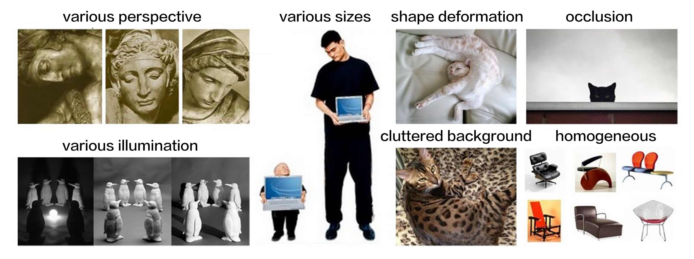
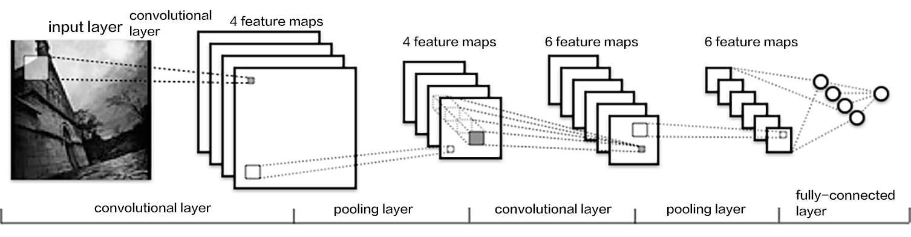
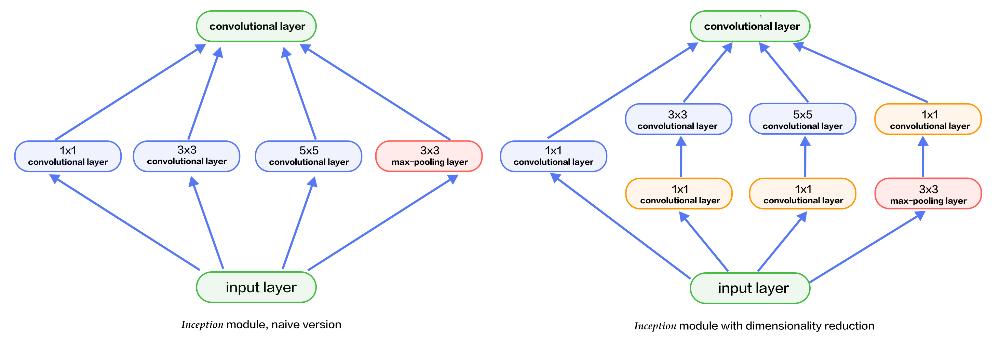
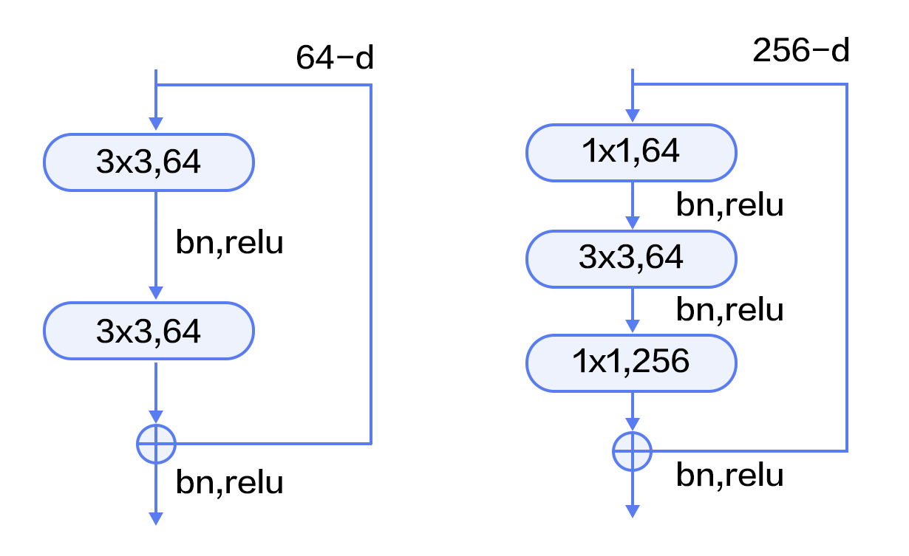
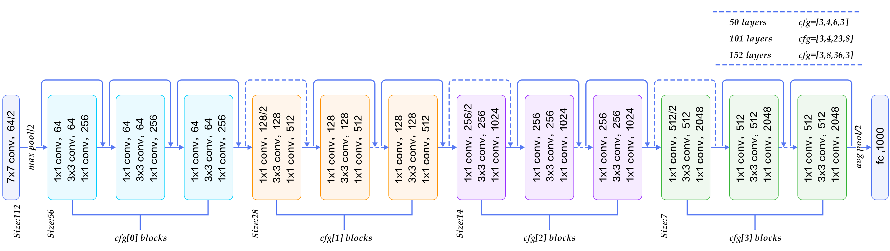
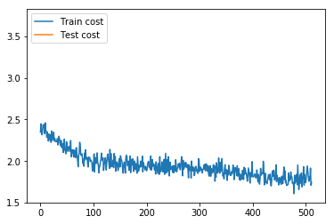
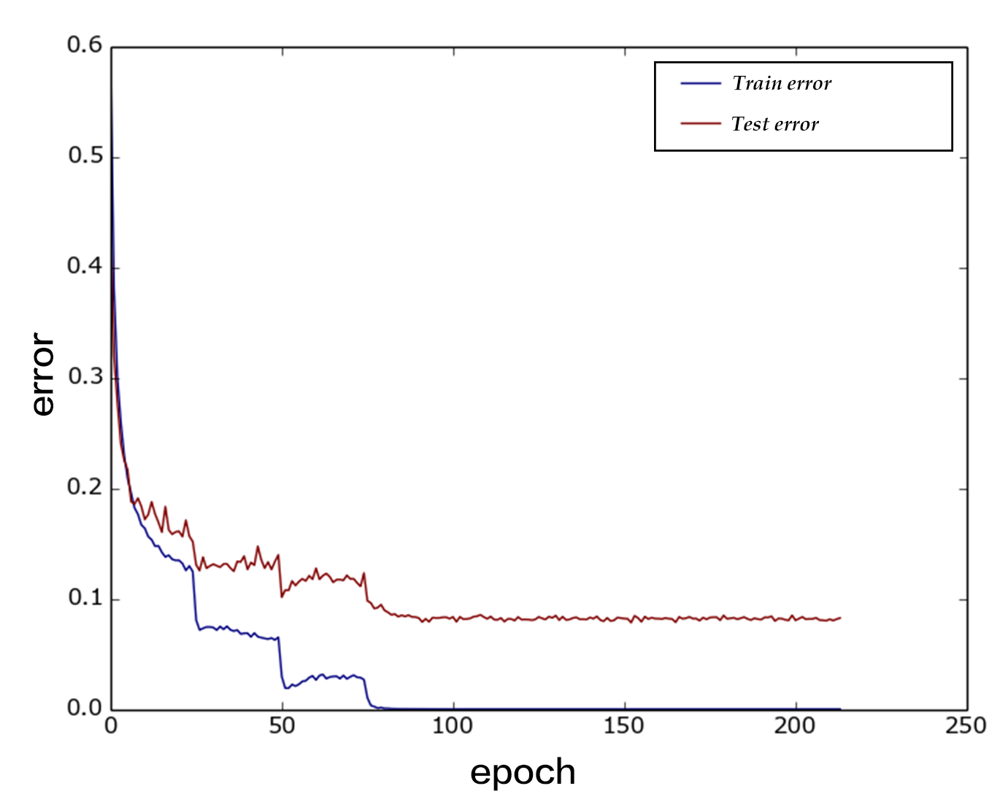

Image Classification
=======================

The source code for this chapter is at [book/image_classification](https://github.com/PaddlePaddle/book/tree/develop/03.image_classification). First-time users, please refer to PaddlePaddle [Installation Tutorial](https://github.com/PaddlePaddle/book/blob/develop/README.md#running-the-book) for installation instructions.

## Background

Compared to words, images provide much more vivid and easier to understand information with an artistic sense. They are an important source for people to express and exchange ideas. In this chapter, we focus on one of the essential problems in image recognition -- image classification.

Image classification is the task of distinguishing images in different categories based on their semantic meaning. It is a core problem in computer vision and is also the foundation of other higher level computer vision tasks such as object detection, image segmentation, object tracking, action recognition, etc. Image classification has applications in many areas such as face recognition, intelligent video analysis in security systems, traffic scene recognition in transportation systems, content-based image retrieval and automatic photo indexing in web services, image classification in medicine, etc.

To classify an image we firstly encode the entire image using handcrafted or learned features and then determine the category using a classifier. Thus, feature extraction plays an important role in image classification. Prior to deep learning the BoW(Bag of Words) model was the most widely used method for classifying an image as well as an object. The BoW technique was introduced in Natural Language Processing where a training sentence is represented as a bag of words. In the context of image classification, the BoW model requires constructing a dictionary. The simplest BoW framework can be designed with three steps: **feature extraction**, **feature encoding** and **classifier design**.

Using Deep learning, image classification can be framed as a supervised or unsupervised learning problem that uses hierarchical features automatically without any need for manually crafted features from the image. In recent years, Convolutional Neural Networks (CNNs) have made significant progress in image classification. CNNs use raw image pixels as input, extract low-level and high-level abstract features through convolution operations, and directly output the classification results from the model. This style of end-to-end learning has lead to not only increased performance but also wider adoption various applications.

In this chapter, we introduce deep-learning-based image classification methods and explain how to train a CNN model using PaddlePaddle.

## Demonstration

An image can be classified by a general as well as fine-grained image classifier.


Figure 1 shows the results of a general image classifier -- the trained model can correctly recognize the main objects in the images.

<p align="center">
<br/>
Figure 1. General image classification
</p>


Figure 2 shows the results of a fine-grained image classifier. This task of flower recognition requires correctly recognizing of the flower's categories.

<p align="center">
<br/>
Figure 2. Fine-grained image classification
</p>


A good model should recognize objects of different categories correctly. The results of such a model should not vary due to viewpoint variation, illumination conditions, object distortion or occlusion.
Figure 3 shows some images with various disturbances. A good model should classify these images correctly like humans.

<p align="center">
<br/>
Figure 3. Disturbed images [22]
</p>

## Model Overview

A large amount of research in image classification is built upon public datasets such as [PASCAL VOC](http://host.robots.ox.ac.uk/pascal/VOC/), [ImageNet](http://image-net.org/) etc. Many image classification algorithms are usually evaluated and compared on top of these datasets. PASCAL VOC is a computer vision competition started in 2005, and ImageNet is a dataset for Large Scale Visual Recognition Challenge (ILSVRC) started in 2010. In this chapter, we introduce some image classification models from the submissions to these competitions.

Before 2012, traditional image classification was accomplished with the three steps described in the background section. A complete model construction usually involves the following stages: low-level feature extraction, feature encoding, spatial constraint or feature clustering, classifier design, model ensemble.

  1). **Low-level feature extraction**: This step extracts large amounts of local features according to fixed strides and scales. Popular local features include Scale-Invariant Feature Transform (SIFT)[1], Histogram of Oriented Gradient(HOG)[2], Local Binary Pattern(LBP)[3], etc. A common practice is to employ multiple feature descriptors in order to avoid missing a lot of information.

  2). **Feature encoding**: Low-level features contain a large amount of redundancy and noise. In order to improve the robustness of features, it is necessary to employ a feature transformation to encode low-level features. This is called feature encoding. Common feature encoding methods include vector quantization [4], sparse coding [5], locality-constrained linear coding [6], Fisher vector encoding [7], etc.

  3). **Spatial constraint**: Spatial constraint or feature clustering is usually adopted after feature encoding for extracting the maximum or average of each dimension in the spatial domain. Pyramid feature matching--a popular feature clustering method--divides an image uniformly into patches and performs feature clustering in each patch.

  4). **Classification**: In the above steps an image can be described by a vector of fixed dimension. Then a classifier can be used to classify the image into categories. Common classifiers include Support Vector Machine(SVM), random forest etc. Kernel SVM is the most popular classifier and has achieved very good performance in traditional image classification tasks.

This method has been used widely as image classification algorithm in PASCAL VOC [18]. NEC Labs(http://www.nec-labs.com/) won the championship by employing SIFT and LBP features, two non-linear encoders and SVM in ILSVRC 2010 [8].

The CNN model--AlexNet proposed by Alex Krizhevsky et al.[9], made a breakthrough in ILSVRC 2012. It dramatically outperformed traditional methods and won the ILSVRC championship in 2012. This was also the first time that a deep learning method was used for large-scale image classification. Since AlexNet, a series of CNN models have been proposed that have advanced the state of the art steadily on Imagenet as shown in Figure 4. With deeper and more sophisticated architectures, Top-5 error rate is getting lower and lower (to around 3.5%). The error rate of human raters on the same Imagenet dataset is 5.1%, which means that the image classification capability of a deep learning model has surpassed human raters.

<p align="center">
<br/>
Figure 4. Top-5 error rates on ILSVRC image classification
</p>

### CNN

Traditional CNNs consist of convolutional and fully-connected layers and use the softmax multi-category classifier with the cross-entropy loss function. Figure 5 shows a typical CNN. We first introduce the common components of a CNN.

<p align="center">
<br/>
Figure 5. A CNN example [20]
</p>

- convolutional layer: this layer uses the convolution operation to extract (low-level and high-level) features and to discover local correlation and spatial invariance.

- pooling layer: this layer down samples feature maps by extracting local max (max-pooling) or average (avg-pooling) value of each patch in the feature map. Down-sampling is a common operation in image processing and is used to filter out high-frequency information.

- fully-connected layer: this layer fully connects neurons between two adjacent layers.

- non-linear activation: Convolutional and fully-connected layers are usually followed by some non-linear activation layers. Non-linearities enhance the expression capability of the network. Some examples of non-linear activation functions are Sigmoid, Tanh and ReLU. ReLU is the most commonly used activation function in CNN.

- Dropout [10]: At each training stage, individual nodes are dropped out of the network with a certain probability. This improves the network's ability to generalize and avoids overfitting.

Parameter updates at each layer during training causes input layer distributions to change and in turn requires hyper-parameters to be carefully tuned. In 2015, Sergey Ioffe and Christian Szegedy proposed a Batch Normalization (BN) algorithm [14], which normalizes the features of each batch in a layer, and enables relatively stable distribution in each layer. Not only does BN algorithm act as a regularizer, but also reduces the need for careful hyper-parameter design. Experiments demonstrate that BN algorithm accelerates the training convergence and has been widely used in later deeper models.

In the following sections, we will introduce the following network architectures - VGG, GoogleNet and ResNets.

### VGG

The Oxford Visual Geometry Group (VGG) proposed the VGG network in ILSVRC 2014 [11]. This model is deeper and wider than previous neural architectures. It consists of five main groups of convolution operations. Adjacent convolution groups are connected via max-pooling layers. Each group contains a series of 3x3 convolutional layers (i.e. kernels). The number of convolution kernels stays the same within the group and increases from 64 in the first group to 512 in the last one. The total number of learnable layers could be 11, 13, 16, or 19 depending on the number of convolutional layers in each group. Figure 6 illustrates a 16-layer VGG. The neural architecture of VGG is relatively simple and has been adopted by many papers such as the first one that surpassed human-level performance on ImageNet [19].

<p align="center">
<br/>
Figure 6. VGG16 model for ImageNet
</p>

### GoogleNet

GoogleNet [12] won the ILSVRC championship in 2014. GoogleNet borrowed some ideas from the Network in Network(NIN) model [13] and is built on the Inception blocks. Let us first familiarize ourselves with these first.

The two main characteristics of the NIN model are:

1) A single-layer convolutional network is replaced with a Multi-Layer Perceptron Convolution (MLPconv). MLPconv is a tiny multi-layer convolutional network. It enhances non-linearity by adding several 1x1 convolutional layers after linear ones.

2) In traditional CNNs, the last fewer layers are usually fully-connected with a large number of parameters. In contrast, NIN replaces all fully-connected layers with convolutional layers with feature maps of the same size as the category dimension and a global average pooling. This replacement of fully-connected layers significantly reduces the number of parameters.

Figure 7 depicts two Inception blocks. Figure 7(a) is the simplest design. The output is a concatenation of features from three convolutional layers and one pooling layer. The disadvantage of this design is that the pooling layer does not change the number of filters and leads to an increase in the number of outputs. After several of such blocks, the number of outputs and parameters become larger and larger and lead to higher computation complexity. To overcome this drawback, the Inception block in Figure 7(b) employs three 1x1 convolutional layers. These reduce dimensions or the number of channels but improve the non-linearity of the network.

<p align="center">
<br/>
Figure 7. Inception block
</p>

GoogleNet consists of multiple stacked Inception blocks followed by an avg-pooling layer as in NIN instead of traditional fully connected layers. The difference between GoogleNet and NIN is that GoogleNet adds a fully connected layer after avg-pooling layer to output a vector of category size. Besides these two characteristics, the features from middle layers of a GoogleNet are also very discriminative. Therefore, GoogeleNet inserts two auxiliary classifiers in the model for enhancing gradient and regularization when doing backpropagation. The loss function of the whole network is the weighted sum of these three classifiers.

Figure 8 illustrates the neural architecture of a GoogleNet which consists of 22 layers: it starts with three regular convolutional layers followed by three groups of sub-networks -- the first group contains two Inception blocks, the second group has five, and the third group has two. It ends with an average pooling and a fully-connected layer.

<p align="center">
<br/>
Figure 8. GoogleNet[12]
</p>

The above model is the first version of GoogleNet or GoogelNet-v1. GoogleNet-v2 [14] introduced BN layer; GoogleNet-v3 [16] further split some convolutional layers, which increases non-linearity and network depth; GoogelNet-v4 [17] leads to the design idea of ResNet which will be introduced in the next section. The evolution from v1 to v4 improved the accuracy rate consistently. We will not go into details of the neural architectures of v2 to v4.

### ResNet

Residual Network(ResNet)[15] won the 2015 championship on three ImageNet competitions -- image classification, object localization, and object detection. The main challenge in training deeper networks is that accuracy degrades with network depth. The authors of ResNet proposed a residual learning approach to ease the difficulty of training deeper networks. Based on the design ideas of BN, small convolutional kernels, full convolutional network, ResNets reformulate the layers as residual blocks, with each block containing two branches, one directly connecting input to the output, the other performing two to three convolutions and calculating the residual function with reference to the layer's inputs. The outputs of these two branches are then added up.

Figure 9 illustrates the ResNet architecture. To the left is the basic building block, it consists of two 3x3 convolutional layers of the same channels. To the right is a Bottleneck block. The bottleneck is a 1x1 convolutional layer used to reduce dimension from 256 to 64. The other 1x1 convolutional layer is used to increase dimension from 64 to 256. Thus, the number of input and output channels of the middle 3x3 convolutional layer is 64, which is relatively small.

<p align="center">
<br/>
Figure 9. Residual block
</p>

Figure 10 illustrates ResNets with 50, 101, 152 layers, respectively. All three networks use bottleneck blocks of different numbers of repetitions. ResNet converges very fast and can be trained with hundreds or thousands of layers.

<p align="center">
<br/>
Figure 10. ResNet model for ImageNet
</p>


## Dataset

Commonly used public datasets for image classification are [CIFAR](https://www.cs.toronto.edu/~kriz/cifar.html), [ImageNet](http://image-net.org/), [COCO](http://mscoco.org/), etc. Those used for fine-grained image classification are [CUB-200-2011](http://www.vision.caltech.edu/visipedia/CUB-200-2011.html), [Stanford Dog](http://vision.stanford.edu/aditya86/ImageNetDogs/), [Oxford-flowers](http://www.robots.ox.ac.uk/~vgg/data/flowers/), etc. Among these, the ImageNet dataset is the largest. Most research results are reported on ImageNet as mentioned in the Model Overview section. Since 2010, the ImageNet dataset has gone through some changes. The commonly used ImageNet-2012 dataset contains 1000 categories. There are 1,281,167 training images, ranging from 732 to 1200 images per category, and 50,000 validation images with 50 images per category in average.

Since ImageNet is too large to be downloaded and trained efficiently, we use [CIFAR-10](https://www.cs.toronto.edu/~kriz/cifar.html) in this tutorial. The CIFAR-10 dataset consists of 60000 32x32 color images in 10 classes, with 6000 images per class. There are 50000 training images and 10000 test images. Figure 11 shows all the classes in CIFAR-10 as well as 10 images randomly sampled from each category.

<p align="center">
<br/>
Figure 11. CIFAR10 dataset[21]
</p>

 `paddle.datasets` package encapsulates multiple public datasets, including `cifar`, `imdb`, `mnist`, `moivelens` and `wmt14`, etc. There's no need to manually download and preprocess CIFAR-10.

After running the command `python train.py`, training will start immediately. The following sections will describe in details.

## Model Configuration

Let's start with importing the Paddle Fluid API package and the helper modules.

```python
import paddle
import paddle.fluid as fluid
import numpy
import sys
from __future__ import print_function
```

Now we are going to walk you through the implementations of the VGG and ResNet.

### VGG

Let's start with the VGG model. Since the image size and amount of CIFAR10 are relatively small comparing to ImageNet, we use a small version of VGG network for CIFAR10. Convolution groups incorporate BN and dropout operations.

The input to VGG main module is from the data layer. `vgg_bn_drop` defines a 16-layer VGG network, with each convolutional layer followed by BN and dropout layers. Here is the definition in detail:

```python
def vgg_bn_drop(input):
    def conv_block(ipt, num_filter, groups, dropouts):
        return fluid.nets.img_conv_group(
            input=ipt,
            pool_size=2,
            pool_stride=2,
            conv_num_filter=[num_filter] * groups,
            conv_filter_size=3,
            conv_act='relu',
            conv_with_batchnorm=True,
            conv_batchnorm_drop_rate=dropouts,
            pool_type='max')

    conv1 = conv_block(input, 64, 2, [0.3, 0])
    conv2 = conv_block(conv1, 128, 2, [0.4, 0])
    conv3 = conv_block(conv2, 256, 3, [0.4, 0.4, 0])
    conv4 = conv_block(conv3, 512, 3, [0.4, 0.4, 0])
    conv5 = conv_block(conv4, 512, 3, [0.4, 0.4, 0])

    drop = fluid.layers.dropout(x=conv5, dropout_prob=0.5)
    fc1 = fluid.layers.fc(input=drop, size=512, act=None)
    bn = fluid.layers.batch_norm(input=fc1, act='relu')
    drop2 = fluid.layers.dropout(x=bn, dropout_prob=0.5)
    fc2 = fluid.layers.fc(input=drop2, size=512, act=None)
    predict = fluid.layers.fc(input=fc2, size=10, act='softmax')
    return predict
```

  1. Firstly, it defines a convolution block or conv_block. The default convolution kernel is 3x3, and the default pooling size is 2x2 with stride 2. Dropout specifies the probability in dropout operation. Function `img_conv_group` is defined in `paddle.networks` consisting of a series of `Conv->BN->ReLu->Dropout` and a `Pooling`.

  2. Five groups of convolutions. The first two groups perform two convolutions, while the last three groups perform three convolutions. The dropout rate of the last convolution in each group is set to 0, which means there is no dropout for this layer.

  3. The last two layers are fully-connected layers of dimension 512.

  4. The above VGG network extracts high-level features and maps them to a vector of the same size as the categories. Softmax function or classifier is then used for calculating the probability of the image belonging to each category.

### ResNet

Here are some basic functions used in `resnet_cifar10`:

  - `conv_bn_layer` : convolutional layer followed by BN.
  - `shortcut` : the shortcut branch in a residual block. There are two kinds of shortcuts: 1x1 convolution used when the number of channels between input and output is different; direct connection used otherwise.

  - `basicblock` : a basic residual module as shown in the left of Figure 9, it consists of two sequential 3x3 convolutions and one "shortcut" branch.
  - `bottleneck` : a bottleneck module as shown in the right of Figure 9, it consists of two 1x1 convolutions with one 3x3 convolution in between branch and a "shortcut" branch.
  - `layer_warp` : a group of residual modules consisting of several stacking blocks. In each group, the sliding window size of the first residual block could be different from the rest of blocks, in order to reduce the size of feature maps along horizontal and vertical directions.

```python
def conv_bn_layer(input,
                  ch_out,
                  filter_size,
                  stride,
                  padding,
                  act='relu',
                  bias_attr=False):
    tmp = fluid.layers.conv2d(
        input=input,
        filter_size=filter_size,
        num_filters=ch_out,
        stride=stride,
        padding=padding,
        act=None,
        bias_attr=bias_attr)
    return fluid.layers.batch_norm(input=tmp, act=act)


def shortcut(input, ch_in, ch_out, stride):
    if ch_in != ch_out:
        return conv_bn_layer(input, ch_out, 1, stride, 0, None)
    else:
        return input


def basicblock(input, ch_in, ch_out, stride):
    tmp = conv_bn_layer(input, ch_out, 3, stride, 1)
    tmp = conv_bn_layer(tmp, ch_out, 3, 1, 1, act=None, bias_attr=True)
    short = shortcut(input, ch_in, ch_out, stride)
    return fluid.layers.elementwise_add(x=tmp, y=short, act='relu')


def layer_warp(block_func, input, ch_in, ch_out, count, stride):
    tmp = block_func(input, ch_in, ch_out, stride)
    for i in range(1, count):
        tmp = block_func(tmp, ch_out, ch_out, 1)
    return tmp
```

The following are the components of `resnet_cifar10`:

1. The lowest level is `conv_bn_layer`.
2. The middle level consists of three `layer_warp`, each of which uses the left residual block in Figure 9.
3. The last level is average pooling layer.

Note: besides the first convolutional layer and the last fully-connected layer, the total number of layers in three `layer_warp` should be dividable by 6, that is the depth of `resnet_cifar10` should satisfy $(depth - 2) % 6 == 0$.

```python
def resnet_cifar10(ipt, depth=32):
    # depth should be one of 20, 32, 44, 56, 110, 1202
    assert (depth - 2) % 6 == 0
    n = (depth - 2) // 6
    nStages = {16, 64, 128}
    conv1 = conv_bn_layer(ipt, ch_out=16, filter_size=3, stride=1, padding=1)
    res1 = layer_warp(basicblock, conv1, 16, 16, n, 1)
    res2 = layer_warp(basicblock, res1, 16, 32, n, 2)
    res3 = layer_warp(basicblock, res2, 32, 64, n, 2)
    pool = fluid.layers.pool2d(
        input=res3, pool_size=8, pool_type='avg', pool_stride=1)
    predict = fluid.layers.fc(input=pool, size=10, act='softmax')
    return predict
```

## Infererence Program Configuration

The input to the network is defined as `fluid.layers.data`, or image pixels in the context of image classification. The images in CIFAR10 are 32x32 color images of three channels. Therefore, the size of the input data is 3072 (3x32x32).

```python
def inference_program():
    # The image is 32 * 32 with RGB representation.
    data_shape = [3, 32, 32]
    images = fluid.layers.data(name='pixel', shape=data_shape, dtype='float32')

    predict = resnet_cifar10(images, 32)
    # predict = vgg_bn_drop(images) # un-comment to use vgg net
    return predict
```

## Train Program Configuration
Then we need to setup the the `train_program`. It takes the prediction from the inference_program first.
During the training, it will calculate the `avg_loss` from the prediction.

In the context of supervised learning, labels of training images are defined in `fluid.layers.data` as well. During training, the cross-entropy loss function is used and the loss is the output of the network. During testing, the outputs are the probabilities calculated in the classifier.

**NOTE:** A train program should return an array and the first returned argument has to be `avg_cost`.
The trainer always implicitly use it to calculate the gradient.

```python
def train_program():
    predict = inference_program()

    label = fluid.layers.data(name='label', shape=[1], dtype='int64')
    cost = fluid.layers.cross_entropy(input=predict, label=label)
    avg_cost = fluid.layers.mean(cost)
    accuracy = fluid.layers.accuracy(input=predict, label=label)
    return [avg_cost, accuracy]
```

## Optimizer Function Configuration

In the following `Adam` optimizer, `learning_rate` specifies the learning rate in the optimization procedure.

```python
def optimizer_program():
    return fluid.optimizer.Adam(learning_rate=0.001)
```

## Model Training

### Create Trainer

Before creating a training module, it is necessary to set the algorithm.
Here we specify `Adam` optimization algorithm via `fluid.optimizer`.

```python
use_cuda = False
place = fluid.CUDAPlace(0) if use_cuda else fluid.CPUPlace()
trainer = fluid.contrib.trainer.Trainer(
    train_func=train_program,
    optimizer_func=optimizer_program,
    place=place)
```

### Data Feeders Configuration

`cifar.train10()` will yield records during each pass, after shuffling, a batch input is generated for training.

```python
# Each batch will yield 128 images
BATCH_SIZE = 128

# Reader for training
train_reader = paddle.batch(
    paddle.reader.shuffle(paddle.dataset.cifar.train10(), buf_size=50000),
    batch_size=BATCH_SIZE)

# Reader for testing. A separated data set for testing.
test_reader = paddle.batch(
    paddle.dataset.cifar.test10(), batch_size=BATCH_SIZE)
```

### Event Handler

Callback function `event_handler` will be called during training when a pre-defined event happens.

`event_handler_plot`is used to plot a figure like below：



```python
params_dirname = "image_classification_resnet.inference.model"

from paddle.v2.plot import Ploter

train_title = "Train cost"
test_title = "Test cost"
cost_ploter = Ploter(train_title, test_title)

step = 0
def event_handler_plot(event):
    global step
    if isinstance(event, fluid.contrib.trainer.EndStepEvent):
        if step % 1 == 0:
            cost_ploter.append(train_title, step, event.metrics[0])
            cost_ploter.plot()
        step += 1
    if isinstance(event, fluid.contrib.trainer.EndEpochEvent):
        avg_cost, accuracy = trainer.test(
            reader=test_reader,
            feed_order=['pixel', 'label'])
        cost_ploter.append(test_title, step, avg_cost)

        # save parameters
        if params_dirname is not None:
            trainer.save_params(params_dirname)
```

`event_handler` is used to plot some text data when training.

```python
params_dirname = "image_classification_resnet.inference.model"

# event handler to track training and testing process
def event_handler(event):
    if isinstance(event, fluid.contrib.trainer.EndStepEvent):
        if event.step % 100 == 0:
            print("\nPass %d, Batch %d, Cost %f, Acc %f" %
                  (event.step, event.epoch, event.metrics[0],
                   event.metrics[1]))
        else:
            sys.stdout.write('.')
            sys.stdout.flush()

    if isinstance(event, fluid.contrib.trainer.EndEpochEvent):
        # Test against with the test dataset to get accuracy.
        avg_cost, accuracy = trainer.test(
            reader=test_reader, feed_order=['pixel', 'label'])

        print('\nTest with Pass {0}, Loss {1:2.2}, Acc {2:2.2}'.format(event.epoch, avg_cost, accuracy))

        # save parameters
        if params_dirname is not None:
            trainer.save_params(params_dirname)
```

### Training

Finally, we can invoke `trainer.train` to start training.

**Note:** On CPU, each epoch will take about 15~20 minutes. This part may take a while. Please feel free to modify the code to run the test on GPU to increase the training speed.


```python
trainer.train(
    reader=train_reader,
    num_epochs=2,
    event_handler=event_handler,
    feed_order=['pixel', 'label'])
```

Here is an example log after training for one pass. The accuracy rates are 0.59 on the training set and 0.6 on the validation set.

```text
Pass 0, Batch 0, Cost 3.869598, Acc 0.164062
...................................................................................................
Pass 100, Batch 0, Cost 1.481038, Acc 0.460938
...................................................................................................
Pass 200, Batch 0, Cost 1.340323, Acc 0.523438
...................................................................................................
Pass 300, Batch 0, Cost 1.223424, Acc 0.593750
..........................................................................................
Test with Pass 0, Loss 1.1, Acc 0.6
```

Figure 12 shows the curve of training error rate, which indicates it converges at Pass 200 with error rate 8.54%.
<p align="center">
<br/>
Figure 12. The error rate of VGG model on CIFAR10
</p>


## Application

After training is completed, users can use the trained model to classify images. The following code shows how to infer through `fluid.contrib.inferencer.Inferencer` interface. You can uncomment some lines from below to change the model name.

### Generate input data for inferring

`dog.png` is an example image of a dog. Turn it into a numpy array to match the data feeder format.

```python
# Prepare testing data.
from PIL import Image
import numpy as np
import os

def load_image(file):
    im = Image.open(file)
    im = im.resize((32, 32), Image.ANTIALIAS)

    im = np.array(im).astype(np.float32)
    # The storage order of the loaded image is W(width),
    # H(height), C(channel). PaddlePaddle requires
    # the CHW order, so transpose them.
    im = im.transpose((2, 0, 1))  # CHW
    im = im / 255.0

    # Add one dimension to mimic the list format.
    im = numpy.expand_dims(im, axis=0)
    return im

cur_dir = os.getcwd()
img = load_image(cur_dir + '/image/dog.png')
```

### Inferencer Configuration and Inference

The `Inferencer` takes an `infer_func` and `param_path` to setup the network and the trained parameters.
We can simply plug-in the inference_program defined earlier here.
Now we are ready to do inference.

```python
inferencer = fluid.contrib.inferencer.Inferencer(
    infer_func=inference_program, param_path=params_dirname, place=place)

label_list = ["airplane", "automobile", "bird", "cat", "deer", "dog", "frog", "horse", "ship", "truck"]
# inference
results = inferencer.infer({'pixel': img})
print("infer results: %s" % label_list[np.argmax(results[0])])
```


## Conclusion

Traditional image classification methods involve multiple stages of processing, which has to utilize complex frameworks. Contrarily, CNN models can be trained end-to-end with a significant increase in classification accuracy. In this chapter, we introduced three models -- VGG, GoogleNet, ResNet and provided PaddlePaddle config files for training VGG and ResNet on CIFAR10. We also explained how to perform prediction and feature extraction using the PaddlePaddle API. For other datasets such as ImageNet, the procedure for config and training are the same and you are welcome to give it a try.


## References

[1] D. G. Lowe, [Distinctive image features from scale-invariant keypoints](http://www.cs.ubc.ca/~lowe/papers/ijcv04.pdf). IJCV, 60(2):91-110, 2004.

[2] N. Dalal, B. Triggs, [Histograms of Oriented Gradients for Human Detection](http://vision.stanford.edu/teaching/cs231b_spring1213/papers/CVPR05_DalalTriggs.pdf), Proc. IEEE Conf. Computer Vision and Pattern Recognition, 2005.

[3] Ahonen, T., Hadid, A., and Pietikinen, M. (2006). [Face description with local binary patterns: Application to face recognition](http://ieeexplore.ieee.org/document/1717463/). PAMI, 28.

[4] J. Sivic, A. Zisserman, [Video Google: A Text Retrieval Approach to Object Matching in Videos](http://www.robots.ox.ac.uk/~vgg/publications/papers/sivic03.pdf), Proc. Ninth Int'l Conf. Computer Vision, pp. 1470-1478, 2003.

[5] B. Olshausen, D. Field, [Sparse Coding with an Overcomplete Basis Set: A Strategy Employed by V1?](http://redwood.psych.cornell.edu/papers/olshausen_field_1997.pdf), Vision Research, vol. 37, pp. 3311-3325, 1997.

[6] Wang, J., Yang, J., Yu, K., Lv, F., Huang, T., and Gong, Y. (2010). [Locality-constrained Linear Coding for image classification](http://ieeexplore.ieee.org/abstract/document/5540018/). In CVPR.

[7] Perronnin, F., Sánchez, J., & Mensink, T. (2010). [Improving the fisher kernel for large-scale image classification](http://dl.acm.org/citation.cfm?id=1888101). In ECCV (4).

[8] Lin, Y., Lv, F., Cao, L., Zhu, S., Yang, M., Cour, T., Yu, K., and Huang, T. (2011). [Large-scale image clas- sification: Fast feature extraction and SVM training](http://ieeexplore.ieee.org/document/5995477/). In CVPR.

[9] Krizhevsky, A., Sutskever, I., and Hinton, G. (2012). [ImageNet classification with deep convolutional neu- ral networks](http://www.cs.toronto.edu/~kriz/imagenet_classification_with_deep_convolutional.pdf). In NIPS.

[10] G.E. Hinton, N. Srivastava, A. Krizhevsky, I. Sutskever, and R.R. Salakhutdinov. [Improving neural networks by preventing co-adaptation of feature detectors](https://arxiv.org/abs/1207.0580). arXiv preprint arXiv:1207.0580, 2012.

[11] K. Chatfield, K. Simonyan, A. Vedaldi, A. Zisserman. [Return of the Devil in the Details: Delving Deep into Convolutional Nets](https://arxiv.org/abs/1405.3531). BMVC, 2014。

[12] Szegedy, C., Liu, W., Jia, Y., Sermanet, P., Reed, S., Anguelov, D., Erhan, D., Vanhoucke, V., Rabinovich, A., [Going deeper with convolutions](https://arxiv.org/abs/1409.4842). In: CVPR. (2015)

[13] Lin, M., Chen, Q., and Yan, S. [Network in network](https://arxiv.org/abs/1312.4400). In Proc. ICLR, 2014.

[14] S. Ioffe and C. Szegedy. [Batch normalization: Accelerating deep network training by reducing internal covariate shift](https://arxiv.org/abs/1502.03167). In ICML, 2015.

[15] K. He, X. Zhang, S. Ren, J. Sun. [Deep Residual Learning for Image Recognition](https://arxiv.org/abs/1512.03385). CVPR 2016.

[16] Szegedy, C., Vanhoucke, V., Ioffe, S., Shlens, J., Wojna, Z. [Rethinking the incep-tion architecture for computer vision](https://arxiv.org/abs/1512.00567). In: CVPR. (2016).

[17] Szegedy, C., Ioffe, S., Vanhoucke, V. [Inception-v4, inception-resnet and the impact of residual connections on learning](https://arxiv.org/abs/1602.07261). arXiv:1602.07261 (2016).

[18] Everingham, M., Eslami, S. M. A., Van Gool, L., Williams, C. K. I., Winn, J. and Zisserman, A. [The Pascal Visual Object Classes Challenge: A Retrospective]((http://link.springer.com/article/10.1007/s11263-014-0733-5)). International Journal of Computer Vision, 111(1), 98-136, 2015.

[19] He, K., Zhang, X., Ren, S., and Sun, J. [Delving Deep into Rectifiers: Surpassing Human-Level Performance on ImageNet Classification](https://arxiv.org/abs/1502.01852). ArXiv e-prints, February 2015.

[20] http://deeplearning.net/tutorial/lenet.html

[21] https://www.cs.toronto.edu/~kriz/cifar.html

[22] http://cs231n.github.io/classification/

<br/>
This tutorial is contributed by <a xmlns:cc="http://creativecommons.org/ns#" href="http://book.paddlepaddle.org" property="cc:attributionName" rel="cc:attributionURL">PaddlePaddle</a>, and licensed under a <a rel="license" href="http://creativecommons.org/licenses/by-sa/4.0/">Creative Commons Attribution-ShareAlike 4.0 International License</a>.
