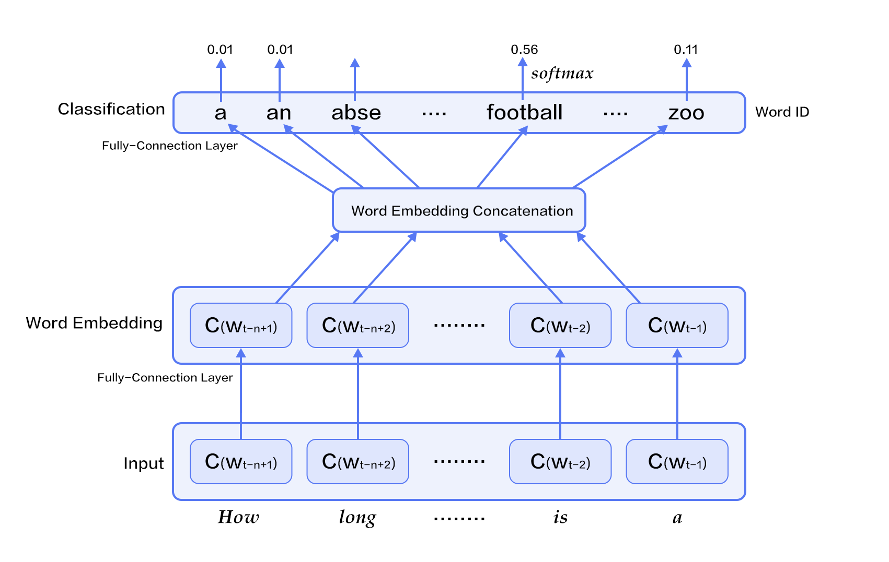
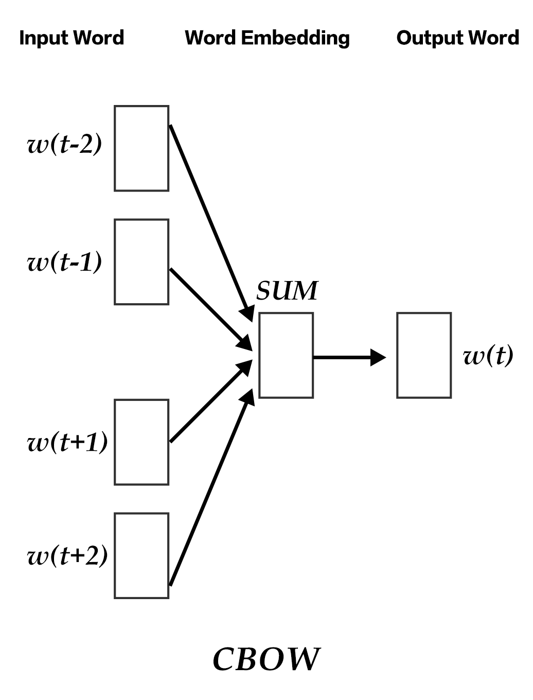
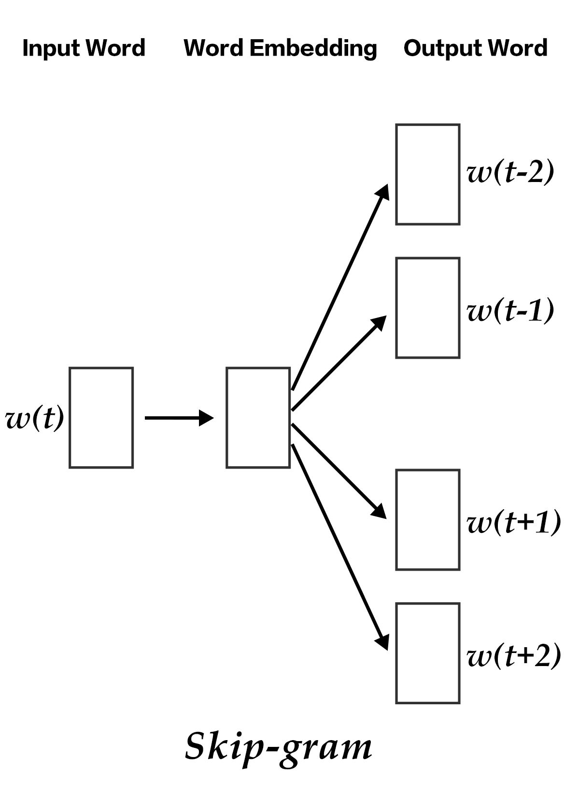
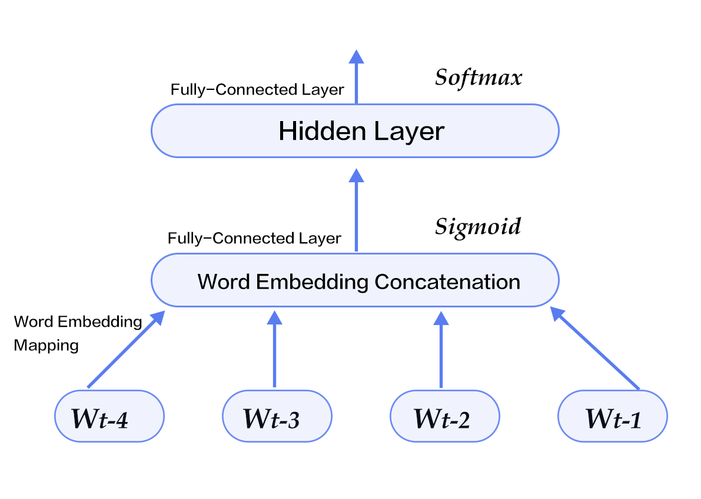

# Word2Vec

This is intended as a reference tutorial. The source code of this tutorial is located at [book/word2vec](https://github.com/PaddlePaddle/book/tree/develop/04.word2vec).

For instructions on getting started with PaddlePaddle, see [PaddlePaddle installation guide](https://github.com/PaddlePaddle/book/blob/develop/README.md#running-the-book).

## Background Introduction

This section introduces the concept of **word embeddings**, which are vector representations of words. Word embeddings is a popular technique used in natural language processing to support applications such as search engines, advertising systems, and recommendation systems.

### One-Hot Vectors

Building these applications requires us to quantify the similarity between two words or paragraphs. This calls for a new representation of all the words to make them more suitable for computation. An obvious way to achieve this is through the vector space model, where every word is represented as an **one-hot vector**.

For each word, its vector representation has the corresponding entry in the vector as 1, and all other entries as 0. The lengths of one-hot vectors match the size of the dictionary. Each entry of a vector corresponds to the presence (or absence) of a word in the dictionary.

One-hot vectors are intuitive, yet they have limited usefulness. Take the example of an Internet advertising system: Suppose a customer enters the query "Mother's Day", while an ad bids for the keyword "carnations". Because the one-hot vectors of these two words are perpendicular, the metric distance (either Euclidean or cosine similarity) between them would indicate  little relevance. However, *we* know that these two queries are connected semantically, since people often gift their mothers bundles of carnation flowers on Mother's Day. This discrepancy is due to the low information capacity in each vector. That is, comparing the vector representations of two words does not assess their relevance sufficiently. To calculate their similarity accurately, we need more information, which could be learned from large amounts of data through machine learning methods.

Like many machine learning models, word embeddings can represent knowledge in various ways. Another model may project an one-hot vector to an embedding vector of lower dimension e.g. $embedding(mother's day) = [0.3, 4.2, -1.5, ...], embedding(carnations) = [0.2, 5.6, -2.3, ...]$. Mapping one-hot vectors onto an embedded vector space has the potential to bring the embedding vectors of similar words (either semantically or usage-wise) closer to each other, so that the cosine similarity between the corresponding vectors for words like "Mother's Day" and "carnations" are no longer zero.

A word embedding model could be a probabilistic model, a co-occurrence matrix model, or a neural network. Before people started using neural networks to generate word embedding, the traditional method was to calculate a co-occurrence matrix $X$ of words. Here, $X$ is a $|V| \times |V|$ matrix, where $X_{ij}$ represents the co-occurrence times of the $i$th and $j$th words in the vocabulary `V` within all corpus, and $|V|$ is the size of the vocabulary. By performing matrix decomposition on $X$ e.g. Singular Value Decomposition \[[5](#references)\]

$$X = USV^T$$

the resulting $U$ can be seen as the word embedding of all the words.

However, this method suffers from many drawbacks:
1) Since many pairs of words don't co-occur, the co-occurrence matrix is sparse. To achieve good performance of matrix factorization, further treatment on word frequency is needed;
2) The matrix is large, frequently on the order of $10^6*10^6$;
3) We need to manually filter out stop words (like "although", "a", ...), otherwise these frequent words will affect the performance of matrix factorization.

The neural network based model does not require storing huge hash tables of statistics on all of the corpus. It obtains the word embedding by learning from semantic information, hence could avoid the aforementioned problems in the traditional method. In this chapter, we will introduce the details of neural network word embedding model and how to train such model in PaddlePaddle.

## Results Demonstration

In this section, we use the $t-$SNE\[[4](#references)\] data visualization algorithm to draw the word embedding vectors after projecting them onto a two-dimensional space (see figure below). From the figure we can see that the semantically relevant words -- *a*, *the*, and *these* or *big* and *huge* -- are close to each other in the projected space, while irrelevant words -- *say* and *business* or *decision* and *japan* -- are far from each other.

<p align="center">
    <br/>
    Figure 1. Two dimension projection of word embeddings
</p>

### Cosine Similarity

On the other hand, we know that the cosine similarity between two vectors falls between $[-1,1]$. Specifically, the cosine similarity is 1 when the vectors are identical, 0 when the vectors are perpendicular, -1 when the are of opposite directions. That is, the cosine similarity between two vectors scales with their relevance. So we can calculate the cosine similarity of two word embedding vectors to represent their relevance:

```
please input two words: big huge
similarity: 0.899180685161

please input two words: from company
similarity: -0.0997506977351
```

The above results could be obtained by running `calculate_dis.py`, which loads the words in the dictionary and their corresponding trained word embeddings. For detailed instruction, see section [Model Application](https://github.com/PaddlePaddle/book/tree/develop/04.word2vec#model-application).


## Model Overview

In this section, we will introduce three word embedding models: N-gram model, CBOW, and Skip-gram, which all output the frequency of each word given its immediate context.

For N-gram model, we will first introduce the concept of language model, and implement it using PaddlePaddle in section [Training](https://github.com/PaddlePaddle/book/tree/develop/04.word2vec#model-application).

The latter two models, which became popular recently, are neural word embedding model developed by Tomas Mikolov at Google \[[3](#references)\]. Despite their apparent simplicity, these models train very well.

### Language Model

Before diving into word embedding models, we will first introduce the concept of **language model**. Language models build the joint probability function $P(w_1, ..., w_T)$ of a sentence, where $w_i$ is the i-th word in the sentence. The goal is to give higher probabilities to meaningful sentences, and lower probabilities to meaningless constructions.

In general, models that generate the probability of a sequence can be applied to many fields, like machine translation, speech recognition, information retrieval, part-of-speech tagging, and handwriting recognition. Take information retrieval, for example. If you were to search for "how long is a football bame" (where bame is a medical noun), the search engine would have asked if you had meant "how long is a football game" instead. This is because the probability of "how long is a football bame" is very low according to the language model; in addition, among all of the words easily confused with "bame", "game" would build the most probable sentence.

#### Target Probability
For language model's target probability $P(w_1, ..., w_T)$, if the words in the sentence were to be independent, the joint probability of the whole sentence would be the product of each word's probability:

$$P(w_1, ..., w_T) = \prod_{t=1}^TP(w_t)$$

However, the frequency of words in a sentence typically relates to the words before them, so canonical language models are constructed using conditional probability in its target probability:

$$P(w_1, ..., w_T) = \prod_{t=1}^TP(w_t | w_1, ... , w_{t-1})$$


### N-gram neural model

In computational linguistics, n-gram is an important method to represent text. An n-gram represents a contiguous sequence of n consecutive items given a text. Based on the desired application scenario, each item could be a letter, a syllable or a word. The N-gram model is also an important method in statistical language modeling. When training language models with n-grams, the first (n-1) words of an n-gram are used to predict the *n*th word.

Yoshua Bengio and other scientists describe how to train a word embedding model using neural network in the famous paper of Neural Probabilistic Language Models \[[1](#references)\] published in 2003. The Neural Network Language Model (NNLM) described in the paper learns the language model and word embedding simultaneously through a linear transformation and a non-linear hidden connection. That is, after training on large amounts of corpus, the model learns the word embedding; then, it computes the probability of the whole sentence, using the embedding. This type of language model can overcome the **curse of dimensionality** i.e. model inaccuracy caused by the difference in dimensionality between training and testing data. Note that the term *neural network language model* is ill-defined, so we will not use the name NNLM but only refer to it as *N-gram neural model* in this section.

We have previously described language model using conditional probability, where the probability of the *t*-th word in a sentence depends on all $t-1$ words before it. Furthermore, since words further prior have less impact on a word, and every word within an n-gram is only effected by its previous n-1 words, we have:

$$P(w_1, ..., w_T) = \prod_{t=n}^TP(w_t|w_{t-1}, w_{t-2}, ..., w_{t-n+1})$$

Given some real corpus in which all sentences are meaningful, the n-gram model should maximize the following objective function:

$$\frac{1}{T}\sum_t f(w_t, w_{t-1}, ..., w_{t-n+1};\theta) + R(\theta)$$

where $f(w_t, w_{t-1}, ..., w_{t-n+1})$ represents the conditional logarithmic probability of the current word $w_t$ given its previous $n-1$ words, and $R(\theta)$ represents parameter regularization term.

<p align="center">
       <br/>
       Figure 2. N-gram neural network model
</p>


Figure 2 shows the N-gram neural network model. From the bottom up, the model has the following components:

 - For each sample, the model gets input $w_{t-n+1},...w_{t-1}$, and outputs the probability that the t-th word is one of `|V|` in the dictionary.

 Every input word $w_{t-n+1},...w_{t-1}$ first gets transformed into word embedding $C(w_{t-n+1}),...C(w_{t-1})$ through a transformation matrix.

 - All the word embeddings concatenate into a single vector, which is mapped (nonlinearly) into the $t$-th word hidden representation:

    $$g=Utanh(\theta^Tx + b_1) + Wx + b_2$$

   where $x$ is the large vector concatenated from all the word embeddings representing the context; $\theta$, $U$, $b_1$, $b_2$ and $W$ are parameters connecting word embedding layers to the hidden layers. $g$ represents the unnormalized probability of the output word, $g_i$ represents the unnormalized probability of the output word being the i-th word in the dictionary.

 - Based on the definition of softmax, using normalized $g_i$, the probability that the output word is $w_t$ is represented as:

  $$P(w_t | w_1, ..., w_{t-n+1}) = \frac{e^{g_{w_t}}}{\sum_i^{|V|} e^{g_i}}$$

 - The cost of the entire network is a multi-class cross-entropy and can be described by the following loss function

   $$J(\theta) = -\sum_{i=1}^N\sum_{c=1}^{|V|}y_k^{i}log(softmax(g_k^i))$$

   where $y_k^i$ represents the true label for the $k$-th class in the $i$-th sample ($0$ or $1$), $softmax(g_k^i)$ represents the softmax probability for the $k$-th class in the $i$-th sample.

### Continuous Bag-of-Words model(CBOW)

CBOW model predicts the current word based on the N words both before and after it. When $N=2$, the model is as the figure below:

<p align="center">
    <br/>
    Figure 3. CBOW model
</p>

Specifically, by ignoring the order of words in the sequence, CBOW uses the average value of the word embedding of the context to predict the current word:

$$\text{context} = \frac{x_{t-1} + x_{t-2} + x_{t+1} + x_{t+2}}{4}$$

where $x_t$ is the word embedding of the t-th word, classification score vector is $z=U*\text{context}$, the final classification $y$ uses softmax and the loss function uses multi-class cross-entropy.

### Skip-gram model

The advantages of CBOW is that it smooths over the word embeddings of the context and reduces noise, so it is very effective on small dataset. Skip-gram uses a word to predict its context and get multiple context for the given word, so it can be used in larger datasets.

<p align="center">
    <br/>
    Figure 4. Skip-gram model
</p>

As illustrated in the figure above, skip-gram model maps the word embedding of the given word onto $2n$ word embeddings (including $n$ words before and $n$ words after the given word), and then combine the classification loss of all those $2n$ words by softmax.

## Dataset

We will use Penn Treebank (PTB) (Tomas Mikolov's pre-processed version) dataset. PTB is a small dataset, used in Recurrent Neural Network Language Modeling Toolkit\[[2](#references)\]. Its statistics are as follows:

<p align="center">
<table>
    <tr>
        <td>training set</td>
        <td>validation set</td>
        <td>test set</td>
    </tr>
    <tr>
        <td>ptb.train.txt</td>
        <td>ptb.valid.txt</td>
        <td>ptb.test.txt</td>
    </tr>
    <tr>
        <td>42068 lines</td>
        <td>3370 lines</td>
        <td>3761 lines</td>
    </tr>
</table>
</p>

### Python Dataset Module

We encapsulated the PTB Data Set in our Python module `paddle.dataset.imikolov`. This module can

1. download the dataset to `~/.cache/paddle/dataset/imikolov`, if not yet, and
2. [preprocesses](#preprocessing) the dataset.

### Preprocessing

We will be training a 5-gram model. Given five words in a window, we will predict the fifth word given the first four words.

Beginning and end of a sentence have a special meaning, so we will add begin token `<s>` in the front of the sentence. And end token `<e>` in the end of the sentence. By moving the five word window in the sentence, data instances are generated.

For example, the sentence "I have a dream that one day" generates five data instances:

```text
<s> I have a dream
I have a dream that
have a dream that one
a dream that one day
dream that one day <e>
```

At last, each data instance will be converted into an integer sequence according it's words' index inside the dictionary.

## Training

The neural network that we will be using is illustrated in the graph below:

<p align="center">
    <br/>
    Figure 5. N-gram neural network model in model configuration
</p>

`word2vec/train.py` demonstrates training word2vec using PaddlePaddle:

### Datafeeder Configuration
Our program starts with importing necessary packages:

- Import packages.

```python
import paddle
import paddle.fluid as fluid
import numpy
```

- Configure parameters and build word dictionary.

```python
EMBED_SIZE = 32  # word vector dimension
HIDDEN_SIZE = 256  # hidden layer dimension
N = 5  # train 5-gram
BATCH_SIZE = 32  # batch size

# can use CPU or GPU
use_cuda = os.getenv('WITH_GPU', '0') != '0'

word_dict = paddle.dataset.imikolov.build_dict()
dict_size = len(word_dict)
```

Unlike from the previous PaddlePaddle v2, in the new API (Fluid), we do not need to calculate word embedding ourselves. PaddlePaddle provides a built-in method `fluid.layers.embedding` and we can use it directly to build our N-gram neural network model.

- We define our N-gram neural network structure as below. This structure will be used both in `train` and in `infer`
```python
def inference_program(is_sparse):
    first_word = fluid.layers.data(name='firstw', shape=[1], dtype='int64')
    second_word = fluid.layers.data(name='secondw', shape=[1], dtype='int64')
    third_word = fluid.layers.data(name='thirdw', shape=[1], dtype='int64')
    fourth_word = fluid.layers.data(name='fourthw', shape=[1], dtype='int64')

    embed_first = fluid.layers.embedding(
        input=first_word,
        size=[dict_size, EMBED_SIZE],
        dtype='float32',
        is_sparse=is_sparse,
        param_attr='shared_w')
    embed_second = fluid.layers.embedding(
        input=second_word,
        size=[dict_size, EMBED_SIZE],
        dtype='float32',
        is_sparse=is_sparse,
        param_attr='shared_w')
    embed_third = fluid.layers.embedding(
        input=third_word,
        size=[dict_size, EMBED_SIZE],
        dtype='float32',
        is_sparse=is_sparse,
        param_attr='shared_w')
    embed_fourth = fluid.layers.embedding(
        input=fourth_word,
        size=[dict_size, EMBED_SIZE],
        dtype='float32',
        is_sparse=is_sparse,
        param_attr='shared_w')

    concat_embed = fluid.layers.concat(
        input=[embed_first, embed_second, embed_third, embed_fourth], axis=1)
    hidden1 = fluid.layers.fc(input=concat_embed,
                              size=HIDDEN_SIZE,
                              act='sigmoid')
    predict_word = fluid.layers.fc(input=hidden1, size=dict_size, act='softmax')
    return predict_word
```

- As we already defined the N-gram neural network structure in the above, we can use it in our `train` method.

```python
def train_program(is_sparse):
    # The declaration of 'next_word' must be after the invoking of inference_program,
    # or the data input order of train program would be [next_word, firstw, secondw,
    # thirdw, fourthw], which is not correct.
    predict_word = inference_program(is_sparse)
    next_word = fluid.layers.data(name='nextw', shape=[1], dtype='int64')
    cost = fluid.layers.cross_entropy(input=predict_word, label=next_word)
    avg_cost = fluid.layers.mean(cost)
    return avg_cost
```

- Now we will begin the training process. It is relatively simple compared to the previous version.  `paddle.dataset.imikolov.train()` and `paddle.dataset.imikolov.test()` are our training and test set. Both of the functions will return a **reader**: In PaddlePaddle, reader is a python function which returns a Python iterator which output a single data instance at a time.

`paddle.batch` takes reader as input, outputs a **batched reader**: In PaddlePaddle, a reader outputs a single data instance at a time but batched reader outputs a minibatch of data instances.

`event_handler` can be passed into `trainer.train` so that we can do some tasks after each step or epoch. These tasks include recording current metrics or terminate current training process.

```python
def train(use_cuda, train_program, params_dirname):
    train_reader = paddle.batch(
        paddle.dataset.imikolov.train(word_dict, N), BATCH_SIZE)
    test_reader = paddle.batch(
        paddle.dataset.imikolov.test(word_dict, N), BATCH_SIZE)

    place = fluid.CUDAPlace(0) if use_cuda else fluid.CPUPlace()

    def event_handler(event):
        if isinstance(event, fluid.EndStepEvent):
            outs = trainer.test(
                reader=test_reader,
                feed_order=['firstw', 'secondw', 'thirdw', 'fourthw', 'nextw'])
            avg_cost = outs[0]

            # We output cost every 10 steps.
            if event.step % 10 == 0:
                print "Step %d: Average Cost %f" % (event.step, event.cost)

            # If average cost is lower than 5.0, we consider the model good enough to stop.
            if avg_cost < 5.5:
                trainer.save_params(params_dirname)
                trainer.stop()

            if math.isnan(avg_cost):
                sys.exit("got NaN loss, training failed.")

    trainer = fluid.Trainer(
        train_func=train_program,
        # Note here we need to choose more sophisticated optimizer
        # such as AdaGrad with a decay rate. The normal SGD converges
        # very slowly.
        # optimizer=fluid.optimizer.SGD(learning_rate=0.001),
        optimizer=fluid.optimizer.AdagradOptimizer(
            learning_rate=3e-3,
            regularization=fluid.regularizer.L2DecayRegularizer(8e-4)
        ),
        place=place)

    trainer.train(
        reader=train_reader,
        num_epochs=1,
        event_handler=event_handler,
        feed_order=['firstw', 'secondw', 'thirdw', 'fourthw', 'nextw'])
```

`trainer.train` will start training, the output of `event_handler` will be similar to following:
```text
Step 0: Average Cost 7.337213
Step 10: Average Cost 6.136128
Step 20: Average Cost 5.766995
...
```


## Model Application

After the model is trained, we can load the saved model parameters and do some inference.

### Predicting the next word

We can use our trained model to predict the next word given its previous N-gram. For example


```python
def infer(use_cuda, inference_program, params_dirname=None):
    place = fluid.CUDAPlace(0) if use_cuda else fluid.CPUPlace()
    inferencer = fluid.Inferencer(
        infer_func=inference_program, param_path=params_dirname, place=place)

    # Setup inputs by creating 4 LoDTensors representing 4 words. Here each word
    # is simply an index to look up for the corresponding word vector and hence
    # the shape of word (base_shape) should be [1]. The length-based level of
    # detail (lod) info of each LoDtensor should be [[1]] meaning there is only
    # one lod_level and there is only one sequence of one word on this level.
    # Note that lod info should be a list of lists.
    lod1 = [[211]]  # 'among'
    lod2 = [[6]]    # 'a'
    lod3 = [[96]]   # 'group'
    lod4 = [[4]]    # 'of'
    base_shape = [1]

    first_word  = fluid.create_lod_tensor(lod1, base_shape, place)
    second_word = fluid.create_lod_tensor(lod2, base_shape, place)
    third_word  = fluid.create_lod_tensor(lod3, base_shape, place)
    fourth_word = fluid.create_lod_tensor(lod4, base_shape, place)

    result = inferencer.infer(
        {
            'firstw': first_word,
            'secondw': second_word,
            'thirdw': third_word,
            'fourthw': fourth_word
        },
        return_numpy=False)

    print(numpy.array(result[0]))
    most_possible_word_index = numpy.argmax(result[0])
    print(most_possible_word_index)
    print([key for key, value in word_dict.iteritems() if value == most_possible_word_index][0])
```

When we spent 30 mins in training, the output is like below, which means the next word for `among a group of` is `unknown`. After several hours training, it gives a meaningful prediction as `workers`.

```text
[[4.0056456e-02 5.4810006e-02 5.3107393e-05 ... 1.0061498e-04
  8.9233123e-05 1.5757295e-01]]
2072
<unk>
```

The main entrance of the program is fairly simple:

```python

def main(use_cuda, is_sparse):
    if use_cuda and not fluid.core.is_compiled_with_cuda():
        return

    params_dirname = "word2vec.inference.model"

    train(
        use_cuda=use_cuda,
        train_program=partial(train_program, is_sparse),
        params_dirname=params_dirname)

    infer(
        use_cuda=use_cuda,
        inference_program=partial(inference_program, is_sparse),
        params_dirname=params_dirname)


main(use_cuda=use_cuda, is_sparse=True)
```

## Conclusion

This chapter introduces word embeddings, the relationship between language model and word embedding, and how to train neural networks to learn word embedding.

In grammar analysis and semantic analysis, a previously trained word embedding can initialize models for better performance. We hope that readers can use word embedding models in their work after reading this chapter.


## References
1. Bengio Y, Ducharme R, Vincent P, et al. [A neural probabilistic language model](http://www.jmlr.org/papers/volume3/bengio03a/bengio03a.pdf)[J]. journal of machine learning research, 2003, 3(Feb): 1137-1155.
2. Mikolov T, Kombrink S, Deoras A, et al. [Rnnlm-recurrent neural network language modeling toolkit](http://www.fit.vutbr.cz/~imikolov/rnnlm/rnnlm-demo.pdf)[C]//Proc. of the 2011 ASRU Workshop. 2011: 196-201.
3. Mikolov T, Chen K, Corrado G, et al. [Efficient estimation of word representations in vector space](https://arxiv.org/pdf/1301.3781.pdf)[J]. arXiv preprint arXiv:1301.3781, 2013.
4. Maaten L, Hinton G. [Visualizing data using t-SNE](https://lvdmaaten.github.io/publications/papers/JMLR_2008.pdf)[J]. Journal of Machine Learning Research, 2008, 9(Nov): 2579-2605.
5. https://en.wikipedia.org/wiki/Singular_value_decomposition

<br/>
This tutorial is contributed by <a xmlns:cc="http://creativecommons.org/ns#" href="http://book.paddlepaddle.org" property="cc:attributionName" rel="cc:attributionURL">PaddlePaddle</a>, and licensed under a <a rel="license" href="http://creativecommons.org/licenses/by-sa/4.0/">Creative Commons Attribution-ShareAlike 4.0 International License</a>.
