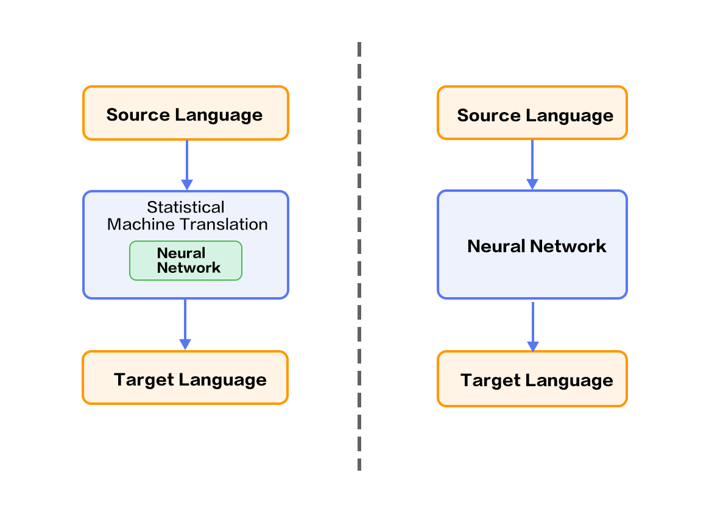
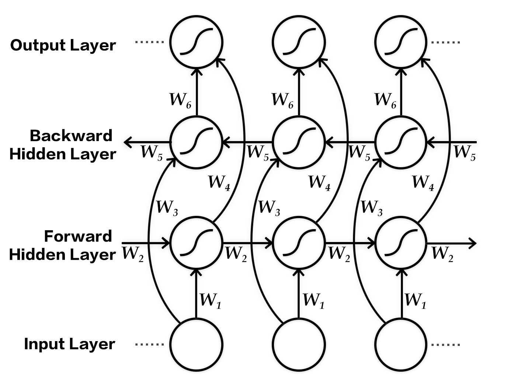
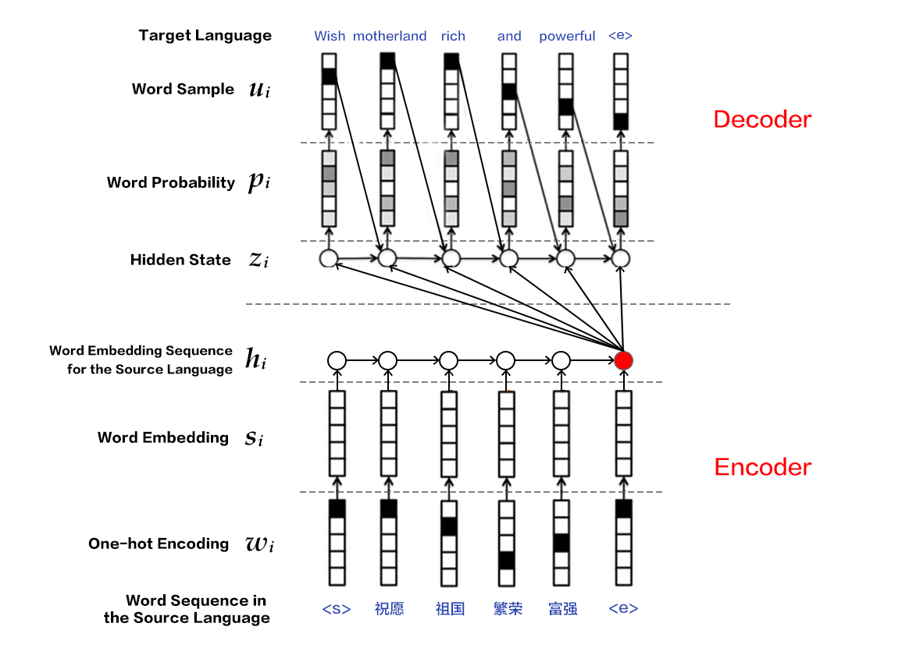
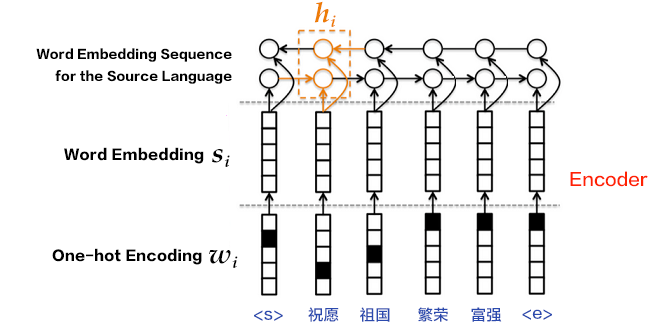

# Machine Translation

The source code of this tutorial is live at [book/machine_translation](https://github.com/PaddlePaddle/book/tree/develop/08.machine_translation). Please refer to the [book running tutorial](https://github.com/PaddlePaddle/book#running-the-book) for getting started with Paddle.

## Background

Machine translation (MT) leverages computers to translate from one language to another. The language to be translated is referred to as the source language, while the language to be translated into is referred to as the target language. Thus, Machine translation is the process of translating from the source language to the target language. It is one of the most important research topics in the field of natural language processing.


Early machine translation systems are mainly rule-based i.e. they rely on a language expert to specify the translation rules between the two languages. It is quite difficult to cover all the rules used in one language. So it is quite a challenge for language experts to specify all possible rules in two or more different languages. Hence, a major challenge in conventional machine translation has been the difficulty in obtaining a complete rule set \[[1](#references)\].


To address the aforementioned problems, statistical machine translation techniques have been developed. These techniques learn the translation rules from a large corpus, instead of being designed by a language expert. While these techniques overcome the bottleneck of knowledge acquisition, there are still quite a lot of challenges, for example:

1. Human designed features cannot cover all possible linguistic variations;

2. It is difficult to use global features;

3. The techniques heavily rely on pre-processing techniques like word alignment, word segmentation and tokenization, rule-extraction and syntactic parsing etc. The error introduced in any of these steps could accumulate and impact translation quality.


The recent development of deep learning provides new solutions to these challenges. The two main categories for deep learning based machine translation techniques are:

1. Techniques based on the statistical machine translation system but with some key components improved with neural networks, e.g., language model, reordering model (please refer to the left part of Figure 1);

2. Techniques mapping from source language to target language directly using a neural network, or end-to-end neural machine translation (NMT).

<p align="center">
<br/>
Figure 1. Neural Network based Machine Translation
</p>


This tutorial will mainly introduce an NMT model and how to use PaddlePaddle to train it.

## Illustrative Results

Let's consider an example of Chinese-to-English translation. The model is given the following segmented sentence in Chinese
```text
这些 是 希望 的 曙光 和 解脱 的 迹象 .
```
After training and with a beam-search size of 3, the generated translations are as follows:
```text
0 -5.36816   These are signs of hope and relief . <e>
1 -6.23177   These are the light of hope and relief . <e>
2 -7.7914  These are the light of hope and the relief of hope . <e>
```
- The first column corresponds to the id of the generated sentence; the second column corresponds to the score of the generated sentence (in descending order), where a larger value indicates better quality; the last column corresponds to the generated sentence.
- There are two special tokens: `<e>` denotes the end of a sentence while `<unk>` denotes unknown word, i.e., a word not in the training dictionary.

## Overview of the Model

This section will introduce Bi-directional Recurrent Neural Network, the Encoder-Decoder framework used in NMT, as well as the beam search algorithm.

### Bi-directional Recurrent Neural Network

We already introduced an instance of bi-directional RNN in the [Semantic Role Labeling](https://github.com/PaddlePaddle/book/blob/develop/label_semantic_roles/README.md) chapter. Here we present another bi-directional RNN model with a different architecture proposed by Bengio et al. in \[[2](#references),[4](#references)\]. This model takes a sequence as input and outputs a fixed dimensional feature vector at each step, encoding the context information at the corresponding time step.

Specifically, this bi-directional RNN processes the input sequence in the original and reverse order respectively, and then concatenates the output feature vectors at each time step as the final output. Thus the output node at each time step contains information from the past and future as context. The figure below shows an unrolled bi-directional RNN. This network contains a forward RNN and backward RNN with six weight matrices: weight matrices from input to forward hidden layer and backward hidden ($W_1, W_3$), weight matrices from hidden to itself ($W_2, W_5$), matrices from forward hidden and backward hidden to output layer ($W_4, W_6$). Note that there are no connections between forward hidden and backward hidden layers.

<p align="center">
<br/>
Figure 3. Temporally unrolled bi-directional RNN
</p>

### Encoder-Decoder Framework

The Encoder-Decoder\[[2](#references)\] framework aims to solve the mapping of a sequence to another sequence, for sequences with arbitrary lengths. The source sequence is encoded into a vector via an encoder, which is then decoded to a target sequence via a decoder by maximizing the predictive probability. Both the encoder and the decoder are typically implemented via RNN.

<p align="center">
<br/>
Figure 4. Encoder-Decoder Framework
</p>

#### Encoder

There are three steps for encoding a sentence:

1. One-hot vector representation of a word: Each word $x_i$ in the source sentence $x=\left \{ x_1,x_2,...,x_T \right \}$ is represented as a vector $w_i\epsilon \left \{ 0,1 \right \}^{\left | V \right |},i=1,2,...,T$   where $w_i$ has the same dimensionality as the size of the dictionary, i.e., $\left | V \right |$, and has an element of one at the location corresponding to the location of the word in the dictionary and zero elsewhere.

2. Word embedding as a representation in the low-dimensional semantic space: There are two problems with one-hot vector representation

  * The dimensionality of the vector is typically large, leading to the curse of dimensionality;

  * It is hard to capture the relationships between words, i.e., semantic similarities. Therefore, it is useful to project the one-hot vector into a low-dimensional semantic space as a dense vector with fixed dimensions, i.e., $s_i=Cw_i$ for the $i$-th word, with $C\epsilon R^{K\times \left | V \right |}$ as the projection matrix and $K$ is the dimensionality of the word embedding vector.

3. Encoding of the source sequence via RNN: This can be described mathematically as:

    $$h_i=\varnothing _\theta \left ( h_{i-1}, s_i \right )$$

    where
    $h_0$ is a zero vector,
    $\varnothing _\theta$ is a non-linear activation function, and
    $\mathbf{h}=\left \{ h_1,..., h_T \right \}$
    is the sequential encoding of the first $T$ words from the source sequence. The vector representation of the whole sentence can be represented as the encoding vector at the last time step $T$ from $\mathbf{h}$, or by temporal pooling over $\mathbf{h}$.


Bi-directional RNN can also be used in step (3) for more a complicated sentence encoding. This can be implemented using a bi-directional GRU. Forward GRU encodes the source sequence in its original order $(x_1,x_2,...,x_T)$, and generates a sequence of hidden states $(\overrightarrow{h_1},\overrightarrow{h_2},...,\overrightarrow{h_T})$. The backward GRU encodes the source sequence in reverse order, i.e., $(x_T,x_T-1,...,x_1)$ and generates $(\overleftarrow{h_1},\overleftarrow{h_2},...,\overleftarrow{h_T})$. Then for each word $x_i$, its complete hidden state is the concatenation of the corresponding hidden states from the two GRUs, i.e., $h_i=\left [ \overrightarrow{h_i^T},\overleftarrow{h_i^T} \right ]^{T}$.

<p align="center">
<br/>
Figure 5. Encoder using bi-directional GRU
</p>

#### Decoder

The goal of the decoder is to maximize the probability of the next correct word in the target language. The main idea is as follows:

1. At each time step $i$, given the encoding vector (or context vector) $c$ of the source sentence, the $i$-th word $u_i$ from the ground-truth target language and the RNN hidden state $z_i$, the next hidden state $z_{i+1}$ is computed as:

   $$z_{i+1}=\phi _{\theta '}\left ( c,u_i,z_i \right )$$
   where $\phi _{\theta '}$ is a non-linear activation function and $c=q\mathbf{h}$ is the context vector of the source sentence. Without using [attention](#Attention Mechanism), if the output of the [encoder](#Encoder) is the encoding vector at the last time step of the source sentence, then $c$ can be defined as $c=h_T$. $u_i$ denotes the $i$-th word from the target language sentence and $u_0$ denotes the beginning of the target language sentence (i.e., `<s>`), indicating the beginning of decoding. $z_i$ is the RNN hidden state at time step $i$ and $z_0$ is an all zero vector.

2. Calculate the probability $p_{i+1}$ for the $i+1$-th word in the target language sequence by normalizing $z_{i+1}$ using `softmax` as follows

   $$p\left ( u_{i+1}|u_{&lt;i+1},\mathbf{x} \right )=softmax(W_sz_{i+1}+b_z)$$

   where $W_sz_{i+1}+b_z$ scores each possible words and is then normalized via softmax to produce the probability $p_{i+1}$ for the $i+1$-th word.

3. Compute the cost accoding to $p_{i+1}$ and $u_{i+1}$.
4. Repeat Steps 1-3, until all the words in the target language sentence have been processed.

The generation process of machine translation is to translate the source sentence into a sentence in the target language according to a pre-trained model. There are some differences between the decoding step in generation and training. Please refer to [Beam Search Algorithm](#Beam Search Algorithm) for details.

### Beam Search Algorithm

[Beam Search](http://en.wikipedia.org/wiki/Beam_search) is a heuristic search algorithm that explores a graph by expanding the most promising node in a limited set. It is typically used when the solution space is huge  (e.g., for machine translation, speech recognition), and there is not enough memory for all the possible solutions. For example, if we want to translate “`<s>你好<e>`” into English, even if there are only three words in the dictionary (`<s>`, `<e>`, `hello`), it is still possible to generate an infinite number of sentences, where the word `hello` can appear different number of times. Beam search could be used to find a good translation among them.

Beam search builds a search tree using breadth first search and sorts the nodes according to a heuristic cost (sum of the log probability of the generated words) at each level of the tree. Only a fixed number of nodes according to the pre-specified beam size (or beam width) are considered. Thus, only nodes with highest scores are expanded in the next level. This reduces the space and time requirements significantly. However, a globally optimal solution is not guaranteed.

The goal is to maximize the probability of the generated sequence when using beam search in decoding, The procedure is as follows:

1. At each time step $i$, compute the hidden state $z_{i+1}$ of the next time step according to the context vector $c$ of the source sentence, the $i$-th word $u_i$ generated for the target language sentence and the RNN hidden state $z_i$.
2. Normalize $z_{i+1}$ using `softmax` to get the probability $p_{i+1}$ for the $i+1$-th word for the target language sentence.
3. Sample the word $u_{i+1}$ according to $p_{i+1}$.
4. Repeat Steps 1-3, until end-of-sentence token `<e>` is generated or the maximum length of the sentence is reached.

Note: $z_{i+1}$ and $p_{i+1}$ are computed the same way as in [Decoder](#Decoder). In generation mode, each step is greedy in so there is no guarantee of a global optimum.

## BLEU Score

Bilingual Evaluation understudy (BLEU) is a metric widely used for automatic machine translation proposed by IBM Watson Research Center in 2002\[[5](#References)\]. The closer the translation produced by a machine is to the translation produced by a human expert, the better the performance of the translation system.

To measure the closeness between machine translation and human translation, sentence precision is used. It compares the number of matched n-grams. More matches will lead to higher BLEU scores.

## Data Preparation

This tutorial uses a dataset from [WMT-14](http://www-lium.univ-lemans.fr/~schwenk/cslm_joint_paper/), where [bitexts (after selection)](http://www-lium.univ-lemans.fr/~schwenk/cslm_joint_paper/data/bitexts.tgz) is used as the training set, and [dev+test data](http://www-lium.univ-lemans.fr/~schwenk/cslm_joint_paper/data/dev+test.tgz) is used as test and generation set.


### Data Preprocessing

There are two steps for pre-processing:
- Merge the source and target parallel corpus files into one file
  - Merge `XXX.src` and `XXX.trg` file pair as `XXX`
  - The $i$-th row in `XXX` is the concatenation of the $i$-th row from `XXX.src` with the $i$-th row from `XXX.trg`, separated with '\t'.

- Create source dictionary and target dictionary, each containing **DICTSIZE** number of words, including the most frequent (DICTSIZE - 3) fo word from the corpus and 3 special token `<s>` (begin of sequence), `<e>` (end of sequence)  and `<unk>` (unknown words that are not in the vocabulary).

### A Subset of Dataset

Because the full dataset is very big, to reduce the time for downloading the full dataset. PadddlePaddle package `paddle.dataset.wmt14` provides a preprocessed `subset of dataset`(http://paddlepaddle.bj.bcebos.com/demo/wmt_shrinked_data/wmt14.tgz).

This subset has 193319 instances of training data and 6003 instances of test data. Dictionary size is 30000. Because of the limitation of size of the subset, the effectiveness of trained model from this subset is not guaranteed.

## Model Configuration

Our program starts with importing necessary packages and initializing some global variables:

```python
import contextlib

import numpy as np
import paddle
import paddle.fluid as fluid
import paddle.fluid.framework as framework
import paddle.fluid.layers as pd
from paddle.fluid.executor import Executor
from functools import partial
import os

dict_size = 30000
source_dict_dim = target_dict_dim = dict_size
hidden_dim = 32
word_dim = 16
batch_size = 2
max_length = 8
topk_size = 50
beam_size = 2

decoder_size = hidden_dim
```

Then we implement encoder as follows:

   ```python
   def encoder(is_sparse):
    # encoder
    src_word_id = pd.data(
        name="src_word_id", shape=[1], dtype='int64', lod_level=1)
    src_embedding = pd.embedding(
        input=src_word_id,
        size=[dict_size, word_dim],
        dtype='float32',
        is_sparse=is_sparse,
        param_attr=fluid.ParamAttr(name='vemb'))

    fc1 = pd.fc(input=src_embedding, size=hidden_dim * 4, act='tanh')
    lstm_hidden0, lstm_0 = pd.dynamic_lstm(input=fc1, size=hidden_dim * 4)
    encoder_out = pd.sequence_last_step(input=lstm_hidden0)
    return encoder_out
   ```

Implement the decoder for training as follows:

```python
   def train_decoder(context, is_sparse):
    # decoder
    trg_language_word = pd.data(
        name="target_language_word", shape=[1], dtype='int64', lod_level=1)
    trg_embedding = pd.embedding(
        input=trg_language_word,
        size=[dict_size, word_dim],
        dtype='float32',
        is_sparse=is_sparse,
        param_attr=fluid.ParamAttr(name='vemb'))

    rnn = pd.DynamicRNN()
    with rnn.block():
        current_word = rnn.step_input(trg_embedding)
        pre_state = rnn.memory(init=context)
        current_state = pd.fc(input=[current_word, pre_state],
                              size=decoder_size,
                              act='tanh')

        current_score = pd.fc(input=current_state,
                              size=target_dict_dim,
                              act='softmax')
        rnn.update_memory(pre_state, current_state)
        rnn.output(current_score)

    return rnn()
```

Implement the decoder for prediction as follows:

```python
def decode(context, is_sparse):
    init_state = context
    array_len = pd.fill_constant(shape=[1], dtype='int64', value=max_length)
    counter = pd.zeros(shape=[1], dtype='int64', force_cpu=True)

    # fill the first element with init_state
    state_array = pd.create_array('float32')
    pd.array_write(init_state, array=state_array, i=counter)

    # ids, scores as memory
    ids_array = pd.create_array('int64')
    scores_array = pd.create_array('float32')

    init_ids = pd.data(name="init_ids", shape=[1], dtype="int64", lod_level=2)
    init_scores = pd.data(
        name="init_scores", shape=[1], dtype="float32", lod_level=2)

    pd.array_write(init_ids, array=ids_array, i=counter)
    pd.array_write(init_scores, array=scores_array, i=counter)

    cond = pd.less_than(x=counter, y=array_len)

    while_op = pd.While(cond=cond)
    with while_op.block():
        pre_ids = pd.array_read(array=ids_array, i=counter)
        pre_state = pd.array_read(array=state_array, i=counter)
        pre_score = pd.array_read(array=scores_array, i=counter)

        # expand the lod of pre_state to be the same with pre_score
        pre_state_expanded = pd.sequence_expand(pre_state, pre_score)

        pre_ids_emb = pd.embedding(
            input=pre_ids,
            size=[dict_size, word_dim],
            dtype='float32',
            is_sparse=is_sparse)

        # use rnn unit to update rnn
        current_state = pd.fc(input=[pre_state_expanded, pre_ids_emb],
                              size=decoder_size,
                              act='tanh')
        current_state_with_lod = pd.lod_reset(x=current_state, y=pre_score)
        # use score to do beam search
        current_score = pd.fc(input=current_state_with_lod,
                              size=target_dict_dim,
                              act='softmax')
        topk_scores, topk_indices = pd.topk(current_score, k=topk_size)
        selected_ids, selected_scores = pd.beam_search(
            pre_ids, topk_indices, topk_scores, beam_size, end_id=10, level=0)

        pd.increment(x=counter, value=1, in_place=True)

        # update the memories
        pd.array_write(current_state, array=state_array, i=counter)
        pd.array_write(selected_ids, array=ids_array, i=counter)
        pd.array_write(selected_scores, array=scores_array, i=counter)

        pd.less_than(x=counter, y=array_len, cond=cond)

    translation_ids, translation_scores = pd.beam_search_decode(
        ids=ids_array, scores=scores_array)

    return translation_ids, translation_scores
```


Then we define a `training_program` that uses the result from `encoder` and `train_decoder` to compute the cost with label data.
Also define `optimizer_func` to specify the optimizer.

```python
def train_program(is_sparse):
    context = encoder(is_sparse)
    rnn_out = train_decoder(context, is_sparse)
    label = pd.data(
        name="target_language_next_word", shape=[1], dtype='int64', lod_level=1)
    cost = pd.cross_entropy(input=rnn_out, label=label)
    avg_cost = pd.mean(cost)
    return avg_cost


def optimizer_func():
    return fluid.optimizer.Adagrad(
        learning_rate=1e-4,
        regularization=fluid.regularizer.L2DecayRegularizer(
            regularization_coeff=0.1))
```

## Model Training

### Specify training environment

Specify your training environment, you should specify if the training is on CPU or GPU.

```python
use_cuda = False
place = fluid.CUDAPlace(0) if use_cuda else fluid.CPUPlace()
```

### Datafeeder Configuration

Next we define data feeders for test and train. The feeder reads a `buf_size` of data each time and feed them to the training/testing process.
`paddle.dataset.wmt14.train` will yield records during each pass, after shuffling, a batch input of `BATCH_SIZE` is generated for training.

```python
train_reader = paddle.batch(
        paddle.reader.shuffle(
            paddle.dataset.wmt14.train(dict_size), buf_size=1000),
        batch_size=batch_size)
```

### Create Trainer

Create a trainer that takes `train_program` as input and specify optimizer function.

```python
is_sparse = False
trainer = fluid.Trainer(
        train_func=partial(train_program, is_sparse),
        place=place,
        optimizer_func=optimizer_func)
```

### Feeding Data

`feed_order` is devoted to specifying the correspondence between each yield record and `paddle.layer.data`. For instance, the first column of data generated by `wmt14.train` corresponds to `src_word_id`.

```python
feed_order = [
        'src_word_id', 'target_language_word', 'target_language_next_word'
    ]
```

### Event Handler

Callback function `event_handler` will be called during training when a pre-defined event happens.
For example, we can check the cost by `trainer.test` when `EndStepEvent` occurs

```python
def event_handler(event):
    if isinstance(event, fluid.EndStepEvent):
        if event.step % 10 == 0:
            print('pass_id=' + str(event.epoch) + ' batch=' + str(event.step))

        if event.step == 20:
            trainer.stop()
```


### Training

Finally, we invoke `trainer.train` to start training with `num_epochs` and other parameters.

```python
EPOCH_NUM = 1

trainer.train(
        reader=train_reader,
        num_epochs=EPOCH_NUM,
        event_handler=event_handler,
        feed_order=feed_order)
```

## Inference

### Define the decode part

Use the `encoder` and `decoder` function we defined above to predict translation ids and scores.

```python
context = encoder(is_sparse)
translation_ids, translation_scores = decode(context, is_sparse)
```

### Define DataSet

We initialize ids and scores and create tensors for input. In this test we are using first record data from `wmt14.test` for inference. At the end we get src dict and target dict for printing out results later.

```python
init_ids_data = np.array([1 for _ in range(batch_size)], dtype='int64')
init_scores_data = np.array(
    [1. for _ in range(batch_size)], dtype='float32')
init_ids_data = init_ids_data.reshape((batch_size, 1))
init_scores_data = init_scores_data.reshape((batch_size, 1))
init_lod = [1] * batch_size
init_lod = [init_lod, init_lod]

init_ids = fluid.create_lod_tensor(init_ids_data, init_lod, place)
init_scores = fluid.create_lod_tensor(init_scores_data, init_lod, place)

test_data = paddle.batch(
    paddle.reader.shuffle(
        paddle.dataset.wmt14.test(dict_size), buf_size=1000),
    batch_size=batch_size)

feed_order = ['src_word_id']
feed_list = [
    framework.default_main_program().global_block().var(var_name)
    for var_name in feed_order
]
feeder = fluid.DataFeeder(feed_list, place)

src_dict, trg_dict = paddle.dataset.wmt14.get_dict(dict_size)
```

### Infer

We create `feed_dict` with all the inputs we need and run with `executor` to get predicted results id and corresponding scores.

```python
exe = Executor(place)
exe.run(framework.default_startup_program())

for data in test_data():
    feed_data = map(lambda x: [x[0]], data)
    feed_dict = feeder.feed(feed_data)
    feed_dict['init_ids'] = init_ids
    feed_dict['init_scores'] = init_scores

    results = exe.run(
        framework.default_main_program(),
        feed=feed_dict,
        fetch_list=[translation_ids, translation_scores],
        return_numpy=False)

    result_ids = np.array(results[0])
    result_scores = np.array(results[1])

    print("Original sentence:")
    print(" ".join([src_dict[w] for w in feed_data[0][0]]))
    print("Translated sentence:")
    print(" ".join([trg_dict[w] for w in result_ids]))
    print("Corresponding score: ", result_scores)

    break
```

## References

1. Koehn P. [Statistical machine translation](https://books.google.com.hk/books?id=4v_Cx1wIMLkC&printsec=frontcover&hl=zh-CN&source=gbs_ge_summary_r&cad=0#v=onepage&q&f=false)[M]. Cambridge University Press, 2009.
2. Cho K, Van Merriënboer B, Gulcehre C, et al. [Learning phrase representations using RNN encoder-decoder for statistical machine translation](http://www.aclweb.org/anthology/D/D14/D14-1179.pdf)[C]//Proceedings of the 2014 Conference on Empirical Methods in Natural Language Processing (EMNLP), 2014: 1724-1734.
3. Chung J, Gulcehre C, Cho K H, et al. [Empirical evaluation of gated recurrent neural networks on sequence modeling](https://arxiv.org/abs/1412.3555)[J]. arXiv preprint arXiv:1412.3555, 2014.
4.  Bahdanau D, Cho K, Bengio Y. [Neural machine translation by jointly learning to align and translate](https://arxiv.org/abs/1409.0473)[C]//Proceedings of ICLR 2015, 2015.
5. Papineni K, Roukos S, Ward T, et al. [BLEU: a method for automatic evaluation of machine translation](http://dl.acm.org/citation.cfm?id=1073135)[C]//Proceedings of the 40th annual meeting on association for computational linguistics. Association for Computational Linguistics, 2002: 311-318.

<br/>
This tutorial is contributed by <a xmlns:cc="http://creativecommons.org/ns#" href="http://book.paddlepaddle.org" property="cc:attributionName" rel="cc:attributionURL">PaddlePaddle</a>, and licensed under a <a rel="license" href="http://creativecommons.org/licenses/by-sa/4.0/">Creative Commons Attribution-ShareAlike 4.0 International License</a>.
