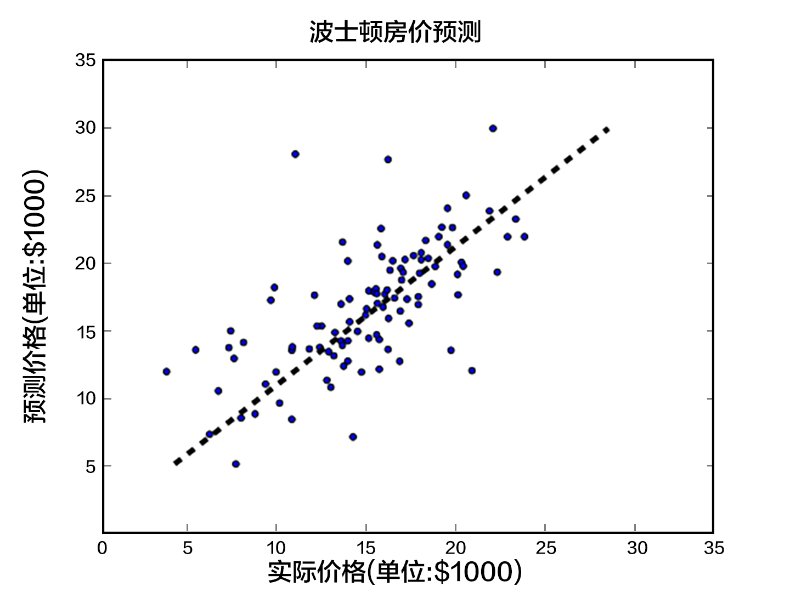

# Linear Regression
Let us begin the tutorial with a classical problem called Linear Regression \[[1](#References)\]. In this chapter, we will train a model from a realistic dataset to predict house prices. Some important concepts in Machine Learning will be covered through this example.

The source code for this tutorial is at [book/fit_a_line](https://github.com/PaddlePaddle/book/tree/develop/fit_a_line). If this is your first time using PaddlePaddle, please refer to the [Install Guide](http://www.paddlepaddle.org/doc_cn/build_and_install/index.html).

## Problem
Suppose we have a dataset of $n$ houses. Each house $i$ has $d$ properties and the price $y_i$. A property $x_{i,d}$ describes one aspect of the house, for example, the number of rooms in the house, the number of schools or hospitals in the neighborhood, the nearby traffic condition, etc. Our task is to predict $y_i$ given a set of properties $\{x_{i,1}, ..., x_{i,d}\}$. We assume that the price is a linear combination of all the properties, i.e.,

$$y_i = \omega_1x_{i,1} + \omega_2x_{i,2} + \ldots + \omega_dx_{i,d} + b,  i=1,\ldots,n$$

where $\omega_{d}$ and $b$ are the model parameters we want to estimate. Once they are learned, given a set of properties of a house, we will be able to predict a price for that house. The model we have here is called Linear Regression, namely, we want to regress a value as a linear combination of several values. In practice this linear model for our problem is hardly true, because the real relationship between the house properties and the price is much more complicated. However, due to its simple formulation which makes the model training and analysis easy, Linear Regression has been applied to lots of real problems. It is always an important topic in many classical Statistical Learning and Machine Learning textbooks \[[2,3,4](#References)\].

## Results Demonstration
We first show the training result of our model. We use the [UCI Housing Data Set](https://archive.ics.uci.edu/ml/datasets/Housing) to train a linear model and predict the house prices in Boston. The figure below shows the predictions the model makes for some house prices. The $X$ coordinate of each point represents the median value of the prices of a certain type of houses, while the $Y$ coordinate represents the predicted value by our linear model. When $X=Y$, the point lies exactly on the dotted line. In other words, the more precise the model predicts, the closer the point is to the dotted line.
<p align="center">
	<br/>
	Figure 1. Predicted Value V.S. Actual Value (波士顿房价预测->Prediction of Boston house prices; 预测价格->Predicted prices; 单位->Units; 实际价格->Actual prices)
</p>

## Model Overview

### Model Definition

In the UCI Housing Data Set, there are 13 house properties $x_{i,d}$ that are related to the median house price $y_i$. Thus our model is:

$$\hat{Y} = \omega_1X_{1} + \omega_2X_{2} + \ldots + \omega_{13}X_{13} + b$$

where $\hat{Y}$ is the predicted value used to differentiate from the actual value $Y$. The model parameters to be learned are: $\omega_1, \ldots, \omega_{13}, b$, where $\omega$ are called the weights and $b$ is called the bias.

Now we need an optimization goal, so that with the learned parameters, $\hat{Y}$ is close to $Y$ as much as possible. Here we introduce the concept of [Loss Function (Cost Function)](https://en.wikipedia.org/wiki/Loss_function). The Loss Function has such property: given any pair of the actual value $y_i$ and the predicted value $\hat{y_i}$, its output is always non-negative. This non-negative value reflects the model error.

For Linear Regression, the most common Loss Function is [Mean Square Error (MSE)](https://en.wikipedia.org/wiki/Mean_squared_error) which has the following form:

$$MSE=\frac{1}{n}\sum_{i=1}^{n}{(\hat{Y_i}-Y_i)}^2$$

For a dataset of size $n$, MSE is the average value of the $n$ predicted errors.

### Training

After defining our model, we have several major steps for the training:
1. Initialize the parameters including the weights $\omega$ and the bias $b$. For example, we can set their mean values as 0s, and their standard deviations as 1s.
2. Feedforward to compute the network output and the Loss Function.
3. Backward to [backpropagate](https://en.wikipedia.org/wiki/Backpropagation) the errors. The errors will be propagated from the output layer back to the input layer, during which the model parameters will be updated with the corresponding errors.
4. Repeat steps 2~3, until the loss is below a predefined threshold or the maximum number of repeats is reached.

## Data Preparation
Follow the command below to prepare data:
```bash
cd data && python prepare_data.py
```
This line of code will download the dataset from the [UCI Housing Data Set](https://archive.ics.uci.edu/ml/datasets/Housing) and perform some [preprocessing](#Preprocessing). The dataset is split into a training set and a test set.

The dataset contains 506 lines in total, each line describing the properties and the median price of a certain type of houses in Boston. The meaning of each line is below:


| Property Name | Explanation | Data Type |
| ------| ------ | ------ |
| CRIM | per capita crime rate by town | Continuous|
| ZN | proportion of residential land zoned for lots over 25,000 sq.ft. | Continuous |
| INDUS | proportion of non-retail business acres per town | Continuous |
| CHAS | Charles River dummy variable | Discrete, 1 if tract bounds river; 0 otherwise|
| NOX | nitric oxides concentration (parts per 10 million) | Continuous |
| RM | average number of rooms per dwelling | Continuous |
| AGE | proportion of owner-occupied units built prior to 1940 | Continuous |
| DIS | weighted distances to five Boston employment centres | Continuous |
| RAD | index of accessibility to radial highways | Continuous |
| TAX | full-value property-tax rate per $10,000 | Continuous |
| PTRATIO | pupil-teacher ratio by town | Continuous |
| B | 1000(Bk - 0.63)^2 where Bk is the proportion of blacks by town | Continuous |
| LSTAT | % lower status of the population | Continuous |
| MEDV | Median value of owner-occupied homes in $1000's | Continuous |

The last entry is the median house price.

### Preprocessing
#### Continuous and Discrete Data
We define a feature vector of length 13 for each house, where each entry of the feature vector corresponds to a property of that house. Our first observation is that among the 13 dimensions, there are 12 continuous dimensions and 1 discrete dimension. Note that although a discrete value is also written as digits such as 0, 1, or 2, it has a quite different meaning from a continuous value. The reason is that the difference between two discrete values has no practical meaning. For example, if we use 0, 1, and 2 to represent `red`, `green`, and `blue` respectively, although the numerical difference between `red` and `green` is smaller than that between `red` and `blue`, we cannot say that the extent to which `blue` is different from `red` is greater than the extent to which `green` is different from `red`. Therefore, when handling a discrete feature that has $d$ possible values, we will usually convert it to $d$ new features where each feature can only take 0 or 1, indicating whether the original $d$th value is present or not. Or we can map the discrete feature to a continuous multi-dimensional vector through an embedding table. For our problem here, because CHAS itself is a binary discrete value, we do not need to do any preprocessing.

#### Feature Normalization
Another observation we have is that there is a huge difference among the value ranges of the 13 features (Figure 2). For example, feature B has a value range of [0.32, 396.90] while feature NOX has a range of [0.3850, 0.8170]. For an effective optimization, here we need data normalization. The goal of data normalization is to scale each feature into roughly the same value range, for example [-0.5, 0.5]. In this example, we adopt a standard way of normalization: substracting the mean value from the feature and divide the result by the original value range.

There are at least three reasons for [Feature Normalization](https://en.wikipedia.org/wiki/Feature_scaling) (Feature Scaling):
- A value range that is too large or too small might cause floating number overflow or underflow during computation.
- Different value ranges might result in different importances of different features to the model (at least in the beginning of the training process), which however is an unreasonable assumption. Such assumption makes the optimization more difficult and increases the training time a lot.
- Many Machine Learning techniques or models (e.g., L1/L2 regularization and Vector Space Model) are based on the assumption that all the features have roughly zero means and their value ranges are similar.

<p align="center">
	<br/>
	Figure 2. The value ranges of the features (特征尺度->Feature value range)
</p>

#### Prepare Training and Test Sets
We split the dataset into two subsets, one for estimating the model parameters, namely, model training, and the other for model testing. The model error on the former is called the **training error**, and the error on the latter is called the **test error**. Our goal of training a model is to find the statistical dependency between the outputs and the inputs, so that we can predict new outputs given new inputs. As a result, the test error reflects the performance of the model better than the training error does. We consider two things when deciding the ratio of the training set to the test set: 1) More training data will decrease the variance of the parameter estimation, yielding more reliable models; 2) More test data will decrease the variance of the test error, yielding more reliable test errors. One standard split ratio is $8:2$. You can try different split ratios to observe how the two variances change.

Executing the following command to split the dataset and write the training and test set into the `train.list` and `test.list` files, so that later PaddlePaddle can read from them.
```python
python prepare_data.py -r 0.8 #8:2 is the default split ratio
```

When training complex models, we usually have one more split: the validation set. Complex models usually have [Hyperparameters](https://en.wikipedia.org/wiki/Hyperparameter_optimization) that need to be set before the training process begins. These hyperparameters are not part of the model parameters and cannot be trained using the same Loss Function (e.g., the number of layers in the network). Thus we will try several sets of hyperparameters to get several models, and compare these trained models on the validation set to pick the best one, and finally it on the test set. Because our model is relatively simple in this problem, we ignore this validation process for now.

### Provide Data to PaddlePaddle
After the data is prepared, we use a Python Data Provider to provide data for PaddlePaddle. A Data Provider is a Python function which will be called by PaddlePaddle during training. In this example, the Data Provider only needs to read the data and return it to the training process of PaddlePaddle line by line.

```python
from paddle.trainer.PyDataProvider2 import *
import numpy as np
#define data type and dimensionality
@provider(input_types=[dense_vector(13), dense_vector(1)])
def process(settings, input_file):
    data = np.load(input_file.strip())
    for row in data:
	    yield row[:-1].tolist(), row[-1:].tolist()

```

## Model Configuration

### Data Definition
We first call the function `define_py_data_sources2` to let PaddlePaddle read training and test data from the `dataprovider.py` in the above. PaddlePaddle can accept configuration info from the command line, for example, here we pass a variable named `is_predict` to control the model to have different structures during training and test.
```python
from paddle.trainer_config_helpers import *

is_predict = get_config_arg('is_predict', bool, False)

define_py_data_sources2(
    train_list='data/train.list',
    test_list='data/test.list',
    module='dataprovider',
    obj='process')

```

### Algorithm Settings
Next we need to set the details of the optimization algorithm. Due to the simplicity of the Linear Regression model, we only need to set the `batch_size` which defines how many samples are used every time for updating the parameters.
```python
settings(batch_size=2)
```

### Network
Finally, we use `fc_layer` and `LinearActivation` to represent the Linear Regression model.
```python
#input data of 13 dimensional house information
x = data_layer(name='x', size=13)

y_predict = fc_layer(
    input=x,
    param_attr=ParamAttr(name='w'),
    size=1,
    act=LinearActivation(),
    bias_attr=ParamAttr(name='b'))

if not is_predict: #when training, we use MSE (i.e., regression_cost) as the Loss Function
    y = data_layer(name='y', size=1)
    cost = regression_cost(input=y_predict, label=y)
    outputs(cost) #output MSE to view the loss change
else: #during test, output the prediction value
    outputs(y_predict)
```

## Training Model
We can run the PaddlePaddle command line trainer in the root directory of the code. Here we name the configuration file as `trainer_config.py`. We train 30 passes and save the result in the directory `output`:
```bash
./train.sh
```

## Use Model
Now we can use the trained model to do prediction.
```bash
python predict.py
```
Here by default we use the model in `output/pass-00029` for prediction, and compare the actual house price with the predicted one. The result is shown in `predictions.png`.
If you want to use another model or test on other data, you can pass in a new model path or data path:
```bash
python predict.py -m output/pass-00020 -t data/housing.test.npy
```

## Summary
In this chapter, we have introduced the Linear Regression model using the UCI Housing Data Set as an example. We have shown how to train and test this model with PaddlePaddle. Many more complex models and techniques are derived from this simple linear model, thus it is important for us to understand how it works.


## References
1. https://en.wikipedia.org/wiki/Linear_regression
2. Friedman J, Hastie T, Tibshirani R. The elements of statistical learning[M]. Springer, Berlin: Springer series in statistics, 2001.
3. Murphy K P. Machine learning: a probabilistic perspective[M]. MIT press, 2012.
4. Bishop C M. Pattern recognition[J]. Machine Learning, 2006, 128.

<br/>
<a rel="license" href="http://creativecommons.org/licenses/by-nc-sa/4.0/"></a><br /><span xmlns:dct="http://purl.org/dc/terms/" href="http://purl.org/dc/dcmitype/Text" property="dct:title" rel="dct:type">本教程</span> 由 <a xmlns:cc="http://creativecommons.org/ns#" href="http://book.paddlepaddle.org" property="cc:attributionName" rel="cc:attributionURL">PaddlePaddle</a> 创作，采用 <a rel="license" href="http://creativecommons.org/licenses/by-nc-sa/4.0/">知识共享 署名-非商业性使用-相同方式共享 4.0 国际 许可协议</a>进行许可。
