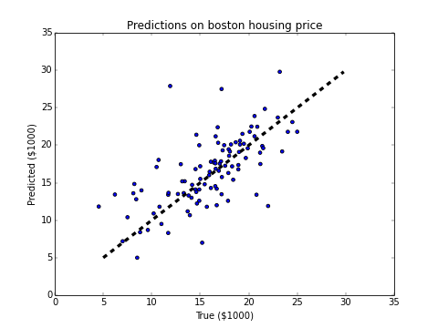
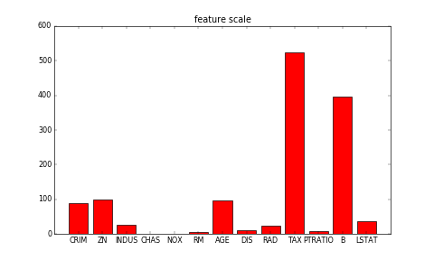

# 线性回归
让我们从经典的线性回归（Linear Regression \[[1](#参考文献)\]）模型开始这份教程。在这一章里，你将使用真实的数据集建立起一个房价预测模型，并且了解到机器学习中的若干重要概念。

本教程源代码目录在[book/fit_a_line](https://github.com/PaddlePaddle/book/tree/develop/fit_a_line)， 初次使用请参考PaddlePaddle[安装教程](http://www.paddlepaddle.org/doc_cn/build_and_install/index.html)。

## 背景介绍
给定一个大小为$n$的数据集  ${\{y_{i}, x_{i1}, ..., x_{id}\}}_{i=1}^{n}$，其中$x_{i1}, \ldots, x_{id}$是第$i$个样本$d$个属性上的取值，$y_i$是该样本待预测的目标。线性回归模型假设目标$y_i$可以被属性间的线性组合描述，即

$$y_i = \omega_1x_{i1} + \omega_2x_{i2} + \ldots + \omega_dx_{id} + b,  i=1,\ldots,n$$

例如，在我们将要建模的房价预测问题里，$x_{ij}$是描述房子$i$的各种属性（比如房间的个数、周围学校和医院的个数、交通状况等），而 $y_i$是房屋的价格。

初看起来，这个假设实在过于简单了，变量间的真实关系很难是线性的。但由于线性回归模型有形式简单和易于建模分析的优点，它在实际问题中得到了大量的应用。很多经典的统计学习、机器学习书籍\[[2,3,4](#参考文献)\]也选择对线性模型独立成章重点讲解。

## 效果展示
我们使用从[UCI Housing Data Set](https://archive.ics.uci.edu/ml/datasets/Housing)获得的波士顿房价数据集进行模型的训练和预测。下面的散点图展示了使用模型对部分房屋价格进行的预测。其中，每个点的横坐标表示同一类房屋真实价格的中位数，纵坐标表示线性回归模型根据特征预测的结果，当二者值完全相等的时候就会落在虚线上。所以模型预测得越准确，则点离虚线越近。
<p align="center">
	<br/>
	图1. 预测值 V.S. 真实值
</p>

## 模型概览

### 模型定义

在波士顿房价数据集中，和房屋相关的值共有14个：前13个用来描述房屋相关的各种信息，即模型中的 $x_i$；最后一个值为我们要预测的该类房屋价格的中位数，即模型中的 $y_i$。因此，我们的模型就可以表示成：

$$\hat{Y} = \omega_1X_{1} + \omega_2X_{2} + \ldots + \omega_{13}X_{13} + b$$

$\hat{Y}$ 表示模型的预测结果，用来和真实值$Y$区分。模型要学习的参数即：$\omega_1, \ldots, \omega_{13}, b$。

建立模型后，我们需要给模型一个优化目标，使得学到的参数能够让预测值$\hat{Y}$尽可能地接近真实值$Y$。这里我们引入损失函数（[Loss Function](https://en.wikipedia.org/wiki/Loss_function)，或Cost Function）这个概念。 输入任意一个数据样本的目标值$y_{i}$和模型给出的预测值$\hat{y_{i}}$，损失函数输出一个非负的实值。这个实质通常用来反映模型误差的大小。

对于线性回归模型来讲，最常见的损失函数就是均方误差（Mean Squared Error， [MSE](https://en.wikipedia.org/wiki/Mean_squared_error)）了，它的形式是：

$$MSE=\frac{1}{n}\sum_{i=1}^{n}{(\hat{Y_i}-Y_i)}^2$$

即对于一个大小为$n$的测试集，$MSE$是$n$个数据预测结果误差平方的均值。

### 训练过程

定义好模型结构之后，我们要通过以下几个步骤进行模型训练
 1. 初始化参数，其中包括权重$\omega_i$和偏置$b$，对其进行初始化（如0均值，1方差）。
 2. 网络正向传播计算网络输出和损失函数。
 3. 根据损失函数进行反向误差传播 （[backpropagation](https://en.wikipedia.org/wiki/Backpropagation)），将网络误差从输出层依次向前传递, 并更新网络中的参数。
 4. 重复2~3步骤，直至网络训练误差达到规定的程度或训练轮次达到设定值。

## 数据集

### 数据集接口的封装
首先加载需要的包

```python
import paddle.v2 as paddle
import paddle.v2.dataset.uci_housing as uci_housing
```

我们通过uci_housing模块引入了数据集合[UCI Housing Data Set](https://archive.ics.uci.edu/ml/datasets/Housing)

其中，在uci_housing模块中封装了：

1. 数据下载的过程。下载数据保存在~/.cache/paddle/dataset/uci_housing/housing.data。
2. [数据预处理](#数据预处理)的过程。


### 数据集介绍
这份数据集共506行，每行包含了波士顿郊区的一类房屋的相关信息及该类房屋价格的中位数。其各维属性的意义如下：

| 属性名 | 解释 | 类型 |
| ------| ------ | ------ |
| CRIM | 该镇的人均犯罪率 | 连续值 |
| ZN | 占地面积超过25,000平方呎的住宅用地比例 | 连续值 |
| INDUS | 非零售商业用地比例 | 连续值 |
| CHAS | 是否邻近 Charles River  | 离散值，1=邻近；0=不邻近 |
| NOX | 一氧化氮浓度 | 连续值 |
| RM | 每栋房屋的平均客房数 | 连续值 |
| AGE | 1940年之前建成的自用单位比例 | 连续值 |
| DIS | 到波士顿5个就业中心的加权距离 | 连续值 |
| RAD | 到径向公路的可达性指数 | 连续值 |
| TAX | 全值财产税率 | 连续值 |
| PTRATIO | 学生与教师的比例 | 连续值 |
| B | 1000(BK - 0.63)^2，其中BK为黑人占比 | 连续值 |
| LSTAT | 低收入人群占比 | 连续值 |
| MEDV | 同类房屋价格的中位数 | 连续值 |

### 数据预处理
#### 连续值与离散值
观察一下数据，我们的第一个发现是：所有的13维属性中，有12维的连续值和1维的离散值（CHAS）。离散值虽然也常使用类似0、1、2这样的数字表示，但是其含义与连续值是不同的，因为这里的差值没有实际意义。例如，我们用0、1、2来分别表示红色、绿色和蓝色的话，我们并不能因此说“蓝色和红色”比“绿色和红色”的距离更远。所以通常对一个有$d$个可能取值的离散属性，我们会将它们转为$d$个取值为0或1的二值属性或者将每个可能取值映射为一个多维向量。不过就这里而言，因为CHAS本身就是一个二值属性，就省去了这个麻烦。

#### 属性的归一化
另外一个稍加观察即可发现的事实是，各维属性的取值范围差别很大（如图2所示）。例如，属性B的取值范围是[0.32, 396.90]，而属性NOX的取值范围是[0.3850, 0.8170]。这里就要用到一个常见的操作-归一化（normalization）了。归一化的目标是把各位属性的取值范围放缩到差不多的区间，例如[-0.5,0.5]。这里我们使用一种很常见的操作方法：减掉均值，然后除以原取值范围。

做归一化（或 [Feature scaling](https://en.wikipedia.org/wiki/Feature_scaling)）至少有以下3个理由：
- 过大或过小的数值范围会导致计算时的浮点上溢或下溢。
- 不同的数值范围会导致不同属性对模型的重要性不同（至少在训练的初始阶段如此），而这个隐含的假设常常是不合理的。这会对优化的过程造成困难，使训练时间大大的加长。
- 很多的机器学习技巧/模型（例如L1，L2正则项，向量空间模型-Vector Space Model）都基于这样的假设：所有的属性取值都差不多是以0为均值且取值范围相近的。

<p align="center">
	<br/>
	图2. 各维属性的取值范围
</p>

#### 整理训练集与测试集
我们将数据集分割为两份：一份用于调整模型的参数，即进行模型的训练，模型在这份数据集上的误差被称为**训练误差**；另外一份被用来测试，模型在这份数据集上的误差被称为**测试误差**。我们训练模型的目的是为了通过从训练数据中找到规律来预测未知的新数据，所以测试误差是更能反映模型表现的指标。分割数据的比例要考虑到两个因素：更多的训练数据会降低参数估计的方差，从而得到更可信的模型；而更多的测试数据会降低测试误差的方差，从而得到更可信的测试误差。我们这个例子中设置的分割比例为$8:2$


在更复杂的模型训练过程中，我们往往还会多使用一种数据集：验证集。因为复杂的模型中常常还有一些超参数（[Hyperparameter](https://en.wikipedia.org/wiki/Hyperparameter_optimization)）需要调节，所以我们会尝试多种超参数的组合来分别训练多个模型，然后对比它们在验证集上的表现选择相对最好的一组超参数，最后才使用这组参数下训练的模型在测试集上评估测试误差。由于本章训练的模型比较简单，我们暂且忽略掉这个过程。

## 训练

`fit_a_line/trainer.py`演示了训练的整体过程。

### 初始化PaddlePaddle

```python
paddle.init(use_gpu=False, trainer_count=1)
```

### 模型配置

线性回归的模型其实就是一个采用线性激活函数（linear activation，`LinearActivation`）的全连接层（fully-connected layer，`fc_layer`）：

```python
x = paddle.layer.data(name='x', type=paddle.data_type.dense_vector(13))
y_predict = paddle.layer.fc(input=x,
                                size=1,
                                act=paddle.activation.Linear())
y = paddle.layer.data(name='y', type=paddle.data_type.dense_vector(1))
cost = paddle.layer.regression_cost(input=y_predict, label=y)
```
### 创建参数

```python
parameters = paddle.parameters.create(cost)
```

### 创建Trainer

```python
optimizer = paddle.optimizer.Momentum(momentum=0)

trainer = paddle.trainer.SGD(cost=cost,
                             parameters=parameters,
                             update_equation=optimizer)
```

### 读取数据且打印训练的中间信息

PaddlePaddle提供一个
[reader机制](https://github.com/PaddlePaddle/Paddle/tree/develop/doc/design/reader)
来读取数据。 Reader返回的数据可以包括多列，我们需要一个Python dict把列
序号映射到网络里的数据层。

```python
feeding={'x': 0, 'y': 1}
```

此外，我们还可以提供一个 event handler，来打印训练的进度：

```python
# event_handler to print training and testing info
def event_handler(event):
    if isinstance(event, paddle.event.EndIteration):
        if event.batch_id % 100 == 0:
            print "Pass %d, Batch %d, Cost %f" % (
                event.pass_id, event.batch_id, event.cost)

    if isinstance(event, paddle.event.EndPass):
        result = trainer.test(
            reader=paddle.batch(
                uci_housing.test(), batch_size=2),
            feeding=feeding)
        print "Test %d, Cost %f" % (event.pass_id, result.cost)
```

### 开始训练

```python
trainer.train(
    reader=paddle.batch(
        paddle.reader.shuffle(
            uci_housing.train(), buf_size=500),
        batch_size=2),
    feeding=feeding,
    event_handler=event_handler,
    num_passes=30)
```

## 总结
在这章里，我们借助波士顿房价这一数据集，介绍了线性回归模型的基本概念，以及如何使用PaddlePaddle实现训练和测试的过程。很多的模型和技巧都是从简单的线性回归模型演化而来，因此弄清楚线性模型的原理和局限非常重要。


## 参考文献
1. https://en.wikipedia.org/wiki/Linear_regression
2. Friedman J, Hastie T, Tibshirani R. The elements of statistical learning[M]. Springer, Berlin: Springer series in statistics, 2001.
3. Murphy K P. Machine learning: a probabilistic perspective[M]. MIT press, 2012.
4. Bishop C M. Pattern recognition[J]. Machine Learning, 2006, 128.

<br/>
<a rel="license" href="http://creativecommons.org/licenses/by-nc-sa/4.0/"></a><br /><span xmlns:dct="http://purl.org/dc/terms/" href="http://purl.org/dc/dcmitype/Text" property="dct:title" rel="dct:type">本教程</span> 由 <a xmlns:cc="http://creativecommons.org/ns#" href="http://book.paddlepaddle.org" property="cc:attributionName" rel="cc:attributionURL">PaddlePaddle</a> 创作，采用 <a rel="license" href="http://creativecommons.org/licenses/by-nc-sa/4.0/">知识共享 署名-非商业性使用-相同方式共享 4.0 国际 许可协议</a>进行许可。
