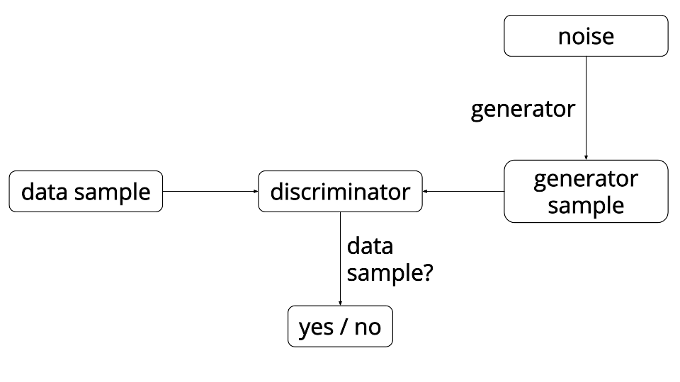
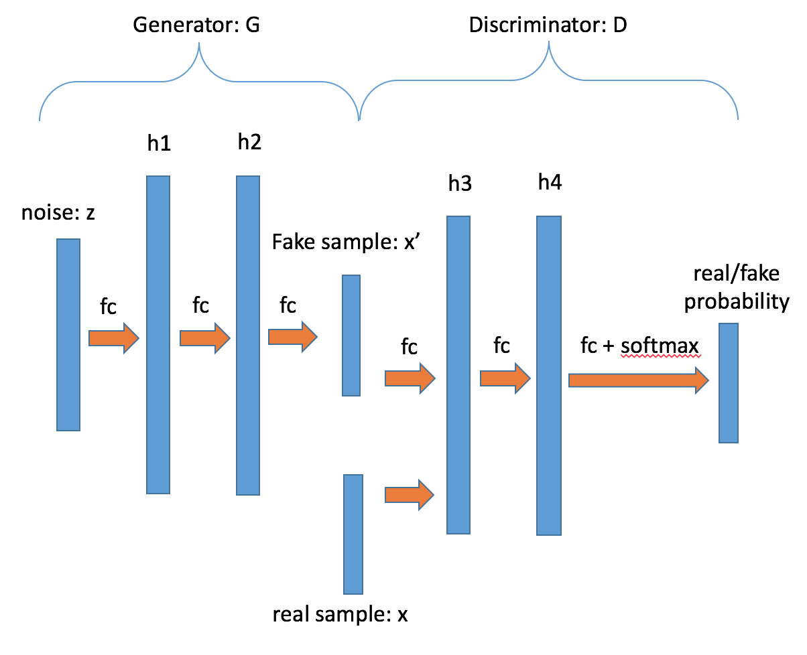
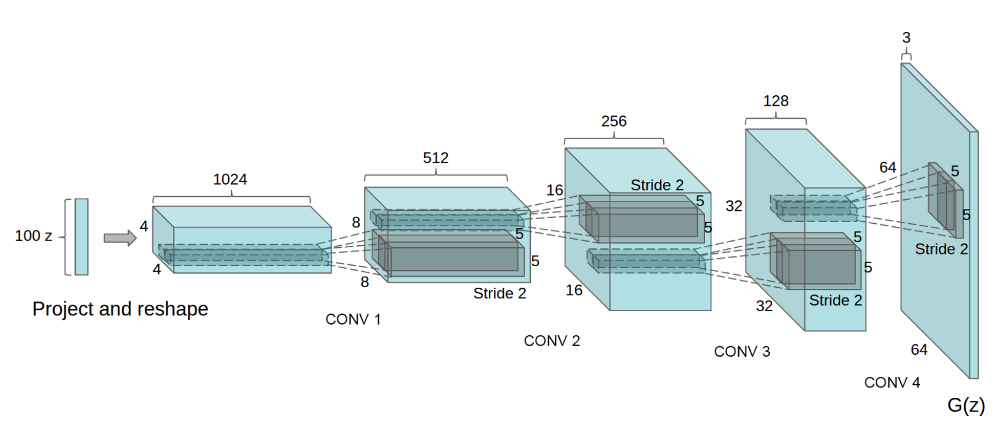

# 对抗式生成网络

## 背景介绍

本章我们介绍对抗式生成网络，也称为Generative Adversarial Network (GAN) \[[1](#参考文献)\]。GAN的核心思想是，为了更好地训练一个生成式神经元网络模型（generative model），我们引入一个判别式神经元网络模型来构造优化目标函数。实验证明，在图像自动生成、图像去噪、和缺失图像补全等应用里，这种方法可以训练处一个能更逼近训练数据分布的生成式模型。

到目前为止，大部分取得好的应用效果的神经元网络模型都是有监督训练（supervised learning）的判别式模型（discriminative models），包括图像识别中使用的convolutional networks和在语音识别中使用的connectionist temporal classification (CTC) networks。在这些例子里，训练数据 X 都是带有标签 y 的——每张图片附带了一个或者多个tag，每段语音附带了一段对应的文本；而模型的输入是 X，输出是 y，训练得到的模型表示从X到y的映射函数 y=f(X)。

和判别式神经元网络模型相对的一类模型是生成式模型（generative models）。它们通常是通过非监督训练（unsupervised learning）来得到的。这类模型的训练数据里只有 X，没有y。训练的目标是希望模型能蕴含训练数据的统计分布信息，从而可以从训练好的模型里产生出新的、在训练数据里没有出现过的新数据 x'。

一些为人熟知的生成模型的例子包括受限玻尔兹曼机（Restricted Boltzmann Machine）\[[4](#参考文献)\]，深度玻尔兹曼机（Deep Boltzmann Machine）\[[5](#参考文献)\]，神经自回归分布估计（Neural Autoregressive Distribution Estimator）\[[6](#参考文献)\]等。

近年出现了一些专门用来生成图像的模型，一种是变分自编码器（variational autoencoder）\[[3](#参考文献)\]，它是在概率图模型（probabilistic graphical model）的框架下面搭建了一个生成模型，对数据有完整的概率描述，训练时是通过调节参数来最大化数据的概率。用这种方法产生的图片，虽然似然（likelihood）比较高，但经常看起来比较模糊。另一种是像素循环神经网络（Pixel Recurrent Neural Network）\[[7](#参考文献)\]，它是通过根据周围的像素来一个像素一个像素的生成图片，但这种方法生成的图片在全局看来会不太一致。为了解决这些问题，人们又提出了本章所要介绍的另一种生成模型，对抗式生成网络。

本文介绍如何训练一个产生式神经元网络模型，它的输入是一个随机生成的向量（相当于不需要任何有意义的输入），而输出是一幅图像，其中有一个数字。换句话说，我们训练一个会写字（阿拉伯数字）的神经元网络模型。它“写”的一些数字如下图：

<p align="center">
    <br/>
    图1. GAN生成的MNIST例图
</p>

现实中成功使用的生成式神经元网络模型往往接受有意义的输入。比如可能接受一幅低分辨率的图像，输出对应的高分辨率图像。这样的模型被称为 conditional GAN这过程实际上是从大量数据学习得到模型，或者说归纳得到知识，然后用这些知识来补足图像的分辨率。


## 传统训练方式和对抗式训练

因为神经元网络是一个有向图，总是有输入和输出的。当我们用无监督学习方式来训练一个神经元网络，用于描述训练数据分布的时候，一个通常的学习目标是估计一组参数，使得输出和输入很接近 —— 或者说输入是什么输出就是什么。很多早期的生成式神经元网络模型，包括受限波尔茨曼机和 autoencoder 都是这么训练的。这种情况下优化目标经常是最小化输出和输入的差别。

<p align="center">
    <br/>
    图2. GAN模型原理示意图
    <a href="https://ishmaelbelghazi.github.io/ALI/">figure credit</a>
</p>

对抗式训练里，我们用一个判别式模型 D 辅助构造优化目标函数，来训练一个生成式模型 G。如图2所示。具体训练流程是不断交替执行如下两步：

1. 更新模型 D：
   1. 固定G的参数不变，对于一组随机输入，得到一组（产生式）输出，$X_f$，并且将其label成“假”。
   1. 从训练数据 X 采样一组 $X_r$，并且label为“真”。
   1. 用这两组数据更新模型 D，从而使D能够分辨G产生的数据和真实训练数据。

1. 更新模型 G：
   1. 把G的输出和D的输入连接起来，得到一个网路。
   1. 给G一组随机输入，期待G的输出让D认为像是“真”的。
   1. 在D的输出端，优化目标是通过更新G的参数来最小化D的输出和“真”的差别。

上述方法实际上在优化如下目标：

$$\min_G \max_D \frac{1}{N}\sum_{i=1}^N[\log D(x^i) + \log(1-D(G(z^i)))]$$

其中$x$是真实数据，$z$是随机产生的输入，$N$是训练数据的数量。这个损失函数的意思是：真实数据被分类为真的概率加上伪数据被分类为假的概率。因为上述两步交替优化G生成的结果的仿真程度（看起来像x）和D分辨G的生成结果和x的能力，所以这个方法被称为对抗（adversarial）方法。

在最早的对抗式生成网络的论文中，生成器和分类器用的都是全联接层。在附带的代码[`gan_conf.py`](./gan_conf.py)中，我们实现了一个类似的结构。G和D是由三层全联接层构成，并且在某些全联接层后面加入了批标准化层（batch normalization）。所用网络结构在图3中给出。

<p align="center">
    <br/>
    图3. GAN模型结构图
</p>

由于上面的这种网络都是由全联接层组成，所以没有办法很好的生成图片数据，也没有办法做的很深。所以在随后的论文中，人们提出了深度卷积对抗式生成网络（deep convolutional generative adversarial network or DCGAN）\[[2](#参考文献)\]。在DCGAN中，生成器 G 是由多个卷积转置层（transposed convolution）组成的，这样可以用更少的参数来生成质量更高的图片。具体网络结果可参见图4。而判别器是由多个卷积层组成。

<p align="center">
    <br/>
    图4. DCGAN生成器模型结构
    <a href="https://arxiv.org/pdf/1511.06434v2.pdf">figure credit</a>
</p>


## 数据

这章会用到两种数据，一种是G的随机输入，另一种是来自MNIST数据集的图片，其中一张是人类手写的一个数字。随机输入数据的生成方式如下：

```python
# 合成2-D均匀分布数据 gan_trainer.py:114
def load_uniform_data():
    data = numpy.random.rand(1000000, 2).astype('float32')
    return data
```

MNIST数据可以通过执行[get_mnist_data.sh](./data/get_mnist_data.sh)下载：

```bash
$cd data/
$./get_mnist_data.sh
```

其实只需要换一种图像数据集，这个例子即可训练G来生成对应的类似图像。比如Cifar-10数据集可由执行[download_cifa.sh](./data/download_cifa.sh)下载：

```bash
$cd data/
$./download_cifar.sh
```

## 模型配置

由于对抗式生产网络涉及到多个神经网络，所以必须用PaddlePaddle Python API来训练。下面的介绍也可以部分的拿来当作PaddlePaddle Python API的使用说明。

### 数据定义

这里数据没有通过data provider提供，而是在`gan_trainer.py`里面直接产生`data_batch`并以`Arguments`的形式提供给trainer。

```python
def prepare_generator_data_batch(batch_size, noise):
	 # generator训练标签。根据前文的介绍，generator是为了让自己的生成的数据
	 # 被标记为真，所以这里的标签都统一生成1，也就是真
    label = numpy.ones(batch_size, dtype='int32')
    ＃ 数据是Arguments的类型，这里创建的一个有两个位置的Arguments
    inputs = api.Arguments.createArguments(2)
    ＃ 第一个Argument位置放noise
    inputs.setSlotValue(0, api.Matrix.createDenseFromNumpy(noise))
    ＃ 第二个Argument位置放label
    inputs.setSlotIds(1, api.IVector.createVectorFromNumpy(label))
    return inputs

＃ 为generator训练创造数据
data_batch_gen = prepare_generator_data_batch(batch_size, noise)
# 把数据data_batch_gen传递给generator trainer
gen_trainer.trainOneDataBatch(batch_size, data_batch_gen)
```

### 算法配置

在这里，我们指定了模型的训练参数, 选择learning rate和batch size。这里的`beta1`参数比默认值0.9小很多是为了使学习的过程更稳定。

```python
settings(
    batch_size=128,
    learning_rate=1e-4,
    learning_method=AdamOptimizer(beta1=0.5))

```
	
### 模型结构

在文件`gan_conf.py`当中我们定义了三个网络, **generator_training**, **discriminator_training** and **generator**. 和前文提到的模型结构的关系是：**discriminator_training** 是分类器，**generator** 是生成器，**generator_training** 是生成器加分类器因为训练生成器时需要用到分类器提供目标函数。这个对应关系在下面这段代码中定义：

```python
if is_generator_training:
    noise = data_layer(name="noise", size=noise_dim)
    # 函数generator定义了生成器的结构
    sample = generator(noise)

if is_discriminator_training:
    sample = data_layer(name="sample", size=sample_dim)

if is_generator_training or is_discriminator_training:
    label = data_layer(name="label", size=1)
    ＃ 函数discriminator定义了判别器的结构
    prob = discriminator(sample)
    cost = cross_entropy(input=prob, label=label)
    classification_error_evaluator(
        input=prob, label=label, name=mode + '_error')
    outputs(cost)

if is_generator:
    noise = data_layer(name="noise", size=noise_dim)
    outputs(generator(noise))
```

## 训练模型

用MNIST手写数字图片训练对抗式生成网络可以用如下的命令：

```bash
$python gan_trainer.py -d mnist --use_gpu 1
```

训练中打印的日志信息大致如下：

```
d_pos_loss is 0.681067     d_neg_loss is 0.704936
d_loss is 0.693001151085    g_loss is 0.681496
...........d_pos_loss is 0.64475     d_neg_loss is 0.667874
d_loss is 0.656311988831    g_loss is 0.719081
...
I0105 17:15:48.346783 20517 TrainerInternal.cpp:165]  Batch=100 samples=12800 AvgCost=0.701575 CurrentCost=0.701575 Eval: generator_training_error=0.679219  CurrentEval: generator_training_error=0.679219 
.........d_pos_loss is 0.644203     d_neg_loss is 0.71601
d_loss is 0.680106401443    g_loss is 0.671118
....
I0105 17:16:37.172737 20517 TrainerInternal.cpp:165]  Batch=100 samples=12800 AvgCost=0.687359 CurrentCost=0.687359 Eval: discriminator_training_error=0.438359  CurrentEval: discriminator_training_error=0.438359 
```

其中`d_pos_loss`是判别器对于真实数据判别真的负对数概率，`d_neg_loss`是判别器对于伪数据判别为假的负对数概率，`d_loss`是这两者的平均值。`g_loss`是伪数据被判别器判别为真的负对数概率。对于对抗式生成网络来说，最好的训练情况是D和G的能力比较相近，也就是`d_loss`和`g_loss`在训练的前几个pass中数值比较接近（-log(0.5) = 0.693）。由于G和D是轮流训练，所以它们各自每过100个batch，都会打印各自的训练信息。

为了能够训练在gan_conf.py中定义的网络，我们需要如下几个步骤：

1. 初始化Paddle环境，
1. 解析设置，
1. 由设置创造GradientMachine以及由GradientMachine创造trainer。

这几步分别由下面几段代码实现：


```python
import py_paddle.swig_paddle as api
# 初始化Paddle环境
api.initPaddle('--use_gpu=' + use_gpu, '--dot_period=10',
               '--log_period=100', '--gpu_id=' + args.gpu_id,
               '--save_dir=' + "./%s_params/" % data_source)

# 解析设置
gen_conf = parse_config(conf, "mode=generator_training,data=" + data_source)
dis_conf = parse_config(conf, "mode=discriminator_training,data=" + data_source)
generator_conf = parse_config(conf, "mode=generator,data=" + data_source)

# 由设置创造GradientMachine
dis_training_machine = api.GradientMachine.createFromConfigProto(
dis_conf.model_config)
gen_training_machine = api.GradientMachine.createFromConfigProto(
gen_conf.model_config)
generator_machine = api.GradientMachine.createFromConfigProto(
generator_conf.model_config)

# 由GradientMachine创造trainer
dis_trainer = api.Trainer.create(dis_conf, dis_training_machine)
gen_trainer = api.Trainer.create(gen_conf, gen_training_machine)
```

为了能够平衡生成器和分类器之间的能力，我们依据它们各自的损失函数的大小来决定训练对象，即我们选择训练那个损失函数更大的网络。损失函数的值可以通过调用`GradientMachine`的`forward`方法来计算。

```python
def get_training_loss(training_machine, inputs):
    outputs = api.Arguments.createArguments(0)
    training_machine.forward(inputs, outputs, api.PASS_TEST)
    loss = outputs.getSlotValue(0).copyToNumpyMat()
    return numpy.mean(loss)
```

每当训练完一个网络，我们需要和其他几个网络同步互相分享的参数值。下面的代码展示了其中一个例子：

```python
# 训练gen_training
gen_trainer.trainOneDataBatch(batch_size, data_batch_gen)

# 把gen_training中的参数同步到dis_training和generator当中
copy_shared_parameters(gen_training_machine,
dis_training_machine)
copy_shared_parameters(gen_training_machine, generator_machine)
```

## 应用模型

图片由训练好的生成器生成。以下的代码将随机向量输入到模型 G，通过向前传递得到生成的图片。

```python
# 噪音z是多维正态分布
def get_noise(batch_size, noise_dim):
    return numpy.random.normal(size=(batch_size, noise_dim)).astype('float32')

def get_fake_samples(generator_machine, batch_size, noise):
    gen_inputs = api.Arguments.createArguments(1)
    gen_inputs.setSlotValue(0, api.Matrix.createDenseFromNumpy(noise))
    gen_outputs = api.Arguments.createArguments(0)
    generator_machine.forward(gen_inputs, gen_outputs, api.PASS_TEST)
    fake_samples = gen_outputs.getSlotValue(0).copyToNumpyMat()
    return fake_samples

# 在每个pass的最后，保存生成的图片
noise = get_noise(batch_size, noise_dim)
fake_samples = get_fake_samples(generator_machine, batch_size, noise)
```

## 总结

本章中，我们介绍了对抗式生成网络的基本概念，训练方法以及如何用PaddlePaddle来训练一个简单的图像生成模型。对抗式生成网络是一种新的训练生成模型的有效方法，我们期待看到它的更有意思的应用场景。


## 参考文献

1. Goodfellow I, Pouget-Abadie J, Mirza M, et al. [Generative adversarial nets](https://arxiv.org/pdf/1406.2661v1.pdf)[C] Advances in Neural Information Processing Systems. 2014
2. Radford A, Metz L, Chintala S. [Unsupervised Representation Learning with Deep Convolutional Generative Adversarial Networks](https://arxiv.org/pdf/1511.06434v2.pdf)[C] arXiv preprint arXiv:1511.06434. 2015
3. Kingma D.P. and Welling M. [Auto-encoding variational bayes](https://arxiv.org/pdf/1312.6114v10.pdf)[C] arXiv preprint arXiv:1312.6114. 2013
4. Hinton G and Salakhutdinov R. [Reducing the dimensionality of data with neural networks](https://www.cs.toronto.edu/~hinton/science.pdf) Science 313.5786. 2006
5. Salakhutdinov R and Hinton G. [Deep Boltzmann Machines](http://www.jmlr.org/proceedings/papers/v5/salakhutdinov09a/salakhutdinov09a.pdf)[J] AISTATS. Vol. 1. 2009
6. Larochelle H and Murray I. [The Neural Autoregressive Distribution Estimator](http://www.jmlr.org/proceedings/papers/v15/larochelle11a/larochelle11a.pdf) AISTATS. Vol. 1. 2011.
7. van den Oord A, Kalchbrenner N and Kavukcuoglu K. [Pixel Recurrent Neural Networks](https://arxiv.org/pdf/1601.06759v3.pdf) arXiv preprint arXiv:1601.06759 (2016).
