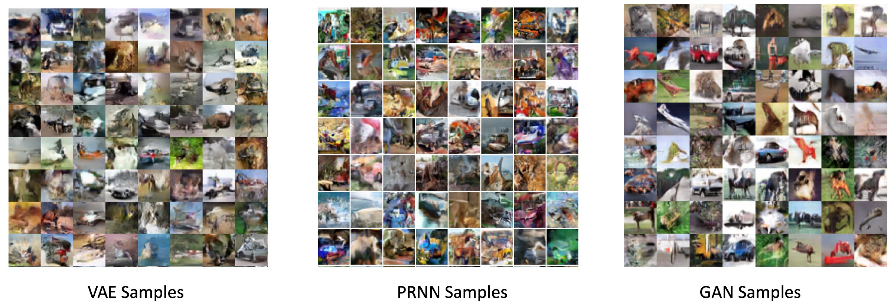
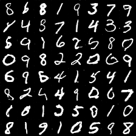
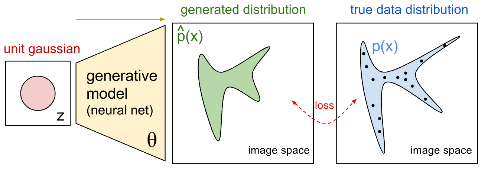
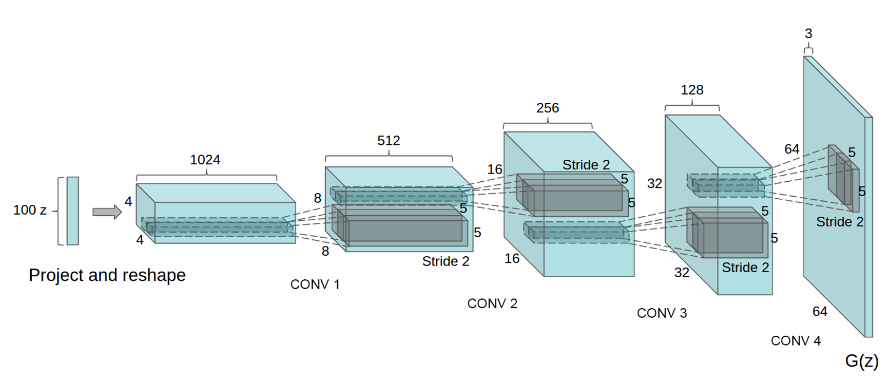

# 对抗式生成网络

## 背景介绍

本章我们介绍对抗式生成网络，也称为Generative Adversarial Network (GAN) \[[1](#参考文献)\]。GAN的核心思想是，为了更好地训练一个生成式神经元网络模型（generative model），我们引入一个判别式神经元网络模型来构造优化目标函数。实验证明，这种方法可以训练出一个能更逼近训练数据分布的生成式模型。

到目前为止，大部分取得好的应用效果的神经元网络模型都是有监督训练（supervised learning）的判别式模型（discriminative models），包括图像识别中使用的convolutional networks和在语音识别中使用的connectionist temporal classification (CTC) networks。在这些例子里，训练数据 X 都是带有标签 y 的——每张图片附带了一个或者多个tag，每段语音附带了一段对应的文本；而模型的输入是 X，输出是 y，训练得到的模型表示从X到y的映射函数 y=f(X)。

和判别式神经元网络模型相对的一类模型是生成式模型（generative models）。它们通常是通过非监督训练（unsupervised learning）来得到的。这类模型的训练数据里只有 X，没有y。训练的目标是希望模型能蕴含训练数据的统计分布信息，从而可以从训练好的模型里产生出新的、在训练数据里没有出现过的新数据 x'。

生成模型在很多方面都有广泛应用。比如在图像处理方面的图像自动生成、图像去噪、和缺失图像补全等应用。比如在增强学习的条件下，可以根据之前观测到的数据和可能的操作来生成未来的数据，使得agent能够从中选择最佳的操作。比如在半监督（semi-supervised）学习的条件下，把生成模型生成的数据加入分类器训练当中，能够减少分类器训练对于标记数据数量的要求。真实世界中大量数据都是没有标注的，人为标注数据会耗费大量人力财力，这就使生成模型有了它的用武之地。研究生成模型的另一个动机是，人们认为如果能够生成很好的数据，那么很可能这个生成模型就学习到了这组数据的一个很好的通用表示（representation），就可以用这个学到的表示来完成其他的一些任务。

之前出现的生成模型，一般是直接构造模型$P_{model}(x; \theta)$来模拟真实数据分布$P_{data}(x)$。而这个模拟的过程，通常是由最大似然（Maximum Likelihood）的办法来调节模型参数，使得观测到的真实数据在该模型下概率最大。这里模型的种类又可以分为两大类，一类是tractable的，一类是untractable的。第一类里的一个例子是像素循环神经网络（Pixel Recurrent Neural Network）\[[2](#参考文献)\]，它是用概率的链式规则把对于n维数据的概率分解成n个一维数据的概率相乘，也就是说根据周围的像素来一个像素一个像素的生成图片。这种方法的问题是对于一个n维的数据，需要n步才能生成，速度较慢，而且图片整体看来各处不太连续。

为了能有更复杂的模型来模拟数据分布，人们提出了第二类untractable的模型，这样就只能用近似的办法来学习模型参数。近似的办法一种是构造一个似然的下限（Likelihood lower-bound），然后用变分的办法来提高这个下限的值，其中一个例子是变分自编码器（variational autoencoder）\[[3](#参考文献)\]。用这种方法产生的图片，虽然似然比较高，但经常看起来会比较模糊。近似的另一种办法是通过马尔可夫链－蒙地卡罗（Markov-Chain-Monte-Carlo）来取样本，比如深度玻尔兹曼机（Deep Boltzmann Machine）\[[4](#参考文献)\]就是用的这个方法。这种方法的问题是取样本的计算量非常大，而且没有办法并行化。

为了解决这些问题，人们又提出了本章所要介绍的另一种生成模型，对抗式生成网络。它相比于前面提到的方法，具有生成网络结构灵活，产生样本快，生成图像看起来更真实的优点。下面的图1就对比了上面介绍的几种方法在生成CIFAR-10图片时的效果。

<p align="center">
    <br/>
    图1. Cifar-10生成图像对比
</p>

## 效果展示

本章将介绍如何训练一个对抗式生成网络，它的输入是一个随机生成的向量（相当于不需要任何有意义的输入），而输出是一幅图像，其中有一个数字。换句话说，我们训练一个会写字（阿拉伯数字）的神经元网络模型。它“写”的一些数字如下图：

<p align="center">
    <br/>
    图2. GAN生成的MNIST例图
</p>


## 模型概览
对抗式生成网络的基本结构是将一个已知概率分布的随机变量$z$，通过参数化的概率生成模型（通常是用一个神经网络模型来进行参数化），变换后得到一个生成的概率分布（图3中绿色的分布）。训练生成模型的过程就是调节生成模型的参数，使得生成的概率分布趋向于真实数据的概率分布（图3中蓝色的分布）。

对抗式生成网络和之前的生成模型最大的创新就在于，用一个判别式神经网络来描述生成的概率分布和真实数据概率分布之间的差别。也就是说，我们用一个判别式模型 D 辅助构造优化目标函数，来训练一个生成式模型 G。G和D在训练时是处在相互对抗的角色下，G的目标是尽量生成和真实数据看起来相似的伪数据，从而使得D无法分别数据的真伪；而D的目标是能尽量分别出哪些是真实数据，哪些是G生成的伪数据。两者在竞争的条件下，能够相互提高各自的能力，最后收敛到一个均衡点：生成器生成的数据分布和真实数据分布完全一样，而判别器完全无法区分数据的真伪。

<p align="center">
    <br/>
    图3. GAN模型原理示意图
    <a href="https://openai.com/blog/generative-models/">figure credit</a>
</p>


对抗式训练里，具体训练流程是不断交替执行如下两步（参见图4）：

1. 更新模型 D：
   1. 固定G的参数不变，对于一组随机输入，得到一组（产生式）输出，$X_f$，并且将其label成“假”。
   2. 从训练数据 X 采样一组 $X_r$，并且label为“真”。
   3. 用这两组数据更新模型 D，从而使D能够分辨G产生的数据和真实训练数据。

2. 更新模型 G：
   1. 把G的输出和D的输入连接起来，得到一个网路。
   2. 给G一组随机输入，期待G的输出让D认为像是“真”的。
   3. 在D的输出端，优化目标是通过更新G的参数来最小化D的输出和“真”的差别。

<p align="center">
    <br/>
    图4. GAN模型训练流程图
    <a href="https://arxiv.org/pdf/1701.00160v1.pdf">figure credit</a>
</p>

上述方法实际上在优化如下目标：

$$\min_G \max_D \frac{1}{N}\sum_{i=1}^N[\log D(x^i) + \log(1-D(G(z^i)))]$$

其中$x$是真实数据，$z$是随机产生的输入，$N$是训练数据的数量。这个损失函数的意思是：真实数据被分类为真的概率加上伪数据被分类为假的概率。因为上述两步交替优化G生成的结果的仿真程度（看起来像x）和D分辨G的生成结果和x的能力，所以这个方法被称为对抗（adversarial）方法。

在最早的对抗式生成网络的论文中，生成器和分类器用的都是全联接层。在附带的代码[`gan_conf.py`](./gan_conf.py)中，我们实现了一个类似的结构。G和D是由三层全联接层构成，并且在某些全联接层后面加入了批标准化层（batch normalization）。所用网络结构在图5中给出。

<p align="center">
    <br/>
    图5. GAN模型结构图
</p>

由于上面的这种网络都是由全联接层组成，所以没有办法很好的生成图片数据，也没有办法做的很深。所以在随后的论文中，人们提出了深度卷积对抗式生成网络（deep convolutional generative adversarial network or DCGAN）\[[5](#参考文献)\]。在DCGAN中，生成器 G 是由多个卷积转置层（transposed convolution）组成的，这样可以用更少的参数来生成质量更高的图片。具体网络结果可参见图6。而判别器是由多个卷积层组成。

<p align="center">
    <br/>
    图6. DCGAN生成器模型结构
    <a href="https://arxiv.org/pdf/1511.06434v2.pdf">figure credit</a>
</p>


## 数据

这章会用到两种数据，一种是G的随机输入，另一种是来自MNIST数据集的图片，其中一张是人类手写的一个数字。随机输入数据的生成方式如下：

```python
# 合成2-D均匀分布数据 gan_trainer.py:114
def load_uniform_data():
    data = numpy.random.rand(1000000, 2).astype('float32')
    return data
```

MNIST数据可以通过执行[get_mnist_data.sh](./data/get_mnist_data.sh)下载：

```bash
$cd data/
$./get_mnist_data.sh
```

其实只需要换一种图像数据集，这个例子即可训练G来生成对应的类似图像。比如Cifar-10数据集可由执行[download_cifa.sh](./data/download_cifa.sh)下载：

```bash
$cd data/
$./download_cifar.sh
```

## 模型配置

由于对抗式生产网络涉及到多个神经网络，所以必须用PaddlePaddle Python API来训练。下面的介绍也可以部分的拿来当作PaddlePaddle Python API的使用说明。

### 数据定义

这里数据没有通过data provider提供，而是在`gan_trainer.py`里面直接产生`data_batch`并以`Arguments`的形式提供给trainer。

```python
def prepare_generator_data_batch(batch_size, noise):
	 # generator训练标签。根据前文的介绍，generator是为了让自己的生成的数据
	 # 被标记为真，所以这里的标签都统一生成1，也就是真
    label = numpy.ones(batch_size, dtype='int32')
    ＃ 数据是Arguments的类型，这里创建的一个有两个位置的Arguments
    inputs = api.Arguments.createArguments(2)
    ＃ 第一个Argument位置放noise
    inputs.setSlotValue(0, api.Matrix.createDenseFromNumpy(noise))
    ＃ 第二个Argument位置放label
    inputs.setSlotIds(1, api.IVector.createVectorFromNumpy(label))
    return inputs

＃ 为generator训练创造数据
data_batch_gen = prepare_generator_data_batch(batch_size, noise)
# 把数据data_batch_gen传递给generator trainer
gen_trainer.trainOneDataBatch(batch_size, data_batch_gen)
```

### 算法配置

在这里，我们指定了模型的训练参数, 选择learning rate和batch size。这里的`beta1`参数比默认值0.9小很多是为了使学习的过程更稳定。

```python
settings(
    batch_size=128,
    learning_rate=1e-4,
    learning_method=AdamOptimizer(beta1=0.5))

```
	
### 模型结构
本章里我们主要用到两种模型。一种是基本的GAN模型，主要由全联接层搭建，在gan_conf.py里面定义。另一种是DCGAN模型，主要由卷基层搭建，在gan_conf_image.py里面定义。

```python
# 下面这个函数定义了GAN模型里面的判别器结构
def discriminator(sample):
    """
    discriminator ouputs the probablity of a sample is from generator
    or real data.
    The output has two dimenstional: dimension 0 is the probablity
    of the sample is from generator and dimension 1 is the probabblity
    of the sample is from real data.
    """
    param_attr = ParamAttr(is_static=is_generator_training)
    bias_attr = ParamAttr(
        is_static=is_generator_training, initial_mean=1.0, initial_std=0)

    hidden = fc_layer(
        input=sample,
        name="dis_hidden",
        size=hidden_dim,
        bias_attr=bias_attr,
        param_attr=param_attr,
        act=ReluActivation())

    hidden2 = fc_layer(
        input=hidden,
        name="dis_hidden2",
        size=hidden_dim,
        bias_attr=bias_attr,
        param_attr=param_attr,
        act=LinearActivation())

    hidden_bn = batch_norm_layer(
        hidden2,
        act=ReluActivation(),
        name="dis_hidden_bn",
        bias_attr=bias_attr,
        param_attr=ParamAttr(
            is_static=is_generator_training, initial_mean=1.0,
            initial_std=0.02),
        use_global_stats=False)

    return fc_layer(
        input=hidden_bn,
        name="dis_prob",
        size=2,
        bias_attr=bias_attr,
        param_attr=param_attr,
        act=SoftmaxActivation())

# 下面这个函数定义了GAN模型里面生成器的结构
def generator(noise):
    """
    generator generates a sample given noise
    """
    param_attr = ParamAttr(is_static=is_discriminator_training)
    bias_attr = ParamAttr(
        is_static=is_discriminator_training, initial_mean=1.0, initial_std=0)

    hidden = fc_layer(
        input=noise,
        name="gen_layer_hidden",
        size=hidden_dim,
        bias_attr=bias_attr,
        param_attr=param_attr,
        act=ReluActivation())

    hidden2 = fc_layer(
        input=hidden,
        name="gen_hidden2",
        size=hidden_dim,
        bias_attr=bias_attr,
        param_attr=param_attr,
        act=LinearActivation())

    hidden_bn = batch_norm_layer(
        hidden2,
        act=ReluActivation(),
        name="gen_layer_hidden_bn",
        bias_attr=bias_attr,
        param_attr=ParamAttr(
            is_static=is_discriminator_training,
            initial_mean=1.0,
            initial_std=0.02),
        use_global_stats=False)

    return fc_layer(
        input=hidden_bn,
        name="gen_layer1",
        size=sample_dim,
        bias_attr=bias_attr,
        param_attr=param_attr,
        act=LinearActivation())
```

```python
# 一个卷积／卷积转置层和一个批标准化层打包在一起
def conv_bn(input,
            channels,
            imgSize,
            num_filters,
            output_x,
            stride,
            name,
            param_attr,
            bias_attr,
            param_attr_bn,
            bn,
            trans=False,
            act=ReluActivation()):
    """
    conv_bn is a utility function that constructs a convolution/deconv layer 
    with an optional batch_norm layer
    :param bn: whether to use batch_norm_layer
    :type bn: bool
    :param trans: whether to use conv (False) or deconv (True)
    :type trans: bool
    """

    # calculate the filter_size and padding size based on the given
    # imgSize and ouput size
    tmp = imgSize - (output_x - 1) * stride
    if tmp <= 1 or tmp > 5:
        raise ValueError("conv input-output dimension does not fit")
    elif tmp <= 3:
        filter_size = tmp + 2
        padding = 1
    else:
        filter_size = tmp
        padding = 0

    print(imgSize, output_x, stride, filter_size, padding)

    if trans:
        nameApx = "_conv"
    else:
        nameApx = "_convt"

    if bn:
        conv = img_conv_layer(
            input,
            filter_size=filter_size,
            num_filters=num_filters,
            name=name + nameApx,
            num_channels=channels,
            act=LinearActivation(),
            groups=1,
            stride=stride,
            padding=padding,
            bias_attr=bias_attr,
            param_attr=param_attr,
            shared_biases=True,
            layer_attr=None,
            filter_size_y=None,
            stride_y=None,
            padding_y=None,
            trans=trans)

        conv_bn = batch_norm_layer(
            conv,
            act=act,
            name=name + nameApx + "_bn",
            bias_attr=bias_attr,
            param_attr=param_attr_bn,
            use_global_stats=False)

        return conv_bn
    else:
        conv = img_conv_layer(
            input,
            filter_size=filter_size,
            num_filters=num_filters,
            name=name + nameApx,
            num_channels=channels,
            act=act,
            groups=1,
            stride=stride,
            padding=padding,
            bias_attr=bias_attr,
            param_attr=param_attr,
            shared_biases=True,
            layer_attr=None,
            filter_size_y=None,
            stride_y=None,
            padding_y=None,
            trans=trans)
        return conv

# 下面这个函数定义了DCGAN模型里面的生成器的结构
def generator(noise):
    """
    generator generates a sample given noise
    """
    param_attr = ParamAttr(
        is_static=is_discriminator_training, initial_mean=0.0, initial_std=0.02)
    bias_attr = ParamAttr(
        is_static=is_discriminator_training, initial_mean=0.0, initial_std=0.0)

    param_attr_bn = ParamAttr(
        is_static=is_discriminator_training, initial_mean=1.0, initial_std=0.02)

    h1 = fc_layer(
        input=noise,
        name="gen_layer_h1",
        size=s8 * s8 * gf_dim * 4,
        bias_attr=bias_attr,
        param_attr=param_attr,
        act=LinearActivation())

    h1_bn = batch_norm_layer(
        h1,
        act=ReluActivation(),
        name="gen_layer_h1_bn",
        bias_attr=bias_attr,
        param_attr=param_attr_bn,
        use_global_stats=False)

    h2_bn = conv_bn(
        h1_bn,
        channels=gf_dim * 4,
        output_x=s8,
        num_filters=gf_dim * 2,
        imgSize=s4,
        stride=2,
        name="gen_layer_h2",
        param_attr=param_attr,
        bias_attr=bias_attr,
        param_attr_bn=param_attr_bn,
        bn=True,
        trans=True)

    h3_bn = conv_bn(
        h2_bn,
        channels=gf_dim * 2,
        output_x=s4,
        num_filters=gf_dim,
        imgSize=s2,
        stride=2,
        name="gen_layer_h3",
        param_attr=param_attr,
        bias_attr=bias_attr,
        param_attr_bn=param_attr_bn,
        bn=True,
        trans=True)

    return conv_bn(
        h3_bn,
        channels=gf_dim,
        output_x=s2,
        num_filters=c_dim,
        imgSize=sample_dim,
        stride=2,
        name="gen_layer_h4",
        param_attr=param_attr,
        bias_attr=bias_attr,
        param_attr_bn=param_attr_bn,
        bn=False,
        trans=True,
        act=TanhActivation())

# 下面这个函数定义了DCGAN模型里面的判别器结构
def discriminator(sample):
    """
    discriminator ouputs the probablity of a sample is from generator
    or real data.
    The output has two dimenstional: dimension 0 is the probablity
    of the sample is from generator and dimension 1 is the probabblity
    of the sample is from real data.
    """
    param_attr = ParamAttr(
        is_static=is_generator_training, initial_mean=0.0, initial_std=0.02)
    bias_attr = ParamAttr(
        is_static=is_generator_training, initial_mean=0.0, initial_std=0.0)

    param_attr_bn = ParamAttr(
        is_static=is_generator_training, initial_mean=1.0, initial_std=0.02)

    h0 = conv_bn(
        sample,
        channels=c_dim,
        imgSize=sample_dim,
        num_filters=df_dim,
        output_x=s2,
        stride=2,
        name="dis_h0",
        param_attr=param_attr,
        bias_attr=bias_attr,
        param_attr_bn=param_attr_bn,
        bn=False)

    h1_bn = conv_bn(
        h0,
        channels=df_dim,
        imgSize=s2,
        num_filters=df_dim * 2,
        output_x=s4,
        stride=2,
        name="dis_h1",
        param_attr=param_attr,
        bias_attr=bias_attr,
        param_attr_bn=param_attr_bn,
        bn=True)

    h2_bn = conv_bn(
        h1_bn,
        channels=df_dim * 2,
        imgSize=s4,
        num_filters=df_dim * 4,
        output_x=s8,
        stride=2,
        name="dis_h2",
        param_attr=param_attr,
        bias_attr=bias_attr,
        param_attr_bn=param_attr_bn,
        bn=True)

    return fc_layer(
        input=h2_bn,
        name="dis_prob",
        size=2,
        bias_attr=bias_attr,
        param_attr=param_attr,
        act=SoftmaxActivation())
```


在文件`gan_conf.py`当中我们定义了三个网络, **generator_training**, **discriminator_training** and **generator**. 和前文提到的模型结构的关系是：**discriminator_training** 是分类器，**generator** 是生成器，**generator_training** 是生成器加分类器因为训练生成器时需要用到分类器提供目标函数。这个对应关系在下面这段代码中定义：

```python
if is_generator_training:
    noise = data_layer(name="noise", size=noise_dim)
    # 函数generator定义了生成器的结构
    sample = generator(noise)

if is_discriminator_training:
    sample = data_layer(name="sample", size=sample_dim)

if is_generator_training or is_discriminator_training:
    label = data_layer(name="label", size=1)
    ＃ 函数discriminator定义了判别器的结构
    prob = discriminator(sample)
    cost = cross_entropy(input=prob, label=label)
    classification_error_evaluator(
        input=prob, label=label, name=mode + '_error')
    outputs(cost)

if is_generator:
    noise = data_layer(name="noise", size=noise_dim)
    outputs(generator(noise))
```

## 训练模型

用MNIST手写数字图片训练对抗式生成网络可以用如下的命令：

```bash
$python gan_trainer.py -d mnist --use_gpu 1
```

训练中打印的日志信息大致如下：

```
d_pos_loss is 0.681067     d_neg_loss is 0.704936
d_loss is 0.693001151085    g_loss is 0.681496
...........d_pos_loss is 0.64475     d_neg_loss is 0.667874
d_loss is 0.656311988831    g_loss is 0.719081
...
I0105 17:15:48.346783 20517 TrainerInternal.cpp:165]  Batch=100 samples=12800 AvgCost=0.701575 CurrentCost=0.701575 Eval: generator_training_error=0.679219  CurrentEval: generator_training_error=0.679219 
.........d_pos_loss is 0.644203     d_neg_loss is 0.71601
d_loss is 0.680106401443    g_loss is 0.671118
....
I0105 17:16:37.172737 20517 TrainerInternal.cpp:165]  Batch=100 samples=12800 AvgCost=0.687359 CurrentCost=0.687359 Eval: discriminator_training_error=0.438359  CurrentEval: discriminator_training_error=0.438359 
```

其中`d_pos_loss`是判别器对于真实数据判别真的负对数概率，`d_neg_loss`是判别器对于伪数据判别为假的负对数概率，`d_loss`是这两者的平均值。`g_loss`是伪数据被判别器判别为真的负对数概率。对于对抗式生成网络来说，最好的训练情况是D和G的能力比较相近，也就是`d_loss`和`g_loss`在训练的前几个pass中数值比较接近（-log(0.5) = 0.693）。由于G和D是轮流训练，所以它们各自每过100个batch，都会打印各自的训练信息。

为了能够训练在gan_conf.py中定义的网络，我们需要如下几个步骤：

1. 初始化Paddle环境，
2. 解析设置，
3. 由设置创造GradientMachine以及由GradientMachine创造trainer。

这几步分别由下面几段代码实现：


```python
import py_paddle.swig_paddle as api
# 初始化Paddle环境
api.initPaddle('--use_gpu=' + use_gpu, '--dot_period=10',
               '--log_period=100', '--gpu_id=' + args.gpu_id,
               '--save_dir=' + "./%s_params/" % data_source)

# 解析设置
gen_conf = parse_config(conf, "mode=generator_training,data=" + data_source)
dis_conf = parse_config(conf, "mode=discriminator_training,data=" + data_source)
generator_conf = parse_config(conf, "mode=generator,data=" + data_source)

# 由设置创造GradientMachine
dis_training_machine = api.GradientMachine.createFromConfigProto(
dis_conf.model_config)
gen_training_machine = api.GradientMachine.createFromConfigProto(
gen_conf.model_config)
generator_machine = api.GradientMachine.createFromConfigProto(
generator_conf.model_config)

# 由GradientMachine创造trainer
dis_trainer = api.Trainer.create(dis_conf, dis_training_machine)
gen_trainer = api.Trainer.create(gen_conf, gen_training_machine)
```

为了能够平衡生成器和分类器之间的能力，我们依据它们各自的损失函数的大小来决定训练对象，即我们选择训练那个损失函数更大的网络。损失函数的值可以通过调用`GradientMachine`的`forward`方法来计算。

```python
def get_training_loss(training_machine, inputs):
    outputs = api.Arguments.createArguments(0)
    training_machine.forward(inputs, outputs, api.PASS_TEST)
    loss = outputs.getSlotValue(0).copyToNumpyMat()
    return numpy.mean(loss)
```

每当训练完一个网络，我们需要和其他几个网络同步互相分享的参数值。下面的代码展示了其中一个例子：

```python
# 训练gen_training
gen_trainer.trainOneDataBatch(batch_size, data_batch_gen)

# 把gen_training中的参数同步到dis_training和generator当中
copy_shared_parameters(gen_training_machine,
dis_training_machine)
copy_shared_parameters(gen_training_machine, generator_machine)
```

## 应用模型

图片由训练好的生成器生成。以下的代码将随机向量输入到模型 G，通过向前传递得到生成的图片。

```python
# 噪音z是多维正态分布
def get_noise(batch_size, noise_dim):
    return numpy.random.normal(size=(batch_size, noise_dim)).astype('float32')

def get_fake_samples(generator_machine, batch_size, noise):
    gen_inputs = api.Arguments.createArguments(1)
    gen_inputs.setSlotValue(0, api.Matrix.createDenseFromNumpy(noise))
    gen_outputs = api.Arguments.createArguments(0)
    generator_machine.forward(gen_inputs, gen_outputs, api.PASS_TEST)
    fake_samples = gen_outputs.getSlotValue(0).copyToNumpyMat()
    return fake_samples

# 在每个pass的最后，保存生成的图片
noise = get_noise(batch_size, noise_dim)
fake_samples = get_fake_samples(generator_machine, batch_size, noise)
```

## 总结

本章中，我们介绍了对抗式生成网络的基本概念，训练方法以及如何用PaddlePaddle来训练一个简单的图像生成模型。对抗式生成网络是一种新的训练生成模型的有效方法，我们期待看到它的更有意思的应用场景。


## 参考文献

1. Goodfellow I, Pouget-Abadie J, Mirza M, et al. [Generative adversarial nets](https://arxiv.org/pdf/1406.2661v1.pdf)[C] Advances in Neural Information Processing Systems. 2014
2. van den Oord A, Kalchbrenner N and Kavukcuoglu K. [Pixel Recurrent Neural Networks](https://arxiv.org/pdf/1601.06759v3.pdf) arXiv preprint arXiv:1601.06759 (2016).
3. Kingma D.P. and Welling M. [Auto-encoding variational bayes](https://arxiv.org/pdf/1312.6114v10.pdf)[C] arXiv preprint arXiv:1312.6114. 2013
4. Salakhutdinov R and Hinton G. [Deep Boltzmann Machines](http://www.jmlr.org/proceedings/papers/v5/salakhutdinov09a/salakhutdinov09a.pdf)[J] AISTATS. Vol. 1. 2009
5. Radford A, Metz L, Chintala S. [Unsupervised Representation Learning with Deep Convolutional Generative Adversarial Networks](https://arxiv.org/pdf/1511.06434v2.pdf)[C] arXiv preprint arXiv:1511.06434. 2015
