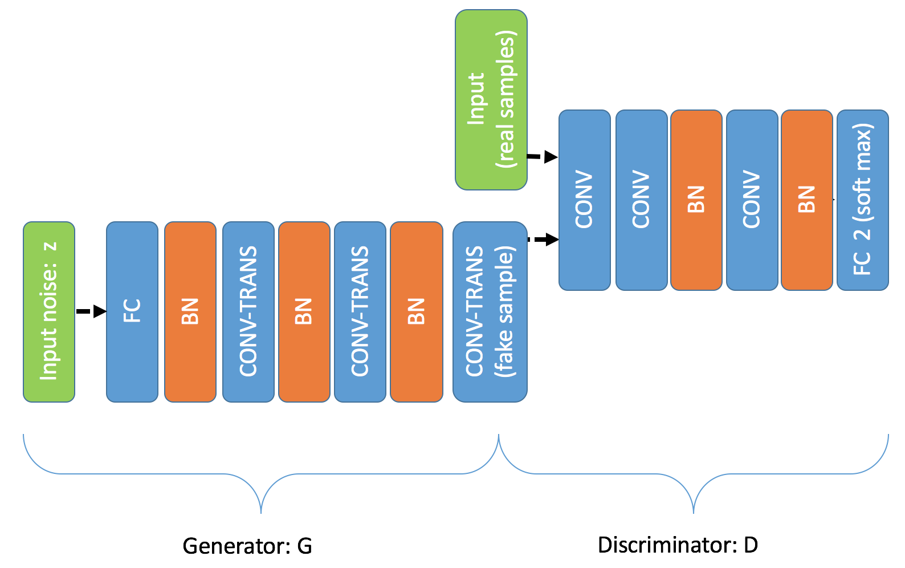

# 对抗式生成网络

## 背景介绍

之前的几章中，我们主要介绍的深度学习模型都是在有监督学习(supervised learning)条件下的判别式模型（discriminative models）。在这些例子里，训练数据 X 都是带有标签 y 的，如图像识别中的类别标号，或是语音识别中对应的真实文本。模型的输入是 X，输出是 y，训练得到的模型表示从X到y的映射函数 y=f(X)。

和判别式网络模型相对的一类模型是生成式模型（generative models）。它们通常是通过非监督训练（unsupervised learning）来得到的。这类模型的训练数据里只有 X，没有y。训练的目标是希望模型能蕴含训练数据的统计分布信息，从而可以从训练好的模型里产生出新的、在训练数据里没有出现过的新数据 X'。

生成模型在很多方向都有着广泛的应用。在图像处理方向，生成模型可以用来做图像自动生成、图像去噪、和缺失图像补全等应用。在半监督（semi-supervised）学习的条件下，把生成模型生成的数据加入分类器训练当中，能够减少分类器训练对于标记数据数量的要求。真实世界中大量数据都是没有标注的，人为标注数据会耗费大量人力财力，这就使生成模型有了它的用武之地。研究生成模型的另一个动机是，人们认为如果能够生成很好的数据，那么很可能这个生成模型就学习到了这组数据的一个很好的通用表示（representation），随后就可以用这个学到的表示来完成其他的一些任务。

之前出现的生成模型，一般是直接构造模型$P_{model}(x; \theta)$来模拟真实数据分布$P_{data}(x)$。而这个模拟的过程，通常是由最大似然（Maximum Likelihood）的办法来调节模型参数，使得观测到的真实数据在该模型下概率最大。现在常用的生成模型有以下几种：

1. 深度玻尔兹曼机（Deep Boltzmann Machine）\[[4](#参考文献)\]: 深度玻尔兹曼机是在概率图模型（probabilistc graphical model）的框架下由多个隐层（hidden layer）搭建的无向图模型（Markov random field）。具体的模型结构可参见图1，图中各层之间的是通过受限玻尔兹曼机（restricted Boltzmann machine）的结构来连接的。这类模型参数的学习一般需要通过马尔可夫链－蒙地卡罗（Markov-Chain-Monte-Carlo）的方法来取样本，所以计算量会比较大。
2. 变分自编码器（variational autoencoder）\[[3](#参考文献)\]：它是在概率图模型的框架下搭建的有向图模型，并结合了深度学习和统计推断方法，希望将数据表示在一个隐层空间（z）中，而其中仍用神经网络做非线性映射，具体模型结构可参加图1。这类模型的参数学习用的近似方法是构造一个似然的下限（Likelihood lower-bound），然后用变分的办法来提高这个下限的值，从而达到提高数据似然的目的。这种方法的问题是产生的图片看起来会比较模糊。
3. 像素循环神经网络（Pixel Recurrent Neural Network）\[[2](#参考文献)\]：它是对每个像素相对于周围像素的条件概率进行建模，也就是说根据周围的像素来一个像素一个像素的生成图片。例如图1中红色像素$x_i$的值就是依赖于之前生成的所有蓝色像素。这种方法的问题是对于一个n维的数据，需要n步才能生成，速度较慢。

<p align="center">
    <br/>
    图1. 生成模型概览
</p>

为了解决上面这些模型的问题，人们又提出了本章所要介绍的另一种生成模型，对抗式生成网络。它相比于前面提到的方法，具有生成网络结构灵活，产生样本快，生成图像看起来更真实的优点。对抗式生成网络，也称为Generative Adversarial Network (GAN) \[[1](#参考文献)\]。GAN的核心思想是，为了更好地训练一个生成式神经元网络模型，我们引入一个判别式神经元网络模型来构造优化目标函数。

## 效果展示

一个训练好的对抗式生成网络，它的输入是一个随机生成的向量（相当于不需要任何有意义的输入），而输出是一个和训练数据相类似的数据样本。如果训练数据是二维单位均匀分布的数据，那么输出的也是二维单位均匀分布的数据（参见图2左）；如果训练数据是MNIST手写数字图片，那么输出也是类似MNIST的数字图片（参见图2中，其中每个数字是由一个随机向量产生）；如果训练数据是CIFAR物体图片，那么输出也是类似物体的图片（参见图2右）。

<p align="center">
    <br/>
    图2. GAN生成效果展示图
</p>


## 模型概览
### 对抗式网络结构
对抗式生成网络的基本结构是将一个已知概率分布的随机变量$z$，通过参数化的概率生成模型（通常是用一个神经网络模型来进行参数化），变换后得到一个生成的概率分布（图3中绿色的分布）。训练生成模型的过程就是调节生成模型的参数，使得生成的概率分布趋向于真实数据的概率分布（图3中蓝色的分布）。

对抗式生成网络和之前的生成模型最大的创新就在于，用一个判别式神经网络来描述生成的概率分布和真实数据概率分布之间的差别。也就是说，我们用一个判别式模型 D 辅助构造优化目标函数，来训练一个生成式模型 G。G和D在训练时是处在相互对抗的角色下，G的目标是尽量生成和真实数据看起来相似的伪数据，从而使得D无法分别数据的真伪；而D的目标是能尽量分别出哪些是真实数据，哪些是G生成的伪数据。两者在竞争的条件下，能够相互提高各自的能力，最后收敛到一个均衡点：生成器生成的数据分布和真实数据分布完全一样，而判别器完全无法区分数据的真伪。

### 对抗式训练方法
对抗式训练里，具体训练流程是不断交替执行如下两步（参见图3）：

1. 更新判别器D：
   1. 固定G的参数不变，对于一组随机输入，得到一组（产生式）输出，$X_f$，并将其标号(label)设置为"假"。
   2. 从训练数据 X 采样一组 $X_r$，并将其标号设置为"真"。
   3. 用这两组数据更新模型 D，从而使D能够分辨G产生的数据和真实训练数据。

2. 更新生成器G：
   1. 把G的输出和D的输入连接起来，得到一个网路。
   2. 给G一组随机输入，输出生成数据。
   3. 将G生成的数据输入D。在D的输出端，优化目标是通过更新G的参数来最小化D对生成数据的判别结果和“真”的差别。

<p align="center">
    <br/>
    图3. GAN模型训练流程图 [6]
</p>

上述方法实际上在优化如下目标：

$$\min_G \max_D \frac{1}{N}\sum_{i=1}^N[\log D(x^i) + \log(1-D(G(z^i)))]$$

其中$x$是真实数据，$z$是随机产生的输入，$N$是训练数据的数量。这个损失函数的意思是：真实数据被分类为真的概率加上伪数据被分类为假的概率。因为上述两步交替优化G生成结果的仿真程度（看起来像x），和D分辨真伪数据的能力，所以这个方法被称为对抗（adversarial）方法。

### 基本GAN模型
在最早的对抗式生成网络的论文中，生成器和判别器用的都是全连接层。我们在本章实现了一个类似的结构。G和D是由三层全连接层构成，并且在某些全联接层后面加入了批标准化层（batch normalization）。所用网络结构在图5中给出。

<p align="center">
    <br/>
    图5. GAN模型结构图
</p>

### DCGAN模型
由于上面的这种网络都是由全连接层组成，所以没有办法很好的生成图片数据，也没有办法做的很深。所以在随后的论文中，人们提出了深度卷积对抗式生成网络（deep convolutional generative adversarial network or DCGAN）\[[5](#参考文献)\]。在DCGAN中，生成器 G 是由多个卷积转置层（transposed convolution）组成的，这样可以用更少的参数来生成质量更高的图片，而判别器是由多个卷积层组成。卷积转置层和卷积层的关系是，卷积转置层的向前传递（feedforward）操作类似于卷积层的向后传递（back-propagation）操作。也就是说，卷积转着层向前传递时，输入图片的每个像素都和整个卷积核（kernal）相乘，然后把结果叠加到输出图片的相应位置\[[7](#参考文献)\]。 具体网络结构可参见图6。

<p align="center">
    <br/>
    图6. DCGAN生成器模型结构
</p>


## 数据准备

这章会用到三种数据，一种是二维均匀分布随机数（后面会用基本GAN模型训练），一种是MNIST手写数字图片（后面会用DCGAN模型训练），一种是CIFAR-10物体图片（后面会用DCGAN模型训练）。

二维均匀分布随机数的生成方式如下：

```python
# 合成二维均匀分布随机数 gan_trainer.py:114
# numpy.random.rand会生成0-1之间的均匀分布随机数
# 后面的参数是让其生成两百万个这样的随机数，然后排成1000000*2的矩阵，
# 这样可以当做1000000个二维均匀分布随机数来使用
def load_uniform_data():
    data = numpy.random.rand(1000000, 2).astype('float32')
    return data
```

MNIST/CIFAR数据可以分别通过执行下面的命令来下载：

```bash
$cd data/
$./get_mnist_data.sh
$./get_cifar_data.sh
```

## 模型配置说明

由于对抗式生产网络涉及到多个神经网络，所以必须用PaddlePaddle Python API来训练。下面的介绍也可以部分的拿来当作PaddlePaddle Python API的使用说明。

### 数据定义

这里数据没有通过data provider提供，而是在`gan_trainer.py`里面直接产生`data_batch`并以`Arguments`的形式提供给trainer。

```python
def prepare_generator_data_batch(batch_size, noise):
	 # generator训练标签。根据前文的介绍，generator是为了让自己的生成的数据
	 # 被标记为真，所以这里的标签都统一生成1，也就是真
    label = numpy.ones(batch_size, dtype='int32')
    ＃ 数据是Arguments的类型，这里创建的一个有两个位置的Arguments
    inputs = api.Arguments.createArguments(2)
    ＃ 第一个Argument位置放noise
    inputs.setSlotValue(0, api.Matrix.createDenseFromNumpy(noise))
    ＃ 第二个Argument位置放label
    inputs.setSlotIds(1, api.IVector.createVectorFromNumpy(label))
    return inputs

＃ 为generator训练创造数据
data_batch_gen = prepare_generator_data_batch(batch_size, noise)
# 把数据data_batch_gen传递给generator trainer
gen_trainer.trainOneDataBatch(batch_size, data_batch_gen)
```

### 算法配置

在这里，我们指定了模型的训练参数, 选择学习率（learning rate）和batch size。这里用到的优化方法是AdamOptimizer\[[8](#参考文献)\]，它的`beta1`参数比默认值0.9小很多是为了使学习的过程更稳定。

```python
settings(
    batch_size=128,
    learning_rate=1e-4,
    learning_method=AdamOptimizer(beta1=0.5))
```
	
### 模型结构
本章里我们主要用到两种模型。一种是基本的GAN模型，主要由全连接层搭建，在gan_conf.py里面定义。另一种是DCGAN模型，主要由卷积层搭建，在gan_conf_image.py里面定义。

#### 对抗式网络基本框架
在文件`gan_conf.py`和`gan_conf_image.py`当中我们都定义了三个网络, **generator_training**, **discriminator_training** and **generator**. 和前文提到的模型结构的关系是：**discriminator_training** 是判别器，**generator** 是生成器，**generator_training** 是生成器加上判别器，这样构造的原因是因为训练生成器时需要用到判别器提供目标函数。这个对应关系在下面这段代码中定义：

```python
if is_generator_training:
    noise = data_layer(name="noise", size=noise_dim)
    # 函数generator定义了生成器的结构，生成器输入噪音z，输出伪数据。
    sample = generator(noise)

if is_discriminator_training:
	 # 判别器输入为真实数据或者伪数据
    sample = data_layer(name="sample", size=sample_dim)

if is_generator_training or is_discriminator_training:
    label = data_layer(name="label", size=1)
    # 函数discriminator定义了判别器的结构，判别器输入样本数据，
    # 输出为该样本为真的概率
    prob = discriminator(sample)
    cost = cross_entropy(input=prob, label=label)
    classification_error_evaluator(
        input=prob, label=label, name=mode + '_error')
    outputs(cost)

if is_generator:
    noise = data_layer(name="noise", size=noise_dim)
    outputs(generator(noise))
```
不同的generator和discriminator函数就决定了不同的GAN模型的实现。下面我们就分别介绍基本GAN模型和DCGAN模型里面这两个函数的定义。

#### 基本GAN模型生成器和判别器定义
```python
# 下面这个函数定义了基本GAN模型里面生成器的结构，可参见图5
def generator(noise):
    # 这里is_static=is_discriminator_training的意思是在训练判别器时，
    # 生成器的参数保持不变。
    param_attr = ParamAttr(is_static=is_discriminator_training)
    # 这里bias的初始值设成1.0是为了让神经元都尽量处于开启（activated）状态
    # 这样便于Relu层向回传递导数信号
    bias_attr = ParamAttr(
        is_static=is_discriminator_training, initial_mean=1.0, initial_std=0)

    hidden = fc_layer(
        input=noise,
        name="gen_layer_hidden",
        size=hidden_dim,
        bias_attr=bias_attr,
        param_attr=param_attr,
        act=ReluActivation())

    hidden2 = fc_layer(
        input=hidden,
        name="gen_hidden2",
        size=hidden_dim,
        bias_attr=bias_attr,
        param_attr=param_attr,
        act=LinearActivation())

    hidden_bn = batch_norm_layer(
        hidden2,
        act=ReluActivation(),
        name="gen_layer_hidden_bn",
        bias_attr=bias_attr,
        param_attr=ParamAttr(
            is_static=is_discriminator_training,
            initial_mean=1.0,
            initial_std=0.02),
        use_global_stats=False)

    return fc_layer(
        input=hidden_bn,
        name="gen_layer1",
        size=sample_dim,
        bias_attr=bias_attr,
        param_attr=param_attr,
        act=LinearActivation())
        
# 下面这个函数定义了基本GAN模型里面的判别器结构，可参见图5
def discriminator(sample):
    # 这里is_static=is_generator_training的意思是在训练生成器时，
    # 判别器的参数保持不变。
    param_attr = ParamAttr(is_static=is_generator_training)
    bias_attr = ParamAttr(
        is_static=is_generator_training, initial_mean=1.0, initial_std=0)

    hidden = fc_layer(
        input=sample,
        name="dis_hidden",
        size=hidden_dim,
        bias_attr=bias_attr,
        param_attr=param_attr,
        act=ReluActivation())

    hidden2 = fc_layer(
        input=hidden,
        name="dis_hidden2",
        size=hidden_dim,
        bias_attr=bias_attr,
        param_attr=param_attr,
        act=LinearActivation())

    hidden_bn = batch_norm_layer(
        hidden2,
        act=ReluActivation(),
        name="dis_hidden_bn",
        bias_attr=bias_attr,
        param_attr=ParamAttr(
            is_static=is_generator_training, initial_mean=1.0,
            initial_std=0.02),
        use_global_stats=False)

    return fc_layer(
        input=hidden_bn,
        name="dis_prob",
        size=2,
        bias_attr=bias_attr,
        param_attr=param_attr,
        act=SoftmaxActivation())
```

#### DCGAN模型生成器和判别器定义
```python
# 一个卷积／卷积转置层和一个批标准化层打包在一起
def conv_bn(input,
            channels,
            imgSize,
            num_filters,
            output_x,
            stride,
            name,
            param_attr,
            bias_attr,
            param_attr_bn,
            bn,
            trans=False,
            act=ReluActivation()):
    # 根据输入图片的大小（imgSize）和输出图片的大小（output_x），
    # 来计算所需的卷积核大小（filter_size）和边界补全大小（padding）
    tmp = imgSize - (output_x - 1) * stride
    if tmp <= 1 or tmp > 5:
        raise ValueError("conv input-output dimension does not fit")
    elif tmp <= 3:
        filter_size = tmp + 2
        padding = 1
    else:
        filter_size = tmp
        padding = 0

    if trans:
        nameApx = "_conv"
    else:
        nameApx = "_convt"
    
    # 如果conv层后面跟batchNorm层，那么conv层的activation必须是线性激发
    if bn:
        conv_act = LinearActivation()
    else:
        conv_act = act

    conv = img_conv_layer(
            input,
            filter_size=filter_size,
            num_filters=num_filters,
            name=name + nameApx,
            num_channels=channels,
            act=conv_act,
            groups=1,
            stride=stride,
            padding=padding,
            bias_attr=bias_attr,
            param_attr=param_attr,
            shared_biases=True,
            layer_attr=None,
            filter_size_y=None,
            stride_y=None,
            padding_y=None,
            trans=trans)

    if bn:
        conv_bn = batch_norm_layer(
            conv,
            act=act,
            name=name + nameApx + "_bn",
            bias_attr=bias_attr,
            param_attr=param_attr_bn,
            use_global_stats=False)
        return conv_bn
    else:
        return conv

# 下面这个函数定义了DCGAN模型里面的生成器的结构，可参见图6
def generator(noise):
    # 这里的参数初始化设置参考了DCGAN论文里的建议和实际调试的结果
    param_attr = ParamAttr(
        is_static=is_discriminator_training, initial_mean=0.0, initial_std=0.02)
    bias_attr = ParamAttr(
        is_static=is_discriminator_training, initial_mean=0.0, initial_std=0.0)
    param_attr_bn = ParamAttr(
        is_static=is_discriminator_training, initial_mean=1.0, initial_std=0.02)

    h1 = fc_layer(
        input=noise,
        name="gen_layer_h1",
        size=s8 * s8 * gf_dim * 4,
        bias_attr=bias_attr,
        param_attr=param_attr,
        act=LinearActivation())

    h1_bn = batch_norm_layer(
        h1,
        act=ReluActivation(),
        name="gen_layer_h1_bn",
        bias_attr=bias_attr,
        param_attr=param_attr_bn,
        use_global_stats=False)

    h2_bn = conv_bn(
        h1_bn,
        channels=gf_dim * 4,
        output_x=s8,
        num_filters=gf_dim * 2,
        imgSize=s4,
        stride=2,
        name="gen_layer_h2",
        param_attr=param_attr,
        bias_attr=bias_attr,
        param_attr_bn=param_attr_bn,
        bn=True,
        trans=True)

    h3_bn = conv_bn(
        h2_bn,
        channels=gf_dim * 2,
        output_x=s4,
        num_filters=gf_dim,
        imgSize=s2,
        stride=2,
        name="gen_layer_h3",
        param_attr=param_attr,
        bias_attr=bias_attr,
        param_attr_bn=param_attr_bn,
        bn=True,
        trans=True)

    return conv_bn(
        h3_bn,
        channels=gf_dim,
        output_x=s2,
        num_filters=c_dim,
        imgSize=sample_dim,
        stride=2,
        name="gen_layer_h4",
        param_attr=param_attr,
        bias_attr=bias_attr,
        param_attr_bn=param_attr_bn,
        bn=False,
        trans=True,
        act=TanhActivation())

# 下面这个函数定义了DCGAN模型里面的判别器结构，可参见图6
def discriminator(sample):
    param_attr = ParamAttr(
        is_static=is_generator_training, initial_mean=0.0, initial_std=0.02)
    bias_attr = ParamAttr(
        is_static=is_generator_training, initial_mean=0.0, initial_std=0.0)
    param_attr_bn = ParamAttr(
        is_static=is_generator_training, initial_mean=1.0, initial_std=0.02)

    h0 = conv_bn(
        sample,
        channels=c_dim,
        imgSize=sample_dim,
        num_filters=df_dim,
        output_x=s2,
        stride=2,
        name="dis_h0",
        param_attr=param_attr,
        bias_attr=bias_attr,
        param_attr_bn=param_attr_bn,
        bn=False)

    h1_bn = conv_bn(
        h0,
        channels=df_dim,
        imgSize=s2,
        num_filters=df_dim * 2,
        output_x=s4,
        stride=2,
        name="dis_h1",
        param_attr=param_attr,
        bias_attr=bias_attr,
        param_attr_bn=param_attr_bn,
        bn=True)

    h2_bn = conv_bn(
        h1_bn,
        channels=df_dim * 2,
        imgSize=s4,
        num_filters=df_dim * 4,
        output_x=s8,
        stride=2,
        name="dis_h2",
        param_attr=param_attr,
        bias_attr=bias_attr,
        param_attr_bn=param_attr_bn,
        bn=True)

    return fc_layer(
        input=h2_bn,
        name="dis_prob",
        size=2,
        bias_attr=bias_attr,
        param_attr=param_attr,
        act=SoftmaxActivation())
```

## 训练模型
### 用Paddle API解析模型设置并创建trainer
为了能够训练在上面的模型配置文件中定义的网络，我们首先需要用Paddle API完成如下几个步骤：

1. 初始化Paddle环境
2. 解析设置
3. 由设置创造GradientMachine以及由GradientMachine创造trainer

这几步分别由下面几段代码实现：

```python
import py_paddle.swig_paddle as api
# 初始化Paddle环境
api.initPaddle('--use_gpu=' + use_gpu, '--dot_period=10',
               '--log_period=100', '--gpu_id=' + args.gpu_id,
               '--save_dir=' + "./%s_params/" % data_source)

# 解析设置：像上个小节提到的那样，gan的模型训练需要三个神经元网络
# 这里分别解析出三种模型设置
gen_conf = parse_config(conf, "mode=generator_training,data=" + data_source)
dis_conf = parse_config(conf, "mode=discriminator_training,data=" + data_source)
generator_conf = parse_config(conf, "mode=generator,data=" + data_source)

# 由模型设置创造GradientMachine
dis_training_machine = api.GradientMachine.createFromConfigProto(
dis_conf.model_config)
gen_training_machine = api.GradientMachine.createFromConfigProto(
gen_conf.model_config)
generator_machine = api.GradientMachine.createFromConfigProto(
generator_conf.model_config)

# 由GradientMachine创造trainer
dis_trainer = api.Trainer.create(dis_conf, dis_training_machine)
gen_trainer = api.Trainer.create(gen_conf, gen_training_machine)
```


为了能够平衡生成器和判别器之间的能力，我们依据它们各自的损失函数的大小来决定训练对象，即我们选择训练那个损失函数更大的网络。损失函数的值可以通过调用`GradientMachine`的`forward`方法来计算。

```python
def get_training_loss(training_machine, inputs):
    outputs = api.Arguments.createArguments(0)
    training_machine.forward(inputs, outputs, api.PASS_TEST)
    loss = outputs.getSlotValue(0).copyToNumpyMat()
    return numpy.mean(loss)
```

每当训练完一个网络，我们需要和其他几个网络同步互相分享的参数值。下面的代码展示了其中一个例子：

```python
# 训练gen_training
gen_trainer.trainOneDataBatch(batch_size, data_batch_gen)

# 把gen_training中的参数同步到dis_training和generator当中
copy_shared_parameters(gen_training_machine,
dis_training_machine)
copy_shared_parameters(gen_training_machine, generator_machine)
```

用MNIST手写数字图片训练对抗式生成网络可以用如下的命令。如果想用其他训练数据可以将参数`-d`改为uniform或者cifar。

```bash
$python gan_trainer.py -d mnist --use_gpu 1
```

训练中打印的日志信息大致如下：

```
d_pos_loss is 0.681067     d_neg_loss is 0.704936
d_loss is 0.693001151085    g_loss is 0.681496
...........d_pos_loss is 0.64475     d_neg_loss is 0.667874
d_loss is 0.656311988831    g_loss is 0.719081
...
I0105 17:15:48.346783 20517 TrainerInternal.cpp:165]  Batch=100 samples=12800 AvgCost=0.701575 CurrentCost=0.701575 Eval: generator_training_error=0.679219  CurrentEval: generator_training_error=0.679219 
.........d_pos_loss is 0.644203     d_neg_loss is 0.71601
d_loss is 0.680106401443    g_loss is 0.671118
....
I0105 17:16:37.172737 20517 TrainerInternal.cpp:165]  Batch=100 samples=12800 AvgCost=0.687359 CurrentCost=0.687359 Eval: discriminator_training_error=0.438359  CurrentEval: discriminator_training_error=0.438359 
```

其中`d_pos_loss`是判别器对于真实数据判别真的负对数概率，`d_neg_loss`是判别器对于伪数据判别为假的负对数概率，`d_loss`是这两者的平均值。`g_loss`是伪数据被判别器判别为真的负对数概率。对于对抗式生成网络来说，最好的训练情况是D和G的能力比较相近，也就是`d_loss`和`g_loss`在训练的前几个pass中数值比较接近（-log(0.5) = 0.693）。由于G和D是轮流训练，所以它们各自每过100个batch，都会打印各自的训练信息。

## 应用模型

图片由训练好的生成器生成。以下的代码将随机向量输入到模型 G，通过向前传递得到生成的图片。

```python
# 噪音z是多维正态分布
def get_noise(batch_size, noise_dim):
    return numpy.random.normal(size=(batch_size, noise_dim)).astype('float32')

def get_fake_samples(generator_machine, batch_size, noise):
    gen_inputs = api.Arguments.createArguments(1)
    gen_inputs.setSlotValue(0, api.Matrix.createDenseFromNumpy(noise))
    gen_outputs = api.Arguments.createArguments(0)
    generator_machine.forward(gen_inputs, gen_outputs, api.PASS_TEST)
    fake_samples = gen_outputs.getSlotValue(0).copyToNumpyMat()
    return fake_samples

# 在每个pass的最后，保存生成的图片
noise = get_noise(batch_size, noise_dim)
fake_samples = get_fake_samples(generator_machine, batch_size, noise)
```

## 总结

本章中，我们首先介绍了生成模型的概念，并简单回顾了几种常见的生成模型。对抗式生成网络是近期出现的一种全新的生成模型，它是由一个生成器和一个分类器通过相互对抗的方法来训练。我们着重介绍和用PaddlePaddle实现了两种常见的GAN模型：基本GAN模型和DCGAN模型。


## 参考文献

1. Goodfellow I, Pouget-Abadie J, Mirza M, et al. [Generative adversarial nets](https://arxiv.org/pdf/1406.2661v1.pdf)[C] Advances in Neural Information Processing Systems. 2014
2. van den Oord A, Kalchbrenner N and Kavukcuoglu K. [Pixel Recurrent Neural Networks](https://arxiv.org/pdf/1601.06759v3.pdf) arXiv preprint arXiv:1601.06759 (2016).
3. Kingma D.P. and Welling M. [Auto-encoding variational bayes](https://arxiv.org/pdf/1312.6114v10.pdf)[C] arXiv preprint arXiv:1312.6114. 2013
4. Salakhutdinov R and Hinton G. [Deep Boltzmann Machines](http://www.jmlr.org/proceedings/papers/v5/salakhutdinov09a/salakhutdinov09a.pdf)[J] AISTATS. Vol. 1. 2009
5. Radford A, Metz L, Chintala S. [Unsupervised Representation Learning with Deep Convolutional Generative Adversarial Networks](https://arxiv.org/pdf/1511.06434v2.pdf)[C] arXiv preprint arXiv:1511.06434. 2015
6. Goodfellow I. [NIPS 2016 Tutorial: Generative Adversarial Networks] (https://arxiv.org/pdf/1701.00160v1.pdf) [C] arXiv preprint arXiv:1701.00160. 2016
7. Dumoulin V. and Visin F. [A guide to convolution arithmetic for deep learning] (https://arxiv.org/pdf/1603.07285v1.pdf). arXiv preprint arXiv:1603.07285. 2016
8. Kingma D., Ba J. [Adam: A method for stochastic optimization] (https://arxiv.org/pdf/1412.6980v8.pdf) arXiv preprint arXiv:1412.6980. 2014
