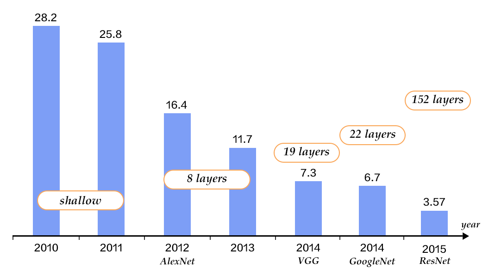
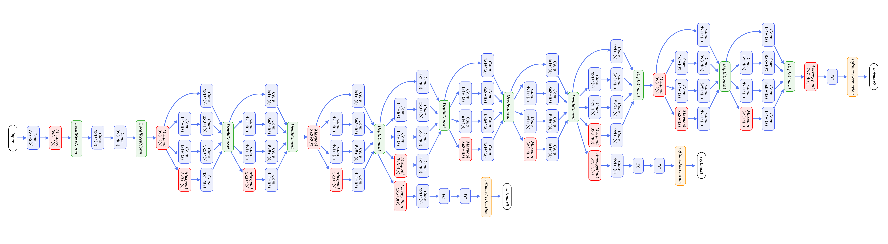
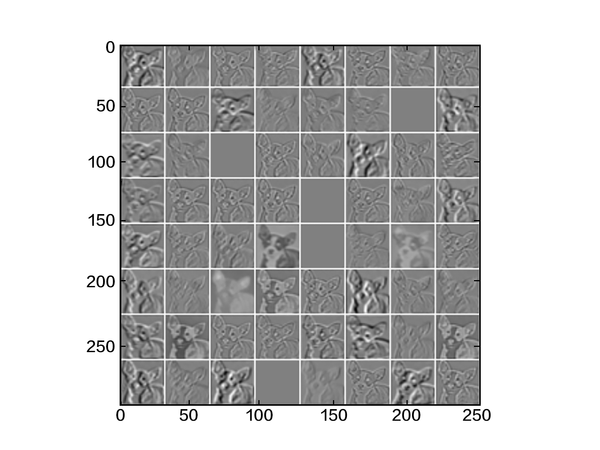

Image Classification
=======================

The source code of this chapter is in [book/image_classification](https://github.com/PaddlePaddle/book/tree/develop/image_classification). For the first-time users, please refer to PaddlePaddle[Installation Tutorial](http://www.paddlepaddle.org/doc_cn/build_and_install/index.html) for installation instructions.

## Background

Comparing to words, images provide more vivid and easier to understand information with more artistic sense. They are important source for people to convey and exchange ideas. In this chapter, we focus on one of the essential problems in image recognition -- image classification.

Image classification distinguishes images of different categories based on their semantic meaning. It is a core problem in computer vision, and is also the foundation of other higher level computer vision tasks such as object detection, image segmentation, object tracking, action recognition, etc. Image classification has applications in many areas such as face recognition and intelligent video analysis in security systems, traffic scene recognition in transportation systems, content-based image retrieval and automatic photo indexing in web services, image classification in medicine, etc.

In image classification, we first encode the whole image using handcrafted or learned features, and then determine the object category by a classifier. Therefore, feature extraction plays an important role in image classification. Prior to deep learning, BoW(Bag of Words) model is the most popular method for object classification. BoW was introduced in NLP where a sentence is represented as a bag of words (words, phrases, or characters) extracted from training sentences. In the context of image classification, BoW model requires constructing a dictionary. The simplest BoW framework can be designed with three steps: **feature extraction**, **feature encoding**, and **classifier design**.

Deep learning approach to image classification works by supervised or unsupervised learning of hierarchical features automatically instead of crafting or selecting image features manually. Convolutional Neural Networks (CNNs) have made significant progress in image classification. They keep all image information by employing raw image pixels as input, extract low-level and high-level abstract features through convolution operations, and directly output the classification results from the model. This end-to-end learning fashion leads to good performance and wide applications.

In this chapter, we focus on introducing deep learning-based image classification methods, and on explaining how to train a CNN model using PaddlePaddle.

## Demonstration

Image classification includes general and fine-grained ones. Figure 1 demonstrates the results of general image classification -- the trained model can correctly recognize the main objects in the images.

<p align="center">
<br/>
Figure 1. General image classification
</p>


Figure 2 demonstrates the results of fine-grained image classification -- flower recognition, which requires correct recognition of flower categories.

<p align="center">
<br/>
Figure 2. Fine-grained image classification
</p>


A good model should be able to recognize objects of different categories correctly, and meanwhile can correctly classify images taken from different points of view, under different illuminations, with object distortion or partial occlusion (we call these image disturbance). Figure 3 show some images with various disturbance. A good model should be able to classify these images correctly like humans.

<p align="center">
<br/>
Figure 3. Disturbed images [22]
不同视角 ==> various perspective
不同大小 ==> various sizes
形变 ==> shape deformation
遮挡 ==> occlusion
不同光照 ==> various illumination
背景干扰 ==> cluttered background
同类异形 ==> homogeneous
</p>

## Model Overview

A large amount of research work in image classification is built upon public datasets such as [PASCAL VOC](http://host.robots.ox.ac.uk/pascal/VOC/), [ImageNet](http://image-net.org/). Many image classification algorithms are usually evaluated and compared on these datasets. PASCAL VOC is a computer vision competition started in 2005, and ImageNet is a dataset started in Large Scale Visual Recognition Challenge (ILSVRC) 2010. In this chapter, we introduce some image classification models from the submissions to these competitions.

Before 2012, traditional image classification methods can be achieved with the three steps described in the Background section. A complete model construction usually involves the following stages: low-level feature extraction, feature encoding, spatial constraint or feature clustering, classifier design, model ensemble.

  1). **Low-level feature extraction**: This is a step for extracting large amounts of local features according to fixed strides and scales. Popular local features include Scale-Invariant Feature Transform(SIFT)[1], Histogram of Oriented Gradient(HOG)[2], Local Binary Pattern(LBP)[3], etc. A common practice is to employ multiple feature descriptors in order to avoid missing too much information.
  2). **Feature encoding**: Low-level features contain large amount of redundancy and noise. In order to improve robustness of features, it is necessary to employ a feature transformation to encode low-level features, which is called feature encoding. Common feature encoding methods include vector quantization [4], sparse coding [5], locality-constrained linear coding [6], Fisher vector encoding [7], etc.
  3). **Spatial constraint**: Spatial constraint or feature clustering is usually adopted after feature encoding for extracting the maximum or average of each dimension in the spatial domain. Pyramid feature matching--a popular feature clustering method--divides an image uniformly into patches, and performs feature clustering in each patch.
  4). **Classification**: Upon the above steps, an image can be described by a vector of fixed dimension. Then a classifier can be used to classify the image into categories. Common classifiers include Support Vector Machine(SVM), random forest, etc. Kernel SVM is the most popular classifier, and has achieved very good performance in traditional image classification tasks.

This method has been used widely as image classification algorithm in PASCAL VOC [18]. NEC Labs(http://www.nec-labs.com/) won the championship by employing SIFT and LBP features, two non-linear encoders and SVM in ILSVRC 2010 [8].

The CNN model--AlexNet proposed by Alex Krizhevsky et al.[9], made a breakthrough in ILSVRC 2012. It outperformed traditional methods dramatically, and won the championship in ILSVRC 2012. This is also the first time that a deep learning method was used for large scale image classification. Since AlexNet, a series of  CNN models have been proposed and has advanced the state of the art steadily on Imagenet as shown in Figure 4. With deeper and more sophisticated architectures, Top-5 error rate is getting lower and lower, until to around 3.5%. The error rate of human raters on the same Imagenet dataset is 5.1%, which means that the image classification capability of a deep learning model surpasses human raters.

<p align="center">
<br/>
Figure 4. Top-5 error rates on ILSVRC image classification
</p>

### CNN

Traditional CNNs consist of convolutional and fully-connected layers, and employ softmax multi-category classifier and cross-entropy as loss function. Figure 5 shows a typical CNN. We first introduce the common parts of a CNN.

<p align="center">
<br/>
Figure 5. A CNN example [20]
输入层 ==> input layer
卷积层 ==> convolutional layer
特征图 ==> feature maps
降采样（池化）层 ==> pooling layer
全连接层 ==> fully-connected layer
</p>

- convolutional layer: It uses convolution operation to extract low-level and high-level features, and to discover local correlation and spatial invariance.

- pooling layer: It down-sample feature maps via extracting local max (max-pooling) or average (avg-pooling) of each patch in the feature map. Down-sampling, a common operator in image processing, can be used to filter out high frequency information.

- fully-connected layer: It fully connects neurons between two adjacent layers.

- non-linear activation: Convolutional and fully-connected layers are usually followed by some non-linear activation layers, such as Sigmoid, Tanh, Relu to enhance the expression capability. Relu is the most commonly used activation function in CNN.

- Dropout [10]: At each training stage, individual nodes are dropped out of the net with a certain probability in order to improve generalization and to avoid overfitting.

Due to parameter updating in each layer during training, it causes the change in the distributions of layer inputs, and requires careful tuning of hyper-parameters. In 2015, Sergey Ioffe and Christian Szegedy proposed a Batch Normalization (BN) algorithm [14], which normalizes the features of each batch in a layer, and enables relatively stable distribution in each layer. Not only does BN algorithm act as a regularizer, but also reduces the need for careful hyper-parameter design. Experiments demonstrate that BN algorithm accelerates the training convergence and has been widely used in later deeper models.

We will introduce the network architectures of VGG, GoogleNet and ResNets in the following sections.

### VGG

Oxford Visual Geometry Group (VGG) proposed VGG network in ILSVRC 2014 [11]. The model is deeper and wider than previous neural architectures. It comprises five main groups of convolution operations, with max-pooling layers between adjacent convolution groups. Each group contains a series of 3x3 convolutional layers, whose number of convolution kernels stays the same within the group and increases from 64 in the first group to 512 in the last one. The total number of learnable layers could be 11, 13, 16, or 19 depending on the number of convolutional layers in each group. Figure 6 illustrates a 16-layer VGG. The neural architecture of VGG is relatively simple, and has been adopted by many papers such as the first one that surpassed human-level performance on ImageNet [19].

<p align="center">
<br/>
Figure 6. Vgg16 model for ImageNet
</p>

### GoogleNet

GoogleNet [12] won the championship in ILSVRC 2014. Before introducing this model, lets get familiar with Network in Network(NIN) model [13] from which GoogleNet borrowed some ideas, and Inception blocks upon which GoogleNet is built.

NIN model has two main characteristics: 1) it replaces the single-layer convolutional network by Multi-Layer Perceptron Convolution or MLPconv. MLPconv, a tiny multi-layer convolutional network, enhances non-linearity by adding several 1x1 convolutional layers after linear ones. 2) In traditional CNNs, the last fewer layers are usually fully-connected with a large number of parameters. In contrast, NIN replaces all fully-connected layers with convolutional layers whose feature maps are of the same size as the category dimension, and followed by a global average pooling. This replacement of fully-connected layers significantly reduces the number of parameters.

Figure 7 depicts two Inception blocks. Figure 7(a) is the simplest design, the output of which is a concat of features from three convolutional layers and one pooling layer. The disadvantage of this design is that the pooling layer does not change the number of filters and leads to an increase of outputs. After going through several of such blocks, the number of outputs and parameters will become larger and larger, leading to higher computation complexity. To overcome this drawback, the Inception block in Figure 7(b) employs three 1x1 convolutional layers to reduce dimension or the number of channels, meanwhile improves non-linearity of the network.

<p align="center">
<br/>
Figure 7. Inception block
输入层 ==> input layer
卷积层 ==> convolutional layer
最大池化层 ==> max-pooling layer
Inception简单模块 ==> Inception module, naive version
Inception含降维模块 ==> Inception module with dimensionality reduction 
</p>

GoogleNet consists of multiple stacking Inception blocks followed by an avg-pooling layer as in NIN in place of by traditional fully connected layers. The difference between GoogleNet and NIN is that GoogleNet adds a fully connected layer after avg-pooling layer to output a vector of category size. Besides these two characteristics, the features from middle layers of a GoogleNet are also very discriminative. Therefore, GoogeleNet inserts two auxiliary classifiers in the model for enhancing gradient and regularization when doing backpropagating. The loss function of the whole network is the weighted sum of these three classifiers.

Figure 8 illustrates the neural architecture of a GoogleNet which consists of 22 layers: it starts with three regular convolutional layers followed by three groups of sub-networks-- the first group contains two Inception blocks, the second one five, and the third one two. It ends up with an average pooling and a fully-connected layer.

<p align="center">
<br/>
Figure 8. GoogleNet[12]
</p>

The above model is the first version of GoogleNet or GoogelNet-v1. GoogleNet-v2 [14] introduces BN layer; GoogleNet-v3 [16] further splits some convolutional layers, which increases non-linearity and network depth; GoogelNet-v4 [17] leads to the design idea of ResNet which will be introduced in the next section. The evolution from v1 to v4 leverages the accuracy rate consistently. We will not go into details of the neural architectures of v2 to v4.

### ResNet

Residual Network(ResNet)[15] won the 2015 championships on three ImageNet competitions -- image classification, object localization and object detection. The authors of ResNet proposed a residual learning approach to easing the difficulty of training deeper networks -- with the network depth increasing, accuracy degrades. Based upon the design ideas of BN, small convolutional kernels, full convolutional network, ResNets reformulate the layers as residual blocks, with each block containing two branches, one directly connecting input to the output, the other performing two to three convolutions and calculating the residual function with reference to the layer inputs. And then the outputs of these two branches are added up.

Figure 9 illustrates the architecture of ResNet. The left is the basic building block consisting of two 3x3 convolutional layers of the same channels. The right one is a Bottleneck block. The bottleneck is a 1x1 convolutional layer used to reduce dimension from 256 to 64. The other 1x1 conolutional layer is used to increase dimension from 64 to 256. Therefore, the number of input and output channels of the middle 3x3 convolutional layer, which is 64, is relatively small.

<p align="center">
<br/>
Figure 9. Residual block
</p>

Figure 10 illustrates ResNets with 50, 101, 152 layers, respectively. All three networks use bottleneck blocks of different numbers of repetitions. ResNet converges very fast and can be trained with hundreds or thousands of layers.

<p align="center">
<br/>
Figure 10. ResNet model for ImageNet
</p>


## Data Preparation

### Data description and downloading

Commonly used public datasets for image classification are CIFAR(https://www.cs.toronto.edu/~kriz/cifar.html), ImageNet(http://image-net.org/), COCO(http://mscoco.org/), etc. Those used for fine-grained image classification are CUB-200-2011(http://www.vision.caltech.edu/visipedia/CUB-200-2011.html), Stanford Dog(http://vision.stanford.edu/aditya86/ImageNetDogs/), Oxford-flowers(http://www.robots.ox.ac.uk/~vgg/data/flowers/), etc. Among them, ImageNet are the largest and most research results are reported on ImageNet as mentioned in Model Overview section. Since 2010, the data of Imagenet has gone through some changes. The commonly used ImageNet-2012 dataset contains 1000 categories. There are 1,281,167 training images, ranging from 732 to 1200 images per category, and 50,000 validation images with 50 images per category in average.

Since ImageNet is too large to be downloaded and trained efficiently, we use CIFAR10 (https://www.cs.toronto.edu/~kriz/cifar.html) in this tutorial. The CIFAR-10 dataset consists of 60000 32x32 color images in 10 classes, with 6000 images per class. There are 50000 training images and 10000 test images. Figure 11 shows all the classes in CIFAR10 as well as 10 images randomly sampled from each category.

<p align="center">
<br/>
Figure 11. CIFAR10 dataset[21]
</p>

The following command is used for downloading data and calculating the mean image used for data preprocessing.

```bash
./data/get_data.sh
```

###  Data provider for PaddlePaddle

We use Python interface for providing data to PaddlePaddle. The following file dataprovider.py is a complete example for CIFAR10.

- 'initializer' function performs initialization of dataprovider: loading the mean image, defining two input types -- image and label.

- 'process' function sends preprocessed data to PaddlePaddle. Data preprocessing performed in this function includes data perturbation, random horizontal flipping, deducting mean image from the raw image.

```python
import numpy as np
import cPickle
from paddle.trainer.PyDataProvider2 import *

def initializer(settings, mean_path, is_train, **kwargs):
    settings.is_train = is_train
    settings.input_size = 3 * 32 * 32
    settings.mean = np.load(mean_path)['mean']
    settings.input_types = {
        'image': dense_vector(settings.input_size),
        'label': integer_value(10)
    }


@provider(init_hook=initializer, pool_size=50000)
def process(settings, file_list):
    with open(file_list, 'r') as fdata:
        for fname in fdata:
            fo = open(fname.strip(), 'rb')
            batch = cPickle.load(fo)
            fo.close()
            images = batch['data']
            labels = batch['labels']
            for im, lab in zip(images, labels):
                if settings.is_train and np.random.randint(2):
                    im = im.reshape(3, 32, 32)
                    im = im[:,:,::-1]
                    im = im.flatten()
                im = im - settings.mean
                yield {
                    'image': im.astype('float32'),
                    'label': int(lab)
                }
```

## Model Config

### Data Definition

In model config file, function `define_py_data_sources2` sets argument 'module' to dataprovider file for loading data, 'args' to mean image file. If the config file is used for prediction, then there is no need to set argument 'train_list'.

```python
from paddle.trainer_config_helpers import *

is_predict = get_config_arg("is_predict", bool, False)
if not is_predict:
    define_py_data_sources2(
        train_list='data/train.list',
        test_list='data/test.list',
        module='dataprovider',
        obj='process',
        args={'mean_path': 'data/mean.meta'})
```

### Algorithm Settings

In model config file, function 'settings' specifies optimization algorithm, batch size, learning rate, momentum and L2 regularization.

```python
settings(
    batch_size=128,
    learning_rate=0.1 / 128.0,
    learning_rate_decay_a=0.1,
    learning_rate_decay_b=50000 * 100,
    learning_rate_schedule='discexp',
    learning_method=MomentumOptimizer(0.9),
    regularization=L2Regularization(0.0005 * 128),)
```

The learning rate adjustment policy can be defined with variables `learning_rate_decay_a`($a$), `learning_rate_decay_b`($b$) and `learning_rate_schedule`. In this example, discrete exponential method is used for adjusting learning rate. The formula is as follows,
$$  lr = lr_{0} * a^ {\lfloor \frac{n}{ b}\rfloor} $$
where $n$ is the number of processed samples, $lr_{0}$ is the learning_rate set in 'settings'.

### Model Architecture

Here we provide the cofig files for VGG and ResNet models.

#### VGG

First we define VGG network. Since the image size and amount of CIFAR10 are relatively small comparing to ImageNet, we uses a small version of VGG network for CIFAR10. Convolution groups incorporate BN and dropout operations.

1. Define input data and its dimension

        The input to the network is defined as `data_layer`, or image pixels in the context of image classification. The images in CIFAR10 are 32x32 color images of three channels. Therefore, the size of the input data is 3072 (3x32x32), and the number of categories is 10.

	```python
	datadim = 3 * 32 * 32
	classdim = 10
	data = data_layer(name='image', size=datadim)
	```

2. Define VGG main module

	```python
	net = vgg_bn_drop(data)
	```
        The input to VGG main module is from data layer. `vgg_bn_drop` defines a 16-layer VGG network, with each convolutional layer followed by BN and dropout layers. Here is the definition in detail:

	```python
	def vgg_bn_drop(input, num_channels):
	    def conv_block(ipt, num_filter, groups, dropouts, num_channels_=None):
	        return img_conv_group(
	            input=ipt,
	            num_channels=num_channels_,
	            pool_size=2,
	            pool_stride=2,
	            conv_num_filter=[num_filter] * groups,
	            conv_filter_size=3,
	            conv_act=ReluActivation(),
	            conv_with_batchnorm=True,
	            conv_batchnorm_drop_rate=dropouts,
	            pool_type=MaxPooling())

	    conv1 = conv_block(input, 64, 2, [0.3, 0], 3)
	    conv2 = conv_block(conv1, 128, 2, [0.4, 0])
	    conv3 = conv_block(conv2, 256, 3, [0.4, 0.4, 0])
	    conv4 = conv_block(conv3, 512, 3, [0.4, 0.4, 0])
	    conv5 = conv_block(conv4, 512, 3, [0.4, 0.4, 0])

	    drop = dropout_layer(input=conv5, dropout_rate=0.5)
	    fc1 = fc_layer(input=drop, size=512, act=LinearActivation())
	    bn = batch_norm_layer(
	        input=fc1, act=ReluActivation(), layer_attr=ExtraAttr(drop_rate=0.5))
	    fc2 = fc_layer(input=bn, size=512, act=LinearActivation())
	    return fc2

	```

        2.1. First defines a convolution block or conv_block. The default convolution kernel is 3x3, and the default pooling size is 2x2 with stride 2. Dropout specifies the probability in dropout operation. Function `img_conv_group` is defined in `paddle.trainer_config_helpers` consisting of a series of `Conv->BN->ReLu->Dropout` and a `Pooling`.


        2.2. Five groups of convolutions. The first two groups perform two convolutions, while the last three groups perform three convolutions. The dropout rate of the last convolution in each group is set to 0, which means there is no dropout for this layer.


        2.3. The last two layers are fully-connected layer of dimension 512.

3. Define Classifier

        The above VGG network extracts high-level features and maps them to a vector of the same size as the categories. Softmax function or classifier is then used for calculating the probability of the image belonging to each category.

	```python
	out = fc_layer(input=net, size=class_num, act=SoftmaxActivation())
	```

4. Define Loss Function and Outputs

        In the context of supervised learning, labels of training images are defined in `data_layer`, too. During training, cross-entropy is used as loss function and as the output of the network; During testing, the outputs are the probabilities calculated in the classifier.

	```python
	if not is_predict:
	    lbl = data_layer(name="label", size=class_num)
	    cost = classification_cost(input=out, label=lbl)
	    outputs(cost)
	else:
	    outputs(out)
	```

### ResNet

The first, third and forth steps of a ResNet are the same as a VGG. The second one is the main module.

```python
net = resnet_cifar10(data, depth=56)
```

Here are some basic functions used in `resnet_cifar10`:

  - `conv_bn_layer` : convolutional layer followed by BN.
  - `shortcut` : the shortcut branch in a residual block. There are two kinds of shortcuts: 1x1 convolution used when the number of channels between input and output are different; direct connection used otherwise.

  - `basicblock` : a basic residual module as shown in the left of Figure 9, consisting of two sequential 3x3 convolutions and one "shortcut" branch.
  - `bottleneck` : a bottleneck module as shown in the right of Figure 9, consisting of a two 1x1 convolutions with one 3x3 convolution in between branch and a "shortcut" branch.
  - `layer_warp` : a group of residual modules consisting of several stacking blocks. In each group, the sliding window size of the first residual block could be different from the rest of blocks, in order to reduce the size of feature maps along horizontal and vertical directions.

```python
def conv_bn_layer(input,
                  ch_out,
                  filter_size,
                  stride,
                  padding,
                  active_type=ReluActivation(),
                  ch_in=None):
    tmp = img_conv_layer(
        input=input,
        filter_size=filter_size,
        num_channels=ch_in,
        num_filters=ch_out,
        stride=stride,
        padding=padding,
        act=LinearActivation(),
        bias_attr=False)
    return batch_norm_layer(input=tmp, act=active_type)


def shortcut(ipt, n_in, n_out, stride):
    if n_in != n_out:
        return conv_bn_layer(ipt, n_out, 1, stride, 0, LinearActivation())
    else:
        return ipt

def basicblock(ipt, ch_out, stride):
    ch_in = ipt.num_filters
    tmp = conv_bn_layer(ipt, ch_out, 3, stride, 1)
    tmp = conv_bn_layer(tmp, ch_out, 3, 1, 1, LinearActivation())
    short = shortcut(ipt, ch_in, ch_out, stride)
    return addto_layer(input=[ipt, short], act=ReluActivation())

def bottleneck(ipt, ch_out, stride):
    ch_in = ipt.num_filter
    tmp = conv_bn_layer(ipt, ch_out, 1, stride, 0)
    tmp = conv_bn_layer(tmp, ch_out, 3, 1, 1)
    tmp = conv_bn_layer(tmp, ch_out * 4, 1, 1, 0, LinearActivation())
    short = shortcut(ipt, ch_in, ch_out, stride)
    return addto_layer(input=[ipt, short], act=ReluActivation())

def layer_warp(block_func, ipt, features, count, stride):
    tmp = block_func(ipt, features, stride)
    for i in range(1, count):
        tmp = block_func(tmp, features, 1)
    return tmp

```

The following are the components of `resnet_cifar10`:

1. The lowest level is `conv_bn_layer`.
2. The middle level consists of three `layer_warp`, each of which uses the left residual block in Figure 9.
3. The last level is average pooling layer.

Note: besides the first convolutional layer and the last fully-connected layer, the total number of layers in three `layer_warp` should be dividable by 6, that is the depth of `resnet_cifar10` should satisfy $(depth - 2) % 6 == 0$.

```python
def resnet_cifar10(ipt, depth=56):
    # depth should be one of 20, 32, 44, 56, 110, 1202
    assert (depth - 2) % 6 == 0
    n = (depth - 2) / 6
    nStages = {16, 64, 128}
    conv1 = conv_bn_layer(ipt,
        ch_in=3,
        ch_out=16,
        filter_size=3,
        stride=1,
        padding=1)
    res1 = layer_warp(basicblock, conv1, 16, n, 1)
    res2 = layer_warp(basicblock, res1, 32, n, 2)
    res3 = layer_warp(basicblock, res2, 64, n, 2)
    pool = img_pool_layer(input=res3,
                         pool_size=8,
                         stride=1,
                         pool_type=AvgPooling())
    return pool
```

## Model Training

We can train the model by running the script train.sh, which specifies config file, device type, number of threads, number of passes, path to the trained models, etc,

``` bash
sh train.sh
```

Here is an example script `train.sh`:

```bash
#cfg=models/resnet.py
cfg=models/vgg.py
output=output
log=train.log

paddle train \
    --config=$cfg \
    --use_gpu=true \
    --trainer_count=1 \
    --log_period=100 \
    --num_passes=300 \
    --save_dir=$output \
    2>&1 | tee $log
```

- `--config=$cfg` : specifies config file. The default is `models/vgg.py`.
- `--use_gpu=true` : uses GPU for training. If use CPU，set it to be false.
- `--trainer_count=1` : specifies the number of threads or GPUs.
- `--log_period=100` : specifies the number of batches between two logs.
- `--save_dir=$output` : specifies the path for saving trained models.

Here is an example log after training for one pass. The average error rates are 0.79958 on training set and 0.7858 on validation set.

```text
TrainerInternal.cpp:165]  Batch=300 samples=38400 AvgCost=2.07708 CurrentCost=1.96158 Eval: classification_error_evaluator=0.81151  CurrentEval: classification_error_evaluator=0.789297
TrainerInternal.cpp:181]  Pass=0 Batch=391 samples=50000 AvgCost=2.03348 Eval: classification_error_evaluator=0.79958
Tester.cpp:115]  Test samples=10000 cost=1.99246 Eval: classification_error_evaluator=0.7858
```

Figure 12 shows the curve of training error rate, which indicates it converges at Pass 200 with error rate 8.54%.

<p align="center">
<br/>
Figure 12. The error rate of VGG model on CIFAR10
训练轮数 ==> epoch
误差 ==> error
训练误差 ==> training error
测试误差 ==> test error
</p>

## Model Application

After training is done, the model from each pass is saved in `output/pass-%05d`. For example, the model of Pass 300 is saved in `output/pass-00299`. The script `classify.py` can be used to extract features and to classify an image. The default config file of this script is `models/vgg.py`.


### Prediction

We can run the following script to predict the category of an image. The default device is GPU. If to use CPU, set `-c`.

```bash
python classify.py --job=predict --model=output/pass-00299 --data=image/dog.png # -c
```

Here is the result：

```text
Label of image/dog.png is: 5
```

### Feature Extraction

We can run the following command to extract features from an image. Here `job` should be `extract` and the default layer is the first convolutional layer. Figure 13 shows the 64 feature maps output from the first convolutional layer of the VGG model.

```bash
python classify.py --job=extract --model=output/pass-00299 --data=image/dog.png # -c
```

<p align="center">
<br/>
Figre 13. Visualization of convolution layer feature maps
</p>

## Conclusion

Traditional image classification methods involve multiple stages of processing and the framework is very complicated. In contrast, CNN models can be trained end-to-end with significant increase of classification accuracy. In this chapter, we introduce three models -- VGG, GoogleNet, ResNet, provide PaddlePaddle config files for training VGG and ResNet on CIFAR10, and explain how to perform prediction and feature extraction using PaddlePaddle API. For other datasets such as ImageNet, the procedure for config and training are the same and you are welcome to give it a try.


## Reference

[1] D. G. Lowe, [Distinctive image features from scale-invariant keypoints](http://www.cs.ubc.ca/~lowe/papers/ijcv04.pdf). IJCV, 60(2):91-110, 2004.

[2] N. Dalal, B. Triggs, [Histograms of Oriented Gradients for Human Detection](http://vision.stanford.edu/teaching/cs231b_spring1213/papers/CVPR05_DalalTriggs.pdf), Proc. IEEE Conf. Computer Vision and Pattern Recognition, 2005.

[3] Ahonen, T., Hadid, A., and Pietikinen, M. (2006). [Face description with local binary patterns: Application to face recognition](http://ieeexplore.ieee.org/document/1717463/). PAMI, 28.

[4] J. Sivic, A. Zisserman, [Video Google: A Text Retrieval Approach to Object Matching in Videos](http://www.robots.ox.ac.uk/~vgg/publications/papers/sivic03.pdf), Proc. Ninth Int'l Conf. Computer Vision, pp. 1470-1478, 2003.

[5] B. Olshausen, D. Field, [Sparse Coding with an Overcomplete Basis Set: A Strategy Employed by V1?](http://redwood.psych.cornell.edu/papers/olshausen_field_1997.pdf), Vision Research, vol. 37, pp. 3311-3325, 1997.

[6] Wang, J., Yang, J., Yu, K., Lv, F., Huang, T., and Gong, Y. (2010). [Locality-constrained Linear Coding for image classification](http://ieeexplore.ieee.org/abstract/document/5540018/). In CVPR.

[7] Perronnin, F., Sánchez, J., & Mensink, T. (2010). [Improving the fisher kernel for large-scale image classification](http://dl.acm.org/citation.cfm?id=1888101). In ECCV (4).

[8] Lin, Y., Lv, F., Cao, L., Zhu, S., Yang, M., Cour, T., Yu, K., and Huang, T. (2011). [Large-scale image clas- sification: Fast feature extraction and SVM training](http://ieeexplore.ieee.org/document/5995477/). In CVPR.

[9] Krizhevsky, A., Sutskever, I., and Hinton, G. (2012). [ImageNet classification with deep convolutional neu- ral networks](http://www.cs.toronto.edu/~kriz/imagenet_classification_with_deep_convolutional.pdf). In NIPS.

[10] G.E. Hinton, N. Srivastava, A. Krizhevsky, I. Sutskever, and R.R. Salakhutdinov. [Improving neural networks by preventing co-adaptation of feature detectors](https://arxiv.org/abs/1207.0580). arXiv preprint arXiv:1207.0580, 2012.

[11] K. Chatfield, K. Simonyan, A. Vedaldi, A. Zisserman. [Return of the Devil in the Details: Delving Deep into Convolutional Nets](https://arxiv.org/abs/1405.3531). BMVC, 2014。

[12] Szegedy, C., Liu, W., Jia, Y., Sermanet, P., Reed, S., Anguelov, D., Erhan, D., Vanhoucke, V., Rabinovich, A., [Going deeper with convolutions](https://arxiv.org/abs/1409.4842). In: CVPR. (2015)

[13] Lin, M., Chen, Q., and Yan, S. [Network in network](https://arxiv.org/abs/1312.4400). In Proc. ICLR, 2014.

[14] S. Ioffe and C. Szegedy. [Batch normalization: Accelerating deep network training by reducing internal covariate shift](https://arxiv.org/abs/1502.03167). In ICML, 2015.

[15] K. He, X. Zhang, S. Ren, J. Sun. [Deep Residual Learning for Image Recognition](https://arxiv.org/abs/1512.03385). CVPR 2016.

[16] Szegedy, C., Vanhoucke, V., Ioffe, S., Shlens, J., Wojna, Z. [Rethinking the incep-tion architecture for computer vision](https://arxiv.org/abs/1512.00567). In: CVPR. (2016).

[17] Szegedy, C., Ioffe, S., Vanhoucke, V. [Inception-v4, inception-resnet and the impact of residual connections on learning](https://arxiv.org/abs/1602.07261). arXiv:1602.07261 (2016).

[18] Everingham, M., Eslami, S. M. A., Van Gool, L., Williams, C. K. I., Winn, J. and Zisserman, A. [The Pascal Visual Object Classes Challenge: A Retrospective]((http://link.springer.com/article/10.1007/s11263-014-0733-5)). International Journal of Computer Vision, 111(1), 98-136, 2015.

[19] He, K., Zhang, X., Ren, S., and Sun, J. [Delving Deep into Rectifiers: Surpassing Human-Level Performance on ImageNet Classification](https://arxiv.org/abs/1502.01852). ArXiv e-prints, February 2015.

[20] http://deeplearning.net/tutorial/lenet.html

[21] https://www.cs.toronto.edu/~kriz/cifar.html

[22] http://cs231n.github.io/classification/

<br/>
<a rel="license" href="http://creativecommons.org/licenses/by-nc-sa/4.0/"></a><br /><span xmlns:dct="http://purl.org/dc/terms/" href="http://purl.org/dc/dcmitype/Text" property="dct:title" rel="dct:type">本教程</span> 由 <a xmlns:cc="http://creativecommons.org/ns#" href="http://book.paddlepaddle.org" property="cc:attributionName" rel="cc:attributionURL">PaddlePaddle</a> 创作，采用 <a rel="license" href="http://creativecommons.org/licenses/by-nc-sa/4.0/">知识共享 署名-非商业性使用-相同方式共享 4.0 国际 许可协议</a>进行许可。
