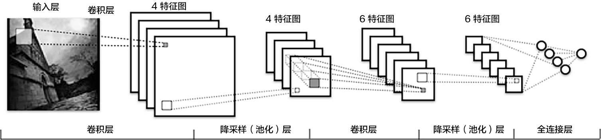

图像分类
=======

## 背景介绍 

图像分类是计算机视觉中的一个核心问题，图像分类是根据图像的语义信息将不同类别图像区分开来的方法。一般来说，图像分类包括训练和预测两个阶段。在训练阶段，输入训练图片集合和每一张训练图片对应的标签，计算机学习得到预测函数。在测试阶段，输入无标签的测试图片，计算机输出测试图片所属的类别标签。

在图像分类任务中，如何提取图像的特征是至关重要的。图像的颜色、纹理、形状各自描述了图像的视觉特性，但各自丢失了一部分原始图像中的信息。基于深度学习的图像分类方法，利用图像像素信息作为输入，最大程度上保留了输入图像的所有信息；与此同时，采用卷积神经网络进行特征的提取和高层抽象，从而得到远超过传统方法的分类性能。

## 效果展示

图像分类包括通用图像分类、细粒度图像分类等。下图展示了通用图像分类效果，即模型可以正确识别图像上的主要物体。

<p align="center">
<br/>
图1. 通用物体分类展示
</p>


下图展示了细粒度图像分类-花卉识别的效果，要求模型可以正确识别花的类别。


<p align="center">
<br/>
图2. 细粒度图像分类展示
</p>


一个好的模型即要对不同类别识别正确，同时也应该能够对变形、扰动后的图像正确识别，下图展示了一些图像的扰动，较好的模型会像人一样能够正确识别。

<p align="center">
<br/>
图3. 扰动图片展示
</p>

## 模型概览

### VGG

[VGG](https://arxiv.org/abs/1405.3531) 模型的核心是五组卷积操作，每两组之间做max-pooling空间降维。同一组内采用多次连续的3X3卷积，卷积核的数目由较浅组的64增多到最深组的512，同一组内的卷积核数目是一样的。卷积之后接两层全连接层，之后是分类层。VGG模型的计算量较大，收敛较慢。

### ResNet

[ResNet](https://arxiv.org/abs/1512.03385) 是2015年ImageNet分类定位、检测比赛的冠军。针对训练卷积神经网络时加深网络导致准确度下降的问题，提出了采用残差学习。在已有设计思路(Batch Norm, 小卷积核，全卷积网络)的基础上，引入了残差模块。每个残差模块包含两条路径，其中一条路径是输入特征的直连通路，另一条路径对该特征做两到三次卷积操作得到该特征的残差，最后再将两条路径上的特征相加。ResNet成功的训练了上百乃至近千层的卷积神经网络，训练时收敛快，速度也较VGG有所提升。


## 数据准备

### 数据介绍与下载

在本教程中，我们使用[CIFAR-10](<https://www.cs.toronto.edu/~kriz/cifar.html>)数据集训练一个卷积神经网络。CIFAR-10数据集包含60,000张32x32的彩色图片，10个类别，每个类包含6,000张。其中50,000张图片作为训练集，10000张作为测试集。下图从每个类别中随机抽取了10张图片，展示了所有的类别。

<p align="center">
<br/>
图3. CIFAR-10数据集
</p>


执行下面命令下载数据，同时，会基于训练集计算图像均值，在训练阶段，输入数据会基于该均值做预处理，再传输给系统。

```bash
./data/get_data.sh
```

### 数据提供器

我们使用Python接口传递数据给系统，下面 `dataprovider.py` 针对Cfiar-10数据给出了完整示例。

`initializer` 函数进行dataprovider的初始化，这里加载图像的均值，定义了输入image和label两个字段的类型。

`process` 函数将数据逐条传输给系统，在图像分类做可以完整数据扰动操作，再传输给PaddlePaddle。这里将原始图片减去均值后传输给系统。


```python
def initializer(settings, mean_path, is_train, **kwargs):
    settings.is_train = is_train
    settings.input_size = 3 * 32 * 32
    settings.mean = np.load(mean_path)['mean']
    settings.input_types = {
        'image': dense_vector(settings.input_size),
        'label': integer_value(10)
    }


@provider(init_hook=initializer, cache=CacheType.CACHE_PASS_IN_MEM)
def process(settings, file_list):
    with open(file_list, 'r') as fdata:
        for fname in fdata:
            fo = open(fname.strip(), 'rb')
            batch = cPickle.load(fo)
            fo.close()
            images = batch['data']
            labels = batch['labels']
            for im, lab in zip(images, labels):
                im = im - settings.mean
                yield {
                    'image': im.astype('float32'),
                    'label': int(lab)
                }
```

## 模型配置说明

### 数据定义

在模型配置中，定义通过 `define_py_data_sources2` 从 dataprovider 中读入数据， 其中 args 指定均值文件的路径。

```python
define_py_data_sources2(
    train_list='data/train.list',
    test_list='data/test.list',
    module='dataprovider',
    obj='process',
    args={'mean_path': 'data/mean.meta'})
```

### 算法配置

在模型配置中，通过 `seetings` 设置训练使用的优化算法，这里指定batch size 、初始学习率、momentum以及L2正则。

```python
settings(
    batch_size=128,
    learning_rate=0.1 / 128.0,
    learning_method=MomentumOptimizer(0.9),
    regularization=L2Regularization(0.0005 * 128))
```

### 模型结构

在模型概览部分已经介绍了VGG和ResNet模型，本教程中我们提供了这两个模型的网络配置。
下面是VGG模型结构，在Cifar-10数据集上，卷积部分引入了Batch Norm和Dropout操作。

1. 首先预定义了一组卷积网络，即conv_block， 所使用的 `img_conv_group` 是我们预定义的一个模块，由若干组 `Conv->BatchNorm->Relu->Dropout` 和 一组 `Pooling` 组成，其中卷积操作采用3x3的卷积核。下面定义中根据 groups 决定是几次连续的卷积操作。

2. 五组卷积操作，即 5个conv_block。 第一、二组采用两次连续的卷积操作。第三、四、五组采用三次连续的卷积操作。

3. 由两层512维的全连接网络和一个分类层组成。


```python
def vgg_bn_drop(input, num_channels):
    def conv_block(ipt, num_filter, groups, dropouts, num_channels_=None):
        return img_conv_group(
            input=ipt,
            num_channels=num_channels_,
            pool_size=2,
            pool_stride=2,
            conv_num_filter=[num_filter] * groups,
            conv_filter_size=3,
            conv_act=ReluActivation(),
            conv_with_batchnorm=True,
            conv_batchnorm_drop_rate=dropouts,
            pool_type=MaxPooling())

    tmp = conv_block(input, 64, 2, [0.3, 0], num_channels)
    tmp = conv_block(tmp, 128, 2, [0.4, 0])
    tmp = conv_block(tmp, 256, 3, [0.4, 0.4, 0])
    tmp = conv_block(tmp, 512, 3, [0.4, 0.4, 0])
    tmp = conv_block(tmp, 512, 3, [0.4, 0.4, 0])

    tmp = dropout_layer(input=tmp, dropout_rate=0.5)
    tmp = fc_layer(
        input=tmp,
        size=512,
        act=LinearActivation())
    tmp = batch_norm_layer(input=tmp,
        act=ReluActivation(),
        layer_attr=ExtraAttr(drop_rate=0.5))
    tmp = fc_layer(
        input=tmp,
        size=512,
        act=LinearActivation())
    tmp = fc_layer(input=tmp, size=10, act=SoftmaxActivation())
    return tmp

```

## 模型训练

``` bash
sh train.sh
```

执行脚本 train.sh 进行模型训练， 其中指定了总共需要执行500个pass。

在第一行中我们载入用于定义网络的函数。

配置创建完毕后，可以运行脚本train.sh来训练模型。


```bash
#cfg=models/resnet.py
cfg=models/vgg.py
output=./output
log=train.log

paddle train \
    --config=$cfg \
    --use_gpu=true \
    --trainer_count=1 \
    --log_period=100 \
    --save_dir=$output \
    2>&1 | tee $log
```

- `--config=$cfg` : 指定配置文件，默认是 `models/vgg.py`。
- `--use_gpu=true` : 指定使用GPU训练，若使用CPU，设置为false。
- `--trainer_count=1` : 指定线程个数或GPU个数。
- `--log_period=100` : 指定日志打印的batch间隔。
- `--save_dir=$output` : 指定模型存储路径。

一轮训练log示例如下所示，经过1个pass， 训练集上平均error为classification_error_evaluator=0.79958 ，测试集上平均error为 classification_error_evaluator=0.7858 。

```text
I1226 12:33:20.257822 25576 TrainerInternal.cpp:165]  Batch=300 samples=38400 AvgCost=2.07708 CurrentCost=1.96158 Eval: classification_error_evaluator=0.81151  CurrentEval: classification_error_evaluator=0.789297
.........I1226 12:33:37.720484 25576 TrainerInternal.cpp:181]  Pass=0 Batch=391 samples=50000 AvgCost=2.03348 Eval: classification_error_evaluator=0.79958
I1226 12:33:42.413450 25576 Tester.cpp:115]  Test samples=10000 cost=1.99246 Eval: classification_error_evaluator=0.7858
```


下图是训练的分类错误率曲线图：

<center></center>

## 模型应用

在训练完成后，模型及参数会被保存在路径`./cifar_vgg_model/pass-%05d`下。例如第300个pass的模型会被保存在`./cifar_vgg_model/pass-00299`。

要对一个图片的进行分类预测，我们可以使用`predict.sh`，该脚本将输出预测分类的标签：

```
sh predict.sh
```

predict.sh:
```
model=cifar_vgg_model/pass-00299/
image=data/cifar-out/test/airplane/seaplane_s_000978.png
use_gpu=1
python prediction.py $model $image $use_gpu
```

## 练习
在CUB-200数据集上使用VGG模型训练一个鸟类图片分类模型。相关的鸟类数据集可以从如下地址下载，其中包含了200种鸟类的照片（主要来自北美洲）。

<http://www.vision.caltech.edu/visipedia/CUB-200.html>


## 细节探究
### 卷积神经网络
卷积神经网络是一种使用卷积层的前向神经网络，很适合构建用于理解图片内容的模型。一个典型的神经网络如下图所示：



一个卷积神经网络包含如下层：

- 卷积层：通过卷积操作从图片或特征图中提取特征
- 池化层：使用max-pooling对特征图下采样
- 全连接层：使输入层到隐藏层的神经元是全部连接的。

卷积神经网络在图片分类上有着惊人的性能，这是因为它发掘出了图片的两类重要信息：局部关联性质和空间不变性质。通过交替使用卷积和池化处理， 卷积神经网络能够很好的表示这两类信息。

关于如何定义网络中的层，以及如何在层之间进行连接，请参考Layer文档。


## 参考文献

[1]. K. Chatfield, K. Simonyan, A. Vedaldi, A. Zisserman. Return of the Devil in the Details: Delving Deep into Convolutional Nets. BMVC, 2014。
[2]. K. He, X. Zhang, S. Ren, J. Sun. Deep Residual Learning for Image Recognition. CVPR 2016.
