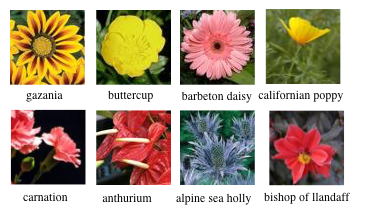
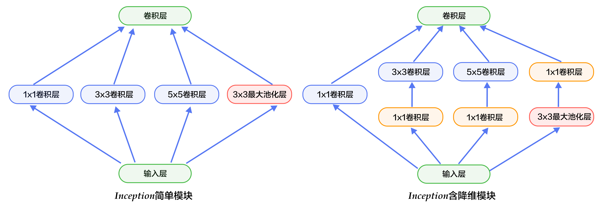
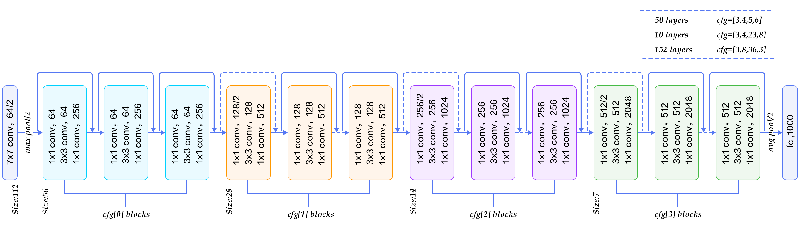
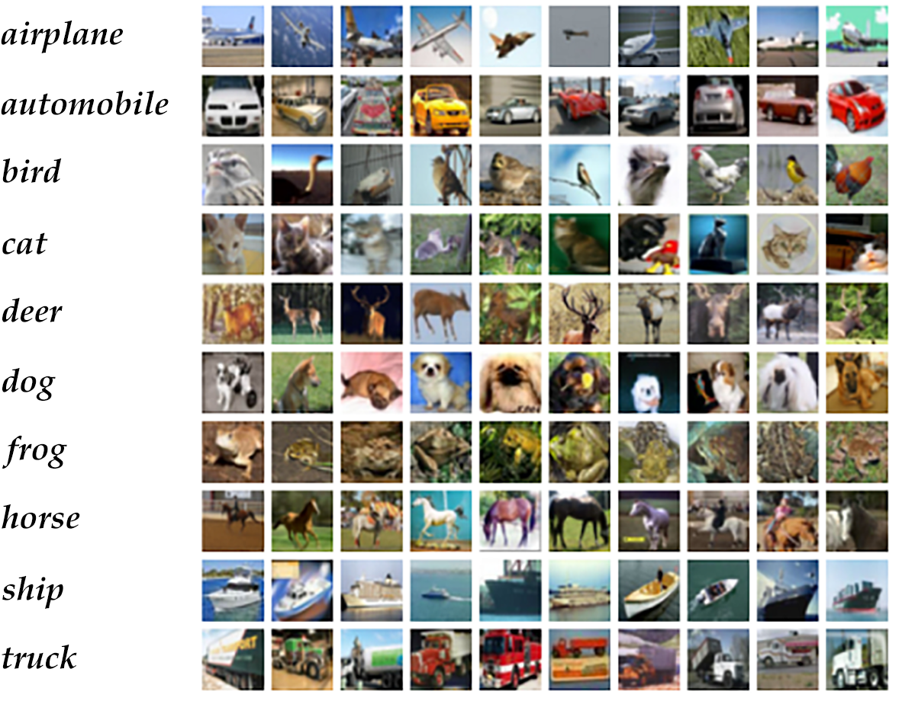

图像分类
=======

## 背景介绍 

图像相比文字能够提供更加生动、容易理解及更具艺术感的信息，是人们转递与交换信息的重要来源。在本教程中，我们专注于图像识别领域的一个重要问题，即图像分类。

图像分类是根据图像的语义信息将不同类别图像区分开来，是计算机视觉中重要的基本问题，也是图像检测、图像分割、物体跟踪、行为分析等其他高层视觉任务的基础。图像分类在很多领域有广泛应用，包括安防领域的人脸识别和智能视频分析等，交通领域的交通场景识别，互联网领域基于内容的图像检索和相册自动归类，医学领域的图像识别等。


一般来说，图像分类通过手工特征或特征学习方法对整个图像进行全部描述，然后使用分类器判别物体类别，因此如何提取图像的特征至关重要。在深度学习算法之前使用较多的是基于词包模型的物体分类方法，词包模型的基本框架包括底层特征学习、特征编码、空间约束、分类器设计、模型融合等几个阶段。

而基于深度学习的图像分类方法，其基本思想是通过有监督或无监督的方式学习层次化的特征描述，来对物体进行从底层到高层的描述。深度学习模型中的卷积神经网络(Convolution Neural Network, CNN)近年来在图像领域取得了惊人的成绩，CNN直接利用图像像素信息作为输入，最大程度上保留了输入图像的所有信息，通过卷积操作进行特征的提取和高层抽象，模型输出直接是图像识别的结果。这种基于"输入-输出"直接端到端学习方法取了非常好的效果，得到了广泛的应用。

本教程主要介绍图像分类的深度学习模型，以及如何使用PaddlePaddle训练CNN模型。

## 效果展示

图像分类包括通用图像分类、细粒度图像分类等。下图展示了通用图像分类效果，即模型可以正确识别图像上的主要物体。

<p align="center">
<br/>
图1. 通用图像分类展示
</p>


下图展示了细粒度图像分类-花卉识别的效果，要求模型可以正确识别花的类别。


<p align="center">
<br/>
图2. 细粒度图像分类展示
</p>


一个好的模型即要对不同类别识别正确，同时也应该能够对不同视角、光照、背景、变形或部分遮挡的图像正确识别(这里我们统一称作图像扰动)，下图展示了一些图像的扰动，较好的模型会像聪明的人类一样能够正确识别。

<p align="center">
<br/>
图3. 扰动图片展示
</p>

## 模型概览

图像识别领域大量的研究成果都是建立在[PASCAL VOC](http://host.robots.ox.ac.uk/pascal/VOC/)、[ImageNet](http://image-net.org/)等公开的数据集上，这些数据集通常作为图像识别的基准测试。PASCAL VOC是2005建立的一个视觉挑战赛，ImageNet是2010年建立的大规模视觉识别竞赛(ILSVRC)的数据集，我们围绕这两个数据集一些论文介绍图像分类的模型。

在2012年之前的传统图像分类模型中，底层特征提取是第一步，通常从图像中按照固定步长、尺度提取大量局部特征描述，通常采用的局部特征包括SIFT(Scale-Invariant Feature Transform, 尺度不变特征转换) \[[1](#参考文献)\]、HOG(Histogram of Oriented Gradient, 方向梯度直方图) \[[2](#参考文献)\]、LBP(Local Bianray Pattern, 局部二值模式) \[[3](#参考文献)\] 等，传统物体分类算法一般都采用多种特征描述子，防止丢失过多的有用信息。底层特征中包含了大量冗余与噪声，为了提高特征表达的鲁棒性，需要使用一种特征变换算法对底层特征进行编码，称作特征编码。特征编码算法包括向量量化编码 \[[4](#参考文献)\]、稀疏编码 \[[5](#参考文献)\]、局部线性约束编码 \[[6](#参考文献)\]、Fisher向量编码 \[[7](#参考文献)\] 等。特征编码之后一般会经过空间特征约束，也称作特征汇聚。特征汇聚是对每一维特征取最大值或者平均值，可以获得一定特征不变形的特征表达。一种常用的特征聚会方法即金字塔特征匹配提出将图像均匀分块，再分块内做特征汇聚。当这些步骤完整之后，一张图像可以用一个固定维度的向量进行描述，接下来就是经过分类器对图像进行分类，通常使用的分类器包括SVM(Support Vector Machine, 支持向量机)、随机森林等，而使用核方法的SVM是最为广泛的分类器，在传统图像分类任务上性能很好。例如ILSVRC 2010年挑战者采用SIFT和LBP特征，两个非线性编码器以及SVM分类器获得图像分类的冠军 \[[8](#参考文献)\]。

Alex Krizhevsky在2012年ILSVRC提出的CNN模型 \[[9](#参考文献)\] 取得了历史性的突破，效果大幅度超越传统方法，获得了ILSVRC 2012冠军，该模型被称作AlexNet，这也是首次将深度学习用于大规模图像分类中，并使用GPU加速模型训练。从此，涌现了一系列CNN模型，不断的在ImageNet上刷新成绩，如图4展示。随着模型变得越来越深以及精妙的结构设计，Top-5的错误率也越来越低，目前降到了3.5%附近，而在同样的ImageNet数据集上，人眼的辨识错误率大概在5.1%，也就是目前的深度学习模型的识别能力已经超过了人眼。

<p align="center">
<br/>
图4. ILSVRC图像分类Top-5错误率
</p>

一个典型的神经网络如下图所示，我们首先了解CNN网络结构的一些基本组件。AlexNet包含了这些基本的组件，也为后来的网络奠定了基础。

<p align="center">
<br/>
图5. CNN网络示例
</p> 

- 卷积层: 通过卷积操作提取底层到高层的特征，发掘出了图片局部关联性质和空间不变性质。
- 池化层: 是一种降采样操作，通过取卷积得到特征图中局部区块的最大值(Max-Pooling)或平均值(Avg-Pooling)来达到降采样的目的，并在做这个过程中获得一定的不变性。
- 全连接层: 输入层到隐藏层的神经元是全部连接的。
- 非线性变化: 卷积层、全连层之后一般都会接非线性变化层，例如Sigmoid、Tanh、ReLu等来增强网络的表达能力，在CNN里最常用的为ReLu激活函数。
- Droupout \[[10](#参考文献)\] : 在模型训练阶段随机让一些隐层节点权重不工作，提高网络的泛化能力
，一定程度上防止过拟合。

传统CNN包含卷积层、全连接层等组件，采用softmax多类别分类器和多类交叉熵损失函数。另一个非常值得一提是2015年提出的Batch Normalization(BN)算法 \[[14](#参考文献)\]，作者指出在训练过程中由于每层参数不断更新，会导致下一次输入分布发生变化，这样导致训练过程需要精心设计超参数。而BN算法是每个batch对网络中的每一层的特征做归一化，使得每层分布相对稳定，起到一定的正则作用，同时也弱化了超参数的设计，经过实验证明，BN加速了训练过程。BN在后来较深的模型中被广泛使用。

接下来我们主要介绍VGG，GooleNet和ResNet网络结构。

### VGG

牛津大学VGG(Visual Geometry Group)组在2014年ILSVRC提出的模型被称作VGG模型 \[[11](#参考文献)\] 。该模型相比以往模型进一步加宽和加深了网络结构，它的核心是五组卷积操作，每两组之间做Max-Pooling空间降维。同一组内采用多次连续的3X3卷积，卷积核的数目由较浅组的64增多到最深组的512，同一组内的卷积核数目是一样的。卷积之后接两层全连接层，之后是分类层。由于每组内卷积层的不同，有11、13、16、19层这几种模型，下图展示一个16层的网络结构。VGG模型的计算量较大，参数较多。

<p align="center">
<br/>
图6. 基于ImageNet的VGG16模型
</p>

### GoogleNet

GoogleNet \[[12](#参考文献)\] 在2014年ILSVRC的获得了冠军，在介绍该模型之前我们先来了解NIN(Network in Network)模型 \[[13](#参考文献)\]，因为GoogleNet模型借鉴了NIN的一些思想。

NIN模型中引入了多层感知卷积网络(Multi-Layer Perceptron Convolution, MLPconv)代替一层线性卷积网络。所谓的MLPconv是一个微小的多层卷积网络，即在线性卷积后面增加1x1的卷积，1x1的卷积等价于全连接层，这样利用MLPconv提取高度非线性特征。另外，传统的CNN最后几层一般都是全连接层，参数较多，NIN中采用全局均值池化(Avg-Pooling)替代全连接层，为了使得最后一个卷积层获得的每一个特征图能够对应于一个输出类别。

GoogleNet模型是由多组Inception模块堆积组成，Inception模块如下图8所示，高层输出是4组不同卷积核大小的特征连接起来，3个黄色1x1卷积是降维的作用，所谓的降维是减少了通道数。引入1x1卷积的原因是如果去掉这几层，会发现Max-Pooling不会改变特征通道数的大小，这样3个蓝色卷积和Max-Pooling特征连接后会导致特征的通道数较大，经过几层这样的模块堆积会导致通常数越来越大，参数和计算量都会增大。因此引入1x1卷积进行降维，同时在NIN模型中提到1x1卷积也可以修正线性特征。另外，GoogleNet在网络最后也没有采用传统的多层全连接层，而是像NIN网络一样采用了Avg-Pooling，与NIN不同的是，Avg-Pooling后面接了一层到类别数映射的全连接层。除了Inception模块和Avg-Pooling外，由于网络中间层特征也很有判别性，所以在中间层添加了两个辅助分类器，后向传播中增强梯度并且增强正则化。 GoogleNet总体结构是开始由3层普通的卷积组成；接下来由三组子网络组成，第一组子网络包含2个Inception模块，第二组包含5个Inception模块，第三组包含2个Inception模块；然后接Avg-Pooling、全连接层，总共22层网络。

<p align="center">
<br/>
图8. 基于ImageNet的VGG16模型
</p>

上面介绍的是GoogleNet第一版模型(称作GoogleNet-v1)，GoogleNet-v2 \[[14](#参考文献)\] 引入BN层。GoogleNet-v3 \[[16](#参考文献)\] 对一些卷积层做了分解，进一步加深网络非线性能力和加深网络，GoogleNet-v4 \[[17](#参考文献)\] 引入下面要讲的ResNet设计思路，每一版的改进准确度都有所提升，这里不再详细介绍v2-v4结构。


### ResNet

ResNet \[[15](#参考文献)\] 是2015年ImageNet分类定位、检测比赛的冠军。针对训练卷积神经网络时加深网络导致准确度下降的问题，提出了采用残差学习。在已有设计思路(BN, 小卷积核，全卷积网络)的基础上，引入了残差模块。每个残差模块包含两条路径，其中一条路径是输入特征的直连通路，另一条路径对该特征做两到三次卷积操作得到该特征的残差，最后再将两条路径上的特征相加。残差模块如图 9 所示，左边是基本模块连接方式，右边是瓶颈模块连接方式。图 10 展示了50-152层网络连接示意图。ResNet成功的训练了上百乃至近千层的卷积神经网络，训练时收敛快，速度也较VGG有所提升。

<p align="center">
<br/>
图9. 残差模块
</p>

<p align="center">
<br/>
图10. 基于ImageNet的ResNet模型
</p>


## 数据准备

### 数据介绍与下载

在本教程中，我们使用[CIFAR10](<https://www.cs.toronto.edu/~kriz/cifar.html>)数据集训练一个卷积神经网络。CIFAR10数据集包含60,000张32x32的彩色图片，10个类别，每个类包含6,000张。其中50,000张图片作为训练集，10000张作为测试集。下图从每个类别中随机抽取了10张图片，展示了所有的类别。

<p align="center">
<br/>
图11. CIFAR10数据集
</p>


执行下面命令下载数据，同时，会基于训练集计算图像均值，在训练阶段，输入数据会基于该均值做预处理，再传输给系统。

```bash
./data/get_data.sh
```

### 数据提供给PaddlePaddle

我们使用Python接口传递数据给系统，下面 `dataprovider.py` 针对CIFAR10数据给出了完整示例。

`initializer` 函数进行dataprovider的初始化，这里加载图像的均值，定义了输入image和label两个字段的类型。

`process` 函数将数据逐条传输给系统，在图像分类做可以完整数据扰动操作，再传输给PaddlePaddle。这里将原始图片减去均值后传输给系统。


```python
import numpy as np
import cPickle
from paddle.trainer.PyDataProvider2 import *

def initializer(settings, mean_path, is_train, **kwargs):
    settings.is_train = is_train
    settings.input_size = 3 * 32 * 32
    settings.mean = np.load(mean_path)['mean']
    settings.input_types = {
        'image': dense_vector(settings.input_size),
        'label': integer_value(10)
    }


@provider(init_hook=initializer, cache=CacheType.CACHE_PASS_IN_MEM)
def process(settings, file_list):
    with open(file_list, 'r') as fdata:
        for fname in fdata:
            fo = open(fname.strip(), 'rb')
            batch = cPickle.load(fo)
            fo.close()
            images = batch['data']
            labels = batch['labels']
            for im, lab in zip(images, labels):
                im = im - settings.mean
                yield {
                    'image': im.astype('float32'),
                    'label': int(lab)
                }
```

## 模型配置说明

### 数据定义

在模型配置中，定义通过 `define_py_data_sources2` 从 dataprovider 中读入数据， 其中 args 指定均值文件的路径。如果改配置文件用于预测，则不需要数据定义部分。

```python
from paddle.trainer_config_helpers import *

is_predict = get_config_arg("is_predict", bool, False)
if not is_predict:
    define_py_data_sources2(
        train_list='data/train.list',
        test_list='data/test.list',
        module='dataprovider',
        obj='process',
        args={'mean_path': 'data/mean.meta'})
```

### 算法配置

在模型配置中，通过 `seetings` 设置训练使用的优化算法，这里指定batch size 、初始学习率、momentum以及L2正则。

```python
settings(
    batch_size=128,
    learning_rate=0.1 / 128.0,
    learning_rate_decay_a=0.1,
    learning_rate_decay_b=50000 * 100,
    learning_rate_schedule='discexp',
    learning_method=MomentumOptimizer(0.9),
    regularization=L2Regularization(0.0005 * 128),)
```

### 模型结构

在模型概览部分已经介绍了VGG和ResNet模型，本教程中我们提供了这两个模型的网络配置。因为CIFAR10图片大小和数量相比ImageNet数据小很多，因此这里的模型针对CIFAR10数据做了一定的适配。

#### VGG
首先介绍VGG模型结构，在CIFAR10数据集上，卷积部分引入了BN和Dropout操作。

1. 定义数据输入及其维度

网络输入定义 `data_layer` (数据层)，在图像分类中即为图像像素信息，CIFRAR10是RGB 3通道32x32大小的彩色图，因此输入数据大小为3072(3x32x32)，类别大小为10。

```python

datadim = 3 * 32 * 32
classdim = 10
data = data_layer(name='image', size=datadim)
```

2. 定义VGG网络核心模块

```python
net = vgg_bn_drop(data)
```
VGG核心模块的输入是数据层，`vgg_bn_drop` 定义了16层VGG结构，每层卷积后面引入BN层和Droupout层，详细的定义如下：

```python
def vgg_bn_drop(input, num_channels):
    def conv_block(ipt, num_filter, groups, dropouts, num_channels_=None):
        return img_conv_group(
            input=ipt,
            num_channels=num_channels_,
            pool_size=2,
            pool_stride=2,
            conv_num_filter=[num_filter] * groups,
            conv_filter_size=3,
            conv_act=ReluActivation(),
            conv_with_batchnorm=True,
            conv_batchnorm_drop_rate=dropouts,
            pool_type=MaxPooling())

    tmp = conv_block(input, 64, 2, [0.3, 0], num_channels)
    tmp = conv_block(tmp, 128, 2, [0.4, 0])
    tmp = conv_block(tmp, 256, 3, [0.4, 0.4, 0])
    tmp = conv_block(tmp, 512, 3, [0.4, 0.4, 0])
    tmp = conv_block(tmp, 512, 3, [0.4, 0.4, 0])

    tmp = dropout_layer(input=tmp, dropout_rate=0.5)
    tmp = fc_layer(
        input=tmp,
        size=512,
        act=LinearActivation())
    tmp = batch_norm_layer(input=tmp,
        act=ReluActivation(),
        layer_attr=ExtraAttr(drop_rate=0.5))
    tmp = fc_layer(
        input=tmp,
        size=512,
        act=LinearActivation())
    return tmp

```

2.1. 首先定义了一组卷积网络，即conv_block。卷积核为3x3，Pooling窗口为2x2，窗口滑动大小为2，groups 决定每组VGG模块是几次连续的卷积操作，dropouts 指定Droupout操作的概率。 所使用的`img_conv_group`是在模块`paddle.trainer_config_helpers`中预定义的模块，由若干组 `Conv->BN->Relu->Dropout` 和 一组 `Pooling` 组成，

2.2. 五组卷积操作，即 5个conv_block。 第一、二组采用两次连续的卷积操作。第三、四、五组采用三次连续的卷积操作。每组最后一个卷积后面Dropout概率为0，即不使用Dropout操作。

2.3. 最后接两层512维的全连接。

3. 定义分类器

通过上面VGG网络提取高层特征，然后经过全连接层映射到类别维度大小的向量，再通过Softmax归一化得到每个类别的概率，也可称作分类器。

```python
out = fc_layer(input=net, size=class_num, act=SoftmaxActivation())
```

4. 定义损失函数和网络输出

在有监督训练中需要输入图像对应的类别信息，同样，通过`data_layer`来定义。训练中采用多类交叉熵作为损失函数并作为网络的输出，预测阶段定义网络的输出为分类器得到的概率信息。

```python
if not is_predict:
    lbl = data_layer(name="label", size=class_num)
    cost = classification_cost(input=out, label=lbl)
    outputs(cost)
else:
    outputs(out)
```

### ResNet

ResNet模型的第1、3、4步和VGG模型相同，这里不在介绍。主要介绍第2步即CIFAR10数据集上ResNet核心模块。

```python
net = resnet_cifar10(data, depth=56)
```

resnet_cifar10的底层输入连接一层 `conv_bn_layer`，即卷积层、BN层、ReLu激活函数。 然后连接3组参数模块即下面配置3组 `layer_warp` ，每组采用图 9 左边残差模块组成，即由2层3x3卷积，各自连接BN层，然后再接ReLu激活函数，每组由若干残差模块堆积而成。最后对网络做Avg-Pooling并返回该层。 返回的网络在第3步接一层全连接层，因此，除过第一层卷积层和最后一层全连接层这2层外，要求3组 `layer_warp` 总的含参层数能够6 整除，即 `resnet_cifar10` 的 depth 要满足 $(depth - 2）% 6 == 0$ 。

```python
def conv_bn_layer(input,
                  ch_out,
                  filter_size,
                  stride,
                  padding,
                  active_type=ReluActivation(),
                  ch_in=None):
    tmp = img_conv_layer(
        input=input,
        filter_size=filter_size,
        num_channels=ch_in,
        num_filters=ch_out,
        stride=stride,
        padding=padding,
        act=LinearActivation(),
        bias_attr=False)
    return batch_norm_layer(input=tmp, act=active_type)


def shortcut(ipt, n_in, n_out, stride):
    if n_in != n_out:
        return conv_bn_layer(ipt, n_out, 1, stride, 0, LinearActivation())
    else:
        return ipt

def basicblock(ipt, ch_out, stride):
    ch_in = ipt.num_filters
    tmp = conv_bn_layer(ipt, ch_out, 3, stride, 1)
    tmp = conv_bn_layer(tmp, ch_out, 3, 1, 1, LinearActivation())
    short = shortcut(ipt, ch_in, ch_out, stride)
    return addto_layer(input=[ipt, short], act=ReluActivation())

def bottleneck(ipt, ch_out, stride):
    ch_in = ipt.num_filter
    tmp = conv_bn_layer(ipt, ch_out, 1, stride, 0)
    tmp = conv_bn_layer(tmp, ch_out, 3, 1, 1)
    tmp = conv_bn_layer(tmp, ch_out * 4, 1, 1, 0, LinearActivation())
    short = shortcut(ipt, ch_in, ch_out, stride)
    return addto_layer(input=[ipt, short], act=ReluActivation())

def layer_warp(block_func, ipt, features, count, stride):
    tmp = block_func(ipt, features, stride)
    for i in range(1, count):
        tmp = block_func(tmp, features, 1)
    return tmp

def resnet_cifar10(ipt, depth=56):
    assert((depth - 2) % 6 == 0, 'depth should be one of 20, 32, 44, 56, 110, 1202')
    n = (depth - 2) / 6
    nStages = {16, 64, 128}
    tmp = conv_bn_layer(ipt,
        ch_in=3,
        ch_out=16,
        filter_size=3,
        stride=1,
        padding=1)
    tmp = layer_warp(basicblock, tmp, 16, n, 1)
    tmp = layer_warp(basicblock, tmp, 32, n, 2)
    tmp = layer_warp(basicblock, tmp, 64, n, 2)
    tmp = img_pool_layer(input=tmp,
                         pool_size=8,
                         stride=1,
                         pool_type=AvgPooling())
    return tmp
```


## 模型训练

``` bash
sh train.sh
```

执行脚本 train.sh 进行模型训练， 其中指定配置文件、设备类型、线程个数、总共训练的轮数、模型存储路径等。

```bash
#cfg=models/resnet.py
cfg=models/vgg.py
output=output
log=train.log

paddle train \
    --config=$cfg \
    --use_gpu=true \
    --trainer_count=1 \
    --log_period=100 \
    --num_passes=300 \
    --save_dir=$output \
    2>&1 | tee $log
```

- `--config=$cfg` : 指定配置文件，默认是 `models/vgg.py`。
- `--use_gpu=true` : 指定使用GPU训练，若使用CPU，设置为false。
- `--trainer_count=1` : 指定线程个数或GPU个数。
- `--log_period=100` : 指定日志打印的batch间隔。
- `--save_dir=$output` : 指定模型存储路径。

一轮训练log示例如下所示，经过1个pass， 训练集上平均error为0.79958 ，测试集上平均error为0.7858 。

```text
TrainerInternal.cpp:165]  Batch=300 samples=38400 AvgCost=2.07708 CurrentCost=1.96158 Eval: classification_error_evaluator=0.81151  CurrentEval: classification_error_evaluator=0.789297
TrainerInternal.cpp:181]  Pass=0 Batch=391 samples=50000 AvgCost=2.03348 Eval: classification_error_evaluator=0.79958
Tester.cpp:115]  Test samples=10000 cost=1.99246 Eval: classification_error_evaluator=0.7858
```

下图是训练的分类错误率曲线图：

<p align="center">
<br/>
图12. CIFAR10数据集
</p>

## 模型应用

在训练完成后，模型会保存在路径 `output/pass-%05d` 下，例如第300个pass的模型会保存在路径 `output/pass-00299`。 脚本 `classify.py` 可以使用模型对图片进行预测或提取特征，注意该脚本默认使用模型配置为 `models/vgg.py`，


### 预测

可以按照下面方式预测图片的类别，默认使用GPU预测，如果使用CPU预测，在后面加参数 `-c`即可。

```bash
python classify.py --job=predict --model=output/pass-00299 --data=image/dog.png # -c
```

预测结果为：

```text
Label of image/dog.png is: 5
```

### 特征提取

可以按照下面方式对图片提取特征，和预测使用方式不同的是指定job类型为extract，并需要指定提取的层。`classify.py` 默认已第一层卷积特征为例提取特征，并给出了可视化图，如图10所示，VGG模型的第一层卷积有64个通道，图 13 展示的为每个通道的灰度图。

```bash
python classify.py --job=extract --model=output/pass-00299 --data=image/dog.png # -c
```

<p align="center">
<br/>
图13. CIFAR10数据集
</p>

## 总结

传统图像分类方法由多个阶段构成，框架较为复杂，而端到端的CNN模型结构可一步到位，而且大幅度提升了分类准确率。本文我们介绍VGG、GoogleNet、ResNet三个经典的模型，基于CIFAR10数据集，介绍了如何使用PaddlePaddle配置和训练CNN模型，尤其是VGG和ResNet模型。最后介绍如何使用PaddlePaddle的API接口对图片进行预测和特征提取。而对于其他数据集比如ImageNet，配置和训练流程是同样的。


## 参考文献

[1] D. G. Lowe, Distinctive image features from scale-invariant keypoints. IJCV, 60(2):91-110, 2004.

[2] N. Dalal, B. Triggs, Histograms of Oriented Gradients for Human Detection, Proc. IEEE Conf. Computer Vision and Pattern Recognition, 2005.

[3] Ahonen, T., Hadid, A., and Pietikinen, M. (2006). Face description with local binary patterns: Application to face recognition. PAMI, 28. 

[4] J. Sivic, A. Zisserman, "Video Google: A Text Retrieval Approach to Object Matching in Videos", Proc. Ninth Int'l Conf. Computer Vision, pp. 1470-1478, 2003.

[5] B. Olshausen, D. Field, "Sparse Coding with an Overcomplete Basis Set: A Strategy Employed by V1?", Vision Research, vol. 37, pp. 3311-3325, 1997.

[6] Wang, J., Yang, J., Yu, K., Lv, F., Huang, T., and Gong, Y. (2010). Locality-constrained Linear Coding for image classification. In CVPR.

[7] Perronnin, F., Sánchez, J., & Mensink, T. (2010). Improving the fisher kernel for large-scale image classification. In ECCV (4).

[8] Lin, Y., Lv, F., Cao, L., Zhu, S., Yang, M., Cour, T., Yu, K., and Huang, T. (2011). Large-scale image clas- sification: Fast feature extraction and SVM training. In CVPR.

[9] Krizhevsky, A., Sutskever, I., and Hinton, G. (2012). ImageNet classification with deep convolutional neu- ral networks. In NIPS.

[10] G.E. Hinton, N. Srivastava, A. Krizhevsky, I. Sutskever, and R.R. Salakhutdinov. Improving neural networks by preventing co-adaptation of feature detectors. arXiv preprint arXiv:1207.0580, 2012.

[11] K. Chatfield, K. Simonyan, A. Vedaldi, A. Zisserman. Return of the Devil in the Details: Delving Deep into Convolutional Nets. BMVC, 2014。

[12] Szegedy, C., Liu, W., Jia, Y., Sermanet, P., Reed, S., Anguelov, D., Erhan, D., Vanhoucke, V., Rabinovich, A.: Going deeper with convolutions. In: CVPR. (2015)

[13] Lin, M., Chen, Q., and Yan, S. Network in network. In Proc. ICLR, 2014.

[14] S. Ioffe and C. Szegedy. Batch normalization: Accelerating deep network training by reducing internal covariate shift. In ICML, 2015.

[15] K. He, X. Zhang, S. Ren, J. Sun. Deep Residual Learning for Image Recognition. CVPR 2016.

[16] Szegedy, C., Vanhoucke, V., Ioffe, S., Shlens, J., Wojna, Z.: Rethinking the incep-tion architecture for computer vision. In: CVPR. (2016).

[17] Szegedy, C., Ioffe, S., Vanhoucke, V.: Inception-v4, inception-resnet and the impact of residual connections on learning. arXiv:1602.07261 (2016).
