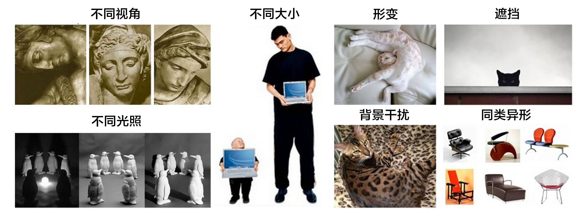

图像分类
=======

## 背景介绍 

图像相比文字能够提供更加生动、容易理解、有趣及更具艺术感的信息，是人们转递与交换信息的总要来源。在本教程中，我们专注于图像识别领域的重要问题之一 - 图像分类。

图像分类是根据图像的语义信息将不同类别图像区分开来，是计算机视觉中重要的基本问题，也是图像检测、图像分割、物体跟踪、行为分析等其他高层视觉任务的基础。

图像分类在很多领域有广泛应用，包括安防领域的人脸识别、智能视频分析等，交通领域的交通场景识别，互联网领域基于内容的图像检索、相册自动归类，医学领域图像识别等。


一般来说，图像分类通过手工特征或特征学习方法对整个图像进行全部描述，然后使用分类器判别物体类别，因此如何提取图像的特征至关重要。在深度学习算法之前使用较多的是基于词包模型的物体分类方法，词包模型的基本框架包括底层特征学习、特征编码、空间约束、分类器设计、模型融合等多个阶段。

而基于深度学习的图像分类方法，其基本思想是通过有监督或无监督的方式学习层次化的特征描述，来对物体进行从底层到高层的描述。深度学习模型之一 — 卷积神经网络(CNN)近年来在图像领域取得了惊人的成绩，CNN直接利用图像像素信息作为输入，最大程度上保留了输入图像的所有信息，通过卷积操作进行特征的提取和高层抽象，模型输出直接是图像识别的结果。这种基于"输入-输出"直接端到端学习方法取了非常好的效果，得到了广泛的应用。

本教程主要介绍图像分类模型，以及如何使用PaddlePaddle训练CNN模型。

## 效果展示

图像分类包括通用图像分类、细粒度图像分类等。下图展示了通用图像分类效果，即模型可以正确识别图像上的主要物体。

<p align="center">
<br/>
图1. 通用物体分类展示
</p>


下图展示了细粒度图像分类-花卉识别的效果，要求模型可以正确识别花的类别。


<p align="center">
<br/>
图2. 细粒度图像分类展示
</p>


一个好的模型即要对不同类别识别正确，同时也应该能够对不同视角、光照、背景、变形或部分遮挡的图像正确识别(这里我们统一称作图像扰动)，下图展示了一些图像的扰动，较好的模型会像聪明的人类一样能够正确识别。

<p align="center">
<br/>
图3. 扰动图片展示
</p>

## 模型概览

Alex Krizhevsky在2012年大规模视觉识别竞赛(ILSVRC 2012)的数据集(ImageNet)中提出的CNN模型 [1] 取得了历史性的突破，效果大幅度超越传统方法，获得了ILSVRC 2012冠军，该模型被称作AlexNet，这也是首次将深度学习用于大规模图像分类中，并使用GPU加速模型训练。从此，涌现了一系列CNN模型，不断的在ImageNet上刷新成绩。随着模型变得越来越深，Top-5的错误率也越来越低，目前降到了3.5%附近，而在同样的ImageNet数据集合上，人眼的辨识错误率大概在5.1%，也就是目前的深度学习模型的识别能力已经超过了人眼。


<p align="center">
<br/>
图4. ILSVRC图像分类Top-5错误率
</p>


在本教程中我们主要采用VGG和ResNet网络结构，在介绍这两个模型之前，我们首先简单介绍CNN网络结构。

### CNN

卷积神经网络是一种使用卷积层的前向神经网络，很适合构建用于理解图片内容的模型。一个典型的神经网络如下图所示：

<p align="center">
<br/>
图5. CNN网络示例
</p>

一个卷积神经网络包含如下层：

- 卷积层：通过卷积操作提取底层到高层的特征，并且保持了图像的空间信息。
- 池化层：是一种降采样操作，通过取卷积得到特征图中局部区块的最大值或平均值来达到降采样的目的，并在做这个过程中获得一定的不变性。
- 全连接层：使输入层到隐藏层的神经元是全部连接的。
- 非线性变化： sigmoid、tanh、relu等非线性变化增强网络表达能力。

卷积神经网络在图片分类上有着惊人的性能，这是因为它发掘出了图片的两类重要信息：局部关联性质和空间不变性质。通过交替使用卷积和池化处理， 卷积神经网络能够很好的表示这两类信息。


### VGG

[VGG](https://arxiv.org/abs/1405.3531) 模型的核心是五组卷积操作，每两组之间做max-pooling空间降维。同一组内采用多次连续的3X3卷积，卷积核的数目由较浅组的64增多到最深组的512，同一组内的卷积核数目是一样的。卷积之后接两层全连接层，之后是分类层。VGG模型的计算量较大，收敛较慢。 

<p align="center">
<br/>
图6. 基于ImageNet的VGG16网络示例
</p>

### ResNet

[ResNet](https://arxiv.org/abs/1512.03385) 是2015年ImageNet分类定位、检测比赛的冠军。针对训练卷积神经网络时加深网络导致准确度下降的问题，提出了采用残差学习。在已有设计思路(Batch Norm, 小卷积核，全卷积网络)的基础上，引入了残差模块。每个残差模块包含两条路径，其中一条路径是输入特征的直连通路，另一条路径对该特征做两到三次卷积操作得到该特征的残差，最后再将两条路径上的特征相加。残差模块如图7所示，左边是基本模块连接方式，右边是瓶颈模块连接方式。图8展示了论文[2]中50-152层网络连接示意图。ResNet成功的训练了上百乃至近千层的卷积神经网络，训练时收敛快，速度也较VGG有所提升。

<p align="center">
<br/>
图7. 残差模块
</p>

<p align="center">
<br/>
图8. 基于ImageNet的ResNet模型
</p>


## 数据准备

### 数据介绍与下载

在本教程中，我们使用[CIFAR10](<https://www.cs.toronto.edu/~kriz/cifar.html>)数据集训练一个卷积神经网络。CIFAR10数据集包含60,000张32x32的彩色图片，10个类别，每个类包含6,000张。其中50,000张图片作为训练集，10000张作为测试集。下图从每个类别中随机抽取了10张图片，展示了所有的类别。

<p align="center">
<br/>
图3. CIFAR10数据集
</p>


执行下面命令下载数据，同时，会基于训练集计算图像均值，在训练阶段，输入数据会基于该均值做预处理，再传输给系统。

```bash
./data/get_data.sh
```

### 数据提供器

我们使用Python接口传递数据给系统，下面 `dataprovider.py` 针对CIFAR10数据给出了完整示例。

`initializer` 函数进行dataprovider的初始化，这里加载图像的均值，定义了输入image和label两个字段的类型。

`process` 函数将数据逐条传输给系统，在图像分类做可以完整数据扰动操作，再传输给PaddlePaddle。这里将原始图片减去均值后传输给系统。


```python
def initializer(settings, mean_path, is_train, **kwargs):
    settings.is_train = is_train
    settings.input_size = 3 * 32 * 32
    settings.mean = np.load(mean_path)['mean']
    settings.input_types = {
        'image': dense_vector(settings.input_size),
        'label': integer_value(10)
    }


@provider(init_hook=initializer, cache=CacheType.CACHE_PASS_IN_MEM)
def process(settings, file_list):
    with open(file_list, 'r') as fdata:
        for fname in fdata:
            fo = open(fname.strip(), 'rb')
            batch = cPickle.load(fo)
            fo.close()
            images = batch['data']
            labels = batch['labels']
            for im, lab in zip(images, labels):
                im = im - settings.mean
                yield {
                    'image': im.astype('float32'),
                    'label': int(lab)
                }
```

## 模型配置说明

### 数据定义

在模型配置中，定义通过 `define_py_data_sources2` 从 dataprovider 中读入数据， 其中 args 指定均值文件的路径。

```python
define_py_data_sources2(
    train_list='data/train.list',
    test_list='data/test.list',
    module='dataprovider',
    obj='process',
    args={'mean_path': 'data/mean.meta'})
```

### 算法配置

在模型配置中，通过 `seetings` 设置训练使用的优化算法，这里指定batch size 、初始学习率、momentum以及L2正则。

```python
settings(
    batch_size=128,
    learning_rate=0.1 / 128.0,
    learning_method=MomentumOptimizer(0.9),
    regularization=L2Regularization(0.0005 * 128))
```

### 模型结构

在模型概览部分已经介绍了VGG和ResNet模型，本教程中我们提供了这两个模型的网络配置。因为CIFAR10图片大小和数量相比ImageNet数据小很多，因此这里的模型针对CIFAR10数据做了一定的适配。首先介绍VGG模型结构，在CIFAR10数据集上，卷积部分引入了Batch Norm和Dropout操作。

1. 首先预定义了一组卷积网络，即conv_block， 所使用的 `img_conv_group` 是我们预定义的一个模块，由若干组 `Conv->BatchNorm->Relu->Dropout` 和 一组 `Pooling` 组成，其中卷积操作采用3x3的卷积核。下面定义中根据 groups 决定是几次连续的卷积操作。

2. 五组卷积操作，即 5个conv_block。 第一、二组采用两次连续的卷积操作。第三、四、五组采用三次连续的卷积操作。

3. 由两层512维的全连接网络和一个分类层组成。


```python
def vgg_bn_drop(input, num_channels):
    def conv_block(ipt, num_filter, groups, dropouts, num_channels_=None):
        return img_conv_group(
            input=ipt,
            num_channels=num_channels_,
            pool_size=2,
            pool_stride=2,
            conv_num_filter=[num_filter] * groups,
            conv_filter_size=3,
            conv_act=ReluActivation(),
            conv_with_batchnorm=True,
            conv_batchnorm_drop_rate=dropouts,
            pool_type=MaxPooling())

    tmp = conv_block(input, 64, 2, [0.3, 0], num_channels)
    tmp = conv_block(tmp, 128, 2, [0.4, 0])
    tmp = conv_block(tmp, 256, 3, [0.4, 0.4, 0])
    tmp = conv_block(tmp, 512, 3, [0.4, 0.4, 0])
    tmp = conv_block(tmp, 512, 3, [0.4, 0.4, 0])

    tmp = dropout_layer(input=tmp, dropout_rate=0.5)
    tmp = fc_layer(
        input=tmp,
        size=512,
        act=LinearActivation())
    tmp = batch_norm_layer(input=tmp,
        act=ReluActivation(),
        layer_attr=ExtraAttr(drop_rate=0.5))
    tmp = fc_layer(
        input=tmp,
        size=512,
        act=LinearActivation())
    tmp = fc_layer(input=tmp, size=10, act=SoftmaxActivation())
    return tmp

```

## 模型训练

``` bash
sh train.sh
```

执行脚本 train.sh 进行模型训练， 其中指定配置文件、设备类型、线程个数、总共训练的轮数、模型存储路径等。

```bash
#cfg=models/resnet.py
cfg=models/vgg.py
output=./output
log=train.log

paddle train \
    --config=$cfg \
    --use_gpu=true \
    --trainer_count=1 \
    --log_period=100 \
    --num_passes=300 \
    --save_dir=$output \
    2>&1 | tee $log
```

- `--config=$cfg` : 指定配置文件，默认是 `models/vgg.py`。
- `--use_gpu=true` : 指定使用GPU训练，若使用CPU，设置为false。
- `--trainer_count=1` : 指定线程个数或GPU个数。
- `--log_period=100` : 指定日志打印的batch间隔。
- `--save_dir=$output` : 指定模型存储路径。

一轮训练log示例如下所示，经过1个pass， 训练集上平均error为0.79958 ，测试集上平均error为0.7858 。

```text
I1226 12:33:20.257822 25576 TrainerInternal.cpp:165]  Batch=300 samples=38400 AvgCost=2.07708 CurrentCost=1.96158 Eval: classification_error_evaluator=0.81151  CurrentEval: classification_error_evaluator=0.789297
.........I1226 12:33:37.720484 25576 TrainerInternal.cpp:181]  Pass=0 Batch=391 samples=50000 AvgCost=2.03348 Eval: classification_error_evaluator=0.79958
I1226 12:33:42.413450 25576 Tester.cpp:115]  Test samples=10000 cost=1.99246 Eval: classification_error_evaluator=0.7858
```


下图是训练的分类错误率曲线图：

<center></center>

## 模型应用

在训练完成后，模型及参数会被保存在路径`./output/pass-%05d`下。例如第300个pass的模型会被保存在`./output/pass-00299`。

要对一个图片的进行分类预测，我们可以使用`predict.sh`，该脚本将输出预测分类的标签：

```
sh predict.sh
```

predict.sh:
```
model=output/pass-00299/
image=data/cifar-out/test/airplane/seaplane_s_000978.png
use_gpu=1
python prediction.py $model $image $use_gpu
```


## 参考文献

[1]. K. Chatfield, K. Simonyan, A. Vedaldi, A. Zisserman. Return of the Devil in the Details: Delving Deep into Convolutional Nets. BMVC, 2014。

[2]. K. He, X. Zhang, S. Ren, J. Sun. Deep Residual Learning for Image Recognition. CVPR 2016.
