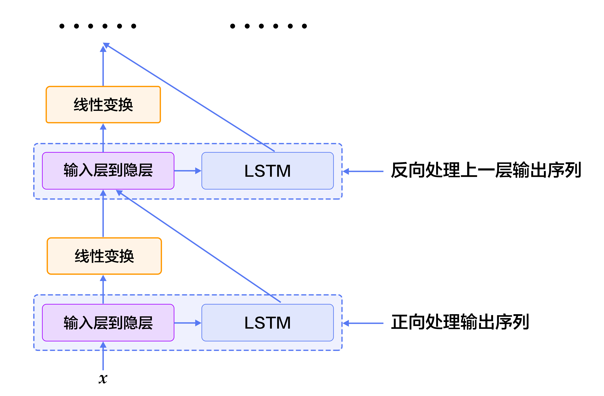

# Semantic Role Labeling

本教程源代码目录在[book/label_semantic_roles](https://github.com/PaddlePaddle/book/tree/develop/label_semantic_roles)， 初次使用请参考PaddlePaddle[安装教程](http://www.paddlepaddle.org/doc_cn/build_and_install/index.html)。

## Background

Natural Language Analysis contains three components: Lexical Analysis, Syntactic Analysis, and Semantic Analysis. Semantic Role Labelling (SRL) is one way for Shallow Semantic Analysis. A predicate of a sentence is seen as a property that a subject has or is characterized by, such as what it does, what it is or how it is, which mostly corresponds to the core of an event. The noun associated with predicate is called Arugment. Sementic roles express the abstract roles that arguments of a predicate can take in the event, such as Agent, Patient, Theme, Experiencer, Beneficiary, Instrument, Location, Goal and Source etc.

In the following example, “遇到” is Predicate (“Pred”)，“小明” is Agent，“小红” is Patient，“昨天” means when the event occurs (Time), and “公园” means where the event occurs (Location).

$$\mbox{[小明]}_{\mbox{Agent}}\mbox{[昨天]}_{\mbox{Time}}\mbox{[晚上]}_\mbox{Time}\mbox{在[公园]}_{\mbox{Location}}\mbox{[遇到]}_{\mbox{Predicate}}\mbox{了[小红]}_{\mbox{Patient}}\mbox{。}$$

Instead of in-depth analysis on semantic information, the goal of Semantic Role Labeling is to identify the relation of predicate and other constituents, e.g., predicate-argument structure, as specific semantic roles, which is an important intermediate step in a wide range of natural language understanding tasks (Information Extraction, Discourse Analysis, DeepQA etc). Predicates are always assumed to be given, the only thing is to identify arguments and their semantic roles.

Standard SRL system mostly build on top of Syntactic Analysis and contains 5 steps:

1. Construct a syntactic parse tree, as shown in Fig. 1
2. Identity candidate arguments of given predicate from constructed syntactic parse tree.
3. Prune most unlikely candidate arguments.
4. Identify argument, which is usually solved as a binary classification problem.
5. Multi-class semantic role labeling. Steps 2-3 usually introduce hand-designed features based on Syntactic Analysis (step 1).


<div  align="center">
<br>
Fig 1. Syntactic parse tree
</div>

核心关系-> HED
定中关系-> ATT
主谓关系-> SBV
状中结构-> ADV
介宾关系-> POB
右附加关系-> RAD
动宾关系-> VOB
标点-> WP


However, complete syntactic analysis requires to identify the relation among all constitutes and the performance of SRL is sensitive to the precision of syntactic analysis, which make SRL a very challenging task. In order to reduce the complexity and obtain some syntactic structure information, shallow syntactic analysis is proposed. Shallow Syntactic Analysis is also called partial parsing or chunking. Unlike complete syntactic analysis which requires constructing complete parsing tree, Shallow Syntactic Analysis only need to identify some idependent components with relatively simple structure, such as verb phrases (chunk). In order to avoid constructing syntactic tree with high accuracy, some work\[[1](#Reference)\] proposed semantic chunking based SRL methods, which convert SRL as a sequence tagging problem.  Sequence tagging tasks classify syntactic chunks using BIO representation. For syntactic chunks forming a chunk of type A, the first chunk receives the B-A tag (Begin), the remaining ones receive the tag I-A (Inside), and all chunks outside receive the tag O-A.

The BIO representation of above example is shown in Fig.1.

<div  align="center">
<br>
Fig 2. BIO represention
</div>

输入序列-> input sequence
语块-> chunk
标注序列-> label sequence
角色-> role

This example illustrates the simplicity of sequence tagging because (1) shallow syntactic analysis reduces precision requirement of syntactic analysis; (2) pruning candidate arguments is removed; 3) argument identification and tagging are finished at the same time. Such unified methods simplify the precedure, reduce the risk of accumulating errors and boost the performance further.

In this tutorial, our SRL system is built as an end-to-end system via neural network. We take only text sequences, without using any syntactic parsing results or complex hand-designed features. We give public dataset [CoNLL-2004 and CoNLL-2005 Shared Tasks](http://www.cs.upc.edu/~srlconll/) as an example to illustrate: given a sentence and it's predicates, identify the corresponding arguments and their semantic roles by sequence tagging method.

## Model

Recurrent Nerual Networks are important tools for sequence modeling and have been successfully used in some natural language processing tasks. Unlike Feed-forward neural netowrks, RNNs can model the dependency between elements of sequences. LSTMs as variants of RNNs aim to model long-term dependency in long sequences. We have introduced this in [understand_sentiment](https://github.com/PaddlePaddle/book/tree/develop/understand_sentiment). In this chapter, we continue to use LSTMs to solve SRL problems.

### Stacked Recurrent Neural Network

Deep Neural Networks allows to extract hierarchical represetations, higher layer can form more abstract/complex representations on top of lower layers. LSTMs when unfolded in time is deep, because a computational path between the input at time $k < t$ to the output at time $t$ crosses several nonlinear layers. However, the computation carried out at each time-step is only linear transformation, which makes LSTMs a shallow model. Deep LSTMs are typically constructed by stacking multiple LSTM layers on top of each other and taking the output from lower LSTM layer at time $t$ as the input of upper LSTM layer at time $t$. Deep, hierarchical nerual networks can be much efficient at representing some functions and modeling varying-length dependencies\[[2](#Reference)\].


However, deep LSTMs increases the number of nonlinear steps the gradient has to traverse when propagated back in depth. For example, 4 layer LSTMs can be trained properly, but the performance becomes worse as the number of layers up to 4-8. Conventional LSTMs prevent backpropagated errors from vanishing and exploding by introduce shortcut connections to skip the intermediate nonlinear layers. Therefore, deep LSTMs can consider shortcut connections in depth as well.


The operation of a single LSTM cell contain 3 parts: (1) input-to-hidden: map input $x$ to the input of forget gates, input gates, memory cells and output gates by linear transformation (i.e., matrix mapping); (2) hidden-to-hidden: calculate forget gates, input gates, output gates and update memory cell, this is the main part of LSTMs; (3)hidden-to-output: this part typically involves an activation operation on hidden states. Based on the above stacked LSTMs, we add a shortcut connection: take the input-to-hidden from previous layer as a new input and learn another linear transfermation.

Fig.3 illustrate the final stacked recurrent neural networks.

<p align="center">    
<br>
Fig 3. Stacked Recurrent Neural Networks
</p>

线性变换-> linear transformation
输入层到隐层-> input-to-hidden

### Bidirectional Recurrent Neural Network

 LSTMs can summarize the history of previous inputs seen up to now, but can not see the future. In most of natural language processing tasks, the entire sentences are ready to use. Therefore, sequencal learning might be much effecient if the future can be encoded as well like histories.

To address the above drawbacks, we can design bidirectional recurrent neural networks by making a minor modification. Higher LSTM layers process the sequence in reversed direction with previous lower LSTM layers, i.e., Deep LSTMs operate from left-to-right, right-to-left, left-to-right,..., in depth. Therefore, LSTM layers at time-step $t$ can see both histories and the future since the second layer. Fig. 4 illustrates the bidirectional recurrent neural networks.


<p align="center">    
<br>
Fig 4. Bidirectional LSTMs
</p>

线性变换-> linear transformation
输入层到隐层-> input-to-hidden
正向处理输出序列->process sequence in forward direction
反向处理上一层序列-> process sequence from previous layer in backward direction

Note that, this bidirectional RNNs is different with the one proposed by Bengio et al in machine translation tasks \[[3](#Reference), [4](#Reference)\]. We will introduce another bidirectional RNNs in the following tasks[machine translation](https://github.com/PaddlePaddle/book/blob/develop/machine_translation/README.md)

### Conditional Random Field

The basic pipeline of Neural Networks solving problems is 1) all lower layers aim to learn representations; 2) the top layer is designed for learning the final task. In SRL tasks, CRF is built on top of the network for the final tag sequence prediction. It takes the representations provided by the last LSTM layer as input.


CRF is a probabilistic graph model (undirected) with nodes denoting random variables and edges denoting dependencies between nodes. To be simplicity, CRFs learn conditional probability $P(Y|X)$, where $X = (x_1, x_2, ... , x_n)$ are sequences of input, $Y = (y_1, y_2, ... , y_n)$ are label sequences; Decoding is to search sequence $Y$ to maximize conditional probability $P(Y|X)$, i.e., $Y^* = \mbox{arg max}_{Y} P(Y | X)$。

Sequence tagging tasks only consider input and output as linear sequences without extra dependent assumptions on graph model. Thus, the graph model of sequence tagging tasks is simple chain or line, which results in a Linear Chain Conditional Random Field, shown in Fig.5.

<p align="center">    
<br>
Fig 5. Linear Chain Conditional Random Field used in SRL tasks
</p>

By the fundamental theorem of random fields \[[5](#Reference)\], the joint distribution over the label sequence $Y$ given $X$ has the form: 

$$p(Y | X) = \frac{1}{Z(X)} \text{exp}\left(\sum_{i=1}^{n}\left(\sum_{j}\lambda_{j}t_{j} (y_{i - 1}, y_{i}, X, i) + \sum_{k} \mu_k s_k (y_i, X, i)\right)\right)$$


where, $Z(X)$ is normalization constant, $t_j$ is feature function defined on edges, called transition feature, depending on $y_i$ and $y_{i-1}$ which represents transition probabilities from $y_{i-1}$ to $y_i$ given input sequence $X$. $s_k$ is feature function defined on nodes, called state feature, depending on $y_i$ and represents the probality of $y_i$ given input sequence $X$. $\lambda_j$ 和 $\mu_k$ are weights corresponding to $t_j$ and $s_k$. Actually, $t$ and $s$ can be wrtten in the same form, then take summation over all nodes $i$: $f_{k}(Y, X) = \sum_{i=1}^{n}f_k({y_{i - 1}, y_i, X, i})$, $f$ is defined as feature function. Thus, $P(Y|X)$ can be wrtten as:

$$p(Y|X, W) = \frac{1}{Z(X)}\text{exp}\sum_{k}\omega_{k}f_{k}(Y, X)$$

$\omega$ are weights of feature function which should be learned in CRF models. At training stage, given input sequences and label sequences $D = \left[(X_1,  Y_1), (X_2 , Y_2) , ... , (X_N, Y_N)\right]$, solve following objective function using MLE:


$$L(\lambda, D) = - \text{log}\left(\prod_{m=1}^{N}p(Y_m|X_m, W)\right) + C \frac{1}{2}\lVert W\rVert^{2}$$


This objective function can be solved via back-propagation in an end-to-end manner. At decoding stage, given input sequences $X$, search sequence $\bar{Y}$ to maximize conditional probability $\bar{P}(Y|X)$ via decoding methods (such as Viterbi, Beam Search).

### DB-LSTM SRL model

Given predicates and a sentence, SRL tasks aim to identify arguments of the given predicate and their semantic roles. If a sequence has n predicates, we will process this sequence n times. One model is as follows:

1. Construct inputs;
 - output 1: predicate, output 2: sentence
 - expand input 1 as a sequence with the same length with input 2 using one-hot representation;
2. Convert one-hot sequences from step 1 to real-vector sequences via lookup table;
3. Learn the representation of input sequences by taking real-vector sequences from step 2 as inputs;
4. Take representations from step 3 as inputs, label sequence as supervision signal, do sequence tagging tasks

We can try above method. Here, we propose some modifications by introducing two simple but effective features:

- predicate context (ctx-p): A single predicate word can not exactly describe the predicate information, especially when the same words appear more than one times in a sentence. With the expanded context, the ambiguity can be largely eliminated. Thus, we extract $n$ words before and after predicate to construct a window chunk.

- region mark ($m_r$): $m_r = 1$ to denote the argument position if it locates in the predicate context region, or $m_r = 0$ if not.

After modification, the model is as follows:

1. Construct inputs
 - input 1: sentence, input 2: predicate sequence, input 3: predicate context, extract $n$ words before and after predicate and get one-hot representation, input 4: region mark, annotate argument position if it locates in the predicate context region
 - expand input 2~3 as sequences with the same length with input 1
2. Convert input 1~4 to real-vector sequences via lookup table; input 1 and 3 share the same lookup table, input 2 and 4 have separate lookup tables
3. Take four real-vector sequences from step 2 as inputs of bidirectional LSTMs; Train LSTMs to update representations
4. Take representation from step 3 as input of CRF, label sequence as supervision signal, do sequence tagging tasks


<div  align="center">    
<br>
Fig 6. DB-LSTM for SRL tasks
</div>

论元-> argu
谓词-> pred
谓词上下文-> ctx-p
谓词上下文区域标记-> $m_r$
输入-> input
原句-> sentence
反向LSTM-> LSTM Reverse

## 数据准备
### 数据介绍与下载

在此教程中，我们选用[CoNLL 2005](http://www.cs.upc.edu/~srlconll/)SRL任务开放出的数据集作为示例。运行 `sh ./get_data.sh` 会自动从官方网站上下载原始数据。需要特别说明的是，CoNLL 2005 SRL任务的训练数集和开发集在比赛之后并非免费进行公开，目前，能够获取到的只有测试集，包括Wall Street Journal的23节和Brown语料集中的3节。在本教程中，我们以测试集中的WSJ数据为训练集来讲解模型。但是，由于测试集中样本的数量远远不够，如果希望训练一个可用的神经网络SRL系统，请考虑付费获取全量数据。

原始数据中同时包括了词性标注、命名实体识别、语法解析树等多种信息。本教程中，我们使用test.wsj文件夹中的数据进行训练和测试，并只会用到words文件夹（文本序列）和props文件夹（标注结果）下的数据。本教程使用的数据目录如下：

```text
conll05st-release/
└── test.wsj
    ├── props  # 标注结果
    └── words  # 输入文本序列
```

标注信息源自Penn TreeBank\[[7](#参考文献)\]和PropBank\[[8](#参考文献)\]的标注结果。PropBank标注结果的标签和我们在文章一开始示例中使用的标注结果标签不同，但原理是相同的，关于标注结果标签含义的说明，请参考论文\[[9](#参考文献)\]。

除数据之外，`get_data.sh`同时下载了以下资源：

| 文件名称 | 说明 |
|---|---|
| word_dict | 输入句子的词典，共计44068个词 |
| label_dict | 标记的词典，共计106个标记 |
| predicate_dict | 谓词的词典，共计3162个词 |
| emb | 一个训练好的词表，32维 |

我们在英文维基百科上训练语言模型得到了一份词向量用来初始化SRL模型。在SRL模型训练过程中，词向量不再被更新。关于语言模型和词向量可以参考[词向量](https://github.com/PaddlePaddle/book/blob/develop/word2vec/README.md) 这篇教程。我们训练语言模型的语料共有995,000,000个token，词典大小控制为4900,000词。CoNLL 2005训练语料中有5%的词不在这4900,000个词中，我们将它们全部看作未登录词，用`<unk>`表示。

### 数据预处理
脚本在下载数据之后，又调用了`extract_pair.py`和`extract_dict_feature.py`两个子脚本进行数据预处理，前者完成了下面的第1步，后者完成了下面的2~4步：

1. 将文本序列和标记序列其合并到一条记录中；
2. 一个句子如果含有$n$个谓词，这个句子会被处理$n$次，变成$n$条独立的训练样本，每个样本一个不同的谓词；
3. 抽取谓词上下文和构造谓词上下文区域标记；
4. 构造以BIO法表示的标记；

`data/feature`文件是处理好的模型输入，一行是一条训练样本，以"\t"分隔，共9列，分别是：句子序列、谓词、谓词上下文（占 5 列）、谓词上下区域标志、标注序列。下表是一条训练样本的示例。

| 句子序列 | 谓词 | 谓词上下文（窗口 = 5） | 谓词上下文区域标记 | 标注序列 | 
|---|---|---|---|---|
| A | set | n't been set . × | 0 | B-A1 |
| record | set | n't been set . × | 0 | I-A1 |
| date | set | n't been set . × | 0 | I-A1 |
| has | set | n't been set . × | 0 | O |
| n't | set | n't been set . × | 1 | B-AM-NEG |
| been | set | n't been set . × | 1 | O |
| set | set | n't been set . × | 1 | B-V |
| . | set | n't been set . × | 1 | O |

### 提供数据给 PaddlePaddle
1. 使用hook函数进行PaddlePaddle输入字段的格式定义。

	```python
	def hook(settings, word_dict, label_dict, predicate_dict, **kwargs):
	    settings.word_dict = word_dict   # 获取句子序列的字典
	    settings.label_dict = label_dict  # 获取标记序列的字典
	    settings.predicate_dict = predicate_dict  # 获取谓词的字典
	
	    #  所有输入特征都是使用one-hot表示序列，在PaddlePaddle中是interger_value_sequence类型
	    #  input_types是一个字典，字典中每个元素对应着配置中的一个data_layer，key恰好就是data_layer的名字
	    
	    settings.input_types = {
		        'word_data': integer_value_sequence(len(word_dict)),    # 句子序列
		        'ctx_n2_data': integer_value_sequence(len(word_dict)),  # 谓词上下文中的第1个词
		        'ctx_n1_data': integer_value_sequence(len(word_dict)),  # 谓词上下文中的第2个词
		        'ctx_0_data': integer_value_sequence(len(word_dict)),   # 谓词上下文中的第3个词
		        'ctx_p1_data': integer_value_sequence(len(word_dict)),  # 谓词上下文中的第4个词
		        'ctx_p2_data': integer_value_sequence(len(word_dict)),  # 谓词上下文中的第5个词
		        'verb_data': integer_value_sequence(len(predicate_dict)),  # 谓词
		        'mark_data': integer_value_sequence(2),  # 谓词上下文区域标记
		        'target': integer_value_sequence(len(label_dict))  # 标记序列
        }
	```

2. 使用process将数据逐一提供给PaddlePaddle，只需要考虑如何从原始数据文件中返回一条训练样本。

	```python
	def process(settings, file_name):
	    with open(file_name, 'r') as fdata:
	        for line in fdata:
	            sentence, predicate, ctx_n2, ctx_n1, ctx_0, ctx_p1, ctx_p2,  mark, label = \
	                line.strip().split('\t')
	
	            # 句子文本
	            words = sentence.split()
	            sen_len = len(words)
	            word_slot = [settings.word_dict.get(w, UNK_IDX) for w in words]
	
	            # 一个谓词，这里将谓词扩展成一个和句子一样长的序列
	            predicate_slot = [settings.predicate_dict.get(predicate)] * sen_len
	            
	            # 在教程中，我们使用一个窗口为 5 的谓词上下文窗口：谓词和这个谓词前后隔两个词
	            # 这里会将窗口中的每一个词，扩展成和输入句子一样长的序列
	            ctx_n2_slot = [settings.word_dict.get(ctx_n2, UNK_IDX)] * sen_len
	            ctx_n1_slot = [settings.word_dict.get(ctx_n1, UNK_IDX)] * sen_len
	            ctx_0_slot = [settings.word_dict.get(ctx_0, UNK_IDX)] * sen_len
	            ctx_p1_slot = [settings.word_dict.get(ctx_p1, UNK_IDX)] * sen_len
	            ctx_p2_slot = [settings.word_dict.get(ctx_p2, UNK_IDX)] * sen_len
	
	            # 谓词上下文区域标记，是一个二值特征
	            marks = mark.split()
	            mark_slot = [int(w) for w in marks]
	
	            label_list = label.split()
	            label_slot = [settings.label_dict.get(w) for w in label_list]
	            yield {
	                'word_data': word_slot,
	                'ctx_n2_data': ctx_n2_slot,
	                'ctx_n1_data': ctx_n1_slot,
	                'ctx_0_data': ctx_0_slot,
	                'ctx_p1_data': ctx_p1_slot,
	                'ctx_p2_data': ctx_p2_slot,
	                'verb_data': predicate_slot,
	                'mark_data': mark_slot,
	                'target': label_slot
	            }	
	```

## 模型配置说明

### 数据定义

首先通过 define_py_data_sources2 从dataprovider中读入数据。配置文件中会读取三个字典：输入文本序列的字典、标记的字典、谓词的字典，并传给data provider，data provider会利用这三个字典，将相应的文本输入转换成one-hot序列。

```python
define_py_data_sources2(
        train_list=train_list_file,
        test_list=test_list_file,
        module='dataprovider',
        obj='process',
        args={
            'word_dict': word_dict,   # 输入文本序列的字典
            'label_dict': label_dict, # 标记的字典
            'predicate_dict': predicate_dict  # 谓词的词典
        }
)
```
### 算法配置

在这里，我们指定了模型的训练参数，选择了$L_2$正则、学习率和batch size，并使用带Momentum的随机梯度下降法作为优化算法。

```python
settings(
    batch_size=150,
    learning_method=MomentumOptimizer(momentum=0),
    learning_rate=2e-2,
    regularization=L2Regularization(8e-4),
    model_average=ModelAverage(average_window=0.5, max_average_window=10000)
)
```

### 模型结构

1. 定义输入数据维度及模型超参数。

	```python
	mark_dict_len = 2    # 谓上下文区域标志的维度，是一个0-1 2值特征，因此维度为2
	word_dim = 32        # 词向量维度
	mark_dim = 5         # 谓词上下文区域通过词表被映射为一个实向量，这个是相邻的维度
	hidden_dim = 512     # LSTM隐层向量的维度 ： 512 / 4
	depth = 8            # 栈式LSTM的深度
	
	word = data_layer(name='word_data', size=word_dict_len)
   predicate = data_layer(name='verb_data', size=pred_len)

	ctx_n2 = data_layer(name='ctx_n2_data', size=word_dict_len)
	ctx_n1 = data_layer(name='ctx_n1_data', size=word_dict_len)
	ctx_0 = data_layer(name='ctx_0_data', size=word_dict_len)
	ctx_p1 = data_layer(name='ctx_p1_data', size=word_dict_len)
	ctx_p2 = data_layer(name='ctx_p2_data', size=word_dict_len)
	mark = data_layer(name='mark_data', size=mark_dict_len)
	
	if not is_predict:
	    target = data_layer(name='target', size=label_dict_len)    # 标记序列只在训练和测试流程中定义
	```
这里需要特别说明的是hidden_dim = 512指定了LSTM隐层向量的维度为128维，关于这一点请参考PaddlePaddle官方文档中[lstmemory](http://www.paddlepaddle.org/doc/ui/api/trainer_config_helpers/layers.html#lstmemory)的说明。

2. 将句子序列、谓词、谓词上下文、谓词上下文区域标记通过词表，转换为实向量表示的词向量序列。

	```python
	
	# 在本教程中，我们加载了预训练的词向量，这里设置了：is_static=True
	# is_static 为 True 时保证了在训练 SRL 模型过程中，词表不再更新
	emb_para = ParameterAttribute(name='emb', initial_std=0., is_static=True)
		
	word_input = [word, ctx_n2, ctx_n1, ctx_0, ctx_p1, ctx_p2]
	emb_layers = [
		    embedding_layer(
		        size=word_dim, input=x, param_attr=emb_para) for x in word_input
	]
	emb_layers.append(predicate_embedding)
	mark_embedding = embedding_layer(
		    name='word_ctx-in_embedding', size=mark_dim, input=mark, param_attr=std_0)
   emb_layers.append(mark_embedding)
	```

3. 8个LSTM单元以“正向/反向”的顺序对所有输入序列进行学习。

	```python
	#  std_0 指定的参数以均值为0的高斯分布初始化，用在LSTM的bias初始化中  
	std_0 = ParameterAttribute(initial_std=0.)
	
	hidden_0 = mixed_layer(
	    name='hidden0',
	    size=hidden_dim,
	    bias_attr=std_default,
	    input=[
	        full_matrix_projection(
	            input=emb, param_attr=std_default) for emb in emb_layers
	    ])
	lstm_0 = lstmemory(
	    name='lstm0',
	    input=hidden_0,
	    act=ReluActivation(),
	    gate_act=SigmoidActivation(),
	    state_act=SigmoidActivation(),
	    bias_attr=std_0,
	    param_attr=lstm_para_attr)
		input_tmp = [hidden_0, lstm_0]

	for i in range(1, depth):
	    mix_hidden = mixed_layer(
	        name='hidden' + str(i),
	        size=hidden_dim,
	        bias_attr=std_default,
	        input=[
	            full_matrix_projection(
	                input=input_tmp[0], param_attr=hidden_para_attr),
	            full_matrix_projection(
	                input=input_tmp[1], param_attr=lstm_para_attr)
	        ])
	    lstm = lstmemory(
	        name='lstm' + str(i),
	        input=mix_hidden,
	        act=ReluActivation(),
	        gate_act=SigmoidActivation(),
	        state_act=SigmoidActivation(),
	        reverse=((i % 2) == 1),
	        bias_attr=std_0,
	        param_attr=lstm_para_attr)
	
	    input_tmp = [mix_hidden, lstm]
	```

4. 取最后一个栈式LSTM的输出和这个LSTM单元的输入到隐层映射，经过一个全连接层映射到标记字典的维度，得到最终的特征向量表示。

	```python
	feature_out = mixed_layer(
	    name='output',
	    size=label_dict_len,
	    bias_attr=std_default,
	    input=[
	        full_matrix_projection(
	            input=input_tmp[0], param_attr=hidden_para_attr),
	        full_matrix_projection(
	            input=input_tmp[1], param_attr=lstm_para_attr)
	    ], ) 
	```

5.  CRF层在网络的末端，完成序列标注。

	```python
	crf_l = crf_layer(
	        name='crf',
	        size=label_dict_len,
	        input=feature_out,
	        label=target,
	        param_attr=ParameterAttribute(
	            name='crfw', initial_std=default_std, learning_rate=mix_hidden_lr))
	```

## 训练模型
执行`sh train.sh`进行模型的训练，其中指定了总共需要训练150个pass。

```bash
paddle train \
  --config=./db_lstm.py \
  --save_dir=./output \
  --trainer_count=1 \
  --dot_period=500 \
  --log_period=10 \
  --num_passes=200 \
  --use_gpu=false \
  --show_parameter_stats_period=10 \
  --test_all_data_in_one_period=1 \
2>&1 | tee 'train.log'
```

训练日志示例如下。

```text
I1224 18:11:53.661479  1433 TrainerInternal.cpp:165]  Batch=880 samples=145305 AvgCost=2.11541 CurrentCost=1.8645 Eval: __sum_evaluator_0__=0.607942  CurrentEval: __sum_evaluator_0__=0.59322
I1224 18:11:55.254021  1433 TrainerInternal.cpp:165]  Batch=885 samples=146134 AvgCost=2.11408 CurrentCost=1.88156 Eval: __sum_evaluator_0__=0.607299  CurrentEval: __sum_evaluator_0__=0.494572
I1224 18:11:56.867604  1433 TrainerInternal.cpp:165]  Batch=890 samples=146987 AvgCost=2.11277 CurrentCost=1.88839 Eval: __sum_evaluator_0__=0.607203  CurrentEval: __sum_evaluator_0__=0.590856
I1224 18:11:58.424069  1433 TrainerInternal.cpp:165]  Batch=895 samples=147793 AvgCost=2.11129 CurrentCost=1.84247 Eval: __sum_evaluator_0__=0.607099  CurrentEval: __sum_evaluator_0__=0.588089
I1224 18:12:00.006893  1433 TrainerInternal.cpp:165]  Batch=900 samples=148611 AvgCost=2.11148 CurrentCost=2.14526 Eval: __sum_evaluator_0__=0.607882  CurrentEval: __sum_evaluator_0__=0.749389
I1224 18:12:00.164089  1433 TrainerInternal.cpp:181]  Pass=0 Batch=901 samples=148647 AvgCost=2.11195 Eval: __sum_evaluator_0__=0.60793
```
经过150个 pass 后，得到平均 error 约为 0.0516055。

## 应用模型

训练好的$N$个pass，会得到$N$个模型，我们需要从中选择一个最优模型进行预测。通常做法是在开发集上进行调参，并基于我们关心的某个性能指标选择最优模型。本教程的`predict.sh`脚本简单地选择了测试集上标记错误最少的那个pass（这里是pass-00100）用于预测。

预测时，我们需要将配置中的 `crf_layer` 删掉，替换为 `crf_decoding_layer`，如下所示：

```python
crf_dec_l = crf_decoding_layer(
        name='crf_dec_l',
        size=label_dict_len,
        input=feature_out,
        param_attr=ParameterAttribute(name='crfw'))
```

运行`python predict.py`脚本，便可使用指定的模型进行预测。

```bash
python predict.py
     -c db_lstm.py  # 指定配置文件
     -w output/pass-00100  # 指定预测使用的模型所在的路径
     -l data/targetDict.txt  # 指定标记的字典
     -p data/verbDict.txt  # 指定谓词的词典
     -d data/wordDict.txt # 指定输入文本序列的字典
     -i data/feature  # 指定输入数据的路径
     -o predict.res  # 指定标记结果输出到文件的路径
```

预测结束后，在 - o 参数所指定的标记结果文件中，我们会得到如下格式的输出：每行是一条样本，以 “\t” 分隔的 2 列，第一列是输入文本，第二列是标记的结果。通过BIO标记可以直接得到论元的语义角色标签。

```text
The interest-only securities were priced at 35 1\/2 to yield 10.72 % .  B-A0 I-A0 I-A0 O O O O O O B-V B-A1 I-A1 O
```

## Conclusion

Semantic Role Labeling is an important intermediate step in a wide range of natural language processing tasks. In this tutorial, we give SRL as an example to introduce how to use PaddlePaddle to do sequence tagging tasks. Proposed models are from our published paper\[[10](#Reference)\]. We only use test data as illustration since train data on CoNLL 2005 dataset is not completely public. We hope to propose an end-to-end neural network model with less dependencies on natural language processing tools, but is comparable, or even better than trandional models. Please check out our paper for more information and discussions.

## Reference
1. Sun W, Sui Z, Wang M, et al. [Chinese semantic role labeling with shallow parsing](http://www.aclweb.org/anthology/D09-1#page=1513)[C]//Proceedings of the 2009 Conference on Empirical Methods in Natural Language Processing: Volume 3-Volume 3. Association for Computational Linguistics, 2009: 1475-1483.
2. Pascanu R, Gulcehre C, Cho K, et al. [How to construct deep recurrent neural networks](https://arxiv.org/abs/1312.6026)[J]. arXiv preprint arXiv:1312.6026, 2013.
3. Cho K, Van Merriënboer B, Gulcehre C, et al. [Learning phrase representations using RNN encoder-decoder for statistical machine translation](https://arxiv.org/abs/1406.1078)[J]. arXiv preprint arXiv:1406.1078, 2014.
4. Bahdanau D, Cho K, Bengio Y. [Neural machine translation by jointly learning to align and translate](https://arxiv.org/abs/1409.0473)[J]. arXiv preprint arXiv:1409.0473, 2014.
5. Lafferty J, McCallum A, Pereira F. [Conditional random fields: Probabilistic models for segmenting and labeling sequence data](http://www.jmlr.org/papers/volume15/doppa14a/source/biblio.bib.old)[C]//Proceedings of the eighteenth international conference on machine learning, ICML. 2001, 1: 282-289.
6. 李航. 统计学习方法[J]. 清华大学出版社, 北京, 2012.
7. Marcus M P, Marcinkiewicz M A, Santorini B. [Building a large annotated corpus of English: The Penn Treebank](http://repository.upenn.edu/cgi/viewcontent.cgi?article=1246&context=cis_reports)[J]. Computational linguistics, 1993, 19(2): 313-330.
8. Palmer M, Gildea D, Kingsbury P. [The proposition bank: An annotated corpus of semantic roles](http://www.mitpressjournals.org/doi/pdfplus/10.1162/0891201053630264)[J]. Computational linguistics, 2005, 31(1): 71-106.
9. Carreras X, Màrquez L. [Introduction to the CoNLL-2005 shared task: Semantic role labeling](http://www.cs.upc.edu/~srlconll/st05/papers/intro.pdf)[C]//Proceedings of the Ninth Conference on Computational Natural Language Learning. Association for Computational Linguistics, 2005: 152-164.
10. Zhou J, Xu W. [End-to-end learning of semantic role labeling using recurrent neural networks](http://www.aclweb.org/anthology/P/P15/P15-1109.pdf)[C]//Proceedings of the Annual Meeting of the Association for Computational Linguistics. 2015.

<br/>
<a rel="license" href="http://creativecommons.org/licenses/by-nc-sa/4.0/"></a><br /><span xmlns:dct="http://purl.org/dc/terms/" href="http://purl.org/dc/dcmitype/Text" property="dct:title" rel="dct:type">本教程</span> 由 <a xmlns:cc="http://creativecommons.org/ns#" href="http://book.paddlepaddle.org" property="cc:attributionName" rel="cc:attributionURL">PaddlePaddle</a> 创作，采用 <a rel="license" href="http://creativecommons.org/licenses/by-nc-sa/4.0/">知识共享 署名-非商业性使用-相同方式共享 4.0 国际 许可协议</a>进行许可。
