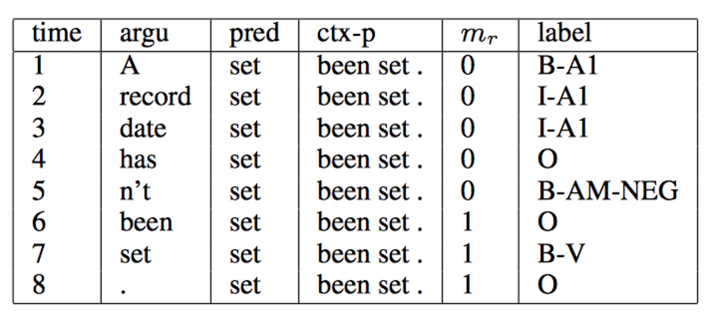

# 语义角色标注（Semantic Role Labeling）

## 背景介绍

语义角色标注（Semantic Role Labeling，SRL）是一种以句子为单位的浅层语义分析技术。SRL以句子的谓词为中心，不对句子所包含的语义信息进行深入分析，只分析句子中各成分与谓词之间的关系，即：句子的谓词（Predicate）- 论元（Argument）结构，并用语义角色来描述这些结构关系。请看下面的例子：

$$\mbox{[小明]}_{\mbox{Agent}}\mbox{[昨天]}_{\mbox{Time}}\mbox{在[公园]}_{\mbox{Location}}\mbox{[遇到]}_{\mbox{Predicate}}\mbox{了[小红]}_{\mbox{Patient}}\mbox{。}$$

在上面的句子中，“遇到” 是谓词（Predicate，通常简写为“Pred”），代表了一个事件的核心，“小明”是施事者（Agent），“小红”是受事者（Patient），“昨天” 是事件发生的时间（Time），“公园”是时间发生的地点（Location）。

通过这个例子可以看出，SRL是为了分析出句子描述的事件，以及事件的参与者（包括施事者、受事者）、事件发生的时间、地点和原因等。是许多自然语言理解任务， 如：信息抽取，篇章分析，深度问答等，的一个重要中间步骤。

传统的 SRL 系统大多建立在句法分析基础之上，通常包括多个步骤：构建一棵句法分析树；从句法树上识别出给定谓词的论元；最后，通过分类得到谓词和论元的语义角色标签等。然而，句法分析是一个非常困难的任务，目前技术下的句法分析准确率并不高，句法分析的细微错误都会导致语义角色标注的错误，也限制了 SRL 任务的准确率。这是 SRL 任务面临的主要挑战。

为了回避 “无法获得准确率较高的句法树” 所造成的困难，研究提出了基于语块的 SRL 方法，也是我们这篇文章所要介绍的方法。基于语块的 SRL 方法将 SRL 作为一个序列标注问题来解决，是一个相对简单的过程。一般采用 BIO 表示方式来定义序列标注的标签集，将不同的语块赋予不同的标签。即：对于一个角色为 A 的论元，将它所包含的第一个语块赋予标签 B-A，将它所包含的其它语块赋予标签 I-A，不属于任何论元的语块赋予标签 O。

我们继续以上面的这句话为例，图1展示了 BIO 表示方法的执行过程，可以看到，根据序列标注的结果可以直接得到语义角色标注的结果，因此，论元识别和论元标注通常作为一个过程同时实现。

<div  align="center">
<br>
图1. BIO标注方法示例
</div>

下面，我们以 [CoNLL-2004 and CoNLL-2005 Shared Tasks](http://www.cs.upc.edu/~srlconll/) 公共任务中 SRL 任务的公开数据集为例，实践下面的任务：

给定谓词和一句话，通过序列标注的方式，从句子中找到谓词对应的论元，同时标注它们的语义角色。

在这个过程中，我们的目标是：只依赖输入文本序列，不依赖任何额外的语法解析结果或是复杂的人造特征，构建一个端到端学习的 SRL 系统。

# 模型概览

循环神经网络（Recurrent Neural Network）是一种对序列建模的重要模型，在自然语言处理任务中有着广泛地应用。不同于传统的前馈神经网络（Feed-forward Neural Network），RNN 引入了循环，能够处理输入之间前后关联的问题。在语言中，由于句子前后单词并不是独立存在，标记句子中下一个词的语义角色，通常都依赖句子前面的词。很自然地，我们选择利用循环神经网络 “记忆历史” 的能力来构建我们的 SRL 系统。

在开始最终的 SRL 模型之前，我们首先介绍三个重要的积木。

## 重要的积木
### 栈式循环神经网络（Stacked Recurrent Neural Network）

深度网络有助于形成层次化特征，网络的上层在下层已经学习到的初级特征基础上，学习更复杂的高级特征。

RNN 等价于一个展开地前向网络，于是，通常人们会认为 RNN 在时间轴上是一个真正的“深层网络”。然而，在循环神经网络中，对网络层数的定义并非如此直接。输入特征经过一次非线性映射，我们称之为神经网络的一层。按照这样的约定，可以看到，尽管 RNN 沿时间轴展开后等价于一个非常“深”的前馈网络，但由于 RNN 各个时间步参数共享，$t-1$ 时刻状态到 $t$ 时刻的映射，始终只经过了一次非线性映射，也就是说 ：RNN 对状态转移的建模是 “浅” 的。

堆叠多个 RNN 单元（可以是：Simple RNN ， LSTM 或者 GRU）构成深层网络，令前一个 RNN $t$ 时刻的输出，成为下一个 RNN 单元 $t$ 时刻的输入，帮助我们构建起一个深层的 RNN 网络。和单层 RNN 网络相比，极大地提高了模型拟合复杂模式的能力，能够更好地建模跨不同时间步的模式\[[3](#参考文献)\]。

### 双向循环神经网络（Bidirectional Recurrent Neural Network）

在 RNN 模型中，$t$ 时刻输出的隐藏层向量编码了到 $t$ 时刻为止所有输入的信息，但由于 RNN 串行计算，$t$ 时刻 RNN 可以看到历史，却无法看到未来。

在绝大多数自然语言处理任务中，我们几乎总是能拿到整个句子。这种情况下，$t$ 时刻如果能够像获取历史信息一样，得到未来的信息，对序列学习任务会有很大的帮助。基于这样的思想，我们设计了一种双向循环网络单元，它的思想非常简单且直接：堆叠多个 RNN 单元，让每一层 RNN 单元分别以：正向、反向、正向 …… 的顺序学习上一层的输出序列。于是，从第 2 层开始， $t$ 时刻我们的 RNN 单元便总是可以看到历史和未来的信息。

需要说明的是，这种双向 RNN 结构和 Bengio 等人在机器翻译任务中使用的双向 RNN 结构 \[[1](#参考文献), [2](#参考文献)\] 并不相同，我们会在后续机器翻译任务中，了解另一种双向循环神经网络。

### 条件随机场 (Conditional Random Field)

前层网络学习输入的特征表示，网络的最后一层在特征基础上，完成 SRL 任务。条件随机场就是完成序列标注的一层，处于整个网络的末端。

条件随机场 （Conditional Random Filed， CRF）是一种概率化结构模型，可以看作是一个概率无向图模型（也叫作马尔科夫随机场），结点表示随机变量，边表示随机变量之间的概率依赖关系。

简单来讲，CRF 学习条件概率型：$P(X|Y)$，其中 $X = (x_1, x_2, ... , x_n)$ 是输入序列，$Y = (y_1, y_2, ... , y_n)$ 是标记序列；解码过程是给定 $X$ 序列求解令 $P(Y|X)$ 最大的 $Y$ 序列，即：$Y^* = \mbox{arg max}_{Y} P(Y | X)$。

我们首先来条件随机场是如何定义的。

**条件随机场** : 设 $G = (V, E)$ 是一个无向图， $V$ 是结点的集合，$E$ 是无向边的集合。$V$ 中的每个结点对应一个随机变量 $Y_{v}$， $Y = \{Y_{v} | v \in V\}$，其取值范围为可能的标记集合 $\{y\}$，如果以随机变量 $X$ 为条件，每个随机变量 $Y_{v}$ 都满足以下马尔科夫特性：
$$p(Y_{v}|X, Y_{\omega}, \omega \not= v) = p(Y_{v} | X, Y_{\omega} , \omega \sim v)$$
其中，$\omega \sim v$ 表示两个结点在图 $G$ 中是邻近结点，那么，$(X, Y)$ 是一个条件随机场。

上面的定义并没有对 $X$ 和 $Y$ 的结构给出更多约束，理论上来讲，只要标记序列表示了一定的条件独立性，$G$ 的图结构可以是任意的。对序列标注任务，我们只需要考虑 $X$ 和 $Y$ 都是一个序列，于是可以形成一个如图2所示的简单链式结构图。在图中，输入序列 $X$ 的元素之间并不存在图结构，因为我们只是将它作为条件，并不做任何条件独立假设。

<p align="center">    
<br>
图2. $X$ 和 $Y$ 具有相同结构的线性链条件随机场
</p>

至此可以看到，序列标注问题使用的是以上这种定义在线性链上的特殊条件随机场，称之为线性链条件随机场（Linear Chain Conditional Random Field）。下面，我们给出线性链条件随机场的精确定义：

**线性链条件随机场** ：设 $X = (x_{1}, x_{2}, ... , x_{n})$，$Y = (y_{1}, y_{2}, ... , y_{n})$ 均为线性链表示的随机变量序列，若在给定随机变量序列 $X$ 的条件下，随机变量序列 $Y$ 的条件概率分布 $P(Y|X)$ 满足马尔科夫性：

$$p\left(Y_{i}|X, y_{1}, ... , y_{i - 1}, y_{i + 1}, ... , y_{n}\right) = p\left(y_{i} | X, y_{i - 1}, y_{i + 1}\right)$$

$$i = 1, 2, ..., n \mbox{（在} i = 1 \mbox{和} n \mbox{时只考虑单边）}$$

则称$P(Y|X)$为线性链条件随机场。$X$表示输入序列，$Y$ 表示与之对应的标记序列。

根据线性链条件随机场上的因子分解定理 \[[5](#参考文献)\]，在给定观测序列 $X$ 时，一个特定标记序列 $Y$ 的概率可以定义为：

$$p(Y | X) = \frac{1}{Z(X)} \text{exp}\left(\sum_{i=1}^{n}\left(\sum_{j}\lambda_{j}t_{j} (y_{i - 1}, y_{i}, X, i) + \sum_{k} \mu_k s_k (y_i, X, i)\right)\right)$$ 

其中：

$$Z(X) = \sum_{y \in Y} \text{exp}\left(\sum_{i = 1}^ {n}\left(\sum_{j} \lambda_j t_j(y_{i-1}, y_i, X, i) + \sum_{k}\mu_k s_k (y_i, X, i)\right)\right)$$ 

是规范化因子。

上面的式子中 $t_j$ 是定义在边上的特征函数，依赖于当前和前一个位置，称为转移特征，表示对于观察序列 $X$ 及其标注序列在 $i$ 及 $i - 1$ 位置上标记的转移概率。$s_k$ 是定义在结点上的特征函数，称为状态特征，依赖于当前位置，表示对于观察序列 $X$ 及其 $i$ 位置的标记概率。$\lambda_j$ 和 $\mu_k$ 分别是转移特征函数和状态特征函数对应的权值。

实际上 ，$t$ 和 $s$ 可以用相同的数学形式表示，$s$ 可以同样也写为以下形式：

$$s(y_i, X, i) = s(y_{i - 1}, y_i, X, i)$$

假设有 $K_1$ 个转移特征，$K_2$ 个状态特征，定义特征函数 $f_k(y_{i-1}, y_{i}, X, i)$ ：

$$f_{k}(y_{i-1}, y_{i}, X, i) = \left\{ \begin{aligned} t_j(y_{i - 1}, y_{i}, X, i), &&k= 1,2, ..., K_1\\ s_{l}(y_{i-1}, y_i, X, i) , && k = K_{1} + l; l= 1, 2, ..., K_2\end{aligned} \right. $$

再对转移特征和状态特在各个位置 $i$ 求和有：
$$f_{k}(Y, X) = \sum_{i=1}^{n}f_k({y_{i - 1}, y_i, X, i})$$

于是条件概率 $P(Y|X)$ 可以写为：

$$p(Y|X, W) = \frac{1}{Z(X)}\text{exp}\sum_{k}\omega_{k}f_{k}(Y, X)$$

$$Z_i(X) = \sum_{y_i \in Y} \text{exp} \sum_{k}\omega_k f_k (Y, X)$$

我们把 $f$ 统称为特征函数，$\omega$ 是权值，是 CRF 模型要求解的参数。

学习时，对于给定的输入序列和对应的标记序列的集合  $D = \left[(X_1,  Y_1), (X_2 , Y_2) , ... , (X_N, Y_N)\right]$ ，通过正则化的极大似然估计，可以得到如下优化目标：

$$L(\lambda, D) = - \text{log}\left(\prod_{m=1}^{N}p(Y_m|X_m, W)\right) + C \frac{1}{2}\lVert W\rVert^{2}$$

解码时，对于给定的输入序列 $X$，通过解码算法求令出条件概率$\bar{P}(Y|X)$最大的输出序列 $\bar{Y}$。

## 深度双向 LSTM （DB-LSTM）SRL 模型

有了上面这些积木，可以开始建立我们的深层双向 LSTM 语义角色标注模型。

在这个任务中，输入是 “谓词” 和 “一句话”，目标是：从句中找到谓词的论元，并标注论元的语义角色。如果，一个句子中可能有 $n$ 谓词，这个句子会被处理 $n$ 次。一个最为直接的模型是下面这样：

- step 1. 构造输入
 - 输入 1：谓词
 - 输入 2：句子
 - 将输入1 扩展成和输入2一样长的序列，用 one-hot 方式表示；
- step 2. one-hot 方式的谓词序列和句子序列通过词表，转换为实向量表示的词向量序列；
- setp 3. 以 step 2 的 2 个词向量序列作为上面介绍的双向 LSTM 模型的输入；LSTM 模型学习输入序列表示，得到输出向量序列；
- step 4. CRF 以 step 3 LSTM 学习到的特征为输入，以标记序列为监督信号，实现序列标注；

大家可以尝试上面这种方法，这里，我们提出一些改进，引入两个简单的特征但对提高系统性能非常有效的特征：（1）谓词上下文；（2）谓词上下文区域标记。

上面的方法中，只用到了谓词的词向量表达谓词相关的所有信息，这种方法始终是非常弱的，特别是，如果谓词在句子中出现多次，有可能引起一定的歧义。从经验出发，谓词前后若干个词的一个小片段，能够提供更丰富的信息，帮助消解词义。于是，我们把这样的经验也添加到我们的模型中。我们为每个谓词同时抽取一个“谓词上下文” 片段，也就是从这个谓词前后各取 $n$ 个词构成的一个窗口片段。在此基础上，同时为句子中的每一个词引入一个 0-1 二值变量，表示他们是否在“谓词上下文”中。图4 谓词上下文窗口为3时，模型输入示例。

<div  align="center">
<br>
图4. 输入数据示例
</div>

于是，我们将最初模型修改如下：

- step 1. 构造输入
 - 输入 1：句子序列；
 - 输入 2：谓词；
 - 输入 3：对给定的谓词，从句子中抽取这个谓词前后 各$n$ 个词，构成谓词上下文；用 one-hot 方式表示；
 - 输入 4：标记句子中每一个词是否是谓词上下文中；用 one-hot 方式表示；
 - 将输入 2 ~ 4 均扩展为和输入 1 一样长的序列；
- step 2. 输入 1 ~ 4 均通过词表，转换为实向量表示的词向量序列；其中输入 1 ~ 3 共享同一个词表，输入 4 的独有词表；
- setp 3. setp 2 的 4 个词向量序列作为上面结果的双向 LSTM 模型的输入；LSTM 模型学习输入序列表示，得到输出向量序列；
- step 4. CRF 以 step 3 LSTM 学习到的特征为输入，以标记序列为监督信号，实现序列标注；

下图是一个深度为 4 的模型结构示意图。

<div  align="center">    
<br>
图3. SRL任务上的深度双向 LSTM 模型
</div>

# 数据准备
## 数据介绍与下载

在此教程中，我们选用 [CoNLL 2005](http://www.cs.upc.edu/~srlconll/) SRL任务开放出的数据集进行示例。运行 ```sh ./get_data.sh``` 会自动从官方网站上下载原始数据，以及一个预训练好的词表，并完成全部的数据准备工作。需要说明的是，CoNLL 2005 SRL 任务的训练数集和开发集并非完全公开，这里获取到的只是测试集，包括 Wall Street Journal 的 23 节和 Brown 语料集中的 3 节。原始数据解压后会得到如下目录结构：

```text
conll05st-release/
├── test.brown
│   ├── ne
│   ├── null
│   ├── props
│   ├── synt.cha
│   ├── synt.col2
│   ├── synt.col2h
│   ├── synt.upc
│   ├── targets
│   └── words
└── test.wsj
    ├── ne
    ├── null
    ├── props
    ├── synt.cha
    ├── synt.col2
    ├── synt.col2h
    ├── synt.upc
    ├── targets
    └── words
```
原始数据中同时包括了词性标注、命名实体识别、语法解析树等多种信息，在这篇文章中，我们使用 test.wsj 文件夹中的数据进行训练，使用 test.brown 文件夹中的数据进行测试。我们的目标是展示如何利用深度神经网络，只使用文本序列作为输入信息，不依赖任何句法解析树以及人工构造的复杂特征，构建一个端到端学习的语义角色标注系统。因此，这里只会用到 words 文件夹（文本序列）和 props 文件夹（标注序列）下的数据。

标注信息源自 Penn TreeBank \[[9](#参考文献)\] 和 PropBank \[[10](#参考文献)\] 的标注结果。PropBank 使用的标注标记和我们在文章一开始示例中使用的标注标签不同，但原理是相同的，关于标注标签含义的说明，请参考论文\[[11](#参考文献)\]。

数据准备阶段， ```extract_dict_feature.py``` 会重新格式化原始数据，抽取谓词上下文（这里取谓词前后各 2 个词，也就是一个长度为 5 的窗口片段），和谓词上下文区域标志。

```data/feature``` 是模型最终的输入，一行是一条训练样本，以 "\t" 分隔，共9列，分别是：句子序列、谓词、谓词上下文（占 5 列）、谓词上下区域标志、标注序列。

## 提供数据给 PaddlePaddle
1. 使用 hook 函数进行 PaddlePaddle 输入字段的格式定义。

	```python
	def hook(settings, word_dict, label_dict, predicate_dict, **kwargs):
	    settings.word_dict = word_dict
	    settings.label_dict = label_dict
	    settings.predicate_dict = predicate_dict
	
	    #all inputs are integral and sequential type
	    settings.slots = [
	        integer_value_sequence(len(word_dict)),
	        integer_value_sequence(len(word_dict)),
	        integer_value_sequence(len(word_dict)),
	        integer_value_sequence(len(word_dict)),
	        integer_value_sequence(len(word_dict)),
	        integer_value_sequence(len(word_dict)),
	        integer_value_sequence(len(predicate_dict)), integer_value_sequence(2),
	        integer_value_sequence(len(label_dict))
	    ]
	```

2. 使用 process 函数将数据逐一提供给 PaddlePaddle，只需要考虑一条数据如何处理。

	```python
	def process(settings, file_name):
	    with open(file_name, 'r') as fdata:
	        for line in fdata:
	            sentence, predicate, ctx_n2, ctx_n1, ctx_0, ctx_p1, ctx_p2,  mark, label = \
	                line.strip().split('\t')
	
	            words = sentence.split()
	            sen_len = len(words)
	            word_slot = [settings.word_dict.get(w, UNK_IDX) for w in words]
	
	            predicate_slot = [settings.predicate_dict.get(predicate)] * sen_len
	            ctx_n2_slot = [settings.word_dict.get(ctx_n2, UNK_IDX)] * sen_len
	            ctx_n1_slot = [settings.word_dict.get(ctx_n1, UNK_IDX)] * sen_len
	            ctx_0_slot = [settings.word_dict.get(ctx_0, UNK_IDX)] * sen_len
	            ctx_p1_slot = [settings.word_dict.get(ctx_p1, UNK_IDX)] * sen_len
	            ctx_p2_slot = [settings.word_dict.get(ctx_p2, UNK_IDX)] * sen_len
	
	            marks = mark.split()
	            mark_slot = [int(w) for w in marks]
	
	            label_list = label.split()
	            label_slot = [settings.label_dict.get(w) for w in label_list]
	            yield word_slot, ctx_n2_slot, ctx_n1_slot, \
	                  ctx_0_slot, ctx_p1_slot, ctx_p2_slot, predicate_slot, mark_slot, label_slot
	
	
	```

# 模型配置说明

## 数据定义

在模型配置中，首先通过 define_py_data_sources2 从 dataprovider 中读入数据。

```
define_py_data_sources2(
        train_list=train_list_file,
        test_list=test_list_file,
        module='dataprovider',
        obj='process',
        args={
            'word_dict': word_dict,
            'label_dict': label_dict,
            'predicate_dict': predicate_dict}
)
```
## 算法配置

在这里，我们指定了模型的训练参数, 选择 $L_2$ 正则项稀疏、学习率和batch size。

```
settings(
    batch_size=150,
    learning_method=MomentumOptimizer(momentum=0),
    learning_rate=2e-2,
    regularization=L2Regularization(8e-4),
    is_async=False,
    model_average=ModelAverage(average_window=0.5, max_average_window=10000)
)
```

## 模型结构

1. 定义输入数据维度，及模型超参数

	```python
	mark_dict_len = 2    # 谓上下文区域标志的维度，是一个 0-1 2 值特征，因此维度为 2
	word_dim = 32        # 词向量维度
	mark_dim = 5         # 谓词上下文区域通过词表被映射为一个实向量，这个是相邻的维度
	hidden_dim = 512     # LSTM 隐层向量的维度 ： 512 / 4
	depth = 8            # 栈式 LSTM 的深度
	
	ctx_n2 = data_layer(name='ctx_n2_data', size=word_dict_len)
	ctx_n1 = data_layer(name='ctx_n1_data', size=word_dict_len)
	ctx_0 = data_layer(name='ctx_0_data', size=word_dict_len)
	ctx_p1 = data_layer(name='ctx_p1_data', size=word_dict_len)
	ctx_p2 = data_layer(name='ctx_p2_data', size=word_dict_len)
	mark = data_layer(name='mark_data', size=mark_dict_len)
	
	if not is_predict:
	    target = data_layer(name='target', size=label_dict_len)    # 标记序列只在训练和测试流程中定义
	```

2. 将句子序列、谓词、谓词上下文、谓词上下文区域标记通过词表，转换为实向量表示的词向量序列

	```python
	mark_embedding = embedding_layer(
	    name='word_ctx-in_embedding', size=mark_dim, input=mark, param_attr=std_0)
	
	word_input = [word, ctx_n2, ctx_n1, ctx_0, ctx_p1, ctx_p2]
	emb_layers = [
	    embedding_layer(
	        size=word_dim, input=x, param_attr=emb_para) for x in word_input
	]
	emb_layers.append(predicate_embedding)
	emb_layers.append(mark_embedding)
	```

3. 8 个 LSTM 单元以“正向/反向”的顺序学习对所有输入特征序列进行学习

	```python
	hidden_0 = mixed_layer(
	    name='hidden0',
	    size=hidden_dim,
	    bias_attr=std_default,
	    input=[
	        full_matrix_projection(
	            input=emb, param_attr=std_default) for emb in emb_layers
	    ])
	lstm_0 = lstmemory(
	    name='lstm0',
	    input=hidden_0,
	    act=ReluActivation(),
	    gate_act=SigmoidActivation(),
	    state_act=SigmoidActivation(),
	    bias_attr=std_0,
	    param_attr=lstm_para_attr)
		input_tmp = [hidden_0, lstm_0]

	for i in range(1, depth):
	    mix_hidden = mixed_layer(
	        name='hidden' + str(i),
	        size=hidden_dim,
	        bias_attr=std_default,
	        input=[
	            full_matrix_projection(
	                input=input_tmp[0], param_attr=hidden_para_attr),
	            full_matrix_projection(
	                input=input_tmp[1], param_attr=lstm_para_attr)
	        ])
	    lstm = lstmemory(
	        name='lstm' + str(i),
	        input=mix_hidden,
	        act=ReluActivation(),
	        gate_act=SigmoidActivation(),
	        state_act=SigmoidActivation(),
	        reverse=((i % 2) == 1),
	        bias_attr=std_0,
	        param_attr=lstm_para_attr)
	
	    input_tmp = [mix_hidden, lstm]
	```

4. 取最后一个栈式 LSTM 的输出和这个LSTM单元的 input-to-hidden 映射结果，经过一个全连接层映射，得到最终的特征向量表示

	```python
	feature_out = mixed_layer(
	    name='output',
	    size=label_dict_len,
	    bias_attr=std_default,
	    input=[
	        full_matrix_projection(
	            input=input_tmp[0], param_attr=hidden_para_attr),
	        full_matrix_projection(
	            input=input_tmp[1], param_attr=lstm_para_attr)
	    ], ) 
	```

5.  CRF 层在网络的末端，完成序列标注

	```python
	crf_l = crf_layer(
	        name='crf',
	        size=label_dict_len,
	        input=feature_out,
	        label=target,
	        param_attr=ParameterAttribute(
	            name='crfw', initial_std=default_std, learning_rate=mix_hidden_lr))
	```

# 训练模型
执行sh train.sh进行模型的训练。其中指定了总共需要执行500个pass。

```
paddle train \
  --config=./db_lstm.py \
  --save_dir=./output \
  --trainer_count=4 \
  --dot_period=500 \
  --log_period=10 \
  --num_passes=500 \
  --use_gpu=false \
  --show_parameter_stats_period=10 \
  --test_all_data_in_one_period=1 \
2>&1 | tee 'train.log'
```
一轮训练 log 示例如下所示，经过 150 个pass，得到平均 error 为 0.0516055。

```
I1224 18:11:53.661479  1433 TrainerInternal.cpp:165]  Batch=880 samples=145305 AvgCost=2.11541 CurrentCost=1.8645 Eval: __sum_evaluator_0__=0.607942  CurrentEval: __sum_evaluator_0__=0.59322
I1224 18:11:55.254021  1433 TrainerInternal.cpp:165]  Batch=885 samples=146134 AvgCost=2.11408 CurrentCost=1.88156 Eval: __sum_evaluator_0__=0.607299  CurrentEval: __sum_evaluator_0__=0.494572
I1224 18:11:56.867604  1433 TrainerInternal.cpp:165]  Batch=890 samples=146987 AvgCost=2.11277 CurrentCost=1.88839 Eval: __sum_evaluator_0__=0.607203  CurrentEval: __sum_evaluator_0__=0.590856
I1224 18:11:58.424069  1433 TrainerInternal.cpp:165]  Batch=895 samples=147793 AvgCost=2.11129 CurrentCost=1.84247 Eval: __sum_evaluator_0__=0.607099  CurrentEval: __sum_evaluator_0__=0.588089
I1224 18:12:00.006893  1433 TrainerInternal.cpp:165]  Batch=900 samples=148611 AvgCost=2.11148 CurrentCost=2.14526 Eval: __sum_evaluator_0__=0.607882  CurrentEval: __sum_evaluator_0__=0.749389
I1224 18:12:00.164089  1433 TrainerInternal.cpp:181]  Pass=0 Batch=901 samples=148647 AvgCost=2.11195 Eval: __sum_evaluator_0__=0.60793
```

# 总结

语义角色标注是许多自然语言理解任务的重要中间步骤。本章中，我们以语义角色标注任务为例，介绍如何利用 PaddlePaddle 进行序列标注任务。这篇文章所介绍的模型来自我们发表的论文\[[9](#参考文献)\]，由于 CoNLL 2005 SRL 任务的训练数据目前并非完全开放，这篇文章只使用测试数据作为示例，在这个过程中，我们希望减少对其它自然语言处理工具的依赖，利用神经网络数据驱动、端到端学习的能力，得到一个和传统方法可比，甚至更好的模型。在论文中我们证实了这种可能性。关于模型更多的信息和讨论可以在论文中找到。

# 参考文献
1. Cho K, Van Merriënboer B, Gulcehre C, et al. [Learning phrase representations using RNN encoder-decoder for statistical machine translation](https://arxiv.org/abs/1406.1078)[J]. arXiv preprint arXiv:1406.1078, 2014.
2. Bahdanau D, Cho K, Bengio Y. [Neural machine translation by jointly learning to align and translate](https://arxiv.org/abs/1409.0473)[J]. arXiv preprint arXiv:1409.0473, 2014.
3. Pascanu R, Gulcehre C, Cho K, et al. [How to construct deep recurrent neural networks](https://arxiv.org/abs/1312.6026)[J]. arXiv preprint arXiv:1312.6026, 2013.
4. Lafferty J, McCallum A, Pereira F. [Conditional random fields: Probabilistic models for segmenting and labeling sequence data](http://www.jmlr.org/papers/volume15/doppa14a/source/biblio.bib.old)[C]//Proceedings of the eighteenth international conference on machine learning, ICML. 2001, 1: 282-289.
5. 李航. 统计学习方法[J]. 清华大学出版社, 北京, 2012.
6. Marcus M P, Marcinkiewicz M A, Santorini B. [Building a large annotated corpus of English: The Penn Treebank](http://repository.upenn.edu/cgi/viewcontent.cgi?article=1246&context=cis_reports)[J]. Computational linguistics, 1993, 19(2): 313-330.
7. Palmer M, Gildea D, Kingsbury P. [The proposition bank: An annotated corpus of semantic roles](http://www.mitpressjournals.org/doi/pdfplus/10.1162/0891201053630264)[J]. Computational linguistics, 2005, 31(1): 71-106.
8. Carreras X, Màrquez L. [Introduction to the CoNLL-2005 shared task: Semantic role labeling](http://www.cs.upc.edu/~srlconll/st05/papers/intro.pdf)[C]//Proceedings of the Ninth Conference on Computational Natural Language Learning. Association for Computational Linguistics, 2005: 152-164.
9. Zhou J, Xu W. [End-to-end learning of semantic role labeling using recurrent neural networks](http://www.aclweb.org/anthology/P/P15/P15-1109.pdf)[C]//Proceedings of the Annual Meeting of the Association for Computational Linguistics. 2015.
