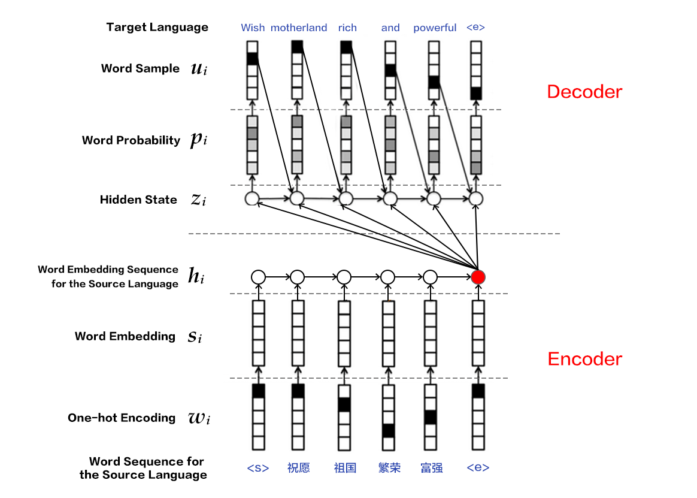

# Machine Translation

The source codes is located at [book/machine_translation](https://github.com/PaddlePaddle/book/tree/develop/machine_translation). Please refer to the PaddlePaddle [installation tutorial](http://www.paddlepaddle.org/doc_cn/build_and_install/index.html) if you are a first time user.

## Background

Machine translation (MT) leverages computers to translate from one language to another. The language to be translated is referred to as the source language, while the language to be translated into is referred to as the target language. Thus, Machine translation is the process of translating from the source language to the target language. It is one of the most important research topics in the field of natural language processing.

Early machine translation systems are mainly rule-based i.e. they rely on a language expert to specify the translation rules between the two languages. It is quite difficult to cover all the rules used in one languge. So it is quite a challenge for language experts to specify all possible rules in two or more different languages. Hence, a major challenge in conventional machine translation has been the difficulty in obtaining a complete rule set \[[1](#References)\]。


To address the aforementioned problems, statistical machine translation techniques have been developed. These techniques learn the translation rules from a large corpus, instead of being designed by a language expert. While these techniques overcome the bottleneck of knowledge acquisition, there are still quite a lot of challenges, for example: 

1. human designed features cannot cover all possible linguistic variations; 

2. it is difficult to use global features; 

3. the techniques heavily rely on pre-processing techniques like word alignment, word segmentation and tokenization, rule-extraction and syntactic parsing etc. The error introduced in any of these steps could accumulate and impact translation quality.


The recent development of deep learning provides new solutions to these challenges. The two main categories for deep learning based machine translation techniques are: 

1. techniques based on the statistical machine translation system but with some key components improved with neural networks, e.g., language model, reordering model (please refer to the left part of Figure 1); 

2. techniques mapping from source language to target language directly using a neural network, or end-to-end neural machine translation (NMT).

<p align="center">
<br/>
Figure 1. Neural Network based Machine Translation
</p>


This tutorial will mainly introduce an NMT model and how to use PaddlePaddle to train it.

## Illustrative Results

Let's consider an example of Chinese-to-English translation. The model is given the following segmented sentence in Chinese
```text
这些 是 希望 的 曙光 和 解脱 的 迹象 .
```
After training and with a beam-search size of 3, the generated translations are as follows:
```text
0 -5.36816   these are signs of hope and relief . <e>
1 -6.23177   these are the light of hope and relief . <e>
2 -7.7914  these are the light of hope and the relief of hope . <e>
```
- The first column corresponds to the id of the generated sentence; the second column corresponds to the score of the generated sentence (in descending order), where a larger value indicates better quality; the last column corresponds to the generated sentence.
- There are two special tokens: `<e>` denotes the end of a sentence while `<unk>` denotes unknown word, i.e., a word not in the training dictionary.

## Overview of the Model

This section will introduce Gated Recurrent Unit (GRU), Bi-directional Recurrent Neural Network, the Encoder-Decoder framework used in NMT, attention mechanism, as well as the beam search algorithm.

### Gated Recurrent Unit (GRU)

We already introduced RNN and LSTM in the [Sentiment Analysis](https://github.com/PaddlePaddle/book/blob/develop/understand_sentiment/README.md) chapter.
Compared to a simple RNN, the LSTM added memory cell, input gate, forget gate and output gate. These gates combined with the memory cell greatly improve the ability to handle long-term dependencies.

GRU\[[2](#References)\] proposed by Cho et al is a simplified LSTM and an extension of a simple RNN. It is shown in the figure below. 
A GRU unit has only two gates:
- reset gate: when this gate is closed, the history information is discarded, i.e., the irrelevant historical information has no effect on the future output.
- update gate: it combines the input gate and the forget gate and is used to control the impact of historical information on the hidden output. The historical information is passed over when the update gate is close to 1.

<p align="center">
<br/>
Figure 2. A GRU Gate
</p>

Generally speaking, sequences with short distance dependencies will have an active reset gate while sequences with long distance dependency will have an active update date.
In addition, Chung et al.\[[3](#References)\] have empirically shown that although GRU has less parameters, it has similar performance to LSTM on several different tasks.

### Bi-directional Recurrent Neural Network

We already introduced an instance of bi-directional RNN in the [Semantic Role Labeling](https://github.com/PaddlePaddle/book/blob/develop/label_semantic_roles/README.md) chapter. Here we present another bi-directional RNN model with a different architecture proposed by Bengio et al. in \[[2](#References),[4](#References)\]. This model takes a sequence as input and outputs a fixed dimensional feature vector at each step, encoding the context information at the corresponding time step.

Specifically, this bi-directional RNN processes the input sequence in the original and reverse order respectively, and then concatenates the output feature vectors at each time step as the final output. Thus the output node at each time step contains information from the past and future as context. The figure below shows an unrolled bi-directional RNN. This network contains a forward RNN and backward RNN with six weight matrices: weight matrices from input to forward hidden layer and backward hidden ($W_1, W_3$), weight matrices from hidden to itself ($W_2, W_5$), matrices from forward hidden and backward hidden to output layer ($W_4, W_6$). Note that there are no connections between forward hidden and backward hidden layers.

<p align="center">
<br/>
Figure 3. Temporally unrolled bi-directional RNN
</p>

### Encoder-Decoder Framework

The Encoder-Decoder\[[2](#References)\] framework aims to solve the mapping of a sequence to another sequence, for sequences with arbitrary lengths. The source sequence is encoded into a vector via an encoder, which is then decoded to a target sequence via a decoder by maximizing the predictive probability. Both the encoder and the decoder are typically implemented via RNN.

<p align="center">
<br/>
Figure 4. Encoder-Decoder Framework
</p>

#### Encoder

There are three steps for encoding a sentence:

1. One-hot vector representation of a word: Each word $x_i$ in the source sentence $x=\left \{ x_1,x_2,...,x_T \right \}$ is represented as a vector $w_i\epsilon R^{\left | V \right |},i=1,2,...,T$   where $w_i$ has the same dimensionality as the size of the dictionary, i.e., $\left | V \right |$, and has an element of one at the location corresponding to the location of the word in the dictionary and zero elsewhere.

2. Word embedding as a representation in the low-dimensional semantic space: There are two problems with one-hot vector representation 

  * the dimensionality of the vector is typically large, leading to the curse of dimensionality; 

  * it is hard to capture the relationships between words, i.e., semantic similarities. Therefore, it is useful to project the one-hot vector into a low-dimensional semantic space as a dense vector with fixed dimensions, i.e., $s_i=Cw_i$ for the $i$-th word, with $C\epsilon R^{K\times \left | V \right |}$ as the projection matrix and $K$ is the dimensionality of the word embedding vector.

3. Encoding of the source sequence via RNN: This can be described mathematically as:

    $$h_i=\varnothing _\theta \left ( h_{i-1}, s_i \right )$$
    
    where 
    $h_0$ is a zero vector, 
    $\varnothing _\theta$ is a non-linear activation function, and 
    $\mathbf{h}=\left \{ h_1,..., h_T \right \}$ 
    is the sequential encoding of the first $T$ words from the source sequence. The vector representation of the whole sentence can be represented as the encoding vector at the last time step $T$ from $\mathbf{h}$, or by temporal pooling over $\mathbf{h}$.


Bi-directional RNN can also be used in step (3) for more a complicated sentence encoding. This can be implemented using a bi-directional GRU. Forward GRU encodes the source sequence in its original order $(x_1,x_2,...,x_T)$, and generates a sequence of hidden states $(\overrightarrow{h_1},\overrightarrow{h_2},...,\overrightarrow{h_T})$. The backward GRU encodes the source sequence in reverse order, i.e., $(x_T,x_T-1,...,x_1)$ and generates $(\overleftarrow{h_1},\overleftarrow{h_2},...,\overleftarrow{h_T})$. Then for each word $x_i$, its complete hidden state is the concatenation of the corresponding hidden states from the two GRUs, i.e., $h_i=\left [ \overrightarrow{h_i^T},\overleftarrow{h_i^T} \right ]^{T}$.

<p align="center">
<br/>
Figure 5. Encoder using bi-directional GRU
</p>

#### Decoder

The goal of the decoder is to maximize the probability of the next correct word in the target language. The main idea is as follows:

1. At each time step $i$, given the encoding vector (or context vector) $c$ of the source sentence, the $i$-th word $u_i$ from the ground-truth target language and the RNN hidden state $z_i$, the next hidden state $z_{i+1}$ is computed as:

   $$z_{i+1}=\phi _{\theta '}\left ( c,u_i,z_i \right )$$
   where $\phi _{\theta '}$ is a non-linear activation function and $c=q\mathbf{h}$ is the context vector of the source sentence. Without using [attention](#Attention Mechanism), if the output of the [encoder](#Encoder) is the encoding vector at the last time step of the source sentence, then $c$ can be defined as $c=h_T$. $u_i$ denotes the $i$-th word from the target language sentence and $u_0$ denotes the beginning of the target language sentence (i.e., `<s>`), indicating the beginning of decoding. $z_i$ is the RNN hidden state at time step $i$ and $z_0$ is an all zero vector.

2. Calculate the probability $p_{i+1}$ for the $i+1$-th word in the target language sequence by normalizing $z_{i+1}$ using `softmax` as follows

   $$p\left ( u_{i+1}|u_{&lt;i+1},\mathbf{x} \right )=softmax(W_sz_{i+1}+b_z)$$

   where $W_sz_{i+1}+b_z$ scores each possible words and is then normalized via softmax to produce the probability $p_{i+1}$ for the $i+1$-th word.

3. Compute the cost accoding to $p_{i+1}$ and $u_{i+1}$.
4. Repeat Steps 1-3, until all the words in the target language sentence have been processed.

The generation process of machine translation is to translate the source sentence into a sentence in the target language according to a pre-trained model. There are some differences between the decoding step in generation and training. Please refer to [Beam Search Algorithm](#Beam Search Algorithm) for details.

### Attention Mechanism

There are a few problems with the fixed dimensional vector representation from the encoding stage: 
  * It is very challenging to encode both the semantic and syntactic information a sentence with a fixed dimensional vector regardless of the length of the sentence. 
  * Intuitively, when translating a sentence, we typically pay more attention to the parts in the source sentence more relevant to the current translation. Moreover, the focus changes along the process of the translation. With a fixed dimensional vector, all the information from the source sentence is treated equally in terms of attention. This is not reasonable. Therefore, Bahdanau et al. \[[4](#References)\] introduced attention mechanism, which can decode based on different fragments of the context sequence in order to address the difficulty of feature learning for long sentences. Decoder with attention will be explained in the following.

Different from the simple decoder, $z_i$ is computed as:

$$z_{i+1}=\phi _{\theta '}\left ( c_i,u_i,z_i \right )$$

It is observed that for each word $u_i$ in the target language sentence, there is a corresponding context vector $c_i$ as the encoding of the source sentence, which is computed as:

$$c_i=\sum _{j=1}^{T}a_{ij}h_j, a_i=\left[ a_{i1},a_{i2},...,a_{iT}\right ]$$

It is noted that the attention mechanism is achieved by a weighted average over the RNN hidden states $h_j$. The weight $a_{ij}$ denotes the strength of attention of the $i$-th word in the target language sentence to the $j$-th word in the source sentence and is calculated as

\begin{align}
a_{ij}&=\frac{exp(e_{ij})}{\sum_{k=1}^{T}exp(e_{ik})}\\\\
e_{ij}&=align(z_i,h_j)\\\\
\end{align}

where $align$ is an alignment model that measures the fitness between the $i$-th word in the target language sentence and the $j$-th word in the source sentence. More concretely, the fitness is computed with the $i$-th hidden state $z_i$ of the decoder RNN and the $j$-th context vector $h_j$ of the source sentence. Hard alignment is used in the conventional alignment model, which means each word in the target language explicitly corresponds to one or more words from the target language sentence. In an attention model, soft alignment is used, where any word in source sentence is related to any word in the target language sentence, where the strength of the relation is a real number computed via the model, thus can be incorporated into the NMT framework and can be trained via back-propagation.

<p align="center">
<br/>
Figure 6. Decoder with Attention Mechanism
</p>

### Beam Search Algorithm

[Beam Search](http://en.wikipedia.org/wiki/Beam_search) is a heuristic search algorithm that explores a graph by expanding the most promising node in a limited set. It is typically used when the solution space is huge  (e.g., for machine translation, speech recognition), and there is not enough memory for all the possible solutions. For example, if we want to translate “`<s>你好<e>`” into English, even if there are only three words in the dictionary (`<s>`, `<e>`, `hello`), it is still possible to generate an infinite number of sentences, where the word `hello` can appear different number of times. Beam search could be used to find a good translation among them.

Beam search builds a search tree using breadth first search and sorts the nodes according to a heuristic cost (sum of the log probability of the generated words) at each level of the tree. Only a fixed number of nodes according to the pre-specified beam size (or beam width) are considered. Thus, only nodes with highest scores are expanded in the next level. This reduces the space and time requirements significantly. However, a globally optimal solution is not guaranteed. 

The goal is to maximize the probability of the generated sequence when using beam search in decoding, The procedure is as follows:

1. At each time step $i$, compute the hidden state $z_{i+1}$ of the next time step according to the context vector $c$ of the source sentence, the $i$-th word $u_i$ generated for the target language sentence and the RNN hidden state $z_i$.
2. Normalize $z_{i+1}$ using `softmax` to get the probability $p_{i+1}$ for the $i+1$-th word for the target language sentence.
3. Sample the word $u_{i+1}$ according to $p_{i+1}$.
4. Repeat Steps 1-3, until end-of-sentence token `<e>` is generated or the maximum length of the sentence is reached.

Note: $z_{i+1}$ and $p_{i+1}$ are computed the same way as in [Decoder](#Decoder). In generation mode, each step is greedy in so there is no guarantee of a global optimum.

## Data Preparation

### Download and Uncompression

This tutorial uses a dataset from [WMT-14](http://www-lium.univ-lemans.fr/~schwenk/cslm_joint_paper/), where [bitexts (after selection)](http://www-lium.univ-lemans.fr/~schwenk/cslm_joint_paper/data/bitexts.tgz) is used as the training set, and [dev+test data](http://www-lium.univ-lemans.fr/~schwenk/cslm_joint_paper/data/dev+test.tgz) is used as test and generation set.

Run the following command in Linux to obtain the data:
```bash
cd data
./wmt14_data.sh
```
There are three folders in the downloaded dataset `data/wmt14`:
<p align = "center">
<table>
<tr>
<td>Folder Name</td>
<td>French-English Parallel Corpus</td>
<td>Number of Files</td>
<td>Size of Files</td>
</tr>

<tr>
<td>train</td>
<td>ccb2_pc30.src, ccb2_pc30.trg, etc</td>
<td>12</td>
<td>3.55G</td>
</tr>

<tr>
<td>test</td>
<td>ntst1213.src, ntst1213.trg</td>
<td>2</td>
<td>1636k</td>
</tr>

</tr>
<tr>
<td>gen</td>
<td>ntst14.src, ntst14.trg</td>
<td>2</td>
<td>864k</td>
</tr>
</table>
</p>

- `XXX.src` is the source file in French and `XXX.trg`is the target file in English. Each row of the file contains one sentence.
- `XXX.src` and `XXX.trg` has the same number of rows and there is a one-to-one correspondance between the sentences at any row from the two files.

### User Defined Dataset (Optional)

To use your own dataset, just put it under the `data` folder and organize it as follows
```text
user_dataset
├── train
│   ├── train_file1.src
│   ├── train_file1.trg
│   └── ...
├── test
│   ├── test_file1.src
│   ├── test_file1.trg
│   └── ...
├── gen
│   ├── gen_file1.src
│   ├── gen_file1.trg
│   └── ...
```

Explanation of the directories:
- First level: `user_dataset`: the name of the user defined dataset.
- Second level: `train`、`test` and `gen`: these names should not be changed.
- Third level: Parallel corpus in source language and target language, each with a postfix of `.src` and `.trg`.

### Data Pre-processing

There are two steps for pre-processing:
- Merge the source and target parallel corpus files into one file
  - Merge `XXX.src` and `XXX.trg` file pair as `XXX`
  - The $i$-th row in `XXX` is the concatenation of the $i$-th row from `XXX.src` with the $i$-th row from `XXX.trg`, separated with '\t'.

- Create source dictionary and target dictionary, each containing **DICTSIZE** number of words, including the most frequent (DICTSIZE - 3) fo word from the corpus and 3 special token `<s>` (begin of sequence), `<e>` (end of sequence)  and `<unk>` (unknown words that are not in the vocabulary).

`preprocess.py` is used for pre-processing:
```python
python preprocess.py -i INPUT [-d DICTSIZE] [-m]
```
- `-i INPUT`: path to the original dataset.
- `-d DICTSIZE`: number of words in the dictionary. If unspecified, the dictionary will contain all the words appeared in the input dataset.
- `-m --mergeDict`: merge the source dictionary with target dictionary, making the two dictionaries have the same content.

The specific command to run the script is as follows:
```python
python preprocess.py -i data/wmt14 -d 30000
```
You will see the following messages after a few minutes:
```text
concat parallel corpora for dataset
build source dictionary for train data
build target dictionary for train data
dictionary size is 30000
```
The pre-processed data is located at `data/pre-wmt14`:
```text
pre-wmt14
├── train
│   └── train
├── test
│   └── test
├── gen
│   └── gen
├── train.list
├── test.list
├── gen.list
├── src.dict
└── trg.dict
```
- `train`, `test` and `gen`: contains French-English parallel corpus for training, testing and generation. Each row from each file is separated into two columns with a "\t", where the first column is the sequence in French and the second one is in English.
- `train.list`, `test.list` and `gen.list`: record respectively the path to `train`, `test` and `gen` folders.
- `src.dict` and `trg.dict`: source (French) and target (English) dictionary. Each dictionary contains 30000 words (29997 most frequent words and 3 special tokens).

### Providing Data to PaddlePaddle

We use `dataprovider.py` to provide data to PaddlePaddle as follows:

1. Import PyDataProvider2 package from PaddlePaddle and define three special tokens:

   ```python
   from paddle.trainer.PyDataProvider2 import *
   UNK_IDX = 2    #out of vocabulary word
   START = "<s>"  #begin of sequence
   END = "<e>"    #end of sequence
   ```
2. Use initialization function `hook` to define the input data types (`input_types`) for training and generation:
   - Training: there are three input sequences, where "source language sequence" and "target language sequence" are input and the "target language next word sequence" is the label.
   - Generation: there are two input sequences, where the "source language sequence" is the input and “source language sequence id” are the ids for the input data (optional).

  `src_dict_path` in the `hook` function is the path to the source language dictionary, while `trg_dict_path` the path to target language dictionary. `is_generating` is passed from model config file. For more details on the usage of the `hook` function please refer to [Model Config](#Model Config).

   ```python
   def hook(settings, src_dict_path, trg_dict_path, is_generating, file_list,
            **kwargs):
       # job_mode = 1: training 0: generation
       settings.job_mode = not is_generating

       def fun(dict_path): # load dictionary according to the path
           out_dict = dict()
           with open(dict_path, "r") as fin:
               out_dict = {
                   line.strip(): line_count
                   for line_count, line in enumerate(fin)
               }
           return out_dict

       settings.src_dict = fun(src_dict_path)
       settings.trg_dict = fun(trg_dict_path)

       if settings.job_mode:                                  #training
           settings.input_types = {
               'source_language_word':                        #source language sequence
               integer_value_sequence(len(settings.src_dict)),
               'target_language_word':                        #target language sequence
               integer_value_sequence(len(settings.trg_dict)),
               'target_language_next_word':                   #target language next word sequence
               integer_value_sequence(len(settings.trg_dict))
           }
       else:                                                  #generation
           settings.input_types = {
               'source_language_word':                        #source language sequence
               integer_value_sequence(len(settings.src_dict)),
               'sent_id':                                     #source language sequence id
               integer_value_sequence(len(open(file_list[0], "r").readlines()))
           }
   ```
3. Use `process` function to open the file `file_name`, read each row of the file, convert the data to be compatible with `input_types`, and then use `yield` to return to PaddlePaddle process. More specifically

   - add `<s>` to the beginning of each source language sequence and add `<e>` to the end, producing "source_language_word".
   - add `<s>` to the beginning of each target language senquence, producing "target_language_word".
   - add `<e>` to the end of each target language senquence, producing "target_language_next_word".

   ```python
   def _get_ids(s, dictionary): # get the location of each word from the source language sequence in the dictionary
       words = s.strip().split()
       return [dictionary[START]] + \
              [dictionary.get(w, UNK_IDX) for w in words] + \
              [dictionary[END]]

   @provider(init_hook=hook, pool_size=50000)
   def process(settings, file_name):
       with open(file_name, 'r') as f:
           for line_count, line in enumerate(f):
               line_split = line.strip().split('\t')
               if settings.job_mode and len(line_split) != 2:
                   continue
               src_seq = line_split[0]
               src_ids = _get_ids(src_seq, settings.src_dict)

               if settings.job_mode:
                   trg_seq = line_split[1]
                   trg_words = trg_seq.split()
                   trg_ids = [settings.trg_dict.get(w, UNK_IDX) for w in trg_words]

                   # sequence with length longer than 80 with be removed during training to avoid an overly deep RNN.
                   if len(src_ids) > 80 or len(trg_ids) > 80:
                       continue
                   trg_ids_next = trg_ids + [settings.trg_dict[END]]
                   trg_ids = [settings.trg_dict[START]] + trg_ids
                   yield {
                       'source_language_word': src_ids,
                       'target_language_word': trg_ids,
                       'target_language_next_word': trg_ids_next
                   }
               else:
                   yield {'source_language_word': src_ids, 'sent_id': [line_count]}
   ```
Note: The size of the training data is 3.55G. For machines with limited memories, it is recommended to use `pool_size` to set the number of data samples stored in memory.

## Model Config

### Data Definition

1. Specify the path to data and source/target dictionaries. `is_generating` accepts argument passed from command lines and is used to denote whether the current configuration is for training (default) or generation. See [Usage and Resutls](#Usage and Results).

   ```python
   import os
   from paddle.trainer_config_helpers import *

   data_dir = "./data/pre-wmt14" # data path
   src_lang_dict = os.path.join(data_dir, 'src.dict') # path to the source language dictionary
   trg_lang_dict = os.path.join(data_dir, 'trg.dict') # path to the target language dictionary
   is_generating = get_config_arg("is_generating", bool, False) # config mode
   ```
2. Use `define_py_data_sources2` to get data from `dataprovider.py`, and use `args` variable to input the source/target language dicitonary path and config mode.

   ```python
   if not is_generating:
       train_list = os.path.join(data_dir, 'train.list')
       test_list = os.path.join(data_dir, 'test.list')
   else:
       train_list = None
       test_list = os.path.join(data_dir, 'gen.list')

   define_py_data_sources2(
       train_list,
       test_list,
       module="dataprovider",
       obj="process",
       args={
           "src_dict_path": src_lang_dict, # source language dictionary path
           "trg_dict_path": trg_lang_dict, # target language dictionary path
           "is_generating": is_generating  # config mode
       })
   ```

### Algorithm Configuration

```python
settings(
    learning_method = AdamOptimizer(),
    batch_size = 50,
    learning_rate = 5e-4)
```
This tutorial will use the default SGD and Adam learning algorithm, with a learning rate of 5e-4. Note that the `batch_size = 50` denotes generating 50 sequence each time.

### Model Structure
1. Define some global variables

   ```python
   source_dict_dim = len(open(src_lang_dict, "r").readlines()) # size of the source language dictionary
   target_dict_dim = len(open(trg_lang_dict, "r").readlines()) # size of target language dictionary
   word_vector_dim = 512 # dimensionality of word vector
   encoder_size = 512 	 # dimensionality of the hidden state of encoder GRU
   decoder_size = 512    # dimentionality of the hidden state of decoder GRU

   if is_generating:
       beam_size=3    # beam size for the beam search algorithm
       max_length=250 # maximum length for the generated sentence
       gen_trans_file = get_config_arg("gen_trans_file", str, None) # generate file
  ```

2. Implement Encoder as follows:

   2.1 Input one-hot vector representations $\mathbf{w}$ converted with `dataprovider.py` from the source language sentence

   ```python
   src_word_id = data_layer(name='source_language_word', size=source_dict_dim)
   ```
   2.2 Map the one-hot vector into a word vector $\mathbf{s}$ in a low-dimensional semantic space

   ```python
   src_embedding = embedding_layer(
       input=src_word_id,
       size=word_vector_dim,
       param_attr=ParamAttr(name='_source_language_embedding'))
   ```
   2.3 Use bi-direcitonal GRU to encode the source language sequence, and concatenate the encoding outputs from the two GRUs to get $\mathbf{h}$

   ```python
   src_forward = simple_gru(input=src_embedding, size=encoder_size)
   src_backward = simple_gru(
       input=src_embedding, size=encoder_size, reverse=True)
   encoded_vector = concat_layer(input=[src_forward, src_backward])
   ```

3. Implement Attention-based Decoder as follows:

   3.1 Get a projection of the encoding (c.f. 2.3) of the source language sequence by passing it into a feed forward neural network

   ```python
   with mixed_layer(size=decoder_size) as encoded_proj:
       encoded_proj += full_matrix_projection(input=encoded_vector)
   ```
   3.2 Use a non-linear transformation of the last hidden state of the backward GRU on the source language sentence as the initial state of the decoder RNN $c_0=h_T$

   ```python
   backward_first = first_seq(input=src_backward)
   with mixed_layer(
           size=decoder_size,
           act=TanhActivation(), ) as decoder_boot:
       decoder_boot += full_matrix_projection(input=backward_first)
   ```
   3.3 Define the computation in each time step for the decoder RNN, i.e., according to the current context vector $c_i$, hidden state for the decoder $z_i$ and the $i$-th word $u_i$ in the target language to predict the probability $p_{i+1}$ for the $i+1$-th word.

      - decoder_mem records the hidden state $z_i$ from the previous time step, with an initial state as decoder_boot.
      - context is computed via `simple_attention` as $c_i=\sum {j=1}^{T}a_{ij}h_j$, where enc_vec is the projection of $h_j$ and enc_proj is the projection of $h_j$ (c.f. 3.1). $a_{ij}$ is calculated within `simple_attention`.
      - decoder_inputs fuse $c_i$ with the representation of the current_word (i.e., $u_i$).
      - gru_step uses `gru_step_layer` function to compute $z_{i+1}=\phi _{\theta '}\left ( c_i,u_i,z_i \right )$.
      - Softmax normalization is used in the end to computed the probability of words, i.e., $p\left ( u_i|u_{&lt;i},\mathbf{x} \right )=softmax(W_sz_i+b_z)$. The output is returned.

   ```python
   def gru_decoder_with_attention(enc_vec, enc_proj, current_word):
       decoder_mem = memory(
           name='gru_decoder', size=decoder_size, boot_layer=decoder_boot)

       context = simple_attention(
           encoded_sequence=enc_vec,
           encoded_proj=enc_proj,
           decoder_state=decoder_mem, )

       with mixed_layer(size=decoder_size * 3) as decoder_inputs:
           decoder_inputs += full_matrix_projection(input=context)
           decoder_inputs += full_matrix_projection(input=current_word)

       gru_step = gru_step_layer(
           name='gru_decoder',
           input=decoder_inputs,
           output_mem=decoder_mem,
           size=decoder_size)

       with mixed_layer(
               size=target_dict_dim, bias_attr=True,
               act=SoftmaxActivation()) as out:
           out += full_matrix_projection(input=gru_step)
       return out
    ```
4. Decoder differences between the training and generation

   4.1 Define the name for the decoder and the first two input for `gru_decoder_with_attention`. Note that `StaticInput` is used for the two inputs. Please refer to [StaticInput Document](https://github.com/PaddlePaddle/Paddle/blob/develop/doc/howto/deep_model/rnn/recurrent_group_cn.md#输入) for more details.

   ```python
   decoder_group_name = "decoder_group"
   group_input1 = StaticInput(input=encoded_vector, is_seq=True)
   group_input2 =  StaticInput(input=encoded_proj, is_seq=True)
   group_inputs = [group_input1, group_input2]
   ```
   4.2 In training mode:

      - word embedding from the target langauge trg_embedding is passed to `gru_decoder_with_attention` as current_word.
      - `recurrent_group` calls `gru_decoder_with_attention` in a recurrent way
      - the sequence of next words from the target language is used as label (lbl)
      - multi-class cross-entropy (`classification_cost`) is used to calculate the cost

   ```python
   if not is_generating:
       trg_embedding = embedding_layer(
           input=data_layer(
               name='target_language_word', size=target_dict_dim),
           size=word_vector_dim,
           param_attr=ParamAttr(name='_target_language_embedding'))
       group_inputs.append(trg_embedding)

       decoder = recurrent_group(
           name=decoder_group_name,
           step=gru_decoder_with_attention,
           input=group_inputs)

       lbl = data_layer(name='target_language_next_word', size=target_dict_dim)
       cost = classification_cost(input=decoder, label=lbl)
       outputs(cost)
   ```
   4.3 In generation mode:

      - during generation, as the decoder RNN will take the word vector generated from the previous time step as input, `GeneratedInput` is used to implement this automatically. Please refer to [GeneratedInput Document](https://github.com/PaddlePaddle/Paddle/blob/develop/doc/howto/deep_model/rnn/recurrent_group_cn.md#输入) for details.
      - `beam_search` will call `gru_decoder_with_attention` to generate id
      - `seqtext_printer_evaluator` outputs the generated sentence to `gen_trans_file` according to `trg_lang_dict`

   ```python
   else:
       trg_embedding = GeneratedInput(
           size=target_dict_dim,
           embedding_name='_target_language_embedding',
           embedding_size=word_vector_dim)
       group_inputs.append(trg_embedding)

       beam_gen = beam_search(
           name=decoder_group_name,
           step=gru_decoder_with_attention,
           input=group_inputs,
           bos_id=0,
           eos_id=1,
           beam_size=beam_size,
           max_length=max_length)

       seqtext_printer_evaluator(
           input=beam_gen,
           id_input=data_layer(
               name="sent_id", size=1),
           dict_file=trg_lang_dict,
           result_file=gen_trans_file)
       outputs(beam_gen)
   ```
Note: Our configuration is based on Bahdanau et al. \[[4](#Reference)\] but with a few simplifications. Please refer to [issue #1133](https://github.com/PaddlePaddle/Paddle/issues/1133) for more details.


## Model Training

Training can be started with the following command:

```bash
./train.sh
```
where `train.sh` contains

```bash
paddle train \
--config='seqToseq_net.py' \
--save_dir='model' \
--use_gpu=false \
--num_passes=16 \
--show_parameter_stats_period=100 \
--trainer_count=4 \
--log_period=10 \
--dot_period=5 \
2>&1 | tee 'train.log'
```
- config: configuration file for the network
- save_dir: path to save the trained model
- use_gpu: whether to use GPU for training; CPU is used here
- num_passes: number of passes for training. In PaddlePaddle, one pass meansing one pass of complete training pass using all the data in the training set
- show_parameter_stats_period: here we show the statistics of parameters every 100 batches
- trainer_count: the number of CPU processes or GPU devices
- log_period: here we print log every 10 batches
- dot_period: we print one "." every 5 batches

The training loss will the printed every 10 batches, and you will see messages like those below:
```text
I0719 19:16:45.952062 15563 TrainerInternal.cpp:160]  Batch=10 samples=500 AvgCost=198.475 CurrentCost=198.475 Eval: classification_error_evaluator=0.737155  CurrentEval: classification_error_evaluator=0.737155
I0719 19:17:56.707319 15563 TrainerInternal.cpp:160]  Batch=20 samples=1000 AvgCost=157.479 CurrentCost=116.483 Eval: classification_error_evaluator=0.698392  CurrentEval: classification_error_evaluator=0.659065
.....
```
- AvgCost: average cost from batch-0 to the current batch.
- CurrentCost: the cost for the current batch
- classification\_error\_evaluator (Eval): average error rate from evaluator-0 to the current evaluator for each word
- classification\_error\_evaluator (CurrentEval): error rate for the current evaluator for each word

The model training is successful when the classification\_error\_evaluator is lower than 0.35.

## Model Usage

### Download Pre-trained Model

As the training of an NMT model is very time consuming, we provide a pre-trained model (pass-00012, ~205M). The model is trained with a cluster of 50 physical nodes (each node has two 6-core CPU). We trained 16 passes (taking about 5 days) with each pass taking about 7 hours. The provided model (pass-00012) has the highest [BLEU Score](#BLEU Score) of 26.92. Run the following command to down load the model:
```bash
cd pretrained
./wmt14_model.sh
```

### Usage and Results

Run the following command to perform translation from French to English:

```bash
./gen.sh
```
where `gen.sh` contains:

```bash
paddle train \
--job=test \
--config='seqToseq_net.py' \
--save_dir='pretrained/wmt14_model' \
--use_gpu=true \
--num_passes=13 \
--test_pass=12 \
--trainer_count=1 \
--config_args=is_generating=1,gen_trans_file="gen_result" \
2>&1 | tee 'translation/gen.log'
```
Parameters different training are listed as follows:
- job: set the mode as testing.
- save_dir: path to the pre-trained model.
- num_passes and test_pass: load the model parameters from pass $i\epsilon \left [ test\\_pass,num\\_passes-1 \right ]$. Here we only load `data/wmt14_model/pass-00012`.
- config_args: pass the self-defined command line parameters to model configuration. `is_generating=1` indicates generation mode and `gen_trans_file="gen_result"` represents the file generated.

For translation results please refer to [Illustrative Results](#Illustrative Results).

### BLEU Evaluation

BLEU (Bilingual Evaluation understudy) is a metric widely used for automatic machine translation proposed by IBM Watson Research Center in 2002\[[5](#References)\]. The closer the translation produced by a machine is to the translation produced by a human expert, the better the performance of the translation system.
To measure the closeness between machine translation and human translation, sentence precision is used. It compares the number of matched n-grams. More matches will lead to higher BLEU scores.

[Moses](http://www.statmt.org/moses/) is an open-source machine translation system, we used [multi-bleu.perl](https://github.com/moses-smt/mosesdecoder/blob/master/scripts/generic/multi-bleu.perl) for BLEU evaluation. Run the following command for downloading:
```bash
./moses_bleu.sh
```
BLEU evaluation can be performed using the `eval_bleu` script as follows, where FILE is the name of the file to be evaluated, BEAMSIZE is the beam size value, and `data/wmt14/gen/ntst14.trg` is used as the standard translation in default.
```bash
./eval_bleu.sh FILE BEAMSIZE
```
Specificaly, the script is run as follows:
```bash
./eval_bleu.sh gen_result 3
```
You will see the following message as output:
```text
BLEU = 26.92
```

## Summary

End-to-end neural machine translation is a recently developed way to perform machine translations. In this chapter, we introduced the typical "Encoder-Decoder" framework and "attention" mechanism. Since NMT is a typical Sequence-to-Sequence (Seq2Seq) learning problem, tasks such as query rewriting, abstraction generation and single-turn dialogues can all be solved with the model presented in this chapter.

## References

1. Koehn P. [Statistical machine translation](https://books.google.com.hk/books?id=4v_Cx1wIMLkC&printsec=frontcover&hl=zh-CN&source=gbs_ge_summary_r&cad=0#v=onepage&q&f=false)[M]. Cambridge University Press, 2009.
2. Cho K, Van Merriënboer B, Gulcehre C, et al. [Learning phrase representations using RNN encoder-decoder for statistical machine translation](http://www.aclweb.org/anthology/D/D14/D14-1179.pdf)[C]//Proceedings of the 2014 Conference on Empirical Methods in Natural Language Processing (EMNLP), 2014: 1724-1734.
3. Chung J, Gulcehre C, Cho K H, et al. [Empirical evaluation of gated recurrent neural networks on sequence modeling](https://arxiv.org/abs/1412.3555)[J]. arXiv preprint arXiv:1412.3555, 2014.
4.  Bahdanau D, Cho K, Bengio Y. [Neural machine translation by jointly learning to align and translate](https://arxiv.org/abs/1409.0473)[C]//Proceedings of ICLR 2015, 2015.
5. Papineni K, Roukos S, Ward T, et al. [BLEU: a method for automatic evaluation of machine translation](http://dl.acm.org/citation.cfm?id=1073135)[C]//Proceedings of the 40th annual meeting on association for computational linguistics. Association for Computational Linguistics, 2002: 311-318.

<br/>
<a rel="license" href="http://creativecommons.org/licenses/by-nc-sa/4.0/"></a><br /><span xmlns:dct="http://purl.org/dc/terms/" href="http://purl.org/dc/dcmitype/Text" property="dct:title" rel="dct:type">本教程</span> 由 <a xmlns:cc="http://creativecommons.org/ns#" href="http://book.paddlepaddle.org" property="cc:attributionName" rel="cc:attributionURL">PaddlePaddle</a> 创作，采用 <a rel="license" href="http://creativecommons.org/licenses/by-nc-sa/4.0/">知识共享 署名-非商业性使用-相同方式共享 4.0 国际 许可协议</a>进行许可。
