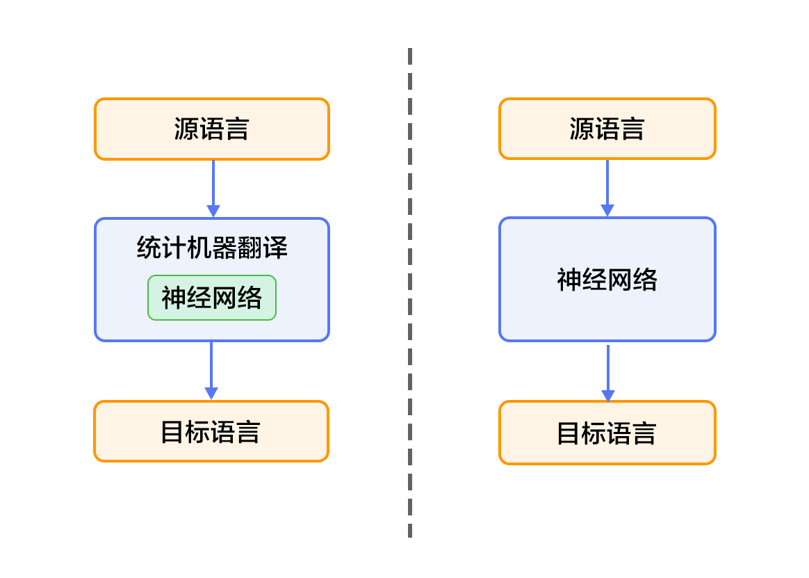

# 机器翻译

## 背景介绍

机器翻译（machine translation, MT）是用计算机来实现不同语言之间的翻译。被翻译的语言通常称为源语言（source language），翻译成的结果语言称为目标语言（target language）。机器翻译即实现从源语言到目标语言转换的过程，是自然语言处理的重要研究领域之一。

传统机器翻译，是让语言学家编写两种语言之间的转换规则，再将这些规则录入给计算机。但该方法对语言学家的要求非常高，并且，我们不可能知道一门语言究竟有多少隐含的使用规则，更何况两种甚至更多的语言。因此，传统机器翻译方法面临的主要挑战是无法得到一个完备的规则集合。

统计机器翻译（Statistical Machine Translation, SMT），其转化规则是由机器自动从大规模的语料中学习得到的，而非我们人主动提供规则。因此，它克服了传统方法面临的知识获取瓶颈问题，但仍然存在许多挑战：1）需要人为设计许多特征，但永远无法覆盖所有的语言规则；2）难以利用全局的特征；3）依赖于许多预处理环节，如词语对齐、中文分词、规则抽取、句法分析等，而每个环节的错误会逐步累积，对翻译的影响也越来越大。

面对上述挑战，一个较好的解决方法是利用神经网络。这类系统又大致分为两类：1）（见图1的左半部分）仍以统计机器翻译系统为框架，只是利用神经网络来改进其中的关键模块，如翻译模型、语言模型、调序模型等；2）（见图1的右半部分）不再以统计机器翻译系统为框架，而是直接用神经网络将源语言映射到目标语言，即端到端的神经网络机器翻译（Neural Machine Translation, NMT）。
<p align="center">
<br/>
图1. 基于神经网络的机器翻译系统
</p>

本教程主要介绍NMT模型，以及如何用PaddlePaddle来训练一个法英翻译（从法语翻译到英语）的模型。

## 效果展示

当法英翻译的模型训练完毕后，以下面的两句法语为例：
```text
Les avionneurs se querellent au sujet de la largeur des sièges alors que de grosses commandes sont en jeu Jet makers feud over seat width with big orders at stake
La dispute fait rage entre les grands constructeurs aéronautiques à propos de la largeur des sièges de la classe touriste sur les vols long-courriers , ouvrant la voie à une confrontation amère lors du salon aéronautique de Dubaï qui a lieu de mois-ci .	A row has flared up between leading plane makers over the width of tourist-class seats on long-distance flights , setting the tone for a bitter confrontation at this month &apos;s Dubai Airshow .

```
如果设定显示翻译结果的条数（即[集束搜索算法](#集束搜索算法)的宽度）为3，生成的英语句子如下：
```text
0
0	-19.0179   The <unk> will be rotated about the width of the seats , while large orders are at stake . <e>
1	-19.1114   The <unk> will be rotated about the width of the seats , while large commands are at stake . <e>
2	-19.5112   The <unk> will be rotated about the width of the seats , while large commands are at play . <e>

1
0	-28.1139	 The dispute is between the large aviation manufacturers about the width of the tourist seats on the <unk> flights , paving the way for a <unk> confrontation at the Dubai aviation fair , which is a month . <e>
1	-28.7138	 The dispute is between the large aviation manufacturers about the width of the tourist seats on the <unk> flights , paving the way for a <unk> confrontation at the Dubai aviation fair , which takes place months . <e>
2	-29.3381	 The dispute is between the large aviation manufacturers about the width of the tourist seats on the <unk> flights , paving the way for a <unk> confrontation at the Dubai aviation fair , which takes place in month . <e>
```
- 第一行的“0”和第6行的“1”表示翻译第几条法语句子。
- 其他六行列出了翻译结果，其中右起第一列是生成的英语句子，右起第二列是该条英语句子的得分（从大到小），右起第三列是该条句子的序号。
- 另外有两个特殊表示：`<e>`表示句子的结尾，`<unk>`表示无法识别（即不在训练字典中）的单词。

## 模型概览

本节依次介绍GRU（Gated Recurrent Unit，门控循环单元），双向RNN模型，NMT中典型的“编码器-解码器”（Encoder-Decoder）框架和“注意力”（Attention）机制，以及集束搜索（Beam Search）算法。

### GRU

GRU\[[1](#参考文献)\]是Cho等人在LSTM上提出的简化版本，如下图所示。GRU单元只有两个门，分别是重置门（Reset Gate）和更新门（Update Gate），用于控制记忆内容是否能继续保存下去。
<p align="center">
<br/>
图2. GRU门控循环单元
</p>

另外，Chung等人\[[2](#参考文献)\]通过多组实验表明，GRU虽然参数更少，但是在多个任务上都和LSTM有相近的表现。

### 双向RNN模型

理论上，RNN $t$时刻的输出，编码了所有到$t$时刻之前的历史信息。然而，标准的神经网络通常都忽略了未来时刻的下文信息。因此，如果能像访问历史上文信息一样来访问未来下文信息，很多序列学习任务都能从中获益。双向RNN就是解决这一问题的一种简单有效的方法，由Bengio等人在论文\[[1](#参考文献),[3](#参考文献)\]中提出。

双向RNN的每一个训练序列，向前和向后分别是两个循环神经网络（RNN），而且都连接着一个输出层。这个结构提供给输出层：输入序列中每一个点完整的过去和未来的下文信息。下图展示的是一个按时间步展开的双向循环神经网络。该网络包含一个前向（forward）和一个后向（backward）RNN，其中有六个权值：输入到前向隐层和后向隐层（$w_1, w_3$），隐层到隐层自己（$w_2,w_5$），前向隐层和后向隐层到输出层（$w_4, w_6$）。注意，该网络的前向隐层和后向隐层之间没有信息流。

<p align="center">
<br/>
图3. 按时间步展开的双向RNN网络
</p>

### 编码器-解码器框架

编码器-解码器（Encoder-Decoder）\[[1](#参考文献)\]框架用于解决一个任意长度的源序列到另一个任意长度的目标序列的变换问题。即编码阶段将整个源序列压缩成一个固定维度的向量，解码阶段以概率的方式从中解码出整个目标序列。编码和解码的过程通常都使用RNN实现，但由于普通的RNN存在梯度消失和梯度爆炸问题，因此会引入LSTM或GRU。
<p align="center">
<br/>
图4. 编码器-解码器框架
</p>

#### 编码器

编码阶段分为三步：
- 独热编码（one-hot coding，1-of-K coding）表示：将源语言句子$x=\left \{ x_1,x_2,...,x_T \right \}$的每个词表示成一个向量$w_i\epsilon R^{\left | V \right |},i=1,2,...,T$ （T暂不包括句子结束标记`<EOS>`）。这个向量的维度与词汇表大小$\left | V \right |$ 相同，并且只有一个维度上有值1（该位置对应该词在词汇表中的位置），其余全是0。
- 映射到低维语义空间的词向量：独热编码表示存在两个问题，1）生成的向量维度往往很大，容易造成维数灾难；2）无法刻画词与词之间的关系（如语义相似性，也就是无法很好地表达语义）。因此，需再映射到低维的语义空间，由一个固定维度的稠密向量（称为词向量）表示。记映射矩阵为$C\epsilon R^{K\times \left | V \right |}$，用$s_i=Cw_i$表示第$i$个词的词向量，向量维度$K$通常取100-500之间。
- 用RNN编码源语言词序列：这一过程的计算公式为$h_i=\varnothing _\theta \left ( h_{i-1}, s_i \right )$，其中$h_0$是一个全零的向量，最后得到的$h_T$就是整个源语言句子的编码。

编码阶段也可使用双向GRU，即一个词的隐层状态不仅编码了前面词的信息，还编码了后面词的信息。具体来说，前向GRU按照词序列$(x_1,x_2,...,x_T)$的顺序依次编码源语言端词，并得到一系列隐层状态$(\overrightarrow{h_1},\overrightarrow{h_2},...,\overrightarrow{h_T})$。类似得，后向GRU按照$(x_T,x_{T-1},...,x_1)$的顺序依次压缩源语言端词，得到$(\overleftarrow{h_1},\overleftarrow{h_2},...,\overleftarrow{h_T})$。最后对于词$x_i$，通过连接两个GRU的结果得到它的隐层状态，即$h_i=\left [ \overrightarrow{h_i^T},\overleftarrow{h_i^T} \right ]^{T}$。

<p align="center">
<br/>
图5. 使用双向GRU的编码器
</p>

#### 解码器

解码阶段的总体思路是：根据源语言句子的上下文向量（context vector）c、解码出来的第$i$个单词$u_i$和$i$时刻RNN的隐层状态$z_i$，计算出下一个隐层状态$z_{i+1}$，然后用softmax归一化得到概率分布$p_{i+1}$。训练模式时，根据$p_{i+1}$和目标语言词在字典中的标签计算代价，重复上述操作，直到目标语言序列中的所有词处理完毕。生成模式时，根据$p_{i+1}$采样出单词$u_{i+1}$，重复上述操作，直到获得句子结束标记`<EOS>`或超过句子的最大生成长度为止。

$z_i$的计算公式如下：

$$z_{i+1}=\phi _{\theta '}\left ( c,u_i,z_i \right )$$

其中$c=h_T$是源语言句子的上下文向量，$z_0$是一个全零的向量，$u_0$是源语言句子的结束标记`<EOS>`。

概率分布公式如下：

$$p\left ( u_i|u_{<i},\mathbf{x} \right )=softmax(W_sz_i+b_z)$$

其中$W_sz_i+b_z$是对每个可能的输出单词进行打分，再用softmax归一化就可以得到每个词的概率$p_i$。

### 注意力机制

在上述框架中，由于编码阶段压缩成的固定维度的向量，需要包含源语言序列的所有信息，对于长句子而言很难达到的。因此，Bahdanau等人\[[3](#参考文献)\]引入注意力（Attention）机制，其基本思想是目标语言端的词，往往只和源语言端的部分词相关。下面介绍在注意力机制的解码器结构。

与简单的解码器不同，这里$z_i$的计算公式为：

$$z_{i+1}=\phi _{\theta '}\left ( c_i,u_i,z_i \right )$$

可见，源语言句子的上下文向量由原来的$c$变成了第$i$个$c_i$，即针对每一个待解码的词$u_i$，都有一个特定的$c_i$与之对应。$c_i$的计算公式如下：

$$c_i=\sum _{j=1}^{T}\mathbf{a}_{ij}h_j, \mathbf{a}_i=\left[ \mathbf{a}_{i1},\mathbf{a}_{i2},...,\mathbf{a}_{iT}\right ]$$

从公式中可以看出，注意力机制即是通过对各个$h_j$进行加权平均实现的，其中权重$a_{ij}$表示待解码的词$u_i$对每个源词语$h_i$不同程度的注意力。具体权重计算公式见\[[3](#参考文献)\]。

<p align="center">
<br/>
图6. 基于注意力机制的解码器
</p>

### 集束搜索算法

集束搜索（[Beam Search](http://en.wikipedia.org/wiki/Beam_search)）是一种启发式图搜索算法，通常用在解空间较大的系统中，如机器翻译、语音识别等。原因是这些系统的数据集通常非常大，而且也没有唯一正确解，因此用最快的方法找到最接近正确的解才是系统的目标。

集束搜索算法使用广度优先策略建立搜索树，在树的每一层，按照启发代价（Heuristic Cost）（本教程中，为生成词的概率）对节点进行排序，然后仅留下预先确定的个数（Beam Width，Beam Size，集束宽度）的节点。只有这些节点会在下一层继续扩展，其他节点就被剪掉了，也就是说保留了质量较高的节点，剪掉了质量较差的节点。因此，搜索所占用的空间和时间大幅减少，但缺点是可能存在最优解被丢弃。

## 数据准备

### 下载与解压缩

本教程使用[WMT-14](http://www-lium.univ-lemans.fr/~schwenk/cslm_joint_paper/)数据集中的[bitexts(after selection)](http://www-lium.univ-lemans.fr/~schwenk/cslm_joint_paper/data/bitexts.tgz)作为训练集，[dev+test data](http://www-lium.univ-lemans.fr/~schwenk/cslm_joint_paper/data/dev+test.tgz)作为测试集和生成集。

在Linux下，只需简单地运行以下命令：
```bash
cd data
./wmt14_data.sh
```
得到的数据集`data/wmt14`包含如下三个文件夹：
<p align = "center">
<table>
<tr>
<td>文件夹名</td>
<td>法英平行语料文件</td>
<td>文件数</td>
<td>文件大小</td>
</tr>

<tr>
<td>train</td>
<td>ccb2_pc30.src, ccb2_pc30.trg, etc</td>
<td>12</td>
<td>3.55G</td>
</tr>

<tr>
<td>test</td>
<td>ntst1213.src, ntst1213.trg</td>
<td>2</td>
<td>1636k</td>
</tr>

</tr>
<tr>
<td>gen</td>
<td>ntst14.src, ntst14.trg</td>
<td>2</td>
<td>864k</td>
</tr>
</table>
</p>

- `XXX.src`是源法语文件，`XXX.trg`是目标英语文件，文件中的每行存放一个句子
- `XXX.src`和`XXX.trg`的行数一致，且两者任意第$i$行的句子之间都有着一一对应的关系。

### 用户自定义数据集（可选）

如果您想使用自己的数据集，只需按照如下方式组织，并将它们放在`data`目录下：
```text
user_dataset
├── train
│   ├── train_file1.src
│   ├── train_file1.trg
│   └── ...
├── test
│   ├── test_file1.src
│   ├── test_file1.trg
│   └── ...
├── gen
│   ├── gen_file1.src
│   ├── gen_file1.trg
│   └── ...
```
  
- 一级目录`user_dataset`：用户自定义的数据集名字。
- 二级目录`train`、`test`和`gen`：必须使用这三个文件夹名字。
- 三级目录：存放源语言到目标语言的平行语料库文件，后缀名必须使用`.src`和`.trg`。

### 数据预处理

我们的预处理流程包括两步：
- 将每个源语言到目标语言的平行语料库文件合并为一个文件：
  - 合并每个`XXX.src`和`XXX.trg`文件为`XXX`。
  - `XXX`中的第$i$行 = `XXX.src`中的第$i$行 + '\t' + `XXX.trg`中的第$i$行。
- 创建训练数据的“源字典”和“目标字典”。每个字典都有**DICTSIZE**个单词，包括：词频最高的（DICTSIZE - 3）个单词，和3个特殊符号`<s>`（序列的开始）、`<e>`（序列的结束）和`<unk>`（未包含在字典中的单词）。

预处理可以使用`preprocess.py`：
```python
python preprocess.py -i INPUT [-d DICTSIZE] [-m]
```
- `-i INPUT`：输入的原始数据集路径
- `-d DICTSIZE`：指定的字典单词数，如果没有设置，字典会包含输入数据集中的所有单词
- `-m --mergeDict`：合并 “源字典”和“目标字典”，使得两个字典有相同的上下文

本教程的具体命令如下：
```python
python preprocess.py -i data/wmt14 -d 30000
```
请耐心等待几分钟的时间，您会在屏幕上看到：
```text
concat parallel corpora for dataset
build source dictionary for train data
build target dictionary for train data
dictionary size is 30000
```
预处理好的数据集存放在`data/pre-wmt14`目录下：
```text
pre-wmt14
├── train
│   └── train
├── test
│   └── test
├── gen
│   └── gen
├── train.list
├── test.list
├── gen.list
├── src.dict
└── trg.dict
```
- `train`、`test`和`gen`：分别包含了法英平行语料库的训练、测试和生成数据。其每个文件的每一行均分为两部分，前半部分是法语序列，后半部分是对应的英语序列。
- `train.list`、`test.list`和`gen.list`：分别记录了`train`、`test`和`gen`文件夹中的文件路径。
- `src.dict`和`trg.dict`：源（法语）和目标（英语）字典。每个字典都含有30000个单词，包括29997个最高频单词和3个特殊符号。

### 提供数据给PaddlePaddle

我们通过`dataprovider.py`将数据提供给PaddlePaddle。具体步骤如下：

1. 首先，引入PaddlePaddle的PyDataProvider2包，并定义三个特殊符号。

   ```python
   from paddle.trainer.PyDataProvider2 import *
   UNK_IDX = 2    #未包含在字典中的单词
   START = "<s>"  #序列的开始
   END = "<e>"    #序列的结束
   ```
2. 其次，使用初始化函数`hook`，分别定义了训练模式和应用（这里为生成）模式下的数据输入格式（`input_types`）。其中`src_dict_path`（源语言字典路径）、`trg_dict_path`（目标语言字典路径）和`is_generating`（训练或生成模式）是从模型配置中传入的对象，调用方式请见[训练模型配置说明](#训练模型配置说明)。

   ```python
   def hook(settings, src_dict_path, trg_dict_path, is_generating, file_list, 
            **kwargs):
       # job_mode = 1: 训练模式；0: 生成模式
       settings.job_mode = not is_generating

       def fun(dict_path): # 根据字典路径加载字典
           out_dict = dict()
           with open(dict_path, "r") as fin:
               out_dict = {
                   line.strip(): line_count
                   for line_count, line in enumerate(fin)
               }
           return out_dict

       settings.src_dict = fun(src_dict_path)
       settings.trg_dict = fun(trg_dict_path)

       if settings.job_mode:                                  #训练模式
           settings.input_types = {
               'source_language_word':                        #源语言序列
               integer_value_sequence(len(settings.src_dict)),
               'target_language_word':                        #目标语言序列
               integer_value_sequence(len(settings.trg_dict)),
               'target_language_next_word':                   #目标语言的下一个词序列
               integer_value_sequence(len(settings.trg_dict))
           }
       else:                                                  #生成模式
           settings.input_types = {
               'source_language_word':                        #源语言序列
               integer_value_sequence(len(settings.src_dict)),
               'sent_id':                                     #源语言序列编号
               integer_value_sequence(len(open(file_list[0], "r").readlines()))
           }
   ```
3. 最后，使用`process`函数打开文本文件`file_name`，读取每一行，将行中的数据转换成与`input_types`一致的格式，再用`yield`关键字返回给PaddlePaddle进程。具体来说，

   - 在源语言序列的每句话前面补上开始符号`<s>`、末尾补上结束符号`<e>`；
   - 在目标语言序列的每句话前面补上`<s>`；
   - 在目标语言序列的每句话末尾补上`<s>`，作为目标语言的下一次词序列。

   ```python
   def _get_ids(s, dictionary): # 获得源语言序列中的每个单词在字典中的位置
       words = s.strip().split()
       return [dictionary[START]] + \
              [dictionary.get(w, UNK_IDX) for w in words] + \
              [dictionary[END]]

   @provider(init_hook=hook, pool_size=50000)
   def process(settings, file_name):
       with open(file_name, 'r') as f:
           for line_count, line in enumerate(f):
               line_split = line.strip().split('\t')
               if settings.job_mode and len(line_split) != 2:
                   continue
               src_seq = line_split[0]
               src_ids = _get_ids(src_seq, settings.src_dict)

               if settings.job_mode:
                   trg_seq = line_split[1]
                   trg_words = trg_seq.split()
                   trg_ids = [settings.trg_dict.get(w, UNK_IDX) for w in trg_words]

                   # 如果任意一个序列长度超过80个单词，在训练模式下会移除这条样本，以防止RNN过深。
                   if len(src_ids) > 80 or len(trg_ids) > 80:
                       continue
                   trg_ids_next = trg_ids + [settings.trg_dict[END]]
                   trg_ids = [settings.trg_dict[START]] + trg_ids
                   yield {
                       'source_language_word': src_ids,
                       'target_language_word': trg_ids,
                       'target_language_next_word': trg_ids_next
                   }
               else:
                   yield {'source_language_word': src_ids, 'sent_id': [line_count]}
   ```
注意：由于本示例中的训练数据有3.55G，对于内存较小的机器，不能一次性加载进内存，所以推荐使用`pool_size`变量来设置内存中暂存的数据条数。

## 模型配置说明

### 数据定义

1. 首先，定义数据集路径和源/目标语言字典路径，并用`is_generating`变量定义当前配置是训练模式（默认）还是应用模式。该变量接受从命令行传入的参数，使用方法见[应用命令与结果](#应用命令与结果)。

   ```python
   import os
   from paddle.trainer_config_helpers import *

   data_dir = "./data/pre-wmt14" # 数据集路径
   src_lang_dict = os.path.join(data_dir, 'src.dict') # 源语言字典路径
   trg_lang_dict = os.path.join(data_dir, 'trg.dict') # 目标语言字典路径
   is_generating = get_config_arg("is_generating", bool, False) # 配置模式
   ```
2. 其次，通过`define_py_data_sources2`函数从`dataprovider.py`中读取数据，并用`args`变量传入源/目标语言的字典路径以及配置模式。

   ```python
   if not is_generating:
       train_list = os.path.join(data_dir, 'train.list')
       test_list = os.path.join(data_dir, 'test.list')
   else:
       train_list = None
       test_list = os.path.join(data_dir, 'gen.list')

   define_py_data_sources2(
       train_list,
       test_list,
       module="dataprovider",
       obj="process",
       args={
           "src_dict_path": src_lang_dict, # 源语言字典路径
           "trg_dict_path": trg_lang_dict, # 目标语言字典路径
           "is_generating": is_generating  # 配置模式
       })
   ```

### 算法配置

```python
settings(
    learning_method = AdamOptimizer(),
    batch_size = 50 is not is_generating else 1,
    learning_rate = 5e-4 is not is_generating else 0)
```
本教程使用默认的SGD随机梯度下降算法和Adam学习方法。在训练过程中，指定batch_size为50，学习率是5e-4；在应用过程中，batch_size为1（每次生成1个序列），学习率为0。

### 模型结构
1. 首先，定义了一些全局变量。

   ```python
   source_dict_dim = len(open(src_lang_dict, "r").readlines()) # 源语言字典维度
   target_dict_dim = len(open(trg_lang_dict, "r").readlines()) # 目标语言字典维度
   word_vector_dim = 512 # dimension of word vector # 词向量维度
   encoder_size = 512 # 编码器中的GRU隐层大小
   decoder_size = 512 # 解码器中的GRU隐层大小

   if is_generating:
       beam_size=3 # # 集束算法中的宽度
       max_length=250 # 生成句子的最大长度
       gen_trans_file = get_config_arg("gen_trans_file", str, None) # 生成后的文件
  ```

2. 其次，实现基于注意力机制的编码器框架。分为三步：

   2.1 传入已经在`dataprovider.py`转换成独热编码表示的源语言序列$\mathbf{w}$。

   ```python
   src_word_id = data_layer(name='source_language_word', size=source_dict_dim)
   ```
   2.2 将上述编码映射到低维语言空间的词向量$\mathbf{s}$。

   ```python
   src_embedding = embedding_layer(
       input=src_word_id,
       size=word_vector_dim,
       param_attr=ParamAttr(name='_source_language_embedding'))
   ```
   2.3 用双向GRU编码源语言序列，将结果拼接成$\mathbf{h}$。
  
   ```python
   src_forward = simple_gru(input=src_embedding, size=encoder_size)
   src_backward = simple_gru(
       input=src_embedding, size=encoder_size, reverse=True)
   encoded_vector = concat_layer(input=[src_forward, src_backward])
   ```

3. 接着，定义基于注意力机制的解码器框架。

   3.1 对源语言序列编码后的结果，过一个前馈神经网络（Feed Forward Neural Network）。该层是3.3中`simple_attention`函数内部的一个计算步骤，但由于每个时间步该层的计算过程都一样，所以这里提取到外面单独计算以节省时间。
   
   ```python
   with mixed_layer(size=decoder_size) as encoded_proj:
       encoded_proj += full_matrix_projection(input=encoded_vector)
   ```
   3.2 取源语言序列编码后的最后一个词（即反向GRU的第一个词）传给解码阶段的RNN。即$\mathbf{c_0}=\mathbf{h_T}$。

   ```python
   backward_first = first_seq(input=src_backward)
   with mixed_layer(
           size=decoder_size,
           act=TanhActivation(), ) as decoder_boot:
       decoder_boot += full_matrix_projection(input=backward_first)
   ```
   3.3 定义解码阶段每一个时间步的RNN行为，即计算每一个时间步的隐层状态$z_i$和词概率$p_i$。

      - decoder_mem记录了前一个时间步的隐层状态$z_i$，其初始状态是decoder_boot，即$\mathbf{z_0}=\mathbf{c_0}$）。
      - context通过调用`simple_attention`函数，实现公式$c_i=\sum {j=1}^{T}\mathbf{a}{ij}h_j$。其中，enc_vec是$h_j$，enc_proj见3.1，权重$\mathbf{a}{ij}$的计算已经封装在`simple_attention`函数中。
      - decoder_inputs记录了针对该目标词的源语言句子的编码$c_i$，和当前目标词current_word（即$u_i$）。
      - gru_step通过调用`gru_step_layer`函数，在decoder_inputs和decoder_mem上做了激活操作，即实现公式$z_{i+1}=\phi _{\theta '}\left ( c_i,u_i,z_i \right )$。
      - 最后，使用softmax归一化计算单词的概率，将out结果返回，即实现公式$p\left ( u_i|u_{<i},\mathbf{x} \right )=softmax(W_sz_i+b_z)$。 
        
   ```python
   def gru_decoder_with_attention(enc_vec, enc_proj, current_word):
       decoder_mem = memory(
           name='gru_decoder', size=decoder_size, boot_layer=decoder_boot)

       context = simple_attention(
           encoded_sequence=enc_vec,
           encoded_proj=enc_proj,
           decoder_state=decoder_mem, )

       with mixed_layer(size=decoder_size * 3) as decoder_inputs:
           decoder_inputs += full_matrix_projection(input=context)
           decoder_inputs += full_matrix_projection(input=current_word)

       gru_step = gru_step_layer(
           name='gru_decoder',
           input=decoder_inputs,
           output_mem=decoder_mem,
           size=decoder_size)

       with mixed_layer(
               size=target_dict_dim, bias_attr=True,
               act=SoftmaxActivation()) as out:
           out += full_matrix_projection(input=gru_step)
       return out
    ```
4. 根据配置模式的不同，调用基于注意力机制的解码器框架。

   4.1 定义解码器框架名字，和`gru_decoder_with_attention`函数的前两个输入。注意：这两个输入使用`StaticInput`，说明它们都是只读的memory，即4.2中的`recurrent_group`函数不会按时间步对它们拆解，而是引用整个输入。具体说明可见[StaticInput文档](https://github.com/PaddlePaddle/Paddle/blob/develop/doc/howto/deep_model/rnn/recurrent_group_cn.md#输入)。

   ```python
   decoder_group_name = "decoder_group"
   group_input1 = StaticInput(input=encoded_vector, is_seq=True)
   group_input2 =  StaticInput(input=encoded_proj, is_seq=True)
   group_inputs = [group_input1, group_input2]
   ```
   4.2 训练模式下的调用：

      - 首先，将目标语言序列的词向量trg_embedding，直接作为训练模式下的current_word传给`gru_decoder_with_attention`函数。
      - 其次，使用`recurrent_group`函数循环调用`gru_decoder_with_attention`函数。
      - 接着，使用目标语言的下一个词序列作为标签层lbl。
      - 最后，用多类交叉熵损失函数`classification_cost`来计算损失值。

   ```python
   if not is_generating:
       trg_embedding = embedding_layer(
           input=data_layer(
               name='target_language_word', size=target_dict_dim),
           size=word_vector_dim,
           param_attr=ParamAttr(name='_target_language_embedding'))
       group_inputs.append(trg_embedding)

       decoder = recurrent_group(
           name=decoder_group_name,
           step=gru_decoder_with_attention,
           input=group_inputs)

       lbl = data_layer(name='target_language_next_word', size=target_dict_dim)
       cost = classification_cost(input=decoder, label=lbl)
       outputs(cost)
   ```
   4.3 应用模式下的调用：

      - 首先，在序列生成任务中，由于解码阶段的RNN总是引用上一时刻生成出的词的词向量，作为当前时刻的输入，因此，使用`GeneratedInput`来自动完成这一过程。具体说明可见[GeneratedInput文档](https://github.com/PaddlePaddle/Paddle/blob/develop/doc/howto/deep_model/rnn/recurrent_group_cn.md#输入)。
      - 其次，使用`beam_search`函数循环调用`gru_decoder_with_attention`函数，生成出序列id。
      - 最后，使用`seqtext_printer_evaluator`函数，根据目标字典`trg_lang_dict`，打印出完整的句子保存在`gen_trans_file`中。
     
   ```python
   else:
       trg_embedding = GeneratedInput(
           size=target_dict_dim,
           embedding_name='_target_language_embedding',
           embedding_size=word_vector_dim)
       group_inputs.append(trg_embedding)

       beam_gen = beam_search(
           name=decoder_group_name,
           step=gru_decoder_with_attention,
           input=group_inputs,
           bos_id=0,
           eos_id=1,
           beam_size=beam_size,
           max_length=max_length)

       seqtext_printer_evaluator(
           input=beam_gen,
           id_input=data_layer(
               name="sent_id", size=1),
           dict_file=trg_lang_dict,
           result_file=gen_trans_file)
       outputs(beam_gen)
   ```

## 训练模型

可以通过以下命令来训练模型：

```bash
./train.sh
```
其中`train.sh` 的内容为：

```bash
paddle train \
--config='seqToseq_net.py' \
--save_dir='model' \
--use_gpu=false \
--num_passes=16 \
--show_parameter_stats_period=100 \
--trainer_count=4 \
--log_period=10 \
--dot_period=5 \
2>&1 | tee 'train.log'
```
- config: 设置神经网络的配置文件。
- save_dir: 设置保存模型的输出路径。
- use_gpu: 是否使用GPU训练，这里使用CPU。
- num_passes: 设置passes的数量。PaddlePaddle中的一个pass表示对数据集中所有样本的一次完整训练。
- show_parameter_stats_period: 这里每隔100个batch显示一次参数统计信息。
- trainer_count: 设置CPU线程数或者GPU设备数。
- log_period: 这里每隔10个batch打印一次日志。
- dot_period: 这里每个5个batch打印一个点"."。

训练的损失函数每隔10个batch打印一次，您将会看到如下消息：
```text
I0719 19:16:45.952062 15563 TrainerInternal.cpp:160]  Batch=10 samples=500 AvgCost=198.475 CurrentCost=198.475 Eval: classification_error_evaluator=0.737155  CurrentEval: classification_error_evaluator=0.737155
I0719 19:17:56.707319 15563 TrainerInternal.cpp:160]  Batch=20 samples=1000 AvgCost=157.479 CurrentCost=116.483 Eval: classification_error_evaluator=0.698392  CurrentEval: classification_error_evaluator=0.659065
.....
```
- AvgCost：从第0个batch到当前batch的平均损失值。
- CurrentCost：当前batch的损失值。
- classification\_error\_evaluator(Eval)：从第0个评估到当前评估中，每个单词的预测错误率。
- classification\_error\_evaluator(CurrentEval)：当前评估中，每个单词的预测错误率。

当classification\_error\_evaluator的值低于0.35时，模型就训练成功了。

## 应用模型

### 下载预训练的模型

由于机器翻译模型的训练非常耗时，我们在50个物理节点（每节点含有2颗6核CPU）的集群中，花了5天时间训练了16个pass，其中每个pass耗时7个小时。因此，我们提供了一个预训练好的模型（pass-00012）供大家直接下载使用。该模型大小为205MB，在所有16个模型中有最高的[BLEU评估](#BLEU评估)值27.77。下载并解压模型的命令如下：
```bash
cd pretrained
./wmt14_model.sh
```

### 应用命令与结果

可以通过以下命令来进行法英翻译：

```bash
./gen.sh
```
其中`gen.sh` 的内容为：

```bash
paddle train \
--job=test \
--config='seqToseq_net.py' \
--save_dir='pretrained/wmt14_model' \
--use_gpu=true \
--num_passes=13 \
--test_pass=12 \
--trainer_count=1 \
--config_args=is_generating=1,gen_trans_file="gen_result" \
2>&1 | tee 'translation/gen.log'
```
与训练命令不同的参数如下：
- job：设置任务的模式为测试。
- save_dir：设置存放预训练模型的路径。
- num_passes和test_pass：加载第$i\epsilon \left [ test\_pass,num\_passes-1 \right ]$轮的模型参数，这里只加载 `data/wmt14_model/pass-00012`。
- config_args：将命令行中的自定义参数传递给模型配置。

翻译结果请见[效果展示](#效果展示)。

### BLEU评估

BLEU(Bilingual Evaluation understudy)是一种广泛使用的机器翻译自动评测指标，由IBM的watson研究中心于2002年提出\[[4](#参考文献)\]，基本出发点是：机器译文越接近专业翻译人员的翻译结果，翻译系统的性能越好。其中，机器译文与人工参考译文之间的接近程度，采用句子精确度（precision）的计算方法，即比较两者的n元词组相匹配的个数，匹配的个数越多，BLEU得分越好。

[Moses](http://www.statmt.org/moses/) 是一个统计学的开源机器翻译系统，我们使用其中的 [multi-bleu.perl](https://github.com/moses-smt/mosesdecoder/blob/master/scripts/generic/multi-bleu.perl) 来做BLEU评估。下载脚本的命令如下：
```bash
./moses_bleu.sh
```
本教程的BLEU评估命令如下（即默认使用`data/wmt14/gen/ntst14.trg`作为标准的翻译结果）：
```bash
./eval_bleu.sh FILE BEAMSIZE
```
其中，FILE为需要评估的文件名，BEAMSIZE为集束宽度。

## 总结

端到端的神经网络机器翻译是近几年兴起的一种全新的机器翻译方法。本章中，我们介绍了NMT中典型的“编码器-解码器”框架和“注意力”机制。由于NMT属于更抽象的Seq2Seq（Sequence to Sequence，序列到序列）问题，因此，Seq2Seq中的query改写（query rewriting）、图像描述（image captioning）等问题都可以用本教程的模型来解决。

## 参考文献

1. Cho K, Van Merriënboer B, Gulcehre C, et al. [Learning phrase representations using RNN encoder-decoder for statistical machine translation](https://arxiv.org/abs/1406.1078)[J]. arXiv preprint arXiv:1406.1078, 2014.
2. Chung J, Gulcehre C, Cho K H, et al. [Empirical evaluation of gated recurrent neural networks on sequence modeling](https://arxiv.org/abs/1412.3555)[J]. arXiv preprint arXiv:1412.3555, 2014.
3.  Bahdanau D, Cho K, Bengio Y. [Neural machine translation by jointly learning to align and translate](https://arxiv.org/abs/1409.0473)[J]. arXiv preprint arXiv:1409.0473, 2014.
4. Papineni K, Roukos S, Ward T, et al. [BLEU: a method for automatic evaluation of machine translation](http://dl.acm.org/citation.cfm?id=1073135)[C]//Proceedings of the 40th annual meeting on association for computational linguistics. Association for Computational Linguistics, 2002: 311-318.
