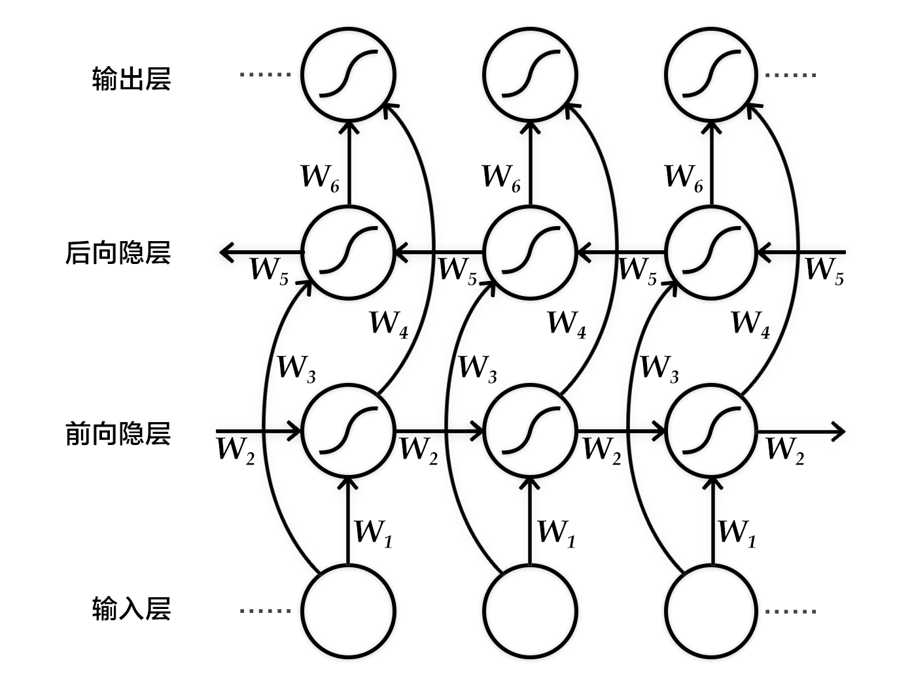
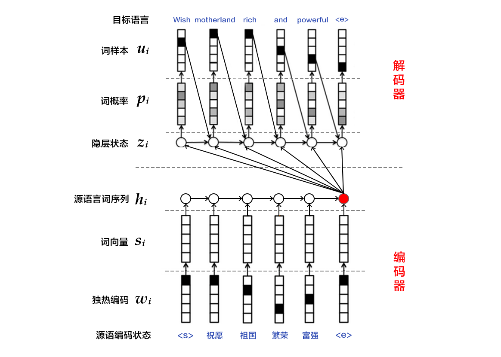
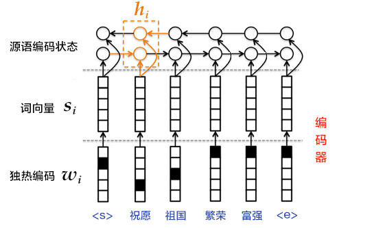

# 机器翻译

本教程源代码目录在[book/machine_translation](https://github.com/PaddlePaddle/book/tree/develop/machine_translation)， 初次使用请参考PaddlePaddle[安装教程](http://www.paddlepaddle.org/doc_cn/build_and_install/index.html)。

## 背景介绍

机器翻译（machine translation, MT）是用计算机来实现不同语言之间翻译的技术。被翻译的语言通常称为源语言（source language），翻译成的结果语言称为目标语言（target language）。机器翻译即实现从源语言到目标语言转换的过程，是自然语言处理的重要研究领域之一。

早期机器翻译系统多为基于规则的翻译系统，需要由语言学家编写两种语言之间的转换规则，再将这些规则录入计算机。该方法对语言学家的要求非常高，而且我们几乎无法总结一门语言会用到的所有规则，更何况两种甚至更多的语言。因此，传统机器翻译方法面临的主要挑战是无法得到一个完备的规则集合\[[1](#参考文献)\]。

为解决以上问题，统计机器翻译（Statistical Machine Translation, SMT）技术应运而生。在统计机器翻译技术中，转化规则是由机器自动从大规模的语料中学习得到的，而非我们人主动提供规则。因此，它克服了基于规则的翻译系统所面临的知识获取瓶颈的问题，但仍然存在许多挑战：1）人为设计许多特征（feature），但永远无法覆盖所有的语言现象；2）难以利用全局的特征；3）依赖于许多预处理环节，如词语对齐、分词或符号化（tokenization）、规则抽取、句法分析等，而每个环节的错误会逐步累积，对翻译的影响也越来越大。

近年来，深度学习技术的发展为解决上述挑战提供了新的思路。将深度学习应用于机器翻译任务的方法大致分为两类：1）仍以统计机器翻译系统为框架，只是利用神经网络来改进其中的关键模块，如语言模型、调序模型等（见图1的左半部分）；2）不再以统计机器翻译系统为框架，而是直接用神经网络将源语言映射到目标语言，即端到端的神经网络机器翻译（End-to-End Neural Machine Translation, End-to-End NMT）（见图1的右半部分），简称为NMT模型。
<p align="center">
<br/>
图1. 基于神经网络的机器翻译系统
</p>

本教程主要介绍NMT模型，以及如何用PaddlePaddle来训练一个NMT模型。

## 效果展示

以中英翻译（中文翻译到英文）的模型为例，当模型训练完毕时，如果输入如下已分词的中文句子：
```text
这些 是 希望 的 曙光 和 解脱 的 迹象 .
```
如果设定显示翻译结果的条数（即[柱搜索算法](#柱搜索算法)的宽度）为3，生成的英语句子如下：
```text
0 -5.36816   these are signs of hope and relief . <e>
1 -6.23177   these are the light of hope and relief . <e>
2 -7.7914  these are the light of hope and the relief of hope . <e>
```
- 左起第一列是生成句子的序号；左起第二列是该条句子的得分（从大到小），分值越高越好；左起第三列是生成的英语句子。
- 另外有两个特殊标志：`<e>`表示句子的结尾，`<unk>`表示未登录词（unknown word），即未在训练字典中出现的词。

## 模型概览

本节依次介绍GRU（Gated Recurrent Unit，门控循环单元），双向循环神经网络（Bi-directional Recurrent Neural Network），NMT模型中典型的编码器-解码器（Encoder-Decoder）框架和注意力（Attention）机制，以及柱搜索（beam search）算法。

### GRU

我们已经在[情感分析](https://github.com/PaddlePaddle/book/blob/develop/understand_sentiment/README.md)一章中介绍了循环神经网络（RNN）及长短时间记忆网络（LSTM）。相比于简单的RNN，LSTM增加了记忆单元（memory cell）、输入门（input gate）、遗忘门（forget gate）及输出门（output gate），这些门及记忆单元组合起来大大提升了RNN处理远距离依赖问题的能力。

GRU\[[2](#参考文献)\]是Cho等人在LSTM上提出的简化版本，也是RNN的一种扩展，如下图所示。GRU单元只有两个门：
- 重置门（reset gate）：如果重置门关闭，会忽略掉历史信息，即历史不相干的信息不会影响未来的输出。
- 更新门（update gate）：将LSTM的输入门和遗忘门合并，用于控制历史信息对当前时刻隐层输出的影响。如果更新门接近1，会把历史信息传递下去。
<p align="center">
<br/>
图2. GRU（门控循环单元）
</p>

一般来说，具有短距离依赖属性的序列，其重置门比较活跃；相反，具有长距离依赖属性的序列，其更新门比较活跃。另外，Chung等人\[[3](#参考文献)\]通过多组实验表明，GRU虽然参数更少，但是在多个任务上都和LSTM有相近的表现。

### 双向循环神经网络

我们已经在[语义角色标注](https://github.com/PaddlePaddle/book/blob/develop/label_semantic_roles/README.md)一章中介绍了一种双向循环神经网络，这里介绍Bengio团队在论文\[[2](#参考文献),[4](#参考文献)\]中提出的另一种结构。该结构的目的是输入一个序列，得到其在每个时刻的特征表示，即输出的每个时刻都用定长向量表示到该时刻的上下文语义信息。

具体来说，该双向循环神经网络分别在时间维以顺序和逆序——即前向（forward）和后向（backward）——依次处理输入序列，并将每个时间步RNN的输出拼接成为最终的输出层。这样每个时间步的输出节点，都包含了输入序列中当前时刻完整的过去和未来的上下文信息。下图展示的是一个按时间步展开的双向循环神经网络。该网络包含一个前向和一个后向RNN，其中有六个权重矩阵：输入到前向隐层和后向隐层的权重矩阵（$W_1, W_3$），隐层到隐层自己的权重矩阵（$W_2,W_5$），前向隐层和后向隐层到输出层的权重矩阵（$W_4, W_6$）。注意，该网络的前向隐层和后向隐层之间没有连接。

<p align="center">
<br/>
图3. 按时间步展开的双向循环神经网络
</p>

### 编码器-解码器框架

编码器-解码器（Encoder-Decoder）\[[2](#参考文献)\]框架用于解决由一个任意长度的源序列到另一个任意长度的目标序列的变换问题。即编码阶段将整个源序列编码成一个向量，解码阶段通过最大化预测序列概率，从中解码出整个目标序列。编码和解码的过程通常都使用RNN实现。
<p align="center">
<br/>
图4. 编码器-解码器框架
</p>

#### 编码器

编码阶段分为三步：

1. one-hot vector表示：将源语言句子$x=\left \{ x_1,x_2,...,x_T \right \}$的每个词$x_i$表示成一个列向量$w_i\epsilon R^{\left | V \right |},i=1,2,...,T$。这个向量$w_i$的维度与词汇表大小$\left | V \right |$ 相同，并且只有一个维度上有值1（该位置对应该词在词汇表中的位置），其余全是0。

2. 映射到低维语义空间的词向量：one-hot vector表示存在两个问题，1）生成的向量维度往往很大，容易造成维数灾难；2）难以刻画词与词之间的关系（如语义相似性，也就是无法很好地表达语义）。因此，需再one-hot vector映射到低维的语义空间，由一个固定维度的稠密向量（称为词向量）表示。记映射矩阵为$C\epsilon R^{K\times \left | V \right |}$，用$s_i=Cw_i$表示第$i$个词的词向量，$K$为向量维度。

3. 用RNN编码源语言词序列：这一过程的计算公式为$h_i=\varnothing _\theta \left ( h_{i-1}, s_i \right )$，其中$h_0$是一个全零的向量，$\varnothing _\theta$是一个非线性激活函数，最后得到的$\mathbf{h}=\left \{ h_1,..., h_T \right \}$就是RNN依次读入源语言$T$个词的状态编码序列。整句话的向量表示可以采用$\mathbf{h}$在最后一个时间步$T$的状态编码，或使用时间维上的池化（pooling）结果。

第3步也可以使用双向循环神经网络实现更复杂的句编码表示，具体可以用双向GRU实现。前向GRU按照词序列$(x_1,x_2,...,x_T)$的顺序依次编码源语言端词，并得到一系列隐层状态$(\overrightarrow{h_1},\overrightarrow{h_2},...,\overrightarrow{h_T})$。类似的，后向GRU按照$(x_T,x_{T-1},...,x_1)$的顺序依次编码源语言端词，得到$(\overleftarrow{h_1},\overleftarrow{h_2},...,\overleftarrow{h_T})$。最后对于词$x_i$，通过拼接两个GRU的结果得到它的隐层状态，即$h_i=\left [ \overrightarrow{h_i^T},\overleftarrow{h_i^T} \right ]^{T}$。

<p align="center">
<br/>
图5. 使用双向GRU的编码器
</p>

#### 解码器

机器翻译任务的训练过程中，解码阶段的目标是最大化下一个正确的源语言词的概率。思路是：

1. 每一个时刻，根据源语言句子的编码信息（又叫上下文向量，context vector）$c$、真实目标语言序列的第$i$个词$u_i$和$i$时刻RNN的隐层状态$z_i$，计算出下一个隐层状态$z_{i+1}$。计算公式如下：
   
   $$z_{i+1}=\phi _{\theta '}\left ( c,u_i,z_i \right )$$

   其中$\phi _{\theta '}$是一个非线性激活函数；$c=q\mathbf{h}$是源语言句子的上下文向量，在不使用[注意力机制](#注意力机制)时，如果[编码器](#编码器)的输出是源语言句子编码后的最后一个元素，则可以定义$c=h_T$；$u_i$是目标语言序列的第$i$个单词，$u_0$是目标语言序列的开始标记`<s>`，表示解码开始；$z_i$是$i$时刻解码RNN的隐层状态，$z_0$是一个全零的向量。

2. 将$z_{i+1}$通过`softmax`归一化，得到目标语言序列的第$i+1$个单词的概率分布$p_{i+1}$。概率分布公式如下：

   $$p\left ( u_{i+1}|u_{&lt;i+1},\mathbf{x} \right )=softmax(W_sz_{i+1}+b_z)$$

   其中$W_sz_{i+1}+b_z$是对每个可能的输出单词进行打分，再用softmax归一化就可以得到第$i+1$个词的概率$p_{i+1}$。

3. 根据$p_{i+1}$和$u_{i+1}$计算代价。
4. 重复步骤1~3，直到目标语言序列中的所有词处理完毕。

机器翻译任务的生成过程，通俗来讲就是根据预先训练的模型来翻译源语言句子。生成过程中的解码阶段和上述训练过程的有所差异，具体介绍请见[柱搜索算法](#柱搜索算法)。

### 注意力机制

如果编码阶段的输出是一个固定维度的向量，会带来以下两个问题：1）不论源语言序列的长度是5个词还是50个词，如果都用固定维度的向量去编码其中的语义和句法结构信息，对模型来说是一个非常高的要求，特别是对长句子序列而言；2）直觉上，当人类翻译一句话时，会对与当前译文更相关的源语言片段上给予更多关注，且关注点会随着翻译的进行而改变。而固定维度的向量则相当于，任何时刻都对源语言所有信息给予了同等程度的关注，这是不合理的。因此，Bahdanau等人\[[4](#参考文献)\]引入注意力（attention）机制，可以对编码后的上下文片段进行解码，以此来解决长句子的特征学习问题。下面介绍在注意力机制下的解码器结构。

与简单的解码器不同，这里$z_i$的计算公式为：

$$z_{i+1}=\phi _{\theta '}\left ( c_i,u_i,z_i \right )$$

可见，源语言句子的编码向量表示为第$i$个词的上下文片段$c_i$，即针对每一个目标语言中的词$u_i$，都有一个特定的$c_i$与之对应。$c_i$的计算公式如下：

$$c_i=\sum _{j=1}^{T}a_{ij}h_j, a_i=\left[ a_{i1},a_{i2},...,a_{iT}\right ]$$

从公式中可以看出，注意力机制是通过对编码器中各时刻的RNN状态$h_j$进行加权平均实现的。权重$a_{ij}$表示目标语言中第$i$个词对源语言中第$j$个词的注意力大小，$a_{ij}$的计算公式如下：

\begin{align}
a_{ij}&=\frac{exp(e_{ij})}{\sum_{k=1}^{T}exp(e_{ik})}\\\\
e_{ij}&=align(z_i,h_j)\\\\
\end{align}

其中，$align$可以看作是一个对齐模型，用来衡量目标语言中第$i$个词和源语言中第$j$个词的匹配程度。具体而言，这个程度是通过解码RNN的第$i$个隐层状态$z_i$和源语言句子的第$j$个上下文片段$h_j$计算得到的。传统的对齐模型中，目标语言的每个词明确对应源语言的一个或多个词（hard alignment）；而在注意力模型中采用的是soft alignment，即任何两个目标语言和源语言词间均存在一定的关联，且这个关联强度是由模型计算得到的实数，因此可以融入整个NMT框架，并通过反向传播算法进行训练。

<p align="center">
<br/>
图6. 基于注意力机制的解码器
</p>

### 柱搜索算法

柱搜索（[beam search](http://en.wikipedia.org/wiki/Beam_search)）是一种启发式图搜索算法，用于在图或树中搜索有限集合中的最优扩展节点，通常用在解空间非常大的系统（如机器翻译、语音识别）中，原因是内存无法装下图或树中所有展开的解。如在机器翻译任务中希望翻译“`<s>你好<e>`”，就算目标语言字典中只有3个词（`<s>`, `<e>`, `hello`），也可能生成无限句话（`hello`循环出现的次数不定），为了找到其中较好的翻译结果，我们可采用柱搜索算法。

柱搜索算法使用广度优先策略建立搜索树，在树的每一层，按照启发代价（heuristic cost）（本教程中，为生成词的log概率之和）对节点进行排序，然后仅留下预先确定的个数（文献中通常称为beam width、beam size、柱宽度等）的节点。只有这些节点会在下一层继续扩展，其他节点就被剪掉了，也就是说保留了质量较高的节点，剪枝了质量较差的节点。因此，搜索所占用的空间和时间大幅减少，但缺点是无法保证一定获得最优解。

使用柱搜索算法的解码阶段，目标是最大化生成序列的概率。思路是：

1. 每一个时刻，根据源语言句子的编码信息$c$、生成的第$i$个目标语言序列单词$u_i$和$i$时刻RNN的隐层状态$z_i$，计算出下一个隐层状态$z_{i+1}$。
2. 将$z_{i+1}$通过`softmax`归一化，得到目标语言序列的第$i+1$个单词的概率分布$p_{i+1}$。
3. 根据$p_{i+1}$采样出单词$u_{i+1}$。
4. 重复步骤1~3，直到获得句子结束标记`<e>`或超过句子的最大生成长度为止。

注意：$z_{i+1}$和$p_{i+1}$的计算公式同[解码器](#解码器)中的一样。且由于生成时的每一步都是通过贪心法实现的，因此并不能保证得到全局最优解。

## 数据准备

### 下载与解压缩

本教程使用[WMT-14](http://www-lium.univ-lemans.fr/~schwenk/cslm_joint_paper/)数据集中的[bitexts(after selection)](http://www-lium.univ-lemans.fr/~schwenk/cslm_joint_paper/data/bitexts.tgz)作为训练集，[dev+test data](http://www-lium.univ-lemans.fr/~schwenk/cslm_joint_paper/data/dev+test.tgz)作为测试集和生成集。

在Linux下，只需简单地运行以下命令：
```bash
cd data
./wmt14_data.sh
```
得到的数据集`data/wmt14`包含如下三个文件夹：
<p align = "center">
<table>
<tr>
<td>文件夹名</td>
<td>法英平行语料文件</td>
<td>文件数</td>
<td>文件大小</td>
</tr>

<tr>
<td>train</td>
<td>ccb2_pc30.src, ccb2_pc30.trg, etc</td>
<td>12</td>
<td>3.55G</td>
</tr>

<tr>
<td>test</td>
<td>ntst1213.src, ntst1213.trg</td>
<td>2</td>
<td>1636k</td>
</tr>

</tr>
<tr>
<td>gen</td>
<td>ntst14.src, ntst14.trg</td>
<td>2</td>
<td>864k</td>
</tr>
</table>
</p>

- `XXX.src`是源法语文件，`XXX.trg`是目标英语文件，文件中的每行存放一个句子
- `XXX.src`和`XXX.trg`的行数一致，且两者任意第$i$行的句子之间都有着一一对应的关系。

### 用户自定义数据集（可选）

如果您想使用自己的数据集，只需按照如下方式组织，并将它们放在`data`目录下：
```text
user_dataset
├── train
│   ├── train_file1.src
│   ├── train_file1.trg
│   └── ...
├── test
│   ├── test_file1.src
│   ├── test_file1.trg
│   └── ...
├── gen
│   ├── gen_file1.src
│   ├── gen_file1.trg
│   └── ...
```
  
- 一级目录`user_dataset`：用户自定义的数据集名字。
- 二级目录`train`、`test`和`gen`：必须使用这三个文件夹名字。
- 三级目录：存放源语言到目标语言的平行语料库文件，后缀名必须使用`.src`和`.trg`。

### 数据预处理

我们的预处理流程包括两步：
- 将每个源语言到目标语言的平行语料库文件合并为一个文件：
  - 合并每个`XXX.src`和`XXX.trg`文件为`XXX`。
  - `XXX`中的第$i$行内容为`XXX.src`中的第$i$行和`XXX.trg`中的第$i$行连接，用'\t'分隔。
- 创建训练数据的“源字典”和“目标字典”。每个字典都有**DICTSIZE**个单词，包括：语料中词频最高的（DICTSIZE - 3）个单词，和3个特殊符号`<s>`（序列的开始）、`<e>`（序列的结束）和`<unk>`（未登录词）。

预处理可以使用`preprocess.py`：
```python
python preprocess.py -i INPUT [-d DICTSIZE] [-m]
```
- `-i INPUT`：输入的原始数据集路径。
- `-d DICTSIZE`：指定的字典单词数，如果没有设置，字典会包含输入数据集中的所有单词。
- `-m --mergeDict`：合并“源字典”和“目标字典”，即这两个字典的内容完全一样。

本教程的具体命令如下：
```python
python preprocess.py -i data/wmt14 -d 30000
```
请耐心等待几分钟的时间，您会在屏幕上看到：
```text
concat parallel corpora for dataset
build source dictionary for train data
build target dictionary for train data
dictionary size is 30000
```
预处理好的数据集存放在`data/pre-wmt14`目录下：
```text
pre-wmt14
├── train
│   └── train
├── test
│   └── test
├── gen
│   └── gen
├── train.list
├── test.list
├── gen.list
├── src.dict
└── trg.dict
```
- `train`、`test`和`gen`：分别包含了法英平行语料库的训练、测试和生成数据。其每个文件的每一行以“\t”分为两列，第一列是法语序列，第二列是对应的英语序列。
- `train.list`、`test.list`和`gen.list`：分别记录了`train`、`test`和`gen`文件夹中的文件路径。
- `src.dict`和`trg.dict`：源（法语）和目标（英语）字典。每个字典都含有30000个单词，包括29997个最高频单词和3个特殊符号。

### 提供数据给PaddlePaddle

我们通过`dataprovider.py`将数据提供给PaddlePaddle。具体步骤如下：

1. 首先，引入PaddlePaddle的PyDataProvider2包，并定义三个特殊符号。

   ```python
   from paddle.trainer.PyDataProvider2 import *
   UNK_IDX = 2    #未登录词
   START = "<s>"  #序列的开始
   END = "<e>"    #序列的结束
   ```
2. 其次，使用初始化函数`hook`，分别定义了训练模式和生成模式下的数据输入格式（`input_types`）。
   - 训练模式：有三个输入序列，其中“源语言序列”和“目标语言序列”作为输入数据，“目标语言的下一个词序列”作为标签数据。
   - 生成模式：有两个输入序列，其中“源语言序列”作为输入数据，“源语言序列编号”作为输入数据的编号（该输入非必须，可以省略）。
  
  `hook`函数中的`src_dict_path`是源语言字典路径，`trg_dict_path`是目标语言字典路径，`is_generating`（训练或生成模式）是从模型配置中传入的对象。`hook`函数的具体调用方式请见[训练模型配置说明](#训练模型配置说明)。

   ```python
   def hook(settings, src_dict_path, trg_dict_path, is_generating, file_list, 
            **kwargs):
       # job_mode = 1: 训练模式；0: 生成模式
       settings.job_mode = not is_generating

       def fun(dict_path): # 根据字典路径加载字典
           out_dict = dict()
           with open(dict_path, "r") as fin:
               out_dict = {
                   line.strip(): line_count
                   for line_count, line in enumerate(fin)
               }
           return out_dict

       settings.src_dict = fun(src_dict_path)
       settings.trg_dict = fun(trg_dict_path)

       if settings.job_mode:                                  #训练模式
           settings.input_types = {
               'source_language_word':                        #源语言序列
               integer_value_sequence(len(settings.src_dict)),
               'target_language_word':                        #目标语言序列
               integer_value_sequence(len(settings.trg_dict)),
               'target_language_next_word':                   #目标语言的下一个词序列
               integer_value_sequence(len(settings.trg_dict))
           }
       else:                                                  #生成模式
           settings.input_types = {
               'source_language_word':                        #源语言序列
               integer_value_sequence(len(settings.src_dict)),
               'sent_id':                                     #源语言序列编号
               integer_value_sequence(len(open(file_list[0], "r").readlines()))
           }
   ```
3. 最后，使用`process`函数打开文本文件`file_name`，读取每一行，将行中的数据转换成与`input_types`一致的格式，再用`yield`关键字返回给PaddlePaddle进程。具体来说，

   - 在源语言序列的每句话前面补上开始符号`<s>`、末尾补上结束符号`<e>`，得到“source_language_word”；
   - 在目标语言序列的每句话前面补上`<s>`，得到“target_language_word”；
   - 在目标语言序列的每句话末尾补上`<e>`，作为目标语言的下一个词序列（“target_language_next_word”）。

   ```python
   def _get_ids(s, dictionary): # 获得源语言序列中的每个单词在字典中的位置
       words = s.strip().split()
       return [dictionary[START]] + \
              [dictionary.get(w, UNK_IDX) for w in words] + \
              [dictionary[END]]

   @provider(init_hook=hook, pool_size=50000)
   def process(settings, file_name):
       with open(file_name, 'r') as f:
           for line_count, line in enumerate(f):
               line_split = line.strip().split('\t')
               if settings.job_mode and len(line_split) != 2:
                   continue
               src_seq = line_split[0]
               src_ids = _get_ids(src_seq, settings.src_dict)

               if settings.job_mode:
                   trg_seq = line_split[1]
                   trg_words = trg_seq.split()
                   trg_ids = [settings.trg_dict.get(w, UNK_IDX) for w in trg_words]

                   # 如果任意一个序列长度超过80个单词，在训练模式下会移除这条样本，以防止RNN过深。
                   if len(src_ids) > 80 or len(trg_ids) > 80:
                       continue
                   trg_ids_next = trg_ids + [settings.trg_dict[END]]
                   trg_ids = [settings.trg_dict[START]] + trg_ids
                   yield {
                       'source_language_word': src_ids,
                       'target_language_word': trg_ids,
                       'target_language_next_word': trg_ids_next
                   }
               else:
                   yield {'source_language_word': src_ids, 'sent_id': [line_count]}
   ```
注意：由于本示例中的训练数据有3.55G，对于内存较小的机器，不能一次性加载进内存，所以推荐使用`pool_size`变量来设置内存中暂存的数据条数。

## 模型配置说明

### 数据定义

1. 首先，定义数据集路径和源/目标语言字典路径，并用`is_generating`变量定义当前配置是训练模式（默认）还是生成模式。该变量接受从命令行传入的参数，使用方法见[应用命令与结果](#应用命令与结果)。

   ```python
   import os
   from paddle.trainer_config_helpers import *

   data_dir = "./data/pre-wmt14" # 数据集路径
   src_lang_dict = os.path.join(data_dir, 'src.dict') # 源语言字典路径
   trg_lang_dict = os.path.join(data_dir, 'trg.dict') # 目标语言字典路径
   is_generating = get_config_arg("is_generating", bool, False) # 配置模式
   ```
2. 其次，通过`define_py_data_sources2`函数从`dataprovider.py`中读取数据，并用`args`变量传入源/目标语言的字典路径以及配置模式。

   ```python
   if not is_generating:
       train_list = os.path.join(data_dir, 'train.list')
       test_list = os.path.join(data_dir, 'test.list')
   else:
       train_list = None
       test_list = os.path.join(data_dir, 'gen.list')

   define_py_data_sources2(
       train_list,
       test_list,
       module="dataprovider",
       obj="process",
       args={
           "src_dict_path": src_lang_dict, # 源语言字典路径
           "trg_dict_path": trg_lang_dict, # 目标语言字典路径
           "is_generating": is_generating  # 配置模式
       })
   ```

### 算法配置

```python
settings(
    learning_method = AdamOptimizer(),
    batch_size = 50,
    learning_rate = 5e-4)
```
本教程使用默认的SGD随机梯度下降算法和Adam学习方法，并指定学习率为5e-4。注意：生成模式下的`batch_size = 50`，表示同时生成50条序列。

### 模型结构
1. 首先，定义了一些全局变量。

   ```python
   source_dict_dim = len(open(src_lang_dict, "r").readlines()) # 源语言字典维度
   target_dict_dim = len(open(trg_lang_dict, "r").readlines()) # 目标语言字典维度
   word_vector_dim = 512 # dimension of word vector # 词向量维度
   encoder_size = 512 # 编码器中的GRU隐层大小
   decoder_size = 512 # 解码器中的GRU隐层大小

   if is_generating:
       beam_size=3 # # 柱搜索算法中的宽度
       max_length=250 # 生成句子的最大长度
       gen_trans_file = get_config_arg("gen_trans_file", str, None) # 生成后的文件
  ```

2. 其次，实现编码器框架。分为三步：

   2.1 传入已经在`dataprovider.py`转换成one-hot vector表示的源语言序列$\mathbf{w}$。

   ```python
   src_word_id = data_layer(name='source_language_word', size=source_dict_dim)
   ```
   2.2 将上述编码映射到低维语言空间的词向量$\mathbf{s}$。

   ```python
   src_embedding = embedding_layer(
       input=src_word_id,
       size=word_vector_dim,
       param_attr=ParamAttr(name='_source_language_embedding'))
   ```
   2.3 用双向GRU编码源语言序列，拼接两个GRU的编码结果得到$\mathbf{h}$。
  
   ```python
   src_forward = simple_gru(input=src_embedding, size=encoder_size)
   src_backward = simple_gru(
       input=src_embedding, size=encoder_size, reverse=True)
   encoded_vector = concat_layer(input=[src_forward, src_backward])
   ```

3. 接着，定义基于注意力机制的解码器框架。分为三步：

   3.1 对源语言序列编码后的结果（见2.3），过一个前馈神经网络（Feed Forward Neural Network），得到其映射。
   
   ```python
   with mixed_layer(size=decoder_size) as encoded_proj:
       encoded_proj += full_matrix_projection(input=encoded_vector)
   ```
   3.2 构造解码器RNN的初始状态。由于解码器需要预测时序目标序列，但在0时刻并没有初始值，所以我们希望对其进行初始化。这里采用的是将源语言序列逆序编码后的最后一个状态进行非线性映射，作为该初始值，即$c_0=h_T$。

   ```python
   backward_first = first_seq(input=src_backward)
   with mixed_layer(
           size=decoder_size,
           act=TanhActivation(), ) as decoder_boot:
       decoder_boot += full_matrix_projection(input=backward_first)
   ```
   3.3 定义解码阶段每一个时间步的RNN行为，即根据当前时刻的源语言上下文向量$c_i$、解码器隐层状态$z_i$和目标语言中第$i$个词$u_i$，来预测第$i+1$个词的概率$p_{i+1}$。

      - decoder_mem记录了前一个时间步的隐层状态$z_i$，其初始状态是decoder_boot。
      - context通过调用`simple_attention`函数，实现公式$c_i=\sum {j=1}^{T}a_{ij}h_j$。其中，enc_vec是$h_j$，enc_proj是$h_j$的映射（见3.1），权重$a_{ij}$的计算已经封装在`simple_attention`函数中。
      - decoder_inputs融合了$c_i$和当前目标词current_word（即$u_i$）的表示。
      - gru_step通过调用`gru_step_layer`函数，在decoder_inputs和decoder_mem上做了激活操作，即实现公式$z_{i+1}=\phi _{\theta '}\left ( c_i,u_i,z_i \right )$。
      - 最后，使用softmax归一化计算单词的概率，将out结果返回，即实现公式$p\left ( u_i|u_{&lt;i},\mathbf{x} \right )=softmax(W_sz_i+b_z)$。 
        
   ```python
   def gru_decoder_with_attention(enc_vec, enc_proj, current_word):
       decoder_mem = memory(
           name='gru_decoder', size=decoder_size, boot_layer=decoder_boot)

       context = simple_attention(
           encoded_sequence=enc_vec,
           encoded_proj=enc_proj,
           decoder_state=decoder_mem, )

       with mixed_layer(size=decoder_size * 3) as decoder_inputs:
           decoder_inputs += full_matrix_projection(input=context)
           decoder_inputs += full_matrix_projection(input=current_word)

       gru_step = gru_step_layer(
           name='gru_decoder',
           input=decoder_inputs,
           output_mem=decoder_mem,
           size=decoder_size)

       with mixed_layer(
               size=target_dict_dim, bias_attr=True,
               act=SoftmaxActivation()) as out:
           out += full_matrix_projection(input=gru_step)
       return out
    ```
4. 训练模式与生成模式下的解码器调用区别。

   4.1 定义解码器框架名字，和`gru_decoder_with_attention`函数的前两个输入。注意：这两个输入使用`StaticInput`，具体说明可见[StaticInput文档](https://github.com/PaddlePaddle/Paddle/blob/develop/doc/howto/deep_model/rnn/recurrent_group_cn.md#输入)。

   ```python
   decoder_group_name = "decoder_group"
   group_input1 = StaticInput(input=encoded_vector, is_seq=True)
   group_input2 =  StaticInput(input=encoded_proj, is_seq=True)
   group_inputs = [group_input1, group_input2]
   ```
   4.2 训练模式下的解码器调用：

      - 首先，将目标语言序列的词向量trg_embedding，直接作为训练模式下的current_word传给`gru_decoder_with_attention`函数。
      - 其次，使用`recurrent_group`函数循环调用`gru_decoder_with_attention`函数。
      - 接着，使用目标语言的下一个词序列作为标签层lbl，即预测目标词。
      - 最后，用多类交叉熵损失函数`classification_cost`来计算损失值。

   ```python
   if not is_generating:
       trg_embedding = embedding_layer(
           input=data_layer(
               name='target_language_word', size=target_dict_dim),
           size=word_vector_dim,
           param_attr=ParamAttr(name='_target_language_embedding'))
       group_inputs.append(trg_embedding)

       decoder = recurrent_group(
           name=decoder_group_name,
           step=gru_decoder_with_attention,
           input=group_inputs)

       lbl = data_layer(name='target_language_next_word', size=target_dict_dim)
       cost = classification_cost(input=decoder, label=lbl)
       outputs(cost)
   ```
   4.3 生成模式下的解码器调用：

      - 首先，在序列生成任务中，由于解码阶段的RNN总是引用上一时刻生成出的词的词向量，作为当前时刻的输入，因此，使用`GeneratedInput`来自动完成这一过程。具体说明可见[GeneratedInput文档](https://github.com/PaddlePaddle/Paddle/blob/develop/doc/howto/deep_model/rnn/recurrent_group_cn.md#输入)。
      - 其次，使用`beam_search`函数循环调用`gru_decoder_with_attention`函数，生成出序列id。
      - 最后，使用`seqtext_printer_evaluator`函数，根据目标字典`trg_lang_dict`，打印出完整的句子保存在`gen_trans_file`中。
     
   ```python
   else:
       trg_embedding = GeneratedInput(
           size=target_dict_dim,
           embedding_name='_target_language_embedding',
           embedding_size=word_vector_dim)
       group_inputs.append(trg_embedding)

       beam_gen = beam_search(
           name=decoder_group_name,
           step=gru_decoder_with_attention,
           input=group_inputs,
           bos_id=0,
           eos_id=1,
           beam_size=beam_size,
           max_length=max_length)

       seqtext_printer_evaluator(
           input=beam_gen,
           id_input=data_layer(
               name="sent_id", size=1),
           dict_file=trg_lang_dict,
           result_file=gen_trans_file)
       outputs(beam_gen)
   ```
注意：我们提供的配置在Bahdanau的论文\[[4](#参考文献)\]上做了一些简化，可参考[issue #1133](https://github.com/PaddlePaddle/Paddle/issues/1133)。


## 训练模型

可以通过以下命令来训练模型：

```bash
./train.sh
```
其中`train.sh` 的内容为：

```bash
paddle train \
--config='seqToseq_net.py' \
--save_dir='model' \
--use_gpu=false \
--num_passes=16 \
--show_parameter_stats_period=100 \
--trainer_count=4 \
--log_period=10 \
--dot_period=5 \
2>&1 | tee 'train.log'
```
- config: 设置神经网络的配置文件。
- save_dir: 设置保存模型的输出路径。
- use_gpu: 是否使用GPU训练，这里使用CPU。
- num_passes: 设置passes的数量。PaddlePaddle中的一个pass表示对数据集中所有样本的一次完整训练。
- show_parameter_stats_period: 这里每隔100个batch显示一次参数统计信息。
- trainer_count: 设置CPU线程数或者GPU设备数。
- log_period: 这里每隔10个batch打印一次日志。
- dot_period: 这里每个5个batch打印一个点"."。

训练的损失函数每隔10个batch打印一次，您将会看到如下消息：
```text
I0719 19:16:45.952062 15563 TrainerInternal.cpp:160]  Batch=10 samples=500 AvgCost=198.475 CurrentCost=198.475 Eval: classification_error_evaluator=0.737155  CurrentEval: classification_error_evaluator=0.737155
I0719 19:17:56.707319 15563 TrainerInternal.cpp:160]  Batch=20 samples=1000 AvgCost=157.479 CurrentCost=116.483 Eval: classification_error_evaluator=0.698392  CurrentEval: classification_error_evaluator=0.659065
.....
```
- AvgCost：从第0个batch到当前batch的平均损失值。
- CurrentCost：当前batch的损失值。
- classification\_error\_evaluator(Eval)：从第0个评估到当前评估中，每个单词的预测错误率。
- classification\_error\_evaluator(CurrentEval)：当前评估中，每个单词的预测错误率。

当classification\_error\_evaluator的值低于0.35时，模型就训练成功了。

## 应用模型

### 下载预训练的模型

由于NMT模型的训练非常耗时，我们在50个物理节点（每节点含有2颗6核CPU）的集群中，花了5天时间训练了16个pass，其中每个pass耗时7个小时。因此，我们提供了一个预先训练好的模型（pass-00012）供大家直接下载使用。该模型大小为205MB，在所有16个模型中有最高的[BLEU评估](#BLEU评估)值26.92。下载并解压模型的命令如下：
```bash
cd pretrained
./wmt14_model.sh
```

### 应用命令与结果

可以通过以下命令来进行法英翻译：

```bash
./gen.sh
```
其中`gen.sh` 的内容为：

```bash
paddle train \
--job=test \
--config='seqToseq_net.py' \
--save_dir='pretrained/wmt14_model' \
--use_gpu=true \
--num_passes=13 \
--test_pass=12 \
--trainer_count=1 \
--config_args=is_generating=1,gen_trans_file="gen_result" \
2>&1 | tee 'translation/gen.log'
```
与训练命令不同的参数如下：
- job：设置任务的模式为测试。
- save_dir：设置存放预训练模型的路径。
- num_passes和test_pass：加载第$i\epsilon \left [ test\_pass,num\_passes-1 \right ]$轮的模型参数，这里只加载 `data/wmt14_model/pass-00012`。
- config_args：将命令行中的自定义参数传递给模型配置。`is_generating=1`表示当前为生成模式，`gen_trans_file="gen_result"`表示生成结果的存储文件。

翻译结果请见[效果展示](#效果展示)。

### BLEU评估

BLEU(Bilingual Evaluation understudy)是一种广泛使用的机器翻译自动评测指标，由IBM的watson研究中心于2002年提出\[[5](#参考文献)\]，基本出发点是：机器译文越接近专业翻译人员的翻译结果，翻译系统的性能越好。其中，机器译文与人工参考译文之间的接近程度，采用句子精确度（precision）的计算方法，即比较两者的n元词组相匹配的个数，匹配的个数越多，BLEU得分越好。

[Moses](http://www.statmt.org/moses/) 是一个统计学的开源机器翻译系统，我们使用其中的 [multi-bleu.perl](https://github.com/moses-smt/mosesdecoder/blob/master/scripts/generic/multi-bleu.perl) 来做BLEU评估。下载脚本的命令如下：
```bash
./moses_bleu.sh
```
BLEU评估可以使用`eval_bleu`脚本如下，其中FILE为需要评估的文件名，BEAMSIZE为柱宽度，默认使用`data/wmt14/gen/ntst14.trg`作为标准的翻译结果。
```bash
./eval_bleu.sh FILE BEAMSIZE
```
本教程的具体命令如下：
```bash
./eval_bleu.sh gen_result 3
```
您会在屏幕上看到：
```text
BLEU = 26.92
```

## 总结

端到端的神经网络机器翻译是近几年兴起的一种全新的机器翻译方法。本章中，我们介绍了NMT中典型的“编码器-解码器”框架和“注意力”机制。由于NMT是一个典型的Seq2Seq（Sequence to Sequence，序列到序列）学习问题，因此，Seq2Seq中的query改写（query rewriting）、摘要、单轮对话等问题都可以用本教程的模型来解决。

## 参考文献

1. Koehn P. [Statistical machine translation](https://books.google.com.hk/books?id=4v_Cx1wIMLkC&printsec=frontcover&hl=zh-CN&source=gbs_ge_summary_r&cad=0#v=onepage&q&f=false)[M]. Cambridge University Press, 2009.
2. Cho K, Van Merriënboer B, Gulcehre C, et al. [Learning phrase representations using RNN encoder-decoder for statistical machine translation](http://www.aclweb.org/anthology/D/D14/D14-1179.pdf)[C]//Proceedings of the 2014 Conference on Empirical Methods in Natural Language Processing (EMNLP), 2014: 1724-1734.
3. Chung J, Gulcehre C, Cho K H, et al. [Empirical evaluation of gated recurrent neural networks on sequence modeling](https://arxiv.org/abs/1412.3555)[J]. arXiv preprint arXiv:1412.3555, 2014.
4.  Bahdanau D, Cho K, Bengio Y. [Neural machine translation by jointly learning to align and translate](https://arxiv.org/abs/1409.0473)[C]//Proceedings of ICLR 2015, 2015.
5. Papineni K, Roukos S, Ward T, et al. [BLEU: a method for automatic evaluation of machine translation](http://dl.acm.org/citation.cfm?id=1073135)[C]//Proceedings of the 40th annual meeting on association for computational linguistics. Association for Computational Linguistics, 2002: 311-318.

<br/>
<a rel="license" href="http://creativecommons.org/licenses/by-nc-sa/4.0/"></a><br /><span xmlns:dct="http://purl.org/dc/terms/" href="http://purl.org/dc/dcmitype/Text" property="dct:title" rel="dct:type">本教程</span> 由 <a xmlns:cc="http://creativecommons.org/ns#" href="http://book.paddlepaddle.org" property="cc:attributionName" rel="cc:attributionURL">PaddlePaddle</a> 创作，采用 <a rel="license" href="http://creativecommons.org/licenses/by-nc-sa/4.0/">知识共享 署名-非商业性使用-相同方式共享 4.0 国际 许可协议</a>进行许可。
