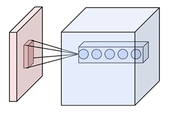

# 手写字符识别教程

## 背景介绍
当我们学习编程的时候，编写的第一个程序一般是实现打印"Hello World"。而就像编程语言有"Hello World"，机器学习则有 [MNIST](http://yann.lecun.com/exdb/mnist/) 数据库。MNIST数据库是手写字符，属于机器学习中典型的图像分类问题，而由于其问题简单，数据集完备，因此常常被作为机器学习入门的教程。

MNIST数据库作为一个简单的计算机视觉数据集，包含一系列如下的手写数字:
<p align="center">
<br/>
图1. MNIST图片示例
</p>
其同时包含每张图片的标签，标签告诉我们图像中包含的数字是什么。例如，上面的图片中对应的标签为[3, 4, 7, 0, 4, 1, 1, 4, 3, 1]。该数据有60,000条数据的训练集，10,000条数据的测试集。其是更大的数据集NIST的一个子集。MNIST数据集中的数字经过了大小归一化和图片居中的处理。 MNIST数据集从NIST的Special Database 3和Special Database 1构建而来，NIST最初利用SD-3作为训练集，而SD-1作为测试集。然而，SD-3比SD-1更干净，更容易识别，因为SD-3是Census Bureau（人口调查局）的员工进行标注的，而SD-1来自高中生的标注。要训练出合理的模型，需要消除数据集的偏差，因此Yann LeCun等人构建了MNIST数据库，从SD-1和SD-3中各取一半作为MNIST的训练集和测试集，其中训练集来自250位标注员的手写，并且保证了训练集和测试集手写标注员也不相同。


该数据库的提供者Yann  LeCun，早先在手写字符识别上做了很多研究，并在研究过程中提出了卷积神经网络，大幅度地提高了手写字符的识别能力，也因此成为了深度学习领域的奠基人之一。如今的深度学习领域，卷积神经网络占据了至关重要的地位，从最早Yann LeCun提出的简单LeNet，到如今ImageNet大赛上的优胜模型VGGNet、GoogLeNet等。现在的卷积神经网络核心与LeNet类似，但它们在网络结构上要复杂很多，有了更多的组织技巧，如GoogLeNet的Inception模块、以及为了防止过拟合的正则和BatchNorm等等方法。

事实上，许多人对MNIST手写字符的识别做了研究，除了采用不同的分类器之外，人们还考虑用许多预处理的方法（如deskewing（去除歪曲），noise removal（去噪），blurring（模糊）等等）来提高识别的准确率。 Yann LeCunn关于[MNIST数据库] (http://yann.lecun.com/exdb/mnist/) 的网站中介绍多种分类器加上多种预处理方法对于该数据库识别效果的表格。
其中包含的分类器有：

1. 线性分类器(Linear Classifiers)
2. K-近邻法(K-Nearest Neighbors)
3. Boosting算法(Boosted Stumps)
4. 非线性分类器(Non-Linear Classifiers)
5. 支持向量机(SVMs)
6. 神经网络(Neural Nets)
7. 卷积神经网络(Convolutional nets)

我们要介绍的Softmax回归，多层感知器和卷积神经网络就分别对应上面的1、6和7分类器，以下为表格中相关的部分：

<p align="center">
<table>
<tr>
<th> 分类器 </th> 
<th> 预处理 </th> 
<th> 测试误差</th>  
<th> 参考文献 </th>
</tr>

<tr>
<td> linear classifier (1-layer NN) </td>  
<td> none </td> 
<td> 12.0 </td> 
<td> [LeCun et al. 1998] (http://yann.lecun.com/exdb/publis/index.html#lecun-98) </td>
</tr>

<tr>
<td> linear classifier (1-layer NN) </td> 
<td> deskewing </td>  
<td> 8.4 </td> 
<td> [LeCun et al. 1998] (http://yann.lecun.com/exdb/publis/index.html#lecun-98) </td>
</tr>

<tr>
<td> 2-layer NN, 300 hidden units, mean square error </td>  
<td> none </td>  
<td> 4.7 </td>  
<td> [LeCun et al. 1998] (http://yann.lecun.com/exdb/publis/index.html#lecun-98) </td>
</tr> 

<tr>
<td>2-layer NN, 300 HU </td> 
<td> deskewing </td>  
<td> 1.6 </td>
<td> [LeCun et al. 1998] (http://yann.lecun.com/exdb/publis/index.html#lecun-98) </td>
</tr>

<tr>
<td> 2-layer NN, 800 HU, Cross-Entropy Loss </td>
<td> none </td> 
<td> 1.6 </td> 
<td> [Simard et al., ICDAR 2003] (https://www.microsoft.com/en-us/research/publication/best-practices-for-convolutional-neural-networks-applied-to-visual-document-analysis/) </td>
</tr>

<tr>
<td> Convolutional net LeNet-1 </td> 
<td> subsampling to 16x16 pixels </td>  
<td> 1.7 </td> 
<td> [LeCun et al. 1998] (http://yann.lecun.com/exdb/publis/index.html#lecun-98) </td>
</tr>

<tr>
<td> Convolutional net LeNet-4 </td>
<td> none </td> 
<td> 1.1 </td>  
<td> [LeCun et al. 1998] (http://yann.lecun.com/exdb/publis/index.html#lecun-98) </td>
</tr>

<tr>
<td> Convolutional net LeNet-5, [no distortions] </td> 
<td> none </td>  
<td> 0.95 </td>  
<td> [LeCun et al. 1998] (http://yann.lecun.com/exdb/publis/index.html#lecun-98) </td>
</tr>

</table>
</p>

从上表中，我们可以大致看出模型从简单到复杂的过程中，测试误差逐渐降低。

本章中，我们希望通过简单的模型带大家入门利用神经网络进行图像识别，并逐步深入进行模型优化。


## 模型概览

###问题说明：
基于MNIST数据，我们希望训练一个分类器 $f$，对于每张给定的图片数据 $x$ ，预测结果为 $f(x)$ ，应该尽可能准确的接近真实标签(label)。这是一个多分类问题，神经网络中通常使用   `softmax` 函数计算多分类问题中，每一类的概率。为了熟悉 `softmax` 函数，我们定义最简单的多分类网络：将输入层经过一个线性映射得到的特征，直接通过 `softmax` 函数进行多分类。


### Softmax回归(Softmax Regression)

MNIST数据库的图片为 $28X28$ 的二维图像，为了进行计算，我们一般将上将 $28X28$ 的二维图像转化为 $n(n=784)$ 维的向量，因此我们采用$x_i(i=0,1,2,...,n-1)$来表示输入的图片数据。同时，我们采用$y_i(i=0,1,2,..9)$来表示输出，其含义为：
比如说，如果图片的数字标签为3，则$y_i$组成的向量为[0,0,0,1,0,0,0,0,0,0]。输入层的数据x传到 `softmax` 层，在激活操作之前，会乘以相应的权重 $w$ ，并加上偏置变量 $b$ ，具体如下：

$$ net_i = \sum_j W_{i,j}x_j + b_i $$

`net` 是激活前的值（仅仅进行了矩阵乘法），然后再用 `softmax` 函数进行激活：
其中 `softmax` 函数的定义如下：

$$ softmax(x_i) = \frac{e^{x_i}}{\sum_j e^{x_j}} $$

即:

$$ y_i = \frac{e^{net_i}}{\sum_j e^{net_j}} $$

在神经网络中，多分类问题一般用 `softmax` 函数来作为输出。对于有 `N` 个类别的多分类问题，指定 `N` 个输出节点，`N` 维输入特征经过 `softmax` 将归一化为 `N` 个[0,1]范围内的实数值，分别表示该样本属于这N个类别的概率。此处的 $y_i$ 即对应该图片为数字 `i` 的概率。

以下为softmax回归的网络图：
<p align="center">
<br/>
图2. softmax回归网络结构图<br/>
注：图中权重用黑线表示，偏置用红线表示，+1代表偏置参数的系数为1
</p>

神经网络模型的构建包括网络配置在内，通常有以下几个步骤:

1. 网络结构配置
2. 初始化参数，其中包括训练参数权重W和偏置b，以及超参数训练速度 $\eta$、 `batchSize` 和训练轮次 `Pass` 等等，训练参数随着网络的迭代不断更新，而超参数一般是在网络初始化的时候给定好的。 
3. 前向传播计算网络输出和代价损失函数。
4. 根据代价损失函数进行反向误差传播，更新训练参数。
5. 重复3~4步骤，直至网络训练误差达到规定的程度或训练轮次达到设定值。

对于以上步骤4，神经网络的训练采用 `backpropagation` 的形式，其一般会定义一个损失函数（也称目标函数），训练的目的是为了减小目标函数的
值。在分类问题中，我们一般采用交叉熵代价损失函数(cross entropy)，其形式如下：


### 多层感知器(Multilayer Perceptron, MLP)

在softmax回归中，我们采用了最简单的两层神经网络，分别为输入的datalayer层和输出的 `softmax` 层，模型比较简单，意味着
其拟合能力有限。因此，为了达到更好的识别效果，我们可以考虑在输入层和输出层中间加上若干个隐藏层。

在该网络层中，我们有输入X($x_i(i=0,1,2,...,n-1)$)，输出标签Y($y_i(i=0,1,2,..9)$)，为了表示方便，以下我们都直接
用向量计算来表示。经过第一层网络，我们可以得到：

$$ H_1 = activation(W_1X + b_1) $$

上面，`activation` 代表激活函数，其常见的为 `sigmoid` ，`tanh` 或 `ReLU` 等函数。
经过第二层网络，可以得到：

$$ H_2 = activation(W_2H_1 + b_2) $$

最后，再经过输出层：

$$ Y = softmax(W_3H_2 + b_3) $$

得到的P即为最后的预测结果向量。
<p align="center">
<br/>
图3. 多层感知器网络结构图<br/>
注：图中权重用黑线表示，偏置用红线表示，+1代表偏置参数的系数为1
</p>

### 卷积神经网络(Convolutional Neural Network, CNN)

#### 卷积层
<p align="center">
<br/>
图4. 卷积层图片<br/>
</p>
卷积层是卷积神经网络的核心基石。该层的参数由一组可学习的过滤器（也叫作卷积核）组成。在前向过程中，每个卷积核在输入层进行横向和纵向的扫描，与输入层对应扫描位置进行卷积，得到的结果加上偏置并用相应的激活函数进行激活，结果能够得到一个二维的激活图(activation map)。每个特定的卷积核都能得到特定的激活图(activation map)，如有的卷积核可能对识别边角，有的可能识别圆圈，那这些卷积核可能对于对应的特征响应要强。

#### 池化层
<p align="center">
<br/>
图5. 池化层图片<br/>
</p>
卷积神经网络另外一个重要的概念就是池化层，这是非线性下采样的一种形式。有许多种非线性函数能够完成下采样的功能，而其中用的最多的就是最大池化。如上所示，其用特定大小不重叠的矩形框将输入层分成不同的区域，然后对于每一个矩形框内的数，取最大值来代表这个区域，从而得到输出层。池化层的主要作用是减少网络的参数，从而能够减小计算量，并且能够控制过拟合。通常情况下在卷积层的后面都会加上一个池化层。

池化包括最大池化、平均池化等等。

#### LeNet-5网络
<p align="center">
<br/>
图6. 卷积神经网络结构<br/>
</p>
上面的网络是典型的LeNet结构，从中我们可以看出，从输入的二维图像，经过两次卷积->池化，然后再经过全连接，最后的输出层是 `softmax` 分类层。


### 常见激活函数介绍
- sigmoid激活函数：

$$ f(x) = \frac{1}{1+e^{-x}} $$

- tanh激活函数：

$$ f(x) = tanh(x) = \frac{e^x-e^{-x}}{e^x+e^{-x}} $$

实际上，`tanh` 函数只是规模变化的 `sigmoid` 函数：

$$ tanh(x) = 2sigmoid(2x) - 1 $$

- ReLU激活函数：

$$ f(x) = max(0, x) $$


## 数据准备

### 数据介绍与下载

- 我们首先下载 <a href="http://yann.lecun.com/exdb/mnist/">MNIST</a>数据库,该数据库是手写字符识别常用的数据库。执行以下命令，进行下载：

```bash
./data/get_mnist_data.sh
```

- 将下载下来的数据进行 `gzip` 解压，可以在文件夹 `data/raw_data` 中找到以下文件：

<p align="center">
<table>
<tr>
<td> t10k-images-idx3-ubyte </td> 
<td> 测试数据图片，10,000条数据 </td>
</tr> 

<tr>
<td> t10k-labels-idx1-ubyte </td> 
<td> 测试数据标签，10,000条数据 </td>
</tr>

<tr>
<td> train-images-idx3-ubyte </td> 
<td> 训练数据图片，60,000条数据 </td>
</tr>

<tr>
<td> train-labels-idx1-ubyte </td>   
<td> 训练数据标签，60,000条数据 </td>
</tr>
</table>
</p>

-     MNIST的每条数据可以分为两部分：手写字符图片和对应的标签。图片是28X28的像素矩阵，而标签则对应着0~9的10个数字，我们随机选取训练集中的10张图片进行绘制，并给出选取图片对应的标签，绘制脚本为 `./data/draw_data.py`。

<p align="center">
<br/>
</p>

```python
label: [3, 4, 7, 0, 4, 1, 1, 4, 3, 1]
```

### 提供数据给PaddlePaddle

首先是用PaddlePaddle的 `PyDataProvider2` 来为模型导入数据，如 `mnist_provider.py` 中所示。
在下面代码中，`process` 函数读取MNIST数据，然后用 `yield` 函数返回数据的生成器，然后用 `@provider` 对返回的数据进行包装
(具体的过程见 `PaddlePaddle_root_path/python/paddle/trainer/PyDataProvider2.py`，从而方便以PaddlePaddle DataProvider对象的形式进行调用。

```python
# Define a py data provider
@provider(
    input_types={'pixel': dense_vector(28 * 28),
                 'label': integer_value(10)},
    cache=CacheType.CACHE_PASS_IN_MEM)
def process(settings, filename):  # settings is not used currently.
    imgf = filename + "-images-idx3-ubyte"
    labelf = filename + "-labels-idx1-ubyte"
    f = open(imgf, "rb")
    l = open(labelf, "rb")

    f.read(16)
    l.read(8)

    # Define number of samples for train/test
    if "train" in filename:
        n = 60000
    else:
        n = 10000

    images = numpy.fromfile(
        f, 'ubyte', count=n * 28 * 28).reshape((n, 28 * 28)).astype('float32')
    images = images / 255.0 * 2.0 - 1.0
    labels = numpy.fromfile(l, 'ubyte', count=n).astype("int")

    for i in xrange(n):
        yield {"pixel": images[i, :], 'label': labels[i]}

    f.close()
    l.close()
```


## 模型配置说明

### 数据定义

首先配置数据，如上给出在训练过程中，训练(train_list)和测试数据集(test_list)的位置，指定数据提供模块(module)函数，目标函数(obj)代表在module中提供数据的函数。

```python
####################Data Configuration ##################

 if not is_predict:
     data_dir = './data/'
     define_py_data_sources2(
         train_list=data_dir + 'train.list',
         test_list=data_dir + 'test.list',
         module='mnist_provider',
         obj='process')
```

### 算法配置

 然后指定训练相关的参数，`batch` 大小( `batch_size` )表示神经网络每次训练使用的数据为128条，训练速度( `learning_rate` )是迭代
的速度，影响着网络的训练收敛速度有关系，训练方法( `learning_method` )代表训练过程在更新权重时采用动量优化器
( `MomentumOptimizer` )，其中参数0.9代表动量优化每次保持前一次速度的0.9倍，正则化( `regularization` )是防止网络过拟合的一
种手段，此处采用L2正则化。

```python
######################Algorithm Configuration #############
settings(
    batch_size=128,
    learning_rate=0.1 / 128.0,
    learning_method=MomentumOptimizer(0.9),
    regularization=L2Regularization(0.0005 * 128))
```

### 模型结构

#### Softmax回归

定义好 `dataprovider` 之后，就可以通过 `data_layer` 调用来获取数据 `img`，然后通过一层简单的 `softmax`
全连接层，得到预测的结果，然后指定训练的损失函数为分类损失( `classification_cost` )，一般分类问题的损失函数为交叉熵
损失函数( `cross_entropy` )。
通过控制变量 `is_predict` ，该配置脚本也可以在预测时候使用，将 `is_predict` 置为 `True` ，则最后直接输出预测结果，而不会经过
损失函数来进行训练过程。

```python
#######################Network Configuration #############

data_size = 1 * 28 * 28
label_size = 10
img = data_layer(name='pixel', size=data_size)

# softmax regression is used
predict = fc_layer(input=img, size=10, act=SoftmaxActivation())
```

#### 多层感知器

以下是一个简单的带有两个隐藏层的多层感知器，也就是全连接网络，两个隐藏层的激活函数均采用 `ReLU` 函数，最后的输出层用
`softmax` 激活函数。

```python
#######################Network Configuration #############

# The first fully-connected layer
hidden1 = fc_layer(input=img, size=128, act=ReluActivation())
# The second fully-connected layer and the according activation function
hidden2 = fc_layer(input=hidden1, size=64, act=ReluActivation())
# The thrid fully-connected layer, note that the hidden size should be 10,
# which is the number of unique digits
predict = fc_layer(input=hidden2, size=10, act=SoftmaxActivation())
```

#### 卷积神经网络LeNet-5

以下为LeNet-5的网络结构

```python
#######################Network Configuration #############

# first conv layer
conv_pool_1 = simple_img_conv_pool(
    input=img,
    filter_size=5,
    num_filters=20,
    num_channel=1,
    pool_size=2,
    pool_stride=2,
    act=TanhActivation())
# second conv layer
conv_pool_2 = simple_img_conv_pool(
    input=conv_pool_1,
    filter_size=5,
    num_filters=50,
    num_channel=20,
    pool_size=2,
    pool_stride=2,
    act=TanhActivation())
# The first fully-connected layer
fc1 = fc_layer(input=conv_pool_2, size=128, act=TanhActivation())
# The softmax layer, note that the hidden size should be 10,
# which is the number of unique digits
predict = fc_layer(input=fc1, size=10, act=SoftmaxActivation())
```

## 训练模型
最后，就可以通过配置训练脚本 `train.sh` 来执行训练过程：

```bash
config=softmax_mnist.py                 # mlp: mlp_mnist.py             cnn: cnn_mnist.py
output=./softmax_mnist_model            # mlp: ./mlp_mnist_model        cnn: ./cnn_mnist_model 
log=softmax_train.log                   # mlp: mlp_train.log            cnn: cnn_train.log

paddle train \
--config=$config \
--dot_period=10 \
--log_period=100 \
--test_all_data_in_one_period=1 \
--use_gpu=0 \
--trainer_count=1 \
--num_passes=100 \
--save_dir=$output \
2>&1 | tee $log

python -m paddle.utils.plotcurve -i $log > plot.png
```

参数意义分别为：
- config:  网络配置的脚本。
- dot_period:  在每训练 `dot_period` 个批次后打印一个 `.`。
- log_period:  每隔多少batch打印一次日志。
- test_all_data_in_one_period:  每次测试是否用所有的数据。
- use_gpu:	是否使用GPU。
- trainer_count:  使用CPU或GPU的个数。
- num_passed:  训练进行的轮数（每次训练使用完所有数据为1轮）。
- save_dir:  模型存储的位置。
配置好参数之后，执行脚本 `./train.sh` 训练日志如下所示：

模型训练的日志类似如下：

```
I1227 02:58:08.519176   275 Util.cpp:229] copy mlp_mnist.py to ./mlp_mnist_model/pass-00087
.........
I1227 02:58:09.395433   275 TrainerInternal.cpp:165]  Batch=100 samples=12800 AvgCost=0.200571 CurrentCost=0.200571 Eval: classification_error_evaluator=0.0621875  CurrentEval: classification_error_evaluator=0.0621875 
.........
I1227 02:58:10.265552   275 TrainerInternal.cpp:165]  Batch=200 samples=25600 AvgCost=0.21248 CurrentCost=0.224389 Eval: classification_error_evaluator=0.065625  CurrentEval: classification_error_evaluator=0.0690625 
.........
I1227 02:58:11.120333   275 TrainerInternal.cpp:165]  Batch=300 samples=38400 AvgCost=0.209837 CurrentCost=0.204553 Eval: classification_error_evaluator=0.0649479  CurrentEval: classification_error_evaluator=0.0635938 
.........
I1227 02:58:11.964988   275 TrainerInternal.cpp:165]  Batch=400 samples=51200 AvgCost=0.215699 CurrentCost=0.233282 Eval: classification_error_evaluator=0.0667773  CurrentEval: classification_error_evaluator=0.0722656 
......I1227 02:58:12.554342   275 TrainerInternal.cpp:181]  Pass=88 Batch=469 samples=60000 AvgCost=0.218966 Eval: classification_error_evaluator=0.0676833 
I1227 02:58:12.871682   275 Tester.cpp:109]  Test samples=10000 cost=0.214518 Eval: classification_error_evaluator=0.064 
I1227 02:58:12.871961   275 GradientMachine.cpp:113] Saving parameters to ./mlp_mnist_model/pass-00088
I1227 02:58:12.873564   275 Util.cpp:229] copy mlp_mnist.py to ./mlp_mnist_model/pass-00088
.
```

## 应用模型
### 训练误差图及评估
用脚本 `plot_error.py` 可以画出训练过程中的误差变化曲线：

```bash
python plot_error.py softmax_train.log              # mlp: mlp_train.log        cnn: cnn_train.log
```

#### softmax回归

<p align="center">
<br/>
图8. softmax回归训练误差图<br/>
</p>

用脚本 `evaluate.py ` 可以选出最好的Pass训练出来的模型，可以执行以下命令：

```bash
python evaluate.py softmax_train.log
```

得到的结果类似如下：

```text
Best pass is 00047, error is 0.473053, which means predict get error as 0.343894
The classification accuracy is 89.49%
```

从上面过程中可以看到，softmax回归模型分类效果最好的时候是pass-00047，分类准确率为89.49%，而最终的pass-00099的准确率为85.39%。
从图中也可以看出，准确率最好的时候并以不定是最后一个pass的模型。

#### 多层感知器

<p align="center">
<br/>
图9. 多层感知器训练误差图
</p>

```text
Best pass is 00085, error is 0.164746, which means predict get error as 0.202945
The classification accuracy is 94.95%
```

从训练日志中我们可以看出，最终训练的准确率为94.95%。这是多层感知器网络分类分类效果，可以
看到其相对于softmax回归来说有了显著的分类效果的提升。但是，这还不是最好的分类效果，后面，我们可以看到卷积神经
网络对于图像分类能够达到更为惊人的准确率。

#### 卷积神经网络

<p align="center">
<br/>
图10. 卷积神经网络训练误差图
</p>

```text
Best pass is 00076, error is 0.0244684, which means predict get error as 0.078212
The classification accuracy is 99.20%
```

从训练日志中我们可以看出，最终训练的准确率为99.20%。由此可以看到，对于图像问题而言，卷积神经网络能够
比一般全连接网络达到更好的识别效果，而这与卷积层的性质是分不开的。同时，我们可以看到，卷积神经网络在
很早的时候就能达到好的效果，说明其训练收敛的速度很快。


### 预测命令与结果
用脚本  `predict.py` 用训练好的模型进行预测，例如softmax回归中：

- -c 指定模型的结构
- -d 指定需要预测的数据源，这里用测试数据集进行预测
- -m 指定模型的参数，这里用之前训练效果最好的模型进行预测

```bash
python predict.py -c softmax_mnist.py -d ../data/raw_data/ -m softmax_mnist_model/pass-00047
```

根据提示，输入需要预测的图片的序号，则分类器能够给出预测的结果和实际的标签。

```
Input image_id [0~9999]: 3
[[  1.00000000e+00   1.60381094e-28   1.60381094e-28   1.60381094e-28
    1.60381094e-28   1.60381094e-28   1.60381094e-28   1.60381094e-28
    1.60381094e-28   1.60381094e-28]]
0 0
```

上面，给出的向量是神经网络输出的十维向量，可以理解为分类为各个数字的概率，实际预测的类即为向量中
值最大的一项。如上，代表该分类器接近100%的认为该图片上面的数字为0，而实际标签给出的类也确实如此。


## 总结
从上面的过程中，我们了解到了softmax回归、多层感知器和卷积神经网络都是最基础的机器学习模型，而复杂的神经网络
都是从这些衍生出来的，因此了解了这些基本的东西之后，对于我们之后的学习大有裨益。在这过程中，我们也观察到当我们将模型从简单的
Softmax回归到稍微复杂的卷积神经网络的时候，识别准确率有了大幅度的提升，而这与卷积层的加入是密切联系的，这启发我们在之后遇到新的
模型的时候，要认识到新模型相对于其他模型来说效果提升的关键之处。此外，在体验用PaddlePaddle搭建模型识别MNIST图片的同时
我们了解了PaddlePaddle模型搭建的过程，从dataprovider的编写，到网络层的构建，到最后的训练和预测，是用PaddlePaddle实现自定义模型的一个
基本流程。对这个流程熟悉以后，我们可以用自己的数据，定义自己的网络模型，来完成自己的训练和预测任务。

## 参考文献

1. http://yann.lecun.com/exdb/mnist/
2. LeCun, Yann, et al. "Gradient-based learning applied to document recognition." Proceedings of the IEEE 86.11 (1998): 2278-2324.
3. Simard, Patrice Y., David Steinkraus, and John C. Platt. "Best practices for convolutional neural networks applied to visual document analysis." ICDAR. Vol. 3. 2003.
