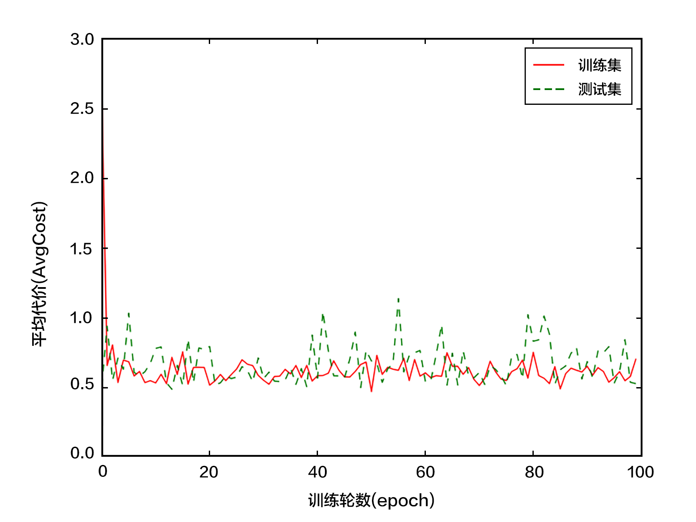

# 手写字符识别教程

## 背景介绍
当我们学习编程的时候，编写的第一个程序一般是实现打印"Hello World"。而就像编程语言有"Hello World"，机器学习则
有MNIST数据库。MNIST数据库是手写字符，属于机器学习中典型的图像分类问题，而由于其问题简单，数据集完备，因此
常常被作为机器学习入门的教程。


该数据库的提供者Yann LeCun，他早起在手写字符识别上做了很多研究，在研究过程中
提出了卷积神经网络，大幅度的提高了识别能力，也因此成为了深度学习领域的奠基人之一。如今的深度学习领域，卷积
神经网络占据了至关重要的地位，从最早Yann LeCun提出的简单LeNet，到如今ImageNet大赛上的优胜模型VGGNet，GoogLeNet,
虽然在网络结构上要复杂很多，但是其核心还是与LeNet类似，只不过在网络的组织上面有了更多的技巧，如GoogLeNet的
Inception模块，以及深度学习为了防止过拟合，还会加入正则，BatchNorm等等方法。


MNIST数据库作为一个简单的计算机视觉数据集，包含一系列如下的手写数字:
<p align="center">
<br/>
图1. MNIST图片示例
</p>
其同时包含每张图片的标签，标签告诉我们图像中包含的数字是什么。例如，上面的图片中对应的标签为[3, 4, 7, 0, 4, 1, 1, 4, 3, 1]
本教程作为入门教程，希望给初学者讲述机器学习和PaddlePaddle的入门知识。在该教程中，我们会训练一个模型，该模型会扫描给定的图片，然后给出对应的标签。


我们意图并不是展示一个对于此类问题的完美的模型，而是会首先给出一个简单的模型，然后逐步深入的优化模型，让初学者感受复杂的模型是如何带来效
果上提升的。


## 模型概览
### Softmax回归(Softmax Regression)

####问题说明：
给予MNIST数据，我们希望训练一个分类器f，对于每张给定的图片数据x，预测结果为f(x)，应该尽可能准确的接近真实label。
这是一个多分类问题，在神经网络中，多分类问题一般用softmax函数来作为输出，因此最简单的神经网络分类器就是一层输
入数据层，加上一个输出softmax层，也就是softmax回归。

####原理介绍：
MNIST数据库的图片为28X28的二维图像，为了进行计算，我们一般将上将28X28的二维图像转化为n(n=784)维的向量，因此我们采用$x_i(i=0,1,2,...,n-1)$来表示输入的图片数据。同时，我们采用$y_i(i=0,1,2,..9)$来表示输出，其含义为：
比如说，如果图片的数字标签为3，则$y_i$组成的向量为[0,0,0,1,0,0,0,0,0,0]。输入层的数据x传到softmax层，在激活操作之
前，会乘以相应的权重w，并加上偏置变量b，具体如下：
$$ net_i = \sum_j W_{i,j}x_j + b_i $$
net是激活前的值（仅仅进行了矩阵乘法），然后再用softmax函数进行激活：
其中softmax函数的定义如下：
$$ softmax(x_i) = \frac{e^{x_i}}{\sum_j e^{x_j}} $$
即:
$$ y_i = \frac{e^{net_i}}{\sum_j e^{net_j}} $$
神经网络的训练采用backpropagation的形式，其一般会定义一个损失函数（也称目标函数），训练的目的是为了减小目标函数的
值。在分类问题中，我们一般采用交叉熵代价损失函数(cross entropy)。

以下为softmax回归的网络图：
<p align="center">
<br/>
图2. softmax回归网络结构图<br/>
注：图中权重用黑线表示，偏置用红线表示，+1代表偏置参数的系数为1
</p>


### 多层感知器(Multilayer Perceptron, MLP)
#### 原理介绍：
在softmax回归中，我们采用了最简单的两层神经网络，分别为输入的datalayer层和输出的softmax层，模型比较简单，意味着
其拟合能力有限。因此，为了达到更好的识别效果，我们可以考虑在输入层和输出层中间加上若干个隐藏层。
在该网络层中，我们有输入X($x_i(i=0,1,2,...,n-1)$)，输出标签Y($y_i(i=0,1,2,..9)$)，为了表示方便，以下我们都直接
用向量计算来表示。经过第一层网络，我们可以得到：
$$ H_1 = activation(W_1X + b_1) $$
上面，activation代表激活函数，其常见的为sigmoid，tanh或ReLU等函数。
经过第二层网络，可以得到：
$$ H_2 = activation(W_2H_1 + b_2) $$
最后，再经过输出层：
$$ Y = softmax(W_3H_2 + b_3) $$
得到的P即为最后的预测结果向量。
<p align="center">
<br/>
图3. 多层感知器网络结构图<br/>
注：图中权重用黑线表示，偏置用红线表示，+1代表偏置参数的系数为1
</p>

#### 常见激活函数介绍
- sigmoid激活函数：
$$ f(x) = \frac{1}{1+e^{-x}} $$
- tanh激活函数：
$$ f(x) = tanh(x) = \frac{e^x-e^{-x}}{e^x+e^{-x}} $$
实际上，tanh函数只是规模变化的sigmoid函数：
$$ tanh(x) = 2sigmoid(2x) - 1 $$
- ReLU激活函数：
$$ f(x) = max(0, x) $$

### 卷积神经网络(Convolutional Neural Network, CNN)
#### 卷积层
<p align="center">
<br/>
图4. 卷积层图片<br/>
</p>
卷积层是卷积神经网络的核心基石。该层的参数由一组可学习的过滤器（也叫作卷积核）组成。在前向过程中，每个卷积核在
输入层进行横向和纵向的扫描，与输入层对应扫描位置进行卷积，得到的结果加上偏置并用相应的激活函数进行激活,结果能够得到
一个二维的activation map。每个特定的卷积核都能得到特定的activation map，如有的卷积核可能对识别边角，有的可能识别
圆圈，那这些卷积核可能对于对应的特征响应要强。
#### 池化层
<p align="center">
<br/>
图5. 池化层图片<br/>
</p>
卷积神经网络另外一个重要的概念就是池化层，这是非线性下采样的一种形式。有许多种非线性函数能够完成下采样的功能，
而其中用的最多的就是最大采样。如上所示，其用特定大小不重叠的矩形框将输入层分成不同的区域，然后对于每一个矩形框
内的数，取最大值来代表这个区域，从而得到输出层。池化层的主要作用是减少网络的参数，从而能够减小计算量，并且能够
控制过拟合。通常情况下在卷积层的后面都会加上一个池化层。

#### 网络结构LeNet
<p align="center">
<br/>
图6. 卷积神经网络结构<br/>
</p>
上面的网络是典型的LeNet结构，是卷积神经网络鼻祖Yann LeCun最早提出的模型。从图上我们可以看出，从输入的二维图像，
经过两次卷积->采样，然后再经过全连接，最后的输出层是softmax分类层。


## 数据准备

### 数据下载

我们首先下载 <a href="http://yann.lecun.com/exdb/mnist/">MNIST</a>数据库,该数据库是手写字符识别常用的数据库。在 `demo/mnist` 目录中执行以下命令，进行下载：

```bash
./data/get_mnist_data.sh
```

### 数据说明
1. 解压缩
将下载下来的数据进行gzip解压，可以在文件夹 `demo/mnist/data/raw_data` 中找到以下文件：
```
t10k-images-idx3-ubyte      测试数据图片，10,000条数据
t10k-labels-idx1-ubyte      测试数据标签，10,000条数据
train-images-idx3-ubyte     训练数据图片，60,000条数据
train-labels-idx1-ubyte     训练数据标签，60,000条数据
 ```
2. 数据格式
MNIST的每条数据可以分为两部分：手写字符图片和对应的标签。图片是28X28的像素矩阵，而标签则对应着0~9的10个数字，我们随机选取训练集中的10张图片进行绘制，并给出选取图片对应的标签，绘制脚本为为 `./data/draw_data.py`。

```python
import numpy as np
import matplotlib.pyplot as plt
import random


def read_data(path, filename):
    imgf = path + filename + "-images-idx3-ubyte"
    labelf = path + filename + "-labels-idx1-ubyte"
    f = open(imgf, "rb")
    l = open(labelf, "rb")

    f.read(16)
    l.read(8)

    # Define number of samples for train/test
    n = 60000 if "train" in filename else 10000

    rows = 28
    cols = 28

    images = np.fromfile(
        f, 'ubyte',
        count=n * rows * cols).reshape(n, rows, cols).astype('float32')
    labels = np.fromfile(l, 'ubyte', count=n).astype("int")

    return images, labels


if __name__ == "__main__":
    train_images, train_labels = read_data("./raw_data/", "train")
    test_images, test_labels = read_data("./raw_data/", "t10k")
    label_list = []
    for i in range(10):
        index = random.randint(0, train_images.shape[0] - 1)
        label_list.append(train_labels[index])
        plt.subplot(1, 10, i + 1)
        plt.imshow(train_images[index], cmap="Greys_r")
        plt.axis('off')
    print('label: %s' % (label_list, ))
    plt.show()
```

<p align="center">
<br/>
</p>

```python
label: [3, 4, 7, 0, 4, 1, 1, 4, 3, 1]
```

## 模型配置说明

在 `./src/mnist_provider.py` 中，我们将数据用PyDataProvider2进行封装，然后在网络配置文件中进行datasource的配置：

```python
define_py_data_sources2(
		train_list=data_dir + 'train.list',
		test_list=data_dir + 'test.list',
		module='mnist_provider',
		obj='process')
```
以上封装完成了神经网络的数据层(data_layer)的工作，这样就可以通过调用数据层data_layer的方式来获取数据：

```python
# 此处 1 * 28 * 28，1代表1个channel，在图片处理中，彩色图片一般具有
# RGB 3个channel，而MNIST数据只有1个channel，每个channel为28*28的像素矩阵。
data_size = 1 * 28 * 28
label_size = 10
img = data_layer(name='pixel', size=data_size)		# 获取图片
label = data_layer(name='label', size=label_size)	 # 获取标签
```


###数据提供
首先是用PaddlePaddle的PyDataProvider2来为模型导入数据，如 `src/mnist_provider.py` 中所示：

```python
# Define a py data provider
@provider(
    input_types={'pixel': dense_vector(28 * 28),
                 'label': integer_value(10)},
    cache=CacheType.CACHE_PASS_IN_MEM)
def process(settings, filename):  # settings is not used currently.
    # following code not shown here
```
在上面代码中，process函数读取MNIST数据，然后用yield函数返回数据的生成器，然后用@provider对返回的数据进行包装
(具体的过程见 `PaddlePaddle_root_path/python/paddle/trainer/PyDataProvider2.py`，从而方便以PaddlePaddle DataProvider对象的形式进行调用。

### 配置
以下为如何用PaddlePaddle实现Softmax回归模型：
然后，进行网络的配置，如 `src/softmax_mnist.py` 中所示：

```python
####################Data Configuration ##################

 if not is_predict:
     data_dir = './data/'
     define_py_data_sources2(
         train_list=data_dir + 'train.list',
         test_list=data_dir + 'test.list',
         module='mnist_provider',
         obj='process')
```
- 首先配置数据，如上给出在训练过程中，训练(train_list)和测试数据集(test_list)的位置，
指定数据提供模块(module)函数，目标函数(obj)代表在module中提供数据的函数。

```python
######################Algorithm Configuration #############
settings(
    batch_size=128,
    learning_rate=0.1 / 128.0,
    learning_method=MomentumOptimizer(0.9),
    regularization=L2Regularization(0.0005 * 128))
```
- 然后指定训练相关的参数，batch大小(batch_size)表示神经网络每次训练使用的数据为128条，训练速度(learning_rate)是迭代
的速度，影响着网络的训练收敛速度有关系，训练方法(learning_method)代表训练过程在更新权重时采用动量优化器
(MomentumOptimizer)，其中参数0.9代表动量优化每次保持前一次速度的0.9倍，正则化(regularization)是防止网络过拟合的一
种手段，此处采用L2正则化。

### 网络结构
#### Softmax回归

```python
#######################Network Configuration #############

data_size = 1 * 28 * 28
label_size = 10
img = data_layer(name='pixel', size=data_size)

# softmax regression is used
predict = fc_layer(input=img, size=10, act=SoftmaxActivation())
```
- 最后就是指定网络的结构，定义好dataprovider之后，就可以通过data_layer调用来获取数据img，然后通过一层简单的softmax
全连接层，得到预测的结果，然后指定训练的损失函数为分类损失(classification_cost)，一般分类问题的损失函数为交叉熵
损失函数(cross_entropy)。
通过控制变量is_predict，该配置脚本也可以在预测时候使用，将is_predict置为True，则最后直接输出预测结果，而不会经过
损失函数来进行训练过程。

#### 多层感知器

```python
#######################Network Configuration #############

# The first fully-connected layer
hidden1 = fc_layer(input=img, size=128, act=ReluActivation())
# The second fully-connected layer and the according activation function
hidden2 = fc_layer(input=hidden1, size=64, act=ReluActivation())
# The thrid fully-connected layer, note that the hidden size should be 10,
# which is the number of unique digits
predict = fc_layer(input=hidden2, size=10, act=SoftmaxActivation())
```
以上是一个简单的带有两个隐藏层的多层感知器，也就是全连接网络，两个隐藏层的激活函数均采用ReLU函数，最后的输出层用
softmax激活函数。

#### 卷积神经网络

```python
#######################Network Configuration #############

# first conv layer
conv_pool_1 = simple_img_conv_pool(
    input=img,
    filter_size=5,
    num_filters=20,
    num_channel=1,
    pool_size=2,
    pool_stride=2,
    act=TanhActivation())
# second conv layer
conv_pool_2 = simple_img_conv_pool(
    input=conv_pool_1,
    filter_size=5,
    num_filters=50,
    num_channel=20,
    pool_size=2,
    pool_stride=2,
    act=TanhActivation())
# The first fully-connected layer
fc1 = fc_layer(input=conv_pool_2, size=128, act=TanhActivation())
# The softmax layer, note that the hidden size should be 10,
# which is the number of unique digits
predict = fc_layer(input=fc1, size=10, act=SoftmaxActivation())
```


```python
if not is_predict:
    lbl = data_layer(name="label", size=label_size)
    inputs(img, lbl)
    outputs(classification_cost(input=predict, label=lbl))
else:
    outputs(predict)
```

###训练过程
最后，就可以通过配置训练脚本 `./src/train.sh` 来执行训练过程：

```bash
config=softmax_mnist.py
output=./softmax_mnist_model
log=softmax_train.log

paddle train \
--config=$config \
--dot_period=10 \
--log_period=100 \
--test_all_data_in_one_period=1 \
--use_gpu=0 \
--trainer_count=1 \
--num_passes=100 \
--save_dir=$output \
2>&1 | tee $log

python -m paddle.utils.plotcurve -i $log > plot.png
```
参数意义分别为：
- config:  网络配置的脚本
- dot_period:  在每训练 `dot_period` 个批次后打印一个 `.`
- log_period:  每隔多少batch打印一次日志
- test_all_data_in_one_period:  每次测试是否用所有的数据
- use_gpu:	是否使用GPU
- trainer_count:  使用CPU或GPU的个数
- num_passed:  训练进行的轮数（每次训练使用完所有数据为1轮）
- save_dir:  模型存储的位置
配置好参数之后，执行脚本 `./src/train.sh` 训练日志如下所示：

## 训练模型
### Softmax回归(Softmax Regression)
####训练过程

```
I1218 18:12:41.720213  2464 Util.cpp:154] commandline: /usr/local/bin/../opt/paddle/bin/paddle_trainer --config=mlp_mnist.py --dot_period=10 --log_period=100 --                     test_all_data_in_one_period=1 --use_gpu=0 --trainer_count=1 --num_passes=100 --save_dir=./mlp_mnist_model
......
```

#### 训练误差图
用脚本 `./src/plot_error.py` 可以画出训练过程中的误差变化曲线：
```bash
python src/plot_error.py softmax_train.log
```
```python
import matplotlib.pyplot as plt
import re
import sys

def plot_log(filename):
    with open(filename, 'r') as f:
        text = f.read()
        pattern = re.compile(
            'Test.*? cost=([0-9]+\.[0-9]+).*?pass-([0-9]+)',
            re.S)
        results = re.findall(pattern, text)
        cost, pass_ = zip(*results)
        cost_float = map(float, cost)
        pass_int = map(int, pass_)
        plt.plot(pass_int, cost_float, 'bo', pass_, cost_float, 'k')
        plt.ylabel('AvgCost')
        plt.xlabel('epoch')
        plt.show()


if __name__ == '__main__':
    plot_log('softmax_train.log')
```
<p align="center">
<br/>
图8. softmax回归训练误差图<br/>
</p>

#### 评估过程
用脚本 `./src/evaluate.py ` 可以选出最好的Pass训练出来的模型，可以执行以下命令：
```bash
./src/evaluate.py mlp_train.log
```
得到的结果类似如下：
```text
Best pass is 00047, error is 0.473053, which means predict get error as 0.343894
The classification accuracy is 89.49%
```

从上面过程中可以看到，模型分类效果最好的时候是pass-00047，分类准确率为89.49%，而最终的pass-00099的准确率为85.39%。
从图中也可以看出，准确率最好的时候并以不定是最后一个pass的模型。

#### 预测过程
用脚本  `./src/predict.py` 用训练好的模型进行预测
```bash
./src/predict.py -c softmax_mnist.py -d ../data/raw_data/ -m softmax_mnist_model/pass-00047
```
- -c 指定模型的结构
- -d 指定需要预测的数据源，这里用测试数据集进行预测
- -m 指定模型的参数，这里用之前训练效果最好的模型进行预测
```python
import os
import sys
from docopt import docopt
import numpy as np

from py_paddle import swig_paddle, DataProviderConverter
from paddle.trainer.PyDataProvider2 import dense_vector
from paddle.trainer.config_parser import parse_config

from load_data import read_data

class Prediction():
    def __init__(self, train_conf, data_dir, model_dir):

        conf = parse_config(
            train_conf,
            'is_predict=1')
        self.network = swig_paddle.GradientMachine.createFromConfigProto(
            conf.model_config)
        self.network.loadParameters(model_dir)

        self.images, self.labels = read_data("./data/raw_data/", "train")

        slots = [ dense_vector( 28 * 28 ) ]
        self.converter = DataProviderConverter(slots)

    def predict(self, index):
        input = self.converter([[self.images[index].flatten().tolist() ]])
        output = self.network.forwardTest(input)
        prob = output[0]["value"]
        predict = np.argsort(-prob)
        print prob
        print predict[0][0], self.labels[index]

train_conf = 'softmax_mnist.py'
data_dir = '../data/raw_data/'
model_dir = 'softmax_mnist_model/pass-00047'
predictor = Prediction(train_conf, data_dir, model_dir)
while True:
     index = int(raw_input("Input image_id [0~9999]: "))
     predictor.predict(index)
```
根据提示，输入需要预测的图片的序号，则分类器能够给出预测的结果和实际的标签。
```
Input image_id [0~9999]: 3
[[  1.00000000e+00   1.60381094e-28   1.60381094e-28   1.60381094e-28
    1.60381094e-28   1.60381094e-28   1.60381094e-28   1.60381094e-28
    1.60381094e-28   1.60381094e-28]]
0 0
```
上面，给出的向量是神经网络输出的十维向量，可以理解为分类为各个数字的概率，实际预测的类即为向量中
值最大的一项。如上，代表该分类器接近100%的认为该图片上面的数字为0，而实际标签给出的类也确实如此。

### 多层感知器(Multilayer Perceptron, MLP)
####训练过程
将配置脚本 `./src/train.sh` 一下部分进行修改：
```bash
config=mlp_mnist.py
output=./mlp_mnist_model
log=mlp_train.log
```
执行脚本即可进行训练
```bash
./train.sh
```
训练日志如下：
```
I1218 19:10:05.007380  3123 Util.cpp:154] commandline: /usr/local/bin/../opt/paddle/bin/paddle_trainer --config=mlp_mnist.py --dot_period=10 --log_period=100 --                     test_all_data_in_one_period=1 --use_gpu=0 --trainer_count=1 --num_passes=100 --save_dir=./mlp_mnist_model
......
```
#### 评估过程
用脚本 `./src/evaluate.py ` 可以选出最好的Pass训练出来的模型，可以执行以下命令：
```bash
./src/evaluate.py mlp_train.log
```
得到的结果类似如下：
```text
Best pass is 00085, error is 0.164746, which means predict get error as 0.202945
The classification accuracy is 94.95%
```

#### 训练误差图
用脚本 `./src/plot_error.py` 可以画出训练过程中的误差变化曲线：
```bash
python src/plot_error.py mlp_train.log
```
<p align="center">
<br/>
图9. 多层感知器训练误差图
</p>

从训练日志中我们可以看出，最终训练的准确率为94.95%。这是多层网络分类分类效果，可以
看到其相对于softmax回归来说有了显著的分类效果的提升。但是，这还不是最好的分类效果，后面，我们可以看到卷积神经
网络对于图像分类能够达到更为惊人的准确率。

#### 预测过程
用脚本  `./src/predict.py` 用训练好的模型进行预测
```bash
./src/predict.py -c mlp_mnist.py -d ./data/raw_data/ -m ./mlp_mnist_model/pass-00085
```


### 卷积神经网络(Convolutional Neural Network, CNN)
####训练过程
将配置脚本 `./src/train.sh` 一下部分进行修改：
```bash
config=cnn_mnist.py
output=./cnn_mnist_model
log=cnn_train.log
```
执行脚本即可进行训练
```bash
./train.sh
```

训练日志如下：
```
I1219 10:18:34.637485  4931 Util.cpp:154] commandline: /usr/local/bin/../opt/paddle/bin/paddle_trainer --config=cnn_mnist.py --dot_period=10 --log_period=100 --                     test_all_data_in_one_period=1 --use_gpu=0 --trainer_count=1 --num_passes=100 --save_dir=./cnn_mnist_model
......
```
#### 评估过程
用脚本 `./src/evaluate.py ` 可以选出最好的Pass训练出来的模型，可以执行以下命令：
```bash
./src/evaluate.py cnn_train.log
```
得到的结果类似如下：
```text
Best pass is 00003, error is 0.0305203, which means predict get error as 0.087350
The classification accuracy is 99.01%
```

从训练日志中我们可以看出，最终训练的准确率为99.01%。由此可以看到，对于图像问题而言，卷积神经网络能够
比一般全连接网络达到更好的识别效果，而这与卷积层的性质是分不开的。同时，我们可以看到，卷积神经网络在
pass-0003的时候就能达到好的效果，说明其训练收敛的速度很快。

#### 预测过程
用脚本  `./src/predict.py` 用训练好的模型进行预测
```bash
./src/predict.py -c cnn_mnist.py -d ./data/raw_data/ -m ./cnn_mnist_model/pass-00003
```

## 总结
从上面的过程中，我们了解到了机器学习的基本知识，softmax回归、多层感知器和卷积神经网络都是最基础的机器学习模型，而复杂的神经网络
都是从这些衍生出来的，因此了解了这些基本的东西之后，对于我们之后的学习大有裨益。在这过程中，我们也观察到当我们将模型从简单的
Softmax回归到稍微复杂的卷积神经网络的时候，识别准确率有了大幅度的提升，而这与卷积层的加入是密切联系的，这启发我们在之后遇到新的
模型的时候，要认识到新模型相对于其他模型来说效果提升的关键之处。此外，在体验用PaddlePaddle搭建模型识别MNIS图片的同时
我们了解了PaddlePaddle模型搭建的过程，从dataprovider的编写，到网络层的构建，到最后的训练和预测，是用PaddlePaddle实现自定义模型的一个
基本流程。对这个流程熟悉以后，我们可以用自己的数据，定义自己的网络模型，来完成自己的训练和预测任务。
## 参考文献
1. LeCun, Yann, et al. "Gradient-based learning applied to document recognition." Proceedings of the IEEE 86.11 (1998): 2278-2324.
