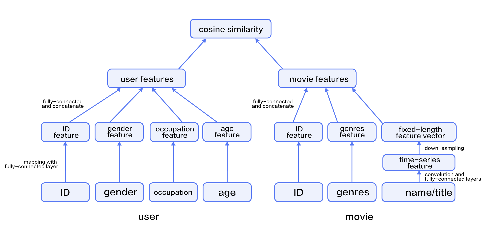

# Personalized Recommendation

The source code of this tutorial is in [book/recommender_system](https://github.com/PaddlePaddle/book/tree/develop/recommender_system).

## Background

With the fast growth of e-commerce, online videos, and online reading business, users have to rely on recommender systems to avoid manually browsing tremendous volume of choices.  Recommender systems understand users' interest by mining user behavior and other properties of users and products.

Some well know approaches include:

- User behavior-based approach.  A well-known method is collaborative filtering. The underlying assumption is that if a person A has the same opinion as a person B on an issue, A is more likely to have B's opinion on a different issue than that of a randomly chosen person.

- Content-based recommendation[[1](#reference)]. This approach infers feature vectors that represent products from their descriptions.  It also infers feature vectors that represent users' interests.  Then it measures the relevance of users and products by some distances between these feature vectors.

- Hybrid approach[[2](#reference)]: This approach uses the content-based information to help address the cold start problem[[6](#reference)] in behavior-based approach.

Among these options, collaborative filtering might be the most studied one.  Some of its variants include user-based[[3](#reference)], item-based [[4](#reference)], social network based[[5](#reference)], and model-based.

This tutorial explains a deep learning based approach and how to implement it using PaddlePaddle.  We will train a model using a dataset that includes user information, movie information, and ratings.  Once we train the model, we will be able to get a predicted rating given a pair of user and movie IDs.

## Model Overview

To know more about deep learning based recommendation, let us start from going over the Youtube recommender system[[7](#参考文献)] before introducing our hybrid model.

### YouTube's Deep Learning Recommendation Model

YouTube is a video-sharing Web site with one of the largest user base in the world.  Its recommender system serves more than a billion users.  This system is composed of two major parts: candidate generation and ranking.  The former selects few hundreds of candidates from millions of videos, and the latter ranks and outputs the top 10.

 
Figure 1. YouTube recommender system overview.

#### Candidate Generation Network

Youtube models candidate generation as a multiclass classification problem with a huge number of classes equal to the number of videos.  The architecture of the model is as follows:

 
Figure. Deep candidate geeration model.

The first stage of this model maps watching history and search queries into fixed-length representative features.  Then, an MLP (multi-layer perceptron, as described in the [Recognize Digits](https://github.com/PaddlePaddle/book/blob/develop/recognize_digits/README.md) tutorial) takes the concatenation of all representative vectors.  The output of the MLP represents the user' *intrinsic interests*.  At training time, it is used together with a softmax output layer for minimizing the classification error.   At serving time, it is used to compute the relevance of the user with all movies.

For a user $U$, the predicted watching probability of video $i$ is

$$P(\omega=i|u)=\frac{e^{v_{i}u}}{\sum_{j \in V}e^{v_{j}u}}$$

where $u$ is the representative vector of user $U$, $V$ is the corpus of all videos, $v_i$ is the representative vector of the $i$-th video. $u$ and $v_i$ are vectors of the same length, so we can compute their dot product using a fully connected layer.

This model could have a performance issue as the softmax output covers millions of classification labels.  To optimize performance, at the training time, the authors down-sample negative samples, so the actual number of classes is reduced to thousands.  At serving time, the authors ignore the normalization of the softmax outputs, because the results are just for ranking.

#### Ranking Network

The architecture of the ranking network is similar to that of the candidate generation network.  Similar to ranking models widely used in online advertising, it uses rich features like video ID, last watching time, etc.  The output layer of the ranking network is a weighted logistic regression, which rates all candidate videos.

### Hybrid Model

In the section, let us introduce our movie recommendation system.

In our network, the input includes features of users and movies.  The user feature includes four properties: user ID, gender, occupation, and age.  Movie features include their IDs, genres, and titles.

We use fully-connected layers to map user features into representative feature vectors and concatenate them.  The process of movie features is similar, except that for movie titles -- we feed titles into a text convolution network as described in the [sentiment analysis tutorial](https://github.com/PaddlePaddle/book/blob/develop/understand_sentiment/README.md)）to get a fixed-length representative feature vector.

Given the feature vectors of users and movies, we compute the relevance using cosine similarity.  We minimize the squared error at training time.

 
Figure 3. A hybrid recommendation model.

 

## Dataset

We use the [MovieLens ml-1m](http://files.grouplens.org/datasets/movielens/ml-1m.zip) to train our model.  This dataset includes 10,000 ratings of 4,000 movies from 6,000 users to 4,000 movies.  Each rate is in the range of 1~5.  Thanks to GroupLens Research for collecting, processing and publishing the dataset.  

We don't have to download and preprocess the data.  Instead, we can use PaddlePaddle's dataset module `paddle.v2.dataset.movielens`.

## Model Specification

## Training

## Inference

## Conclusion

This tutorial goes over traditional approaches in recommender system and a deep learning based approach.  We also show that how to train and use the model with PaddlePaddle.  Deep learning has been well used in computer vision and NLP, we look forward to its new successes in recommender systems.

## Reference

1. [Peter Brusilovsky](https://en.wikipedia.org/wiki/Peter_Brusilovsky) (2007). *The Adaptive Web*. p. 325.
2. Robin Burke , [Hybrid Web Recommender Systems](http://www.dcs.warwick.ac.uk/~acristea/courses/CS411/2010/Book%20-%20The%20Adaptive%20Web/HybridWebRecommenderSystems.pdf), pp. 377-408, The Adaptive Web, Peter Brusilovsky, Alfred Kobsa, Wolfgang Nejdl (Ed.), Lecture Notes in Computer Science, Springer-Verlag, Berlin, Germany, Lecture Notes in Computer Science, Vol. 4321, May 2007, 978-3-540-72078-2.
3. P. Resnick, N. Iacovou, etc. “[GroupLens: An Open Architecture for Collaborative Filtering of Netnews](http://ccs.mit.edu/papers/CCSWP165.html)”, Proceedings of ACM Conference on Computer Supported Cooperative Work, CSCW 1994. pp.175-186.
4. Sarwar, Badrul, et al. "[Item-based collaborative filtering recommendation algorithms.](http://files.grouplens.org/papers/www10_sarwar.pdf)" *Proceedings of the 10th International Conference on World Wide Web*. ACM, 2001.
5. Kautz, Henry, Bart Selman, and Mehul Shah. "[Referral Web: Combining Social networks and collaborative filtering.](http://www.cs.cornell.edu/selman/papers/pdf/97.cacm.refweb.pdf)" Communications of the ACM 40.3 (1997): 63-65. APA
6. Yuan, Jianbo, et al. ["Solving Cold-Start Problem in Large-scale Recommendation Engines: A Deep Learning Approach."](https://arxiv.org/pdf/1611.05480v1.pdf) *arXiv preprint arXiv:1611.05480* (2016).
7. Covington P, Adams J, Sargin E. [Deep neural networks for youtube recommendations](https://static.googleusercontent.com/media/research.google.com/zh-CN//pubs/archive/45530.pdf)[C]//Proceedings of the 10th ACM Conference on Recommender Systems. ACM, 2016: 191-198.

 
 This tutorial was created by <a xmlns:cc="http://creativecommons.org/ns#" href="http://book.paddlepaddle.org" property="cc:attributionName" rel="cc:attributionURL">the PaddlePaddle community</a> and published under <a rel="license" href="http://creativecommons.org/licenses/by-nc-sa/4.0/">Common Creative 4.0 License</a>。
