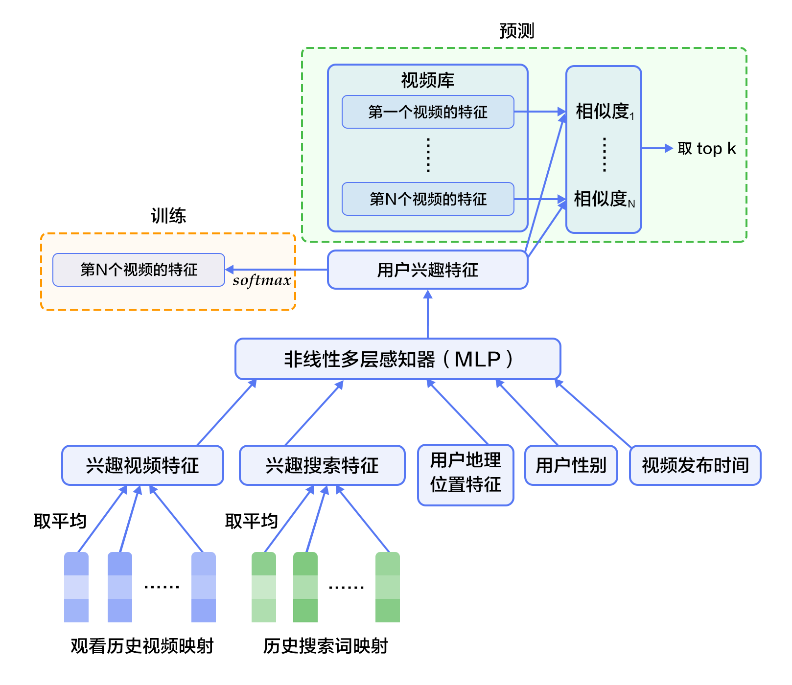

# 个性化推荐

## 背景介绍

在网络技术不断发展和电子商务规模不断扩大的背景下，商品数量和种类快速增长，用户需要花费大量时间才能找到自己想买的商品，这就是信息超载问题。为了解决这个难题，个性化推荐系统（Recommender System）应运而生。

可以想见，最简单的推荐策略是当今热点，比如某宝爆款。再比如希望加入个性化信息，就是浏览过的某宝爆款，或者浏览过的某条消息。 问题是，商品和新闻这么多，大多都是没有浏览过的，而且浏览过的可能已经买过或不再需要了。那么怎样推荐才合适呢？

个性化推荐系统是信息过滤系统（Information Filtering System）的子集，它通过分析、挖掘用户行为，发现用户的个性化需求与兴趣特点，将用户可能感兴趣的信息或商品推荐给用户。与传统的搜索引擎不同，推荐系统不需要用户准确地描述出自己的需求，而是根据分析历史行为建模，主动提供满足用户兴趣和需求的信息。一般来说，个性化推荐比一般化的推荐更能吸引用户点击或购买。个性化推荐可以用在很多领域，如电影、音乐、电商和 Feed 流推荐等。

传统的推荐系统方法主要有：

- 协同过滤推荐[1]（Collaborative Filtering Recommendation）：协同过滤推荐技术是推荐系统中应用最广泛的技术之一。它一般使用 *K*近邻法（*k*-*NN*）收集并分析用户历史行为、活动、偏好，计算一个用户与其他用户的相似度或距离，利用目标用户的最近邻居用户对商品评价的加权评价值来预测目标用户对特定商品的喜好程度。协同过滤可以给用户推荐未购买过的新产品，缺点是对于没有任何行为的新用户存在冷启动的问题，其次是因为用户与商品之间的交互数据不够多造成的稀疏问题。
- 基于内容过滤[2]（Content-based Filtering）：利用商品的内容描述，抽象出有意义的特征，计算用户的兴趣和商品描述之间的相似度，来给用户做推荐。基于内容的推荐简单直接，不需要依据其他用户对商品的评价，同时可以比较商品间的相似度，但它要求得到商品的显示属性，对于没有任何行为的新用户同样存在冷启动的问题。
- 组合推荐[3]（Hybrid Recommendation）：运用不同的输入和技术共同进行推荐，以弥补各自推荐技术的缺点。

深度学习具有优秀的自动提取特征的能力，能够学习多层次的抽象特征表示，并对异质或跨域的内容信息进行学习，解决推荐系统常见的冷启动问题[4]。

## 效果展示

在电影推荐系统的场景中，我们可以根据所有电影的推荐得分排序，推荐给用户可能感兴趣的电影。

我们使用包含用户信息、电影信息与电影评分的数据集作为个性化推荐的应用场景。当我们训练好模型后，只需要输入对应的用户ID和电影ID，就可以得出一个匹配的分数，然后根据所有电影的推荐得分排序，推荐给用户可能感兴趣的电影。

```
Input movie_id: 9
Input user_id: 4
Prediction Score is 2.56
Input movie_id: 8
Input user_id: 2
Prediction Score is 3.13
```

## 模型概览

在构造推荐系统之前，我们先来了解一些业内模型。

### YouTube 的深度神经网络推荐系统

YouTube 是世界上最大的视频上传、分享、发现的网站，YouTube 推荐系统为超过 10 亿用户从不断增长的视频库内个性化定制内容。系统由两个神经网络组成：一个用于生成候选视频，另一个用于排名。系统结构如下图所示[5]：


候选生成网络从用户的  YouTube 活动历史中提取信息，然后从视频库中检索出几百个与用户相关的视频输出。系统把推荐问题视为极多种类别的多分类问题。

如下图所示，深度候选生成模型将嵌入的稀疏特征取平均后和一些稠密特征连接在一起，转换成适合隐藏层输入的固定宽度的向量。所有隐藏层是全连接的。在训练中，在取样的 softmax 输出上，使用梯度下降对交叉熵代价函数进行最小化。在服务中，使用近似最近邻（approximate nearest neighbor ）查询来生成成百上千的候选视频推荐。



在排名模型中，特征根据贡献单个值还是多个值的集合被分为单价（univalent）特征和多价（multivalent）特征。例如，视频 ID 是单价特征，对应的多价特征就是用户最近看过的 N 个视频的 ID 集合。

如下图所示，嵌入的分类特征（包括单价特征和多价特征）带有共享的嵌入和归一化后的连续特征的乘幂。所有层都是全连接的。最后，使用 logistic regression 为每一个视频评出分数，排序后返回给用户。在实践中，需要给网络输入几百个特征。


### 基于 RNN 的推荐系统模型 

在这个场景中[6]，我们先基于用户行为找到用户的最近邻用户群，然后将这些用户的商品评论文本转化为词向量作为训练数据。模型输出是用户喜欢某个商品的可能性大小。

#### 双向 RNN 模型

[双向 RNN]() 不仅可以访问上文信息，还可以访问下文信息。如下图所示，在单层模型中，前向 RNN 的输入为第一个词到最后一个词的顺序，后向 RNN 反之。对双向 RNN 输出的结果取平均值，经过线性转化后作为 softmax 的输入。在多层双向 RNN 中，每一层把前一层的记忆序列视为输入，然后计算这一层的记忆表示，最后取最后一层的输出做和单层一样的运算。


#### 注意力机制模型

在上述双向 RNN 模型的基础上，我们引入了[注意力机制]()。每个前向和后向单元的状态被连接成一个输出向量，之后通过一个注意力权重向量的集合转化为标量。每个单元的标量再连接成一个新向量，这个向量输入到最后的预测层来生成最终结果。


接下来，我们将使用神经网络构建自己的推荐系统。

## 数据准备

### 数据介绍与下载

此教程我们使用[MovieLens 数据集](http://grouplens.org/datasets/movielens/)。该数据集包含一些用户信息、电影信息以及电影评分，由 GroupLens Research 实验室搜集整理。

根据数据规模的不同，该数据集也有很多不同的版本。这里我们用 [MovieLens 百万数据集（ml-1m）](http://files.grouplens.org/datasets/movielens/ml-1m.zip)作为示例，其中包含 6,000 位用户对 4,000 部电影的 1,000,000 条评价。该数据集于 2003 年 2 月发布。当一个新的用户进入 MovieLens ，他需对 15 部电影评分，评分范围为 1-5 分，评分间隔为 0.5 分。当用户查看意图电影时，MovieLens 的推荐系统将根据用户以往的评分预测其对该电影的评分[7]。

运行 `data/getdata.sh` 下载数据，`data/ml-1m` 的目录结构：

```
+--ml-1m
        +--- movies.dat         # 电影特征
        +--- ratings.dat        # 评分
        +--- users.dat          # 用户特征
        +--- README             # 数据集描述
```

ml-1m 中的数据文件使用 "::" 作为分隔符。数据格式为（更多细节请参阅 ml-1m 中的 README ）：

- 评分数据（ratings.dat）：用户ID::电影ID::评分::时间戳
- 电影特征数据（movies.dat）：电影ID::电影名称::电影类型
- 用户特征数据（users.dat）： 用户ID::性别::年龄::职业::邮编

### 数据预处理

首先安装 Python 第三方库（推荐使用 Virtualenv）：

```shell
pip install -r data/requirements.txt
```

整个预处理过程分为处理输入用户、电影特征（数据文件序列化）和将数据分为训练、测试集两部分。执行 `./preprocess.sh` 即可。

在处理输入特征中，得到每个字段（movies/users）的字段配置文件，将其转化为可以解析数据集的 meta 文件，然后用 meta 文件解析数据集为 Python 对象并序列化。

在分割训练、测试集部分中，根据`ratings.dat`将数据分为两部分，分别用来进行模型训练和测试。

### 提供数据给 PaddlePaddle

数据提供脚本 `dataprovider.py` 会读取 `meta.bin` 和评分文件，生成训练需要的样本。在这个脚本中，我们需要设置：

- obj.slots: 特征的类型和维度。
- use_seq: `dataprovider.py` 中的数据是否为序列模式。

```python
from paddle.trainer.PyDataProvider2 import *
import common_utils  # 解析

def __list_to_map__(lst):  # 输出格式
    ret_val = dict()
    for each in lst:
        k, v = each
        ret_val[k] = v
    return ret_val
```

```python
def hook(settings, meta, **kwargs):
    """
    初始 hook 设置了 obj.slots 并存储 meta 数据。它将在处理数据前被唤起。
    :参数对象: global object. It will passed to process routine.
    :类型对象: object
    :参数 meta: meta file 对象，通过 trainer_config 传递(记录了电影和用户的特征)
    :参数 kwargs: 其他未用过的参数
    """
    del kwargs

    # Header 定义了 paddle 使用的 slots.
    #    第一部分是电影特征
    #    第二部分是用户特征
    #    最后的部分是评分分数
    # header 是一个 [USE_SEQ_OR_NOT?, SlotType] 的 list
    movie_headers = list(common_utils.meta_to_header(meta, 'movie'))
    settings.movie_names = [h[0] for h in movie_headers]
    headers = movie_headers
    user_headers = list(common_utils.meta_to_header(meta, 'user'))
    settings.user_names = [h[0] for h in user_headers]
    headers.extend(user_headers)
    headers.append(("rating", dense_vector(1)))  # 分数

    # slot 类型
    settings.input_types = __list_to_map__(headers)
    settings.meta = meta
```

接下来，在`process`函数中将数据逐一提供给 PaddlePaddle。

```python
@provider(init_hook=hook, cache=CacheType.CACHE_PASS_IN_MEM)
def process(settings, filename):
    with open(filename, 'r') as f:
        for line in f:
            # 读取评分
            user_id, movie_id, score = map(int, line.split('::')[:-1])

            # 将分数范围放缩到 [-5, +5]
            score = float(score) * 2 - 5.0

            # 读取 电影/用户 特征
            movie_meta = settings.meta['movie'][movie_id]
            user_meta = settings.meta['user'][user_id]

            outputs = [('movie_id', movie_id - 1)]

            # 添加电影特征
            for i, each_meta in enumerate(movie_meta):
                outputs.append((settings.movie_names[i + 1], each_meta))

            # 添加用户ID
            outputs.append(('user_id', user_id - 1))

            # 添加用户特征
            for i, each_meta in enumerate(user_meta):
                outputs.append((settings.user_names[i + 1], each_meta))

            # 最后添加分数
            outputs.append(('rating', [score]))
            # 将数据提供给 paddle
            yield __list_to_map__(outputs)
```

## 模型配置说明

### 数据定义

定义通过 `define_py_data_sources2` 从 dataprovider 中读入数据：

```python
define_py_data_sources2(
    'data/train.list',
    'data/test.list',
    module='dataprovider',
    obj='process',
    args={'meta': meta})
```

### 算法配置

这里我们设置了 batch size、网络初始学习率，并设置RMSProp 优化方法为自适应学习率策略。

```python
settings(
    batch_size=1600, learning_rate=1e-3, learning_method=RMSPropOptimizer())
```

### 模型结构

网络结构如下图所示：


文件 `trainer_config.py` 中`construct_feature` 函数用来构建电影/用户特征，我们将每个特征种类映射到一个特征向量中：

```python
def construct_feature(name):
    __meta__ = meta[name]['__meta__']['raw_meta']
    fusion = []
    for each_meta in __meta__:	# 读入数据
        type_name = each_meta['type']
        slot_name = each_meta.get('name', '%s_id' % name)
        if type_name == 'id':	# id：简单的嵌入，然后添加一个全连接层
            slot_dim = each_meta['max']
            embedding = embedding_layer(
                input=data_layer(
                    slot_name, size=slot_dim), size=256)
            fusion.append(fc_layer(input=embedding, size=256))
        elif type_name == 'embedding':	# embedding：如果是序列，则先做嵌入，然后再做一次文本卷积操作， 然后得到平均采样的结果。否则，则先做嵌入，然后添加一个全连接层。
            is_seq = each_meta['seq'] == 'sequence'
            slot_dim = len(each_meta['dict'])
            din = data_layer(slot_name, slot_dim)
            embedding = embedding_layer(input=din, size=256)
            if is_seq:
                fusion.append(
                    text_conv_pool(
                        input=embedding, context_len=5, hidden_size=256))
            else:
                fusion.append(fc_layer(input=embedding, size=256))
        elif type_name == 'one_hot_dense':	# one_hot_dense：两个全连接层。
            slot_dim = len(each_meta['dict'])
            hidden = fc_layer(input=data_layer(slot_name, slot_dim), size=256)
            fusion.append(fc_layer(input=hidden, size=256))
	# 聚集所有特征向量，使用全连接层连接它们并返回。
    return fc_layer(name="%s_fusion" % name, input=fusion, size=256)
```

然后我们出求这两个特征的余弦相似度并输出。

```python
movie_feature = construct_feature("movie")
user_feature = construct_feature("user")
similarity = cos_sim(a=movie_feature, b=user_feature)  
if not is_predict:
    outputs(
        regression_cost(
            input=similarity, label=data_layer(
                'rating', size=1)))

    define_py_data_sources2(
        'data/train.list',
        'data/test.list',
        module='dataprovider',
        obj='process',
        args={'meta': meta})
else:
    outputs(similarity)
```

## 训练模型

执行`sh train.sh` 开始训练模型，将日志写入文件 `log.txt` 并打印在屏幕上。其中指定了总共需要执行 50 个pass。

```shell
set -e
paddle train \
    --config=trainer_config.py \			# 神经网络配置文件
    --save_dir=./output \					# 模型保存路径
    --use_gpu=false \						# 是否使用 GPU (默认不使用)
    --trainer_count=4\						# 一台机器上面的线程数量
    --test_all_data_in_one_period=true \	# 每个训练周期训练一次所有数据。否则每个训练周期测试												  batch_size 个 batch 的数据。
    --log_period=100 \						# 训练 log_period 个 batch 后打印日志
    --dot_period=1 \						# 每训练 dot_period 个 batch 后打印一个"."
    --num_passes=50  2>&1 | tee 'log.txt'
```

如果训练过程启动成功的话，输出应该类似如下：

```shell
I0601 08:07:22.832059 10549 TrainerInternal.cpp:157]  Batch=100 samples=160000 AvgCost=4.13494 CurrentCost=4.13494 Eval:  CurrentEval:

I0601 08:07:50.672627 10549 TrainerInternal.cpp:157]  Batch=200 samples=320000 AvgCost=3.80957 CurrentCost=3.48421 Eval:  CurrentEval:

I0601 08:08:18.877369 10549 TrainerInternal.cpp:157]  Batch=300 samples=480000 AvgCost=3.68145 CurrentCost=3.42519 Eval:  CurrentEval:

I0601 08:08:46.863963 10549 TrainerInternal.cpp:157]  Batch=400 samples=640000 AvgCost=3.6007 CurrentCost=3.35847 Eval:  CurrentEval:

I0601 08:09:15.413025 10549 TrainerInternal.cpp:157]  Batch=500 samples=800000 AvgCost=3.54811 CurrentCost=3.33773 Eval:  CurrentEval:
I0601 08:09:36.058670 10549 TrainerInternal.cpp:181]  Pass=0 Batch=565 samples=902826 AvgCost=3.52368 Eval:
I0601 08:09:46.215489 10549 Tester.cpp:101]  Test samples=97383 cost=3.32155 Eval:
I0601 08:09:46.215966 10549 GradientMachine.cpp:132] Saving parameters to ./output/model/pass-00000
I0601 08:09:46.233397 10549 ParamUtil.cpp:99] save dir ./output/model/pass-00000
I0601 08:09:46.233438 10549 Util.cpp:209] copy trainer_config.py to ./output/model/pass-00000
I0601 08:09:46.233541 10549 ParamUtil.cpp:147] fileName trainer_config.py
```

## 应用模型

在训练了几轮以后，你可以对模型进行评估，通过选择最小训练误差的一轮参数得到最好轮次的模型。运行下面命令即可：

```shell
./evaluate.py log.txt
```

你将看到：

```shell
Best pass is 00009,  error is 3.06949, which means predict get error as 0.875998002281
evaluating from pass output/pass-00009
```

然后，你可以预测任何用户对于任何一部电影的评价，运行下面命令即可：

```shell
python prediction.py 'output/pass-00009/'
```

预测程序将读取用户的输入，然后输出预测分数（注意这里的分数不是 dataprovider 归一化后的得分，而是预测的最终得分结果）。

用户预测的命令行界面如下：

```
Input movie_id: 9
Input user_id: 4
Prediction Score is 2.56
Input movie_id: 8
Input user_id: 2
Prediction Score is 3.13
```

## 总结

本章介绍了传统的推荐系统方法、 YouTube 的深度神经网络推荐系统和基于 RNN 的推荐系统模型，并以电影推荐为例，使用神经网络训练了一个个性化推荐模型。推荐系统几乎涵盖了电商系统、社交网络，广告推荐，搜索引擎等领域的方方面面，而在图像处理、自然语言处理等领域已经发挥重要作用的深度学习技术，也将在推荐系统领域大放异彩。

## 参考文献

1. Breese, John S., David Heckerman, and Carl Kadie. ["Empirical analysis of predictive algorithms for collaborative filtering."](https://arxiv.org/pdf/1301.7363v1.pdf) Proceedings of the Fourteenth conference on Uncertainty in artificial intelligence. Morgan Kaufmann Publishers Inc., 1998. APA	
2. [Peter Brusilovsky](https://en.wikipedia.org/wiki/Peter_Brusilovsky) (2007). *The Adaptive Web*. p. 325. [ISBN](https://en.wikipedia.org/wiki/International_Standard_Book_Number) [978-3-540-72078-2](https://en.wikipedia.org/wiki/Special:BookSources/978-3-540-72078-2).
3. Robin Burke , [Hybrid Web Recommender Systems](http://www.dcs.warwick.ac.uk/~acristea/courses/CS411/2010/Book%20-%20The%20Adaptive%20Web/HybridWebRecommenderSystems.pdf), pp. 377-408, The Adaptive Web, Peter Brusilovsky, Alfred Kobsa, Wolfgang Nejdl (Ed.), Lecture Notes in Computer Science, Springer-Verlag, Berlin, Germany, Lecture Notes in Computer Science, Vol. 4321, May 2007, 978-3-540-72078-2.
4. Yuan, Jianbo, et al. ["Solving Cold-Start Problem in Large-scale Recommendation Engines: A Deep Learning Approach."](https://arxiv.org/pdf/1611.05480v1.pdf) *arXiv preprint arXiv:1611.05480* (2016).
5. Covington P, Adams J, Sargin E. [Deep neural networks for youtube recommendations](http://delivery.acm.org/10.1145/2960000/2959190/p191-covington.pdf?ip=113.225.222.231&id=2959190&acc=OA&key=4D4702B0C3E38B35%2E4D4702B0C3E38B35%2E4D4702B0C3E38B35%2E5945DC2EABF3343C&CFID=713293170&CFTOKEN=33777789&__acm__=1483689091_3196ba42120e35d98a6adbf5feed64a0)[C]//Proceedings of the 10th ACM Conference on Recommender Systems. ACM, 2016: 191-198.
   MLA
6. https://cs224d.stanford.edu/reports/LiuSingh.pdf
7. https://zh.wikipedia.org/wiki/MovieLens
