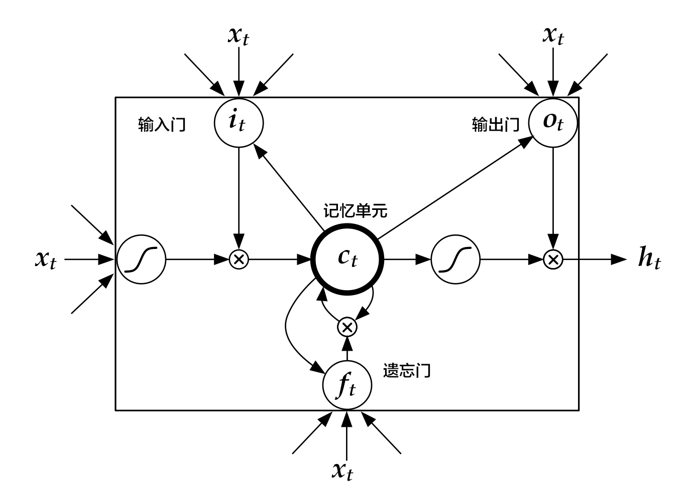

# Sentiment Analysis

The source codes of this section can be located at [book/understand_sentiment](https://github.com/PaddlePaddle/book/tree/develop/understand_sentiment). First-time users may refer to PaddlePaddle for [Installation guide](http://www.paddlepaddle.org/doc_cn/build_and_install/index.html).

## Background Introduction
In natural language processing, sentiment analysis refers to describing emotion status in texts. The texts may refer to a sentence, a paragraph or a document. Emotion status can be a binary classification problem (positive/negative or happy/sad), or a three-class problem (positive/neutral/negative). Sentiment analysis can be applied widely in various situations, such as online shopping (Amazon, Taobao), travel and movie websites. It can be used to grasp from the reviews how the customers feel about the product. Table 1 is an example of sentiment analysis in movie reviews:

| Movie Review       | Category  |
| --------     | -----  |
| Best movie of Xiaogang Feng in recent years!| Positive |
| Pretty bad. Feels like a tv-series from a local TV-channel     | Negative |
| Politically correct version of Taken ... and boring as Heck| Negative|
|delightful, mesmerizing, and completely unexpected. The plot is nicely designed.|Positive|

<p align="center">Table 1 Sentiment Analysis in Movie Reviews</p>

In natural language processing, sentiment analysis can be categorized as a **Text Classification problem**, i.e., to categorize a piece of text to a specific class. It involves two related tasks: text representation and classification. Before deep learning becomes heated, the main-stream methods for the former include BOW (bag of words) and topic modeling, while the latter contain SVM(support vector machine), LR(logistic regression).

For a piece of text, BOW model ignores its word order, grammar and syntax, and regard it as a set of words, so BOW does not capture all the information in the text. For example, “this movie is extremely bad“ and “boring, dull and empty work” describe very similar semantic with low similarity in sense of BOW. Also, “the movie is bad“ and “the movie is not bad“ have high similarity with BOW feature, but they express completely opposite semantics.


In this chapter, we introduce our deep learning model which handles these issues in BOW. Our model embeds texts into a low-dimensional space and takes word order into consideration. It is an end-to-end framework, and has large performance improvement over traditional methods \[[1](#Reference)\].

## Model Overview
The model we used in this chapter is the CNN (Convolutional Neural Networks) and RNN (Recurrent Neural Networks) with some specific extension. 


### Convolutional Neural Networks for Texts (CNN)
Convolutional Neural Networks are always applied in data with grid-like topology, such as 2-d images and 1-d texts. CNN can combine extracted multiple local features to produce higher-level abstract semantics. Experimentally, CNN is very efficient for image and text modeling.

CNN mainly contains convolution and pooling operation, with various extensions. We briefly describe CNN here with an example \[[1](#Refernce)\]. As shown in Figure 1：


<p align="center">
<br/>
Figure 1. CNN for text modeling. 
将一句话表示为矩阵 -> represent a sentence as a $n\times k$ matrix; 使用不同大小的卷积层 -> apply convolution of different kernel sizes; 时间维最大池化 -> max-pooling across temporal channel; 全连接层 -> fully-connected layer.
</p>
Assuming the length of the sentence is $n$, where the $i$-th word has embedding as $x_i\in\mathbb{R}^k$，where $k$ is the embedding dimensionality. 

First, we concatenate the words together: we piece every $h$ words as a window of length $h$: $x_{i:i+h-1}$. It refers to $x_{i},x_{i+1},\ldots,x_{i+h-1}$, where $i$ is the first word in the window, ranging from $1$ to $n-h+1$: $x_{i:i+h-1}\in\mathbb{R}^{hk}$.

Next, we apply the convolution operation: we apply the kernel $w\in\mathbb{R}^{hk}$ in each window, extracting features $c_i=f(w\cdot x_{i:i+h-1}+b)$，
where $b\in\mathbb{R}$ is the bias and $f$ is a non-linear activation function such as $sigmoid$. Applying CNN on every window ${x_{1:h},x_{2:h+1},\ldots,x_{n-h+1:n}}$ produces a feature map as:

$$c=[c_1,c_2,\ldots,c_{n-h+1}], c \in \mathbb{R}^{n-h+1}$$

Next, we apply max pooling over time to represent the whole sentence $\hat c$, which is the maximum element across the feature map:

$$\hat c=max(c)$$

In real applications, we will apply multiple CNN kernels on the sentences. It can be implemented efficiently by concatenating the kernels together as a matrix. Also, we can use CNN kernels with different kernel size (as shown in Figure 1 in different colors).

Finally, the CNN features are concatenated together to produce a fixed-length representation, which can be combined with a softmax for sentiment analysis problem.

For short texts, above CNN model can achieve high accuracy \[[1](#Reference)\]. If we want to extract more abstract representation, we may apply a deeper CNN model \[[2](#Reference),[3](#Reference)\].

### Recurrent Neural Network（RNN）
RNN is an effective model for sequential data. Theoretical, the  computational ability of RNN is Turing-complete \[[4](#Reference)\]. NLP is a classical sequential data, and RNN (especially its variant LSTM\[[5](#Reference)\]) achieves State-of-the-Art performance on various tasks in NLP, such as language modeling, syntax parsing, POS-tagging, image captioning, dialog, machine translation and so forth.

<p align="center">
<br/>
Figure 2. An illustration of an unrolled RNN across “time”. 
</p>
As shown in Figure 2, we unroll an RNN: at $t$-th time step, the network takes the $t$-th input vector and the latent state from last time-step $h_{t-1}$ as inputs and compute the latent state of current step. The whole process is repeated until all inputs are consumed. If we regard the RNN as a function $f$, it can be formulated as:

$$h_t=f(x_t,h_{t-1})=\sigma(W_{xh}x_t+W_{hh}h_{h-1}+b_h)$$

where $W_{xh}$ is the weight matrix from input to latent; $W_{hh}$ is the latent-to-latent matrix; $b_h$ is the latent bias and $\sigma$ refers to the $sigmoid$function.

In NLP, words are first represented as a one-hot vector and then mapped to an embedding. The embedded feature goes through an RNN as input $x_t$ at every time step. Moreover, we can add other layers on top of RNN. e.g., a deep or stacked RNN. Also, the last latent state can be used as a feature for sentence classification.

### Long-Short Term Memory
For data of long sequence, training RNN sometimes has gradient vanishing and explosion problem \[[6](#)\]. To solve this problem Hochreiter S, Schmidhuber J. (1997) proposed the LSTM(long short term memory\[[5](#Refernce)\]).  

Compared with simple RNN, the structrue of LSTM has included memory cell $c$, input gate $i$, forget gate $f$ and output gate $o$. These gates and memory cells largely improves the ability of handling long sequences. We can formulate LSTM-RNN as a function $F$ as：

$$ h_t=F(x_t,h_{t-1})$$

$F$ contains following formulations\[[7](#Reference)\]：
\begin{align}
i_t & = \sigma(W_{xi}x_t+W_{hi}h_{h-1}+W_{ci}c_{t-1}+b_i)\\\\
f_t & = \sigma(W_{xf}x_t+W_{hf}h_{h-1}+W_{cf}c_{t-1}+b_f)\\\\
c_t & = f_t\odot c_{t-1}+i_t\odot tanh(W_{xc}x_t+W_{hc}h_{h-1}+b_c)\\\\
o_t & = \sigma(W_{xo}x_t+W_{ho}h_{h-1}+W_{co}c_{t}+b_o)\\\\
h_t & = o_t\odot tanh(c_t)\\\\
\end{align}

In the equation，$i_t, f_t, c_t, o_t$ stand for input gate, forget gate, memory cell and output gate separately; $W$ and $b$ are model parameters. The $tanh$ is a hyperbolic tangent， and $\odot$ denotes an element-wise product operation. Input gate controls the magnitude of new input into the memory cell $c$; forget gate controls memory propagated from the last time step; output gate controls output magnitude. The three gates are computed similarly with different parameters, and they influence memory cell $c$ separately, as shown in Figure 3:
<p align="center">
<br/>
Figure 3. LSTM at time step $t$ [7]. 输入门 -> input gate, 记忆单元 -> memory cell, 遗忘门 -> forget gate, 输出门 -> output gate.
</p>
LSTM enhances the ability of considering long-term reliance, with the help of memory cell and gate. Similar structures are also proposed in Gated Recurrent Unit (GRU)\[[8](Reference)\] with simpler design. **The structures are still similar to RNN, though with some modifications (As shown in Figure 2), i.e., latent status depends on input as well as the latent status of last time-step, and the process goes on recurrently until all input are consumed:**

$$ h_t=Recrurent(x_t,h_{t-1})$$
where $Recrurent$ is a simple RNN, GRU or LSTM.

### Stacked Bidirectional LSTM
For vanilla LSTM, $h_t$ contains input information from previous time-step $1..t-1$ context. We can also apply an RNN with reverse-direction to take successive context $t+1…n$ into consideration. Combining constructing deep RNN (deeper RNN can contain more abstract and higher level semantic), we can design structures with deep stacked bidirectional LSTM to model sequential data\[[9](#Reference)\].

As shown in Figure 4 (3-layer RNN), odd/even layers are forward/reverse LSTM. Higher layers of LSTM take lower-layers LSTM as input, and the top-layer LSTM produces a fixed length vector by max-pooling (this representation considers contexts from previous and successive words for higher-level abstractions). Finally, we concatenate the output to a softmax layer for classification.

<p align="center">
<br/>
Figure 4. Stacked Bidirectional LSTM for NLP modeling. 词向量映射 -> word embedding mapping; 全连接层 -> fully-connected layer; 反向LSTM -> reverse-directional LSTM; 池化层 -> pooling layer.
</p>

## Data Preparation
### Data introduction and Download
We taks the [IMDB sentiment analysis dataset](http://ai.stanford.edu/%7Eamaas/data/sentiment/) as an example. IMDB dataset contains training and testing set, with 25000 movie reviews. With a 1-10 score, negative reviews are those with score<=4, while positives are those with score>=7. You may use following scripts to download the IMDB dataset and [Moses](http://www.statmt.org/moses/) toolbox:


```bash
./data/get_imdb.sh
```
If successful, you should see the directory ```data``` with following files:

```
aclImdb  get_imdb.sh  imdb  mosesdecoder-master
```

* aclImdb: original data downloaded from the website;
* imdb: containing only training and testing data
* mosesdecoder-master: Moses tool

### Data Preprocessing
We use the script `preprocess.py` to preprocess the data. It will call `tokenizer.perl` in the Moses toolbox to split words and punctuations, randomly shuffle training set and construct the dictionary. Notice: we only use labeled training and testing set. Executing following commands will preprocess the data:

```
data_dir="./data/imdb"
python preprocess.py -i $data_dir
```

If it runs successfully, `./data/pre-imdb` will contain:

```
dict.txt  labels.list  test.list  test_part_000  train.list  train_part_000
```

* test\_part\_000 和 train\_part\_000: all labeled training and testing set, and the training set is shuffled. 
* train.list and test.list: training and testing file-list (containing list of file names).
* dict.txt: dictionary generated from training set.
* labels.list: class label, 0 stands for negative while 1 for positive.

### Data Provider for PaddlePaddle
PaddlePaddle can read Python-style script for configuration. The following `dataprovider.py` provides a detailed example, consisting of two parts:

* hook: define text information and class Id. Texts are defined as `integer_value_sequence` while class Ids are defined as `integer_value`.
* process: read line by line for ID and text information split by `’\t\t’`, and yield the data as a generator.

```python
from paddle.trainer.PyDataProvider2 import *

def hook(settings, dictionary, **kwargs):
settings.word_dict = dictionary
settings.input_types = {
'word':  integer_value_sequence(len(settings.word_dict)),
'label': integer_value(2)
}
settings.logger.info('dict len : %d' % (len(settings.word_dict)))

@provider(init_hook=hook)
def process(settings, file_name):
with open(file_name, 'r') as fdata:
for line_count, line in enumerate(fdata):
label, comment = line.strip().split('\t\t')
label = int(label)
words = comment.split()
word_slot = [
settings.word_dict[w] for w in words if w in settings.word_dict
]
yield {
'word': word_slot,
'label': label
}
```

## Model Setup
`trainer_config.py` is an example of a setup file.
### Data Definition
```python
from os.path import join as join_path
from paddle.trainer_config_helpers import *
# if it is “test” mode
is_test = get_config_arg('is_test', bool, False)
# if it is “predict” mode
is_predict = get_config_arg('is_predict', bool, False)

# Data path
data_dir = "./data/pre-imdb"
# File names
train_list = "train.list"
test_list = "test.list"
dict_file = "dict.txt"

# Dictionary size
dict_dim = len(open(join_path(data_dir, "dict.txt")).readlines())
# class number
class_dim = len(open(join_path(data_dir, 'labels.list')).readlines())

if not is_predict:
train_list = join_path(data_dir, train_list)
test_list = join_path(data_dir, test_list)
dict_file = join_path(data_dir, dict_file)
train_list = train_list if not is_test else None
# construct the dictionary
word_dict = dict()
with open(dict_file, 'r') as f:
for i, line in enumerate(open(dict_file, 'r')):
word_dict[line.split('\t')[0]] = i
# Call the function “define_py_data_sources2” in the file dataprovider.py to extract features
define_py_data_sources2(
train_list,
test_list,
module="dataprovider",
obj="process",  # function to generate data
args={'dictionary': word_dict}) # extra parameters, here refers to dictionary
```

### Algorithm Setup

```python
settings(
batch_size=128,
learning_rate=2e-3,
learning_method=AdamOptimizer(),
regularization=L2Regularization(8e-4),
gradient_clipping_threshold=25)
```

* Batch size set as 128;
* Set global learning rate;
* Apply ADAM algorithm for optimization;
* Set up L2 regularization;
* Set up gradient clipping threshold;

### Model Structure
We use PaddlePaddle to implement two classification algorithms, based on above mentioned model [Text-CNN](#Text-CNN（CNN）)和[Stacked-bidirectional LSTM](#Stacked-bidirectional LSTM（Stacked Bidirectional LSTM）)。
#### Implementation of Text CNN 
```python
def convolution_net(input_dim,
class_dim=2,
emb_dim=128,
hid_dim=128,
is_predict=False):
# network input: id denotes word order, dictionary size as input_dim
data = data_layer("word", input_dim)
# Embed one-hot id to embedding subspace
emb = embedding_layer(input=data, size=emb_dim)
# Convolution and max-pooling operation, convolution kernel size set as 3
conv_3 = sequence_conv_pool(input=emb, context_len=3, hidden_size=hid_dim)
# Convolution and max-pooling, convolution kernel size set as 4
conv_4 = sequence_conv_pool(input=emb, context_len=4, hidden_size=hid_dim)
# Concatenate conv_3 and conv_4 as input for softmax classification, class number as class_dim
output = fc_layer(
input=[conv_3, conv_4], size=class_dim, act=SoftmaxActivation())

if not is_predict:
lbl = data_layer("label", 1)    #network input: class label
outputs(classification_cost(input=output, label=lbl))
else:
outputs(output)
```

In our implementation, we can use just a single layer [`sequence_conv_pool`](https://github.com/PaddlePaddle/Paddle/blob/develop/python/paddle/trainer_config_helpers/networks.py) to do convolution and pooling operation, convolution kernel size set as hidden_size parameters.

#### Implementation of Stacked bidirectional LSTM

```python
def stacked_lstm_net(input_dim,
class_dim=2,
emb_dim=128,
hid_dim=512,
stacked_num=3,
is_predict=False):

# layer number of LSTM “stacked_num” is an odd number to confirm the top-layer LSTM is forward
assert stacked_num % 2 == 1
# network attributes setup
layer_attr = ExtraLayerAttribute(drop_rate=0.5)
# parameter attributes setup
fc_para_attr = ParameterAttribute(learning_rate=1e-3)
lstm_para_attr = ParameterAttribute(initial_std=0., learning_rate=1.)
para_attr = [fc_para_attr, lstm_para_attr]
bias_attr = ParameterAttribute(initial_std=0., l2_rate=0.)
# Activation functions
relu = ReluActivation()
linear = LinearActivation()


# Network input: id as word order, dictionary size is set as input_dim
data = data_layer("word", input_dim)
# Mapping id from word to the embedding subspace
emb = embedding_layer(input=data, size=emb_dim)

fc1 = fc_layer(input=emb, size=hid_dim, act=linear, bias_attr=bias_attr)
# LSTM-based RNN
lstm1 = lstmemory(
input=fc1, act=relu, bias_attr=bias_attr, layer_attr=layer_attr)

# Construct stacked bidirectional LSTM with fc_layer and lstmemory with layer depth as stacked_num:
inputs = [fc1, lstm1]
for i in range(2, stacked_num + 1):
fc = fc_layer(
input=inputs,
size=hid_dim,
act=linear,
param_attr=para_attr,
bias_attr=bias_attr)
lstm = lstmemory(
input=fc,
# Odd number-th layer: forward, Even number-th reverse.
reverse=(i % 2) == 0,
act=relu,
bias_attr=bias_attr,
layer_attr=layer_attr)
inputs = [fc, lstm]

# Apply max-pooling along the temporal dimension on the last fc_layer to produce a fixed length vector
fc_last = pooling_layer(input=inputs[0], pooling_type=MaxPooling())
# Apply max-pooling along tempoeral dim of lstmemory to obtain fixed length feature vector
lstm_last = pooling_layer(input=inputs[1], pooling_type=MaxPooling())
# concatenate fc_last and lstm_last as input for a softmax classification layer, with class number equals class_dim
output = fc_layer(
input=[fc_last, lstm_last],
size=class_dim,
act=SoftmaxActivation(),
bias_attr=bias_attr,
param_attr=para_attr)

if is_predict:
outputs(output)
else:
outputs(classification_cost(input=output, label=data_layer('label', 1)))
```

Our model defined in `trainer_config.py` uses the `stacked_lstm_net` structure as default. If you want to use `convolution_net`, you can comment related lines.
```python
stacked_lstm_net(
dict_dim, class_dim=class_dim, stacked_num=3, is_predict=is_predict)
# convolution_net(dict_dim, class_dim=class_dim, is_predict=is_predict)
```

## Model Training
Use `train.sh` script to run local training:

```
./train.sh
```

train.sh is as following:

```bash
paddle train --config=trainer_config.py \
--save_dir=./model_output \
--job=train \
--use_gpu=false \
--trainer_count=4 \
--num_passes=10 \
--log_period=20 \
--dot_period=20 \
--show_parameter_stats_period=100 \
--test_all_data_in_one_period=1 \
2>&1 | tee 'train.log'
```

* \--config=trainer_config.py: set up model configuration.
* \--save\_dir=./model_output: set up output folder to save model parameters.
* \--job=train: set job mode as training.
* \--use\_gpu=false: Use CPU for training. If you have installed GPU-version PaddlePaddle and want to try GPU training, you may set this term as true.
* \--trainer\_count=4: setup thread number (or GPU numer）.
* \--num\_passes=15: Setup pass. In PaddlePaddle, a pass means a training epoch over all samples.
* \--log\_period=20: print log every 20 batches.
* \--show\_parameter\_stats\_period=100: Print statistics to screen every 100 batch.
* \--test\_all_data\_in\_one\_period=1: Predict all testing data every time.

If it is running sussefully, the output log will be saved at `train.log`, model parameters will be saved at the directory `model_output/`. Output log will be as following:

```
Batch=20 samples=2560 AvgCost=0.681644 CurrentCost=0.681644 Eval: classification_error_evaluator=0.36875  CurrentEval: classification_error_evaluator=0.36875
...
Pass=0 Batch=196 samples=25000 AvgCost=0.418964 Eval: classification_error_evaluator=0.1922
Test samples=24999 cost=0.39297 Eval: classification_error_evaluator=0.149406
```

* Batch=xx: Already |xx| Batch trained.
* samples=xx: xx samples have been processed during training.
* AvgCost=xx: Average loss from 0-th batch to the current batch.
* CurrentCost=xx: loss of the latest |log_period|-th batch;
* Eval: classification\_error\_evaluator=xx: Average accuracy from 0-th batch to current batch;
* CurrentEval: classification\_error\_evaluator: latest |log_period| batches of classification error;
* Pass=0: Running over all data in the training set is called as a Pass. Pass “0” denotes the first round.


## Application models
### Testing

Testing refers to use trained model to evaluate labeled dataset.

```
./test.sh
```

Scripts for testing `test.sh` is as following, where the function `get_best_pass` ranks classification accuracy to obtain the best model:

```bash
function get_best_pass() {
cat $1  | grep -Pzo 'Test .*\n.*pass-.*' | \
sed  -r 'N;s/Test.* error=([0-9]+\.[0-9]+).*\n.*pass-([0-9]+)/\1 \2/g' | \
sort | head -n 1
}

log=train.log
LOG=`get_best_pass $log`
LOG=(${LOG})
evaluate_pass="model_output/pass-${LOG[1]}"

echo 'evaluating from pass '$evaluate_pass

model_list=./model.list
touch $model_list | echo $evaluate_pass > $model_list
net_conf=trainer_config.py
paddle train --config=$net_conf \
--model_list=$model_list \
--job=test \
--use_gpu=false \
--trainer_count=4 \
--config_args=is_test=1 \
2>&1 | tee 'test.log'
```

Different from training, testing requires denoting `--job = test` and model path `--model_list = $model_list`. If successful, log will be saved at `test.log`. In our test, the best model is `model_output/pass-00002`, with classification error rate as 0.115645：

```
Pass=0 samples=24999 AvgCost=0.280471 Eval: classification_error_evaluator=0.115645
```

### Prediction
`predict.py` script provides an API. Predicting IMDB data without labels as following:

```
./predict.sh
```
predict.sh is as following（default model path `model_output/pass-00002` may exist or modified to others）:

```bash
model=model_output/pass-00002/
config=trainer_config.py
label=data/pre-imdb/labels.list
cat ./data/aclImdb/test/pos/10007_10.txt | python predict.py \
--tconf=$config \
--model=$model \
--label=$label \
--dict=./data/pre-imdb/dict.txt \
--batch_size=1
```

* `cat ./data/aclImdb/test/pos/10007_10.txt` : Input prediction samples.
* `predict.py` : Prediction script.
* `--tconf=$config` : Network set up.
* `--model=$model` : Model path set up.
* `--label=$label` : set up the label dictionary, mapping integer IDs to string labels.
* `--dict=data/pre-imdb/dict.txt` : set up the dictionary file.
* `--batch_size=1` : batch size during prediction.


Prediction result of our example:

```
Loading parameters from model_output/pass-00002/
predicting label is pos
```

`10007_10.txt` in folder`./data/aclImdb/test/pos`, the predicted label is also pos，so the prediction is correct.
## Summary
In this chapter, we use sentiment analysis as an example to introduce applying deep learning models on end-to-end short text classification, as well as how to use PaddlePaddle to implement the model. Meanwhile, we briefly introduce two models for text processing: CNN and RNN. In following chapters we will see how these models can be applied in other tasks. 
## Reference
1. Kim Y. [Convolutional neural networks for sentence classification](http://arxiv.org/pdf/1408.5882)[J]. arXiv preprint arXiv:1408.5882, 2014.
2. Kalchbrenner N, Grefenstette E, Blunsom P. [A convolutional neural network for modelling sentences](http://arxiv.org/pdf/1404.2188.pdf?utm_medium=App.net&utm_source=PourOver)[J]. arXiv preprint arXiv:1404.2188, 2014.
3. Yann N. Dauphin, et al. [Language Modeling with Gated Convolutional Networks](https://arxiv.org/pdf/1612.08083v1.pdf)[J] arXiv preprint arXiv:1612.08083, 2016.
4. Siegelmann H T, Sontag E D. [On the computational power of neural nets](http://research.cs.queensu.ca/home/akl/cisc879/papers/SELECTED_PAPERS_FROM_VARIOUS_SOURCES/05070215382317071.pdf)[C]//Proceedings of the fifth annual workshop on Computational learning theory. ACM, 1992: 440-449.
5. Hochreiter S, Schmidhuber J. [Long short-term memory](http://web.eecs.utk.edu/~itamar/courses/ECE-692/Bobby_paper1.pdf)[J]. Neural computation, 1997, 9(8): 1735-1780.
6. Bengio Y, Simard P, Frasconi P. [Learning long-term dependencies with gradient descent is difficult](http://www-dsi.ing.unifi.it/~paolo/ps/tnn-94-gradient.pdf)[J]. IEEE transactions on neural networks, 1994, 5(2): 157-166.
7. Graves A. [Generating sequences with recurrent neural networks](http://arxiv.org/pdf/1308.0850)[J]. arXiv preprint arXiv:1308.0850, 2013.
8. Cho K, Van Merriënboer B, Gulcehre C, et al. [Learning phrase representations using RNN encoder-decoder for statistical machine translation](http://arxiv.org/pdf/1406.1078)[J]. arXiv preprint arXiv:1406.1078, 2014.
9. Zhou J, Xu W. [End-to-end learning of semantic role labeling using recurrent neural networks](http://www.aclweb.org/anthology/P/P15/P15-1109.pdf)[C]//Proceedings of the Annual Meeting of the Association for Computational Linguistics. 2015.

<br/>
<a rel="license" href="http://creativecommons.org/licenses/by-nc-sa/4.0/"></a><br /><span xmlns:dct="http://purl.org/dc/terms/" href="http://purl.org/dc/dcmitype/Text" property="dct:title" rel="dct:type">本教程</span> 由 <a xmlns:cc="http://creativecommons.org/ns#" href="http://book.paddlepaddle.org" property="cc:attributionName" rel="cc:attributionURL">PaddlePaddle</a> 创作，采用 <a rel="license" href="http://creativecommons.org/licenses/by-nc-sa/4.0/">知识共享 署名-非商业性使用-相同方式共享 4.0 国际 许可协议</a>进行许可。
