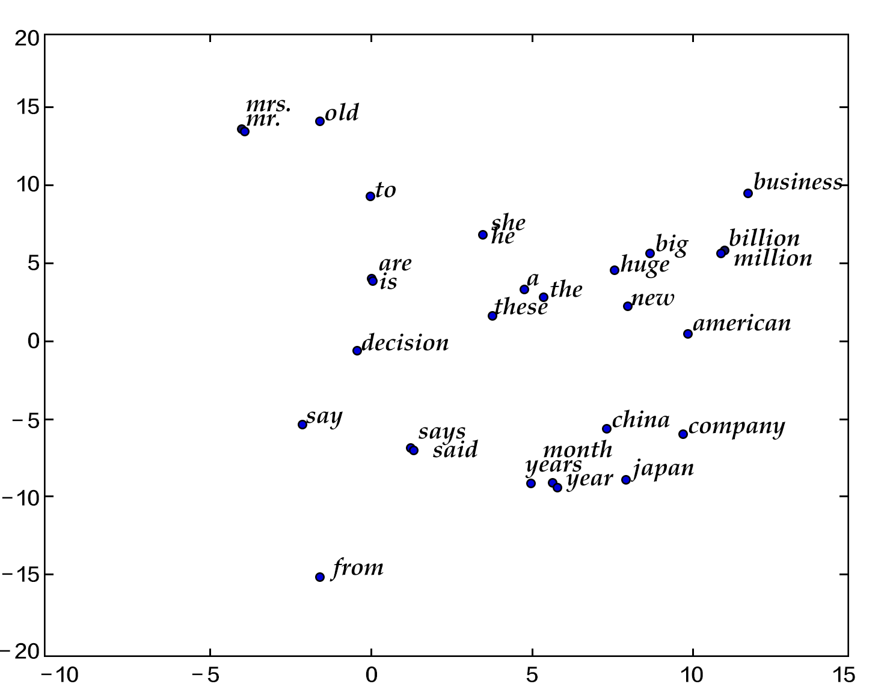

# Word2Vec

The source code of this tutorial can be found at [book/word2vec](https://github.com/PaddlePaddle/book/tree/develop/word2vec), please refer to PaddlePaddle [installation guide](http://www.paddlepaddle.org/doc_cn/build_and_install/index.html) for the first time use.

## Background Introduction

In this chapter, we will introduce the vector representation of words, which is also known as word embedding. Word embedding is a common operation in natural language processing, and is the common fundamental technology behind the search engine, ads system, recommendation system and other Internet services. 

In those Internet services, we usually need to estimate the similarity between two words or two paragraphs. In order to perform this estimation, we need to first represent the words in a way that is easier for the computer to process. The most natural way to achieve this goal is vector space model. In this kind of model, every word is represented as a one-hot vector, whose length is the size of the dictionary. Every element in the one-hot vector corresponds to one word in the dictionary. For each word, the corresponding element in the vector is 1 and all other elements are 0. 

Although one-hot vector is a natural choice, it has limited usefulness. For example, in an Internet ads system, if a customer enters a query of "Mother's day", and the keyword of an ad is "Carnations". We know that these two words are connected based on common sense because normally people would send their mothers a bunch of carnations on mother's day. However, the metric distance (either Euclidean or cosine similarity) between the one-hot vectors of these two words indicates that they are not relevant to each other. The reason that we came to this counter-intuitive conclusion is that the information contained in each word is too small. Therefore, only comparing two words is not sufficient for us to accurately estimate their relevance. In order to accurately calculate their similarity, we need more information which could be learned from big data through machine learning method. 

In the machine learning field, different kinds of "knowledge" are represented by different kinds of model, and word embedding model is one of them. Word embedding model can map an one-hot vector to an embedding vector of lower dimension, like $embedding(mother's day) = [0.3, 4.2, -1.5, ...], embedding(carnations) = [0.2, 5.6, -2.3, ...]$. In this mapped embedding vector space, we wish that the embedding vectors of two similar words (in terms of either semantic meaning or usage) are more close to each other, so that the cosine similarity between the corresponding vectors for "mother's day" and "carnations" are not zero anymore. 

Word embedding model could be probabilistic model, co-occurrence matrix model or neural network model. Before using neural networks to calculate the word embedding, the traditional method is to calculate a co-occurrence matrix of words$X$. $X$ is a $|V| \times |V|$ size of matrix, where $X_{ij}$ represents the co-occurrence times of the ith and jth word in the vocabulary `V` within all of the corpus, and $|V|$ is the size of the vocabulary. By performing matrix decomposition on $X$ (like Singular Value Decomposition \[[5](#References)\]), the resulting $U$ can be seen as the word embedding of all the words. 

$$X = USV^T$$

However such traditional method suffers from many drawbacks:
1) Since lots of words didn't have co-occurrences, the matrix is extremely sparse. So it would require further treatment on word frequency to achieve good performance of matrix factorization;
2) The matrix size is huge (normally on the order of $10^6*10^6$);
3) We need to manually delete stop words (like "although", "a", ...), otherwise these frequent words will affect the performance of matrix factorization.

The neural network based model does not need to store a huge statistic table on all of the corpus. It obtains the word embedding by learning from semantic information, hence could avoid the aforementioned problems in the traditional method. In this chapter, we will introduce the details of neural network word embedding model and how to train such model in PaddlePaddle.

## Results Demonstration

In this chapter, after training the word embedding model, we could use the data visualization algorithm t-SNE\[[4](#reference)\] to draw the word embedding vectors after projecting them onto a two-dimensional space (see figure below). From the figure we could see that the semantically relevant words (like 'a', 'the', 'these'; 'big', 'huge') are close to each other in the projected space, while irrelevant words (like 'say', 'business'; 'decision', 'japan') are far from each other. 

<p align="center">
	<br/>
	Figure 1. Two dimension projection of word embedding
</p>

On the other hand, we know that the cosine similarity between two vectors falls between $[-1,1]$: the cosine similarity of two identical vectors is 1, of two perpendicular vectors is 0, of two opposite vectors is -1, which means that the cosine similarity between two vectors is proportional to their relevance. So we can calculate the cosine similarity of two word embedding vectors:

```
please input two words: big huge
similarity: 0.899180685161

please input two words: from company
similarity: -0.0997506977351
```

The above results could be obtained by running `calculate_dis.py` which loads the words in the dictionary and corresponding trained word embeddings. We will provide detailed instruction in the section of [Model Application](#Model Application)


## Model Overview

In this section we will introduce three word embedding models: N-gram model, CBOW model and Skip-gram model, which shares a common theme of getting the probability of a word given its context. For N-gram model, we will first introduce the concept of language model, and implement it using PaddlePaddle in the following section of [Model Training](#Model Training). The latter two models are neural word embedding model which became popular recently and was developed by Tomas Mikolov at Google \[[3](#reference)\]. Although their structures are shallow and simple, they are very effective.

### Language Model

Before introducing the word embedding model, we will first introduce a concept: language model. Language model aims at modeling the joint probability function $P(w_1, ..., w_T)$ of a sentence, where $w_i$ is the ith word in the sentence. The goal of the language model is to give meaningful sentences higher probabilities and meaningless sentences lower probabilities. Such kind of model can be applied to many fields, like machine translation, speech recognition, information retrieval, part-of-speech tagging and handwriting recognition, all of which require the probability of a sequence. Let us take information retrieval for example. When you search "how long is a football bame" (bame is a medical word), the search engine will ask you if you would like to search "how long is a football game" instead. This is because the probability of "how long is a football bame" is very low according to the language model, and among all of the words close to "bame", the word "game" would make the probability of the sentence highest. 

For language model's target probability $P(w_1, ..., w_T)$, if we assume that each word in the sentence is independent, then the joint probability of the whole sentence is the product of each word's probability: 

$$P(w_1, ..., w_T) = \prod_{t=1}^TP(w_t)$$

However we know that the probability of each word depends heavily on previous words, so people usually use the conditional probability to construct the language model:

$$P(w_1, ..., w_T) = \prod_{t=1}^TP(w_t | w_1, ... , w_{t-1})$$ 


### N-gram neural model 

In computational linguistics, n-gram is an important text representation method, representing n consecutive items in a text. Based on the desired application scenario, each item could be a letter, syllable or word. N-gram model is also an important method in statistical language modeling. When using the n-gram method to train the language model, one uses first n-1 words to predict the nth word in a n-gram.

Yoshua Bengio and other scientists introduce how to train a word embedding model using neural network in the famous paper of Neural Probabilistic Language Models \[[1](#reference)\] published in 2003. The Neural Network Language Model (NNLM) described in the paper learns the language model and word embedding simultaneously through a linear transformation and a non-linear hidden connection. By learning from large amount of corpus, we could get the word embedding and then get the probability of the whole sentence through the word embedding. This type of language model can overcome the curse of dimensionality, i.e. model inaccuracy caused by the difference between training and testing data. Caution: because neural network language model is loosely defined, we will not use the name of NNLM but call it N-gram neural model in this chapter. 

We have described before to use conditional probability to construct language model, so the probability of the i-th word in a sentence depends on all t-1 words before it. But actually the words further away have less impact on a word, so if we only consider a n-gram, every word is only effected by its previous n-1 words, then we have:

$$P(w_1, ..., w_T) = \prod_{t=n}^TP(w_t|w_{t-1}, w_{t-2}, ..., w_{t-n+1})$$

Given some real corpus in which sentences are all meaningful, the objective function of the N-gram model is: 

$$\frac{1}{T}\sum_t f(w_t, w_{t-1}, ..., w_{t-n+1};\theta) + R(\theta)$$

where $f(w_t, w_{t-1}, ..., w_{t-n+1})$ represents the conditional probability of the current word $w_t$ given its previous n-1 words, and $R(\theta)$ represents parameter regularization term. 

<p align="center">	
   	<br/>
   	图2. N-gram neural network model
</p>

Figure 2 shows the N-gram neural network model. From bottom to top, the model can be separated into the following components:  

 - For each sample, the model gets input of $w_{t-n+1},...w_{t-1}$, and outputs the probability of the t-th word being one of `|V|` in the dictionary. 
 
 Every input word $w_{t-n+1},...w_{t-1}$ first get transformed into word embedding $C(w_{t-n+1}),...C(w_{t-1})$ through matrix multiplication. 
 
 - Then all the word embeddings concatenate into a single vector, which is mapped into the t-th word hidden representation:

	$$g=Utanh(\theta^Tx + b_1) + Wx + b_2$$
	
   where $x$ is the large vector concatenated from all the word embeddings representing the context; $\theta$, $U$, $b_1$, $b_2$ and $W$ are parameters connecting from word embedding layer to hidden layer. $g$ represents the unnormalized probability of the output word, $g_i$ represents the unnormalized probability of the output word being the i-th word in the dictionary. 

 - Based on the definition of softmax, by normalizing $g_i$, the probability of the output word being $w_t$ is:
 
  $$P(w_t | w_1, ..., w_{t-n+1}) = \frac{e^{g_{w_t}}}{\sum_i^{|V|} e^{g_i}}$$
 
 - The loss of the entire network is multi-class cross-entropy and can be described by the formula below

   $$J(\theta) = -\sum_{i=1}^N\sum_{c=1}^{|V|}y_k^{i}log(softmax(g_k^i))$$ 

   where $y_k^i$ represents the true label for the k-th class in the i-th sample, $softmax(g_k^i)$ represents the softmax probability for the k-th class in the i-th sample.

### Continuous Bag-of-Words model(CBOW) 

CBOW model predicts the current word based on N words before and after it. When N=2, the model is as the figure below:

<p align="center">	
	<br/>
	Figure 3. CBOW model
</p>

Concretely, by ignoring the sequence of words in the context, CBOW uses the average value of the word embedding of the context words to predict the current word:

$$context = \frac{x_{t-1} + x_{t-2} + x_{t+1} + x_{t+2}}{4}$$

where $x_t$ is the word embedding of the t-th word, classification score vector is $z=U*context$, the final classification $y$ uses softmax and the loss function uses multi-class cross-entropy.

### Skip-gram model 

The advantages of CBOW is that it smooths over the word embeddings of the context and reduces noise, so it is very effective on small dataset. Skip-gram uses a word to predict its context and get multiple context for the given word, so it can be used in larger datasets. 

<p align="center">	
	<br/>
	图4. Skip-gram model
</p>


As illustrated in the figure above, Skip-gram model maps the word embedding of the given word onto $2n$ word embeddings ($2n$ represents $n$ words before and $n$ words after the given word), and then obtained the classification loss of all those $2n$ words by softmax. 

## Data Preparation

### 数据介绍与下载

本教程使用Penn Tree Bank (PTB)数据集。PTB数据集较小，训练速度快，应用于Mikolov的公开语言模型训练工具\[[2](#参考文献)\]中。其统计情况如下：

<p align="center">
<table>
	<tr>
		<td>训练数据</td>
		<td>验证数据</td>
		<td>测试数据</td>
	</tr>
	<tr>
		<td>ptb.train.txt</td>
		<td>ptb.valid.txt</td>
		<td>ptb.test.txt</td>
	</tr>
	<tr>
		<td>42068句</td>
		<td>3370句</td>
		<td>3761句</td>
	</tr>
</table>
</p>

执行以下命令，可下载该数据集，并分别将训练数据和验证数据输入`train.list`和`test.list`文件中，供PaddlePaddle训练时使用。

```bash
./data/getdata.sh
```

	
### 提供数据给PaddlePaddle

1. 使用initializer函数进行dataprovider的初始化，包括字典的建立（build_dict函数中）和PaddlePaddle输入字段的格式定义。注意：这里N为n-gram模型中的`n`, 本章代码中，定义$N=5$, 表示在PaddlePaddle训练时，每条数据的前4个词用来预测第5个词。大家也可以根据自己的数据和需求自行调整N，但调整的同时要在模型配置文件中加入/减少相应输入字段。

    ```python
    from paddle.trainer.PyDataProvider2 import *
    import collections
    import logging
    import pdb
    
    logging.basicConfig(
        format='[%(levelname)s %(asctime)s %(filename)s:%(lineno)s] %(message)s', )
    logger = logging.getLogger('paddle')
    logger.setLevel(logging.INFO)
    
    N = 5  # Ngram
    cutoff = 50  # select words with frequency > cutoff to dictionary
    def build_dict(ftrain, fdict):
    	sentences = []
        with open(ftrain) as fin:
            for line in fin:
                line = ['<s>'] + line.strip().split() + ['<e>']
                sentences += line
        wordfreq = collections.Counter(sentences)
        wordfreq = filter(lambda x: x[1] > cutoff, wordfreq.items())
        dictionary = sorted(wordfreq, key = lambda x: (-x[1], x[0]))
        words, _ = list(zip(*dictionary))
        for word in words:
            print >> fdict, word
        word_idx = dict(zip(words, xrange(len(words))))
        logger.info("Dictionary size=%s" %len(words))
        return word_idx
    
    def initializer(settings, srcText, dictfile, **xargs):
        with open(dictfile, 'w') as fdict:
            settings.dicts = build_dict(srcText, fdict)
        input_types = []
        for i in xrange(N):
            input_types.append(integer_value(len(settings.dicts)))
        settings.input_types = input_types
    ```

2. 使用process函数中将数据逐一提供给PaddlePaddle。具体来说，将每句话前面补上N-1个开始符号 `<s>`, 末尾补上一个结束符号 `<e>`，然后以N为窗口大小，从头到尾每次向右滑动窗口并生成一条数据。

    ```python
    @provider(init_hook=initializer)
    def process(settings, filename):
        UNKID = settings.dicts['<unk>']
        with open(filename) as fin:
            for line in fin:
                line = ['<s>']*(N-1)  + line.strip().split() + ['<e>']
                line = [settings.dicts.get(w, UNKID) for w in line]
                for i in range(N, len(line) + 1):
                    yield line[i-N: i]
    ```
    
    如"I have a dream" 一句提供了5条数据:

    > `<s> <s> <s> <s> I` <br>
    > `<s> <s> <s> I have` <br>
    > `<s> <s> I have a`  <br>
    > `<s> I have a dream` <br>
    > `I have a dream <e>` <br>


## 模型配置说明

### 数据定义

通过`define_py_data_sources2`函数从dataprovider中读入数据，其中args指定了训练文本(srcText)和词汇表(dictfile)。

```python
from paddle.trainer_config_helpers import *
import math

args = {'srcText': 'data/simple-examples/data/ptb.train.txt',
        'dictfile': 'data/vocabulary.txt'}
		
define_py_data_sources2(
    train_list="data/train.list",
    test_list="data/test.list",
    module="dataprovider",
    obj="process",
    args=args)
```

### 算法配置

在这里，我们指定了模型的训练参数, L2正则项系数、学习率和batch size。

```python
settings(
    batch_size=100, regularization=L2Regularization(8e-4), learning_rate=3e-3)
```

### 模型结构

本配置的模型结构如下图所示：

<p align="center">	
	<br/>
	图5. 模型配置中的N-gram神经网络模型
</p>

1. 定义参数维度和和数据输入。

    ```python
    dictsize = 1953 # 字典大小
    embsize = 32 # 词向量维度
    hiddensize = 256 # 隐层维度
    
    firstword = data_layer(name = "firstw", size = dictsize)
    secondword = data_layer(name = "secondw", size = dictsize)
    thirdword = data_layer(name = "thirdw", size = dictsize)
    fourthword = data_layer(name = "fourthw", size = dictsize)
    nextword = data_layer(name = "fifthw", size = dictsize)
    ```

2. 将$w_t$之前的$n-1$个词 $w_{t-n+1},...w_{t-1}$，通过$|V|\times D$的矩阵映射到D维词向量（本例中取D=32）。
	
	```python	
	def wordemb(inlayer):
		wordemb = table_projection(
        input = inlayer,
        size = embsize,
        param_attr=ParamAttr(name = "_proj",
            initial_std=0.001, # 参数初始化标准差
            l2_rate= 0,))      # 词向量不需要稀疏化，因此其l2_rate设为0
    return wordemb

	Efirst = wordemb(firstword)
	Esecond = wordemb(secondword)
	Ethird = wordemb(thirdword)
	Efourth = wordemb(fourthword)
	```

3. 接着，将这n-1个词向量经过concat_layer连接成一个大向量作为历史文本特征。

	```python
	contextemb = concat_layer(input = [Efirst, Esecond, Ethird, Efourth])
	```
4. 然后，将历史文本特征经过一个全连接得到文本隐层特征。

    ```python
	hidden1 = fc_layer(
	        input = contextemb,
	        size = hiddensize,
	        act = SigmoidActivation(),
	        layer_attr = ExtraAttr(drop_rate=0.5),
	        bias_attr = ParamAttr(learning_rate = 2),
	        param_attr = ParamAttr(
	            initial_std = 1./math.sqrt(embsize*8),
	            learning_rate = 1))
    ```
	
5. 最后，将文本隐层特征，再经过一个全连接，映射成一个$|V|$维向量，同时通过softmax归一化得到这`|V|`个词的生成概率。

    ```python
	# use context embedding to predict nextword
	predictword = fc_layer(
	        input = hidden1,
	        size = dictsize,
	        bias_attr = ParamAttr(learning_rate = 2),
	        act = SoftmaxActivation())
	```

6. 网络的损失函数为多分类交叉熵，可直接调用`classification_cost`函数。

	```python
	cost = classification_cost(
	        input = predictword,
	        label = nextword)
	# network input and output
	outputs(cost)
	```
	
##训练模型

模型训练命令为`./train.sh`。脚本内容如下，其中指定了总共需要执行30个pass。

```bash
paddle train \
       --config ngram.py \
       --use_gpu=1 \
       --dot_period=100 \
       --log_period=3000 \
       --test_period=0 \
       --save_dir=model \
       --num_passes=30
```

一个pass的训练日志如下所示：

```text
.............................
I1222 09:27:16.477841 12590 TrainerInternal.cpp:162]  Batch=3000 samples=300000 AvgCost=5.36135 CurrentCost=5.36135 Eval: classification_error_evaluator=0.818653  CurrentEval: class
ification_error_evaluator=0.818653 
.............................
I1222 09:27:22.416700 12590 TrainerInternal.cpp:162]  Batch=6000 samples=600000 AvgCost=5.29301 CurrentCost=5.22467 Eval: classification_error_evaluator=0.814542  CurrentEval: class
ification_error_evaluator=0.81043 
.............................
I1222 09:27:28.343756 12590 TrainerInternal.cpp:162]  Batch=9000 samples=900000 AvgCost=5.22494 CurrentCost=5.08876 Eval: classification_error_evaluator=0.810088  CurrentEval: class
ification_error_evaluator=0.80118 
..I1222 09:27:29.128582 12590 TrainerInternal.cpp:179]  Pass=0 Batch=9296 samples=929600 AvgCost=5.21786 Eval: classification_error_evaluator=0.809647 
I1222 09:27:29.627616 12590 Tester.cpp:111]  Test samples=73760 cost=4.9594 Eval: classification_error_evaluator=0.79676 
I1222 09:27:29.627713 12590 GradientMachine.cpp:112] Saving parameters to model/pass-00000
```
经过30个pass，我们将得到平均错误率为classification_error_evaluator=0.735611。


## 应用模型
训练模型后，我们可以加载模型参数，用训练出来的词向量初始化其他模型，也可以将模型参数从二进制格式转换成文本格式进行后续应用。

### 初始化其他模型

训练好的模型参数可以用来初始化其他模型。具体方法如下：
在PaddlePaddle 训练命令行中，用`--init_model_path` 来定义初始化模型的位置，用`--load_missing_parameter_strategy`指定除了词向量以外的新模型其他参数的初始化策略。注意，新模型需要和原模型共享被初始化参数的参数名。
	
### 查看词向量
PaddlePaddle训练出来的参数为二进制格式，存储在对应训练pass的文件夹下。这里我们提供了文件`format_convert.py`用来互转PaddlePaddle训练结果的二进制文件和文本格式特征文件。

```bash
python format_convert.py --b2t -i INPUT -o OUTPUT -d DIM
```
其中，INPUT是输入的（二进制）词向量模型名称，OUTPUT是输出的文本模型名称，DIM是词向量参数维度。

用法如：

```bash
python format_convert.py --b2t -i model/pass-00029/_proj -o model/pass-00029/_proj.txt -d 32
```
转换后得到的文本文件如下：

```text
0,4,62496
-0.7444070,-0.1846171,-1.5771370,0.7070392,2.1963732,-0.0091410, ......
-0.0721337,-0.2429973,-0.0606297,0.1882059,-0.2072131,-0.7661019, ......
......
```

其中，第一行是PaddlePaddle 输出文件的格式说明，包含3个属性：<br/>
1) PaddlePaddle的版本号，本例中为0;<br/>
2) 浮点数占用的字节数，本例中为4;<br/>
3) 总计的参数个数, 本例中为62496（即1953*32）;<br/>
第二行及之后的每一行都按顺序表示字典里一个词的特征，用逗号分隔。
	
### 修改词向量

我们可以对词向量进行修改，并转换成PaddlePaddle参数二进制格式，方法：	

```bash
python format_convert.py --t2b -i INPUT -o OUTPUT
```

其中，INPUT是输入的输入的文本词向量模型名称，OUTPUT是输出的二进制词向量模型名称

输入的文本格式如下（注意，不包含上面二进制转文本后第一行的格式说明）：

```text
-0.7444070,-0.1846171,-1.5771370,0.7070392,2.1963732,-0.0091410, ......
-0.0721337,-0.2429973,-0.0606297,0.1882059,-0.2072131,-0.7661019, ......
......
```
	
	

### 计算词语之间的余弦距离

两个向量之间的距离可以用余弦值来表示，余弦值在$[-1,1]$的区间内，向量间余弦值越大，其距离越近。这里我们在`calculate_dis.py`中实现不同词语的距离度量。
用法如下：

```bash
python calculate_dis.py VOCABULARY EMBEDDINGLAYER` 
```

其中，`VOCABULARY`是字典，`EMBEDDINGLAYER`是词向量模型，示例如下：

```bash
python calculate_dis.py data/vocabulary.txt model/pass-00029/_proj.txt
```
 
 
## Conclusion

In this chapter, we introduced word embedding, relationship between language model and word embedding, and how to train neural network model to get word embedding. In the information retrieval, we can obtain the similarity between the query and document keyword by calculating the cosine value between their word embeddings. In the grammar analysis and semantic analysis, a trained word embedding can be used to initialized models to gain better performance. In document classification, we can use clustering method to group synonyms in the documents by word embedding. We hope that readers could use word embedding models in their work after reading this chapter.


## Referenes
1. Bengio Y, Ducharme R, Vincent P, et al. [A neural probabilistic language model](http://www.jmlr.org/papers/volume3/bengio03a/bengio03a.pdf)[J]. journal of machine learning research, 2003, 3(Feb): 1137-1155.
2. Mikolov T, Kombrink S, Deoras A, et al. [Rnnlm-recurrent neural network language modeling toolkit](http://www.fit.vutbr.cz/~imikolov/rnnlm/rnnlm-demo.pdf)[C]//Proc. of the 2011 ASRU Workshop. 2011: 196-201.
3. Mikolov T, Chen K, Corrado G, et al. [Efficient estimation of word representations in vector space](https://arxiv.org/pdf/1301.3781.pdf)[J]. arXiv preprint arXiv:1301.3781, 2013.
4. Maaten L, Hinton G. [Visualizing data using t-SNE](https://lvdmaaten.github.io/publications/papers/JMLR_2008.pdf)[J]. Journal of Machine Learning Research, 2008, 9(Nov): 2579-2605.
5. https://en.wikipedia.org/wiki/Singular_value_decomposition

<br/>
<a rel="license" href="http://creativecommons.org/licenses/by-nc-sa/4.0/"></a><br /><span xmlns:dct="http://purl.org/dc/terms/" href="http://purl.org/dc/dcmitype/Text" property="dct:title" rel="dct:type">本教程</span> 由 <a xmlns:cc="http://creativecommons.org/ns#" href="http://book.paddlepaddle.org" property="cc:attributionName" rel="cc:attributionURL">PaddlePaddle</a> 创作，采用 <a rel="license" href="http://creativecommons.org/licenses/by-nc-sa/4.0/">知识共享 署名-非商业性使用-相同方式共享 4.0 国际 许可协议</a>进行许可。
