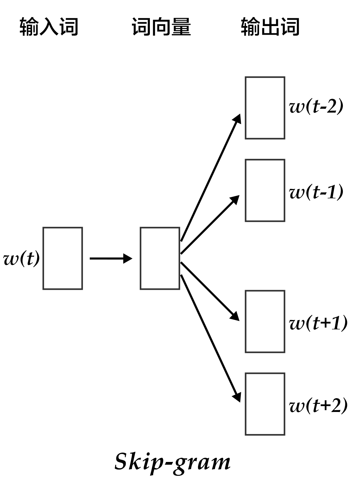

# Word2Vec

The source code of this tutorial can be found at [book/word2vec](https://github.com/PaddlePaddle/book/tree/develop/word2vec), please refer to PaddlePaddle [installation guide](http://www.paddlepaddle.org/doc_cn/build_and_install/index.html) for the first time use.

## Background Introduction

In this chapter, we will introduce the vector representation of words, which is also known as word embedding. Word embedding is a common operation in natural language processing, and is the common fundamental technology behind the search engine, ads system, recommendation system and other Internet services. 

In those Internet services, we usually need to estimate the similarity between two words or two paragraphs. In order to perform this estimation, we need to first represent the words in a way that is easier for the computer to process. The most natural way to achieve this goal is vector space model. In this kind of model, every word is represented as a one-hot vector, whose length is the size of the dictionary. Every element in the one-hot vector corresponds to one word in the dictionary. For each word, the corresponding element in the vector is 1 and all other elements are 0. 

Although one-hot vector is a natural choice, it has limited usefulness. For example, in an Internet ads system, if a customer enters a query of "Mother's day", and the keyword of an ad is "Carnations". We know that these two words are connected based on common sense because normally people would send their mothers a bunch of carnations on mother's day. However, the metric distance (either Euclidean or cosine similarity) between the one-hot vectors of these two words indicates that they are not relevant to each other. The reason that we came to this counter-intuitive conclusion is that the information contained in each word is too small. Therefore, only comparing two words is not sufficient for us to accurately estimate their relevance. In order to accurately calculate their similarity, we need more information which could be learned from big data through machine learning method. 

In the machine learning field, different kinds of "knowledge" are represented by different kinds of model, and word embedding model is one of them. Word embedding model can map an one-hot vector to an embedding vector of lower dimension, like $embedding(mother's day) = [0.3, 4.2, -1.5, ...], embedding(carnations) = [0.2, 5.6, -2.3, ...]$. In this mapped embedding vector space, we wish that the embedding vectors of two similar words (in terms of either semantic meaning or usage) are more close to each other, so that the cosine similarity between the corresponding vectors for "mother's day" and "carnations" are not zero anymore. 

Word embedding model could be probabilistic model, co-occurrence matrix model or neural network model. Before using neural networks to calculate the word embedding, the traditional method is to calculate a co-occurrence matrix $X$ of words. $X$ is a $|V| \times |V|$ size of matrix, where $X_{ij}$ represents the co-occurrence times of the i-th and j-th word in the vocabulary `V` within all corpus, and $|V|$ is the size of the vocabulary. By performing matrix decomposition on $X$ (like Singular Value Decomposition \[[5](#References)\]), the resulting $U$ can be seen as the word embedding of all the words. 

$$X = USV^T$$

However such traditional method suffers from many drawbacks:
1) Since lots of words didn't have co-occurrences, the matrix is extremely sparse. So it would require further treatment on word frequency to achieve good performance of matrix factorization;
2) The matrix size is huge (normally on the order of $10^6*10^6$);
3) We need to manually delete stop words (like "although", "a", ...), otherwise these frequent words will affect the performance of matrix factorization.

The neural network based model does not need to store a huge statistic table on all of the corpus. It obtains the word embedding by learning from semantic information, hence could avoid the aforementioned problems in the traditional method. In this chapter, we will introduce the details of neural network word embedding model and how to train such model in PaddlePaddle.

## Results Demonstration

In this chapter, after training the word embedding model, we could use the data visualization algorithm t-SNE\[[4](#reference)\] to draw the word embedding vectors after projecting them onto a two-dimensional space (see figure below). From the figure we could see that the semantically relevant words (like 'a', 'the', 'these'; 'big', 'huge') are close to each other in the projected space, while irrelevant words (like 'say', 'business'; 'decision', 'japan') are far from each other. 

<p align="center">
	<br/>
	Figure 1. Two dimension projection of word embedding
</p>

On the other hand, we know that the cosine similarity between two vectors falls between $[-1,1]$: the cosine similarity of two identical vectors is 1, of two perpendicular vectors is 0, of two opposite vectors is -1, which means that the cosine similarity between two vectors is proportional to their relevance. So we can calculate the cosine similarity of two word embedding vectors:

```
please input two words: big huge
similarity: 0.899180685161

please input two words: from company
similarity: -0.0997506977351
```

The above results could be obtained by running `calculate_dis.py` which loads the words in the dictionary and their corresponding trained word embeddings. We will provide detailed instruction in the section of [Model Application](#Model Application)


## Model Overview

In this section we will introduce three word embedding models: N-gram model, CBOW model and Skip-gram model, which shares a common theme of getting the probability of a word given its context. For N-gram model, we will first introduce the concept of language model, and implement it using PaddlePaddle in the following section of [Model Training](#Model Training). The latter two models are neural word embedding model which became popular recently and was developed by Tomas Mikolov at Google \[[3](#reference)\]. Although their structures are shallow and simple, they are very effective.

### Language Model

Before introducing the word embedding model, we will first introduce a concept: language model. Language model aims at modeling the joint probability function $P(w_1, ..., w_T)$ of a sentence, where $w_i$ is the i-th word in the sentence. The goal of the language model is to give meaningful sentences higher probabilities and meaningless sentences lower probabilities. Such kind of model can be applied to many fields, like machine translation, speech recognition, information retrieval, part-of-speech tagging and handwriting recognition, all of which require the probability of a sequence. Let us take information retrieval for example. When you search "how long is a football bame" (bame is a medical word), the search engine will ask you if you would actually like to search "how long is a football game" instead. This is because the probability of "how long is a football bame" is very low according to the language model, and among all of the words close to "bame", the word "game" would make the probability of the sentence highest. 

For language model's target probability $P(w_1, ..., w_T)$, if we assume that each word in the sentence is independent, then the joint probability of the whole sentence is the product of each word's probability: 

$$P(w_1, ..., w_T) = \prod_{t=1}^TP(w_t)$$

However we know that the probability of each word depends heavily on previous words, so people usually use the conditional probability to construct the language model:

$$P(w_1, ..., w_T) = \prod_{t=1}^TP(w_t | w_1, ... , w_{t-1})$$ 


### N-gram neural model 

In computational linguistics, n-gram is an important text representation method, representing n consecutive items in a text. Based on the desired application scenario, each item could be a letter, a syllable or a word. N-gram model is also an important method in statistical language modeling. When using the n-gram method to train the language model, one uses first (n-1) words to predict the n-th word in a n-gram.

Yoshua Bengio and other scientists described how to train a word embedding model using neural network in the famous paper of Neural Probabilistic Language Models \[[1](#reference)\] published in 2003. The Neural Network Language Model (NNLM) described in the paper learns the language model and word embedding simultaneously through a linear transformation and a non-linear hidden connection. By learning from large amount of corpus, we could get the word embedding and then get the probability of the whole sentence through the word embedding. This type of language model can overcome the curse of dimensionality, i.e. model inaccuracy caused by the difference between training and testing data. Caution: because neural network language model is loosely defined, we will not use the name of NNLM but call it N-gram neural model in this chapter. 

We have previously described to use conditional probability to construct language model, so the probability of the t-th word in a sentence depends on all t-1 words before it. But actually the words further away have less impact on a word, so if we only consider a n-gram, every word is only effected by its previous n-1 words, then we have:

$$P(w_1, ..., w_T) = \prod_{t=n}^TP(w_t|w_{t-1}, w_{t-2}, ..., w_{t-n+1})$$

Given some real corpus in which sentences are all meaningful, the objective function of the N-gram model is: 

$$\frac{1}{T}\sum_t f(w_t, w_{t-1}, ..., w_{t-n+1};\theta) + R(\theta)$$

where $f(w_t, w_{t-1}, ..., w_{t-n+1})$ represents the conditional probability of the current word $w_t$ given its previous n-1 words, and $R(\theta)$ represents parameter regularization term. 

<p align="center">	
   	<br/>
   	图2. N-gram neural network model
</p>

Figure 2 shows the N-gram neural network model. From bottom to top, the model can be separated into the following components:  

 - For each sample, the model gets input of $w_{t-n+1},...w_{t-1}$, and outputs the probability of the t-th word being one of `|V|` in the dictionary. 
 
 Every input word $w_{t-n+1},...w_{t-1}$ first get transformed into word embedding $C(w_{t-n+1}),...C(w_{t-1})$ through matrix multiplication. 
 
 - Then all the word embeddings concatenate into a single vector, which is mapped into the t-th word hidden representation:

	$$g=Utanh(\theta^Tx + b_1) + Wx + b_2$$
	
   where $x$ is the large vector concatenated from all the word embeddings representing the context; $\theta$, $U$, $b_1$, $b_2$ and $W$ are parameters connecting from word embedding layer to hidden layer. $g$ represents the unnormalized probability of the output word, $g_i$ represents the unnormalized probability of the output word being the i-th word in the dictionary. 

 - Based on the definition of softmax, by normalizing $g_i$, the probability of the output word being $w_t$ is:
 
  $$P(w_t | w_1, ..., w_{t-n+1}) = \frac{e^{g_{w_t}}}{\sum_i^{|V|} e^{g_i}}$$
 
 - The loss of the entire network is multi-class cross-entropy and can be described by the formula below

   $$J(\theta) = -\sum_{i=1}^N\sum_{c=1}^{|V|}y_k^{i}log(softmax(g_k^i))$$ 

   where $y_k^i$ represents the true label for the k-th class in the i-th sample, $softmax(g_k^i)$ represents the softmax probability for the k-th class in the i-th sample.

### Continuous Bag-of-Words model(CBOW) 

CBOW model predicts the current word based on N words before and after it. When N=2, the model is as the figure below:

<p align="center">	
	<br/>
	Figure 3. CBOW model
</p>

Concretely, by ignoring the sequence of words in the context, CBOW uses the average value of the word embedding of the context words to predict the current word:

$$context = \frac{x_{t-1} + x_{t-2} + x_{t+1} + x_{t+2}}{4}$$

where $x_t$ is the word embedding of the t-th word, classification score vector is $z=U*context$, the final classification $y$ uses softmax and the loss function uses multi-class cross-entropy.

### Skip-gram model 

The advantages of CBOW is that it smooths over the word embeddings of the context and reduces noise, so it is very effective on small dataset. Skip-gram uses a word to predict its context and get multiple context for the given word, so it can be used in larger datasets. 

<p align="center">	
	<br/>
	图4. Skip-gram model
</p>


As illustrated in the figure above, Skip-gram model maps the word embedding of the given word onto $2n$ word embeddings (including $n$ words before and $n$ words after the given word), and then obtained the classification loss of all those $2n$ words by softmax. 

## Data Preparation

## Model Configuration
	
## Model Training

## Model Application
 
## Conclusion

In this chapter, we introduced word embedding, relationship between language model and word embedding, and how to train neural network model to get word embedding. In the information retrieval, we can obtain the similarity between the query and document keyword by calculating the cosine value between their word embeddings. In the grammar analysis and semantic analysis, a trained word embedding can be used to initialized models to gain better performance. In document classification, we can use clustering method to group synonyms in the documents by word embedding. We hope that readers could use word embedding models in their work after reading this chapter.


## Referenes
1. Bengio Y, Ducharme R, Vincent P, et al. [A neural probabilistic language model](http://www.jmlr.org/papers/volume3/bengio03a/bengio03a.pdf)[J]. journal of machine learning research, 2003, 3(Feb): 1137-1155.
2. Mikolov T, Kombrink S, Deoras A, et al. [Rnnlm-recurrent neural network language modeling toolkit](http://www.fit.vutbr.cz/~imikolov/rnnlm/rnnlm-demo.pdf)[C]//Proc. of the 2011 ASRU Workshop. 2011: 196-201.
3. Mikolov T, Chen K, Corrado G, et al. [Efficient estimation of word representations in vector space](https://arxiv.org/pdf/1301.3781.pdf)[J]. arXiv preprint arXiv:1301.3781, 2013.
4. Maaten L, Hinton G. [Visualizing data using t-SNE](https://lvdmaaten.github.io/publications/papers/JMLR_2008.pdf)[J]. Journal of Machine Learning Research, 2008, 9(Nov): 2579-2605.
5. https://en.wikipedia.org/wiki/Singular_value_decomposition

<br/>
<a rel="license" href="http://creativecommons.org/licenses/by-nc-sa/4.0/"></a><br /><span xmlns:dct="http://purl.org/dc/terms/" href="http://purl.org/dc/dcmitype/Text" property="dct:title" rel="dct:type">本教程</span> 由 <a xmlns:cc="http://creativecommons.org/ns#" href="http://book.paddlepaddle.org" property="cc:attributionName" rel="cc:attributionURL">PaddlePaddle</a> 创作，采用 <a rel="license" href="http://creativecommons.org/licenses/by-nc-sa/4.0/">知识共享 署名-非商业性使用-相同方式共享 4.0 国际 许可协议</a>进行许可。
