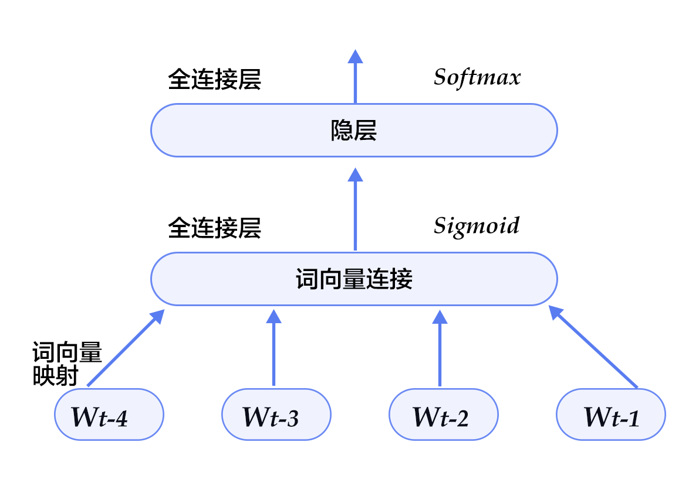

TODO: Base on [this tutorial](https://github.com/PaddlePaddle/Paddle/blob/develop/doc/tutorials/embedding_model/index_en.md).

# 背景介绍

本章我们主要讲如何训练词语的向量表征，即词语在向量空间模型（vector space models）中的特征表示。首先我们来熟悉词向量和语言模型。

- 词向量：word embedding是指将词语映射到的高维向量，如
	<center>E(football) = [0.3, 4.2, -1.5, ...]</center>
	<center>E(baseball) = [0.2, 5.6, -2.3, ...]</center>
向量空间模型中，每个词/句子/文档 都有自己的向量表示，可以通过该向量来计算两个词/句子/文档之间的距离。学习词向量的目标就是希望训练出来这样一个映射矩阵，能够将相同语义的词语(如"football"和"baseball")映射到相近的特征向量。
在信息检索中，我们可以根据query和文档关键词向量间的夹角判断相关性；在句法分析和语义分析等自然语言处理任务中，训练好的词向量可以用来初始化模型，以得到更好的效果；有了词向量之后我们同样可以用聚类的方法将文档中同义词进行分组，从而进行文档分类。

- 语言模型：语言模型旨在为语句的联合概率函数建模。统计语言模型中，一句话的联合概率可以表示为其中所有词语条件概率的乘积，即
$$P(w_1, ..., w_T) = \prod_{t=1}^TP(w_t | w_1, ... , w_{t-1})$$
其中$w_i$表示句子中的第i个词。
语言模型有很多应用领域，如机器翻译、语音识别、信息检索、词性标注、手写识别等。这些应用有个共同的特点，就是希望能得到一个连续序列的概率。拿信息检索为例，当你在搜索“how long is a football bame”时（bame是一个医学名词），搜索引擎会提示你是否希望搜索"how long is a football game", 这是因为根据语言模型计算出“how long is a football bame”的概率很低，而与bame近似的，可能引起typo的词中，game会使该句生成的概率最大。

- 语言模型与词向量的关系：
	在实际应用中, 语言模型和词向量密不可分。如下图所示，语言模型希望得到一句话的概率时，训练模型的输入是词语映射到的词向量。
	<p align="center">	
	<center></center>
	</p>
	相反，词向量的训练也基于语言模型。我们希望训练出来的词向量能够将相同语义的词语映射到相近的特征向量，而语言模型的训练语料中经常出现"how long is a football game" 和"how long is a baseball game"，即可通过语言模型学到相近特征的"football"和"baseball"了。本章中，我们就主要介绍语言模型和词向量的关系，以及如何训练词向量。
	

#效果展示

本例中，当语言模型训练好后，我们可以用t-SNE将词语特征在二维上的投影画在下图，可见语义相关的词语（如a, the, these; big, huge）在投影上距离也很近， 语意无关的词（如say, business; decision, japan）在投影上的距离也很远。

<center></center>

另一方面，我们还可以通过计算词向量的cosine得到相似度, 如:
```
similarity: 0.899180685161
please input two words: big huge
similarity: 0.638160689862
please input two words: billion million
similarity: 0.632455899017
please input two words: china japan
similarity: 0.704361449565

please input two words: a decision
similarity: -0.436248234689
please input two words: huge say
similarity: -0.160392409963
please input two words: from company
similarity: -0.0997506977351
please input two words: year he
similarity: 0.0558745388603
```
以上结果可以通过运行`caldis.py`, 加载字典里的单词和对应训练特征结果得到，我们将在[应用模型](#应用模型)中详细描述用法。

#模型概览
在这里我们介绍4个训练词向量的模型。

- **N-gram neural model**\[[1](#参考文献)\]
	在计算语言学中，n-gram表示一个文本中连续的n个项。基于具体的应用场景，每一项可以是一个字母、单词或者音节。本模型中用每个n-gram的历史n-1个词语组成的内容来预测第n个词。

- **Continuous Bag-of-Words model(CBOW)****\[[4](#参考文献)\]


- **Skip-Gram model****\[[4](#参考文献)\]
	CBOW方法中，根据上下文信息预测当前词，而skip-gram方法相反地用当前词预测上下文。CBOW的好处是对上下文词语分布进行了平滑，因此在小数据集上很有效，而skip-gram的方法得到了当前词上下文的很多样本，因此适用于大数据集。

- **RNNLM**
基于RNN的语言模型，将N-gram模型中固定输入个数输入改成序列输入，根据上文序列的RNN隐状态估计下一时刻的词语。


### N-gram neural model
n-gram模型是统计语言模型中的一种重要方法，

Bengio等人在2003年的一篇经典工作A Neural Probabilistic Language Model中\[[1](#参考文献)\]提出，可以通过学习大量语料得到词语的向量表达，通过这些向量得到整个句子的概率。用这种方法学习语言模型可以克服维度诅咒（curse of dimensionality）,即训练和测试数据不同导致的模型不准。

该语言模型的优化目标是最大化
$$\frac{1}{T}\sum_t f(w_t, w_{t-1}, ..., w_{t-n+1};\theta) + R(\theta)$$

其中$f(w_t, w_{t-1}, ..., w_{t-n+1})=P(w_t | w_1, ..., w_{t-1})$, 表示根据历史n-1个词得到当前词$w_t$的条件概率，$R(\theta)$表示正则项。

在该论文的基础上稍加修改，本例中函数$f$的网络表示如图：

<center></center>

对于每个样本，模型输入$w_{t-n+1},...w_{t-1}$, 输出第t个词时字典中|V|个词的概率，V表示训练语料词汇表（vocabulary），本例中n取5。


根据softmax的定义，生成目标词$w_t$的概率为：
$$P(w_t | w_1, ..., w_{t-n+1}) = \frac{e^{g_{w_t}}}{\sum_i^{|V|} e^{g_i}}$$
其中$g_i$为predictword在第i个输出接点的值，$g_i = \theta_i^Tx + b$, $x$为hidden1层的特征, $\theta$和$b$为hidden1层到predictword层的全连接参数。

整个网络的cost为多类分类交叉熵，用classification_cost层实现。

用公式表示，

$$J(\theta) = -\sum_{i=1}^N\sum_{c=1}^{|V|}y_k^{i}log(softmax(g_k^i))$$ 

其中$y_k^i$表示第i个样本第k类的真实label(0或1)，$softmax(g_k^i)$表示第i个样本第k类softmax输出的概率。


#数据准备
	
1. 数据概览：

	在此demo中我们选用[Penn Tree Bank](http://www.fit.vutbr.cz/~imikolov/rnnlm/) (PTB)数据集。该数据集用在Mikolov的公开语言模型训练工具 Recurrent Neural Network Language Modeling Toolkit \[[3](#参考文献)\]中。数据集较小，训练速度快。该数据集统计情况如下:
	<center>
	| 训练数据 | 验证数据 | 测试数据 |
	| -- | -- | -- |
	| ptb.train.txt | ptb.valid.txt| ptb.test.txt|
	|42068句|3370句|3761句|
	</center>
	
2. 数据下载和准备: <br/>
	执行data/getdata.sh下载该数据，并分别将训练数据和验证数据输入train.list和test.list文件中，供paddle训练时使用。<br/>
	
3. 提供数据给paddle:<br/>
	在`dataprovider.py`中，我们将数据提供给paddle。
`initializer`中进行dataprovider的初始化，其中主要包括字典的建立（在`build_dict`函数中实现）和paddle输入字段的格式定义。

	```python
	def build_dict(ftrain, fdict):
		sentences = []
	    with open(ftrain) as fin:
	        for line in fin:
	            line = ['<s>'] + line.strip().split() + ['<e>']
	            sentences += line
	    wordfreq = collections.Counter(sentences)
	    wordfreq = filter(lambda x: x[1] > cutoff, wordfreq.items())
	    dictionary = sorted(wordfreq, key = lambda x: (-x[1], x[0]))
	    words, _ = list(zip(*dictionary))
	    for word in words:
	        print >> fdict, word
	    word_idx = dict(zip(words, xrange(len(words))))
	    logger.info("Dictionary size=%s" %len(words))
	    return word_idx
	
	def initializer(settings, srcText, dictfile, **xargs):
	    with open(dictfile, 'w') as fdict:
	        settings.dicts = build_dict(srcText, fdict)
	    input_types = []
	    for i in xrange(N):
	        input_types.append(integer_value(len(settings.dicts)))
	    settings.input_types = input_types
	```
	
	这里N为模型N-gram, `dataprovider.py`中定义N=5,大家也可以根据新的数据和需求自行调整N。但注意调整的同时要在模型配置文件中加入/减少相应输入字段。
	接下来，在`process`函数中将数据逐一提供给paddle。

	```python
	@provider(init_hook=initializer)
	def process(settings, filename):
	    UNKID = settings.dicts['<unk>']
	    with open(filename) as fin:
	        for line in fin:
	            line = ['<s>']*(N-1)  + line.strip().split() + ['<e>']
	            line = [settings.dicts.get(w, UNKID) for w in line]
	            for i in range(N, len(line) + 1):
	                yield line[i-N: i]
	```

	具体来说，将每句话前面补上N-1个开始符号 <s> 末尾补上一个结束符号<e>，然后以N为窗口大小，从头到尾每次向右滑动窗口并生成一条数据。如"I have a dream" 一句提供了5条数据：
	
	> 	<s> <s> <s> <s> I 	
	> <s> <s> <s> I have
	> <s> <s> I have a 
	> <s> I have a dream
	> I have a dream <e>

	在paddle训练时，每条数据的前4个词用来预测第5个词。


#训练模型

1. 首先将$w_t$之前的$n-1$个词 $w_{t-n+1},...w_{t-1}$通过|V|*D的矩阵映射到D维词向量（本例config中取D=32），
	```
	embsize = 32
	Efirst = wordemb(firstword)  
	Esecond = wordemb(secondword)
	Ethird = wordemb(thirdword)  
	Efourth = wordemb(fourthword)
	```

2. 将这n-1个词向量经过concat_layer连接成一个大向量作为文本上文特征contextemb层。
	```
	contextemb = concat_layer(input = [Efirst, Esecond, Ethird, Efourth])
	```
3. 将contextemb全连接到hidden1层作为文本隐层特征，再经过一个全连接映射到|V|维向量predictword层，并softmax得到|V|个词的生成概率。

	```
	# concatentate Ngram embeddings into context embedding
	contextemb = concat_layer(input = [Efirst, Esecond, Ethird, Efourth])
	hidden1 = fc_layer(
	        input = contextemb,
	        size = hiddensize,
	        act = SigmoidActivation(),
	        layer_attr = ExtraAttr(drop_rate=0.5),
	        bias_attr = ParamAttr(learning_rate = 2),
	        param_attr = ParamAttr(
	            initial_std = 1./math.sqrt(embsize*8),
	            learning_rate = 1))
	
	# use context embedding to predict nextword
	predictword = fc_layer(
	        input = hidden1,
	        size = dictsize,
	        bias_attr = ParamAttr(learning_rate = 2),
	        act = SoftmaxActivation())
	```

4. 网络的loss function为多类交叉熵，在paddle中用`classification_cost`实现。
	```
	cost = classification_cost(
	        input = predictword,
	        label = nextword)
	```

5. 最后，执行sh train.sh进行模型的训练。其中指定了总共需要执行30个pass。
	```
	paddle train \
	       --config Ngram.py \
	       --use_gpu=1 \
	       --dot_period=100 \
	       --log_period=3000 \
	       --test_period=0 \
	       --save_dir=model \
	       --num_passes=30
	```

#应用模型
训练模型后，我们可以加载模型参数，用训练出来的词向量初始化其他模型，也可以将模型参数从二进制格式转换成文本格式进行后续应用。

1. 初始化其他模型

	该模型训练好的参数可以用来初始化其他模型，具体方法如下。
	在paddle 训练命令行中，用`--init_model_path` 来定义初始化模型的位置，用`--load_missing_parameter_strategy`指定除了词向量以外，新模型其他参数的初始化策略。	注意被初始化的模型中，需要和原模型共享被初始化参数的参数名。
	
2. 转换二进制词向量到文本格式

	我们提供了文件`paraconvert.py`用来互转paddle训练结果的二进制文件和文本格式特征文件。
	 - 二进制转文本

		```
		python paraconvert.py --b2t -i INPUT -o OUTPUT -d DIM
		```
		转换后得到的文本文件中，第一行为文件信息，之后每一行都按顺序表示字典里一个词的特征，用逗号分隔。用法如：
		```
		python paraconvert.py --b2t -i model/pass-00029/_proj -o model/pass-00029/_proj.txt -d 32
		```
		
	 - 文本转二进制
		
		```
		python paraconvert.py --t2b -i INPUT -o OUTPUT
		```

3. 计算词语之间的余弦距离

	两个向量之间的余弦值通常用来计算向量之间的距离。这里我们在`caldis.py`中实现不同词语的距离度量。
	用法：
 `python caldis.py VOCABULARY EMBEDDINGLAYER` <br/>
其中，VOCABULARY是dataprovider中生成的字典，EMBEDDINGLAYER是模型训练出来的词向量，如
 `python caldis.py data/vocabulary.txt model/pass-00029/_proj.txt`。


#参考文献
1. Bengio Y, Ducharme R, Vincent P, et al. [A neural probabilistic language model](http://www.jmlr.org/papers/volume3/bengio03a/bengio03a.pdf)[J]. journal of machine learning research, 2003, 3(Feb): 1137-1155.
2. Mikolov T, Sutskever I, Chen K, et al. [Distributed representations of words and phrases and their compositionality](http://papers.nips.cc/paper/5021-distributed-representations-of-words-and-phrases-and-their-compositionality.pdf)[C]//Advances in neural information processing systems. 2013: 3111-3119.
3. Mikolov T, Kombrink S, Deoras A, et al. [Rnnlm-recurrent neural network language modeling toolkit](http://www.fit.vutbr.cz/~imikolov/rnnlm/rnnlm-demo.pdf)[C]//Proc. of the 2011 ASRU Workshop. 2011: 196-201.
4. Mikolov T, Chen K, Corrado G, et al. [Efficient estimation of word representations in vector space\[J\]](https://arxiv.org/pdf/1301.3781.pdf). arXiv preprint arXiv:1301.3781, 2013.

