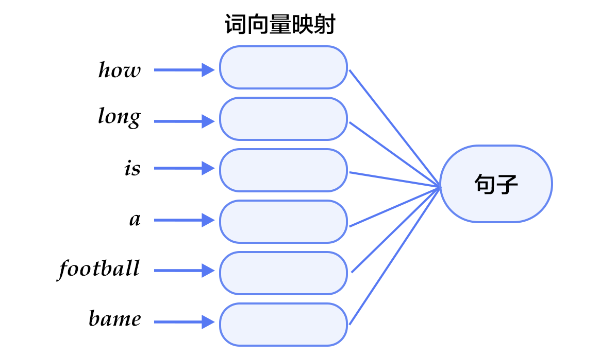

# 词向量

## 背景介绍

本章我们词的向量表征，也称为word embedding。词向量是自然语言处理中常见的一个操作，是搜索引擎、广告系统、推荐系统等互联网服务背后常见的基础技术。

在这些互联网服务里，我们经常要比较两个词或者两段文本之间的相关性。为了做这样的比较，我们往往先要把词表示成计算机适合处理的方式。最自然的方式恐怕莫过于向量空间模型(vector space model)。 在这种方式里，每个词被表示成一个实数向量，其长度为字典大小，其中每个维度对应一个字典里的每个词。任何一个单词对应一个向量，其中绝大多数元素都是0，只有这个词对应的维度上的值是1。这样的向量有个术语名字——one-hot vector。

One-hot vector虽然自然，但是用处有限。比如，在互联网广告系统里，如果用户输入的query是“母亲节”，而有一个广告的关键词是“康乃馨”。按照常理，我们知道这两个词之间是有联系的——母亲节通常应该送给母亲一束康乃馨。但是这两个词对应的one-hot vectors之间的距离度量，无论是欧氏距离还是余弦相似度(cosine similarity)，由于其向量正交，都认为这两个词毫无相关性。 这样与我们认识相悖的结论的根本原因是，每个词本身的信息量都很小，所以仅仅给定两个词，不足以让我们准确判别它们是否相关。要想精确计算相关性，我们还需要更多的信息——从大量数据里通过机器学习方法归纳出来的知识！

在机器学习领域里，各种“知识库”被用各种模型表示。其中有一类模型被称为词向量模型(word embedding model)。通过词向量模型可以得到词语的向量表示，如E(母亲节) = [0.3, 4.2, -1.5, ...], E(康乃馨) = [0.2, 5.6, -2.3, ...]。词向量模型可能是概率模型, 也可能是co-occurrence matrix模型或神经元网络模型；它们的作用是可以把一个 one-hot vector 映射到一个实数向量（embedding vector），通常更短（维度更低），而且两个语义上（或者用法上）相似的词对应的 embedding vectors 通常“更像”。 比如我们希望“母亲节”和“康乃馨”对应的embedding vectors的余弦相似度不再为零了。

在本章里，我们展示神经元 word embedding model 的细节，以及如何用PaddlePaddle 训练一个 word embedding model，把语义相近的词表示成距离相近的向量。


## 效果展示

本例中，当语言模型训练好后，我们可以用t-SNE将词语特征在二维上的投影画在下图，可见语义相关的词语（如a, the, these; big, huge）在投影上距离也很近， 语意无关的词（如say, business; decision, japan）在投影上的距离也很远。

<p align="center">
	<br/>
	图1. 词向量的二维投影
</p>

另一方面，我们还可以通过计算词向量的cosine得到相似度, 如:
```
similarity: 0.899180685161
please input two words: big huge
similarity: 0.638160689862
please input two words: billion million
similarity: 0.632455899017
please input two words: china japan
similarity: 0.704361449565

please input two words: a decision
similarity: -0.436248234689
please input two words: huge say
similarity: -0.160392409963
please input two words: from company
similarity: -0.0997506977351
please input two words: year he
similarity: 0.0558745388603
```
以上结果可以通过运行`calculate_dis.py`, 加载字典里的单词和对应训练特征结果得到，我们将在[应用模型](#应用模型)中详细描述用法。


## 模型概览

在介绍词向量常用模型之前，我们先来了解一下语言模型，以及语言模型和词向量的关系。

- n-gram: 	在计算语言学中，n-gram表示一个文本中连续的n个项。基于具体的应用场景，每一项可以是一个字母、单词或者音节。在学习词向量的n-gram模型中，一般用每个n-gram的历史n-1个词语组成的内容来预测第n个词。


- 语言模型：语言模型旨在为语句的联合概率函数$P(w_1, ..., w_T)$建模, 其中$w_i$表示句子中的第i个词。目标即希望模型对有意义的句子赋予大概率，对没意义的句子赋予小概率。
语言模型有很多应用领域，如机器翻译、语音识别、信息检索、词性标注、手写识别等。这些应用有个共同的特点，就是希望能得到一个连续序列的概率。拿信息检索为例，当你在搜索“how long is a football bame”时（bame是一个医学名词），搜索引擎会提示你是否希望搜索"how long is a football game", 这是因为根据语言模型计算出“how long is a football bame”的概率很低，而与bame近似的，可能引起typo的词中，game会使该句生成的概率最大。


- 语言模型与词向量的关系：
	在实际应用中, 语言模型和词向量密不可分。如下图所示，语言模型希望得到一句话的概率时，训练模型的输入是词语映射到的词向量。通过这些词向量，和语料中词语/短语/句子出现的频率，就可以得到给定的一句话的概率（我们将在模型概览中详细讲述）。
	<p align="center">	
		<br/>
		图2. 语言模型与词向量模型
	</p>
	相反，词向量的训练也基于语言模型。我们希望训练出来的词向量能够将相同语义的词语映射到相近的特征向量，而语言模型的训练语料中经常出现"how long is a football game" 和"how long is a baseball game"，即可通过语言模型学到相近特征的"football"和"baseball"了。下面，我们就主要介绍如何结合语言模型训练词向量。


在用神经网络求word embedding之前，传统做法是统计一个word co-occurrence矩阵$X$。$X$是一个`|V|*|V|`大小的矩阵，$X_{ij}$表示在所有语料中，词汇表(vocabulary)中第i个词和第j个词同时出现的词数，`|V|`为词汇表的大小。对$X$做矩阵分解（如Singular Value Decomposition），即
$$X = USV^T$$
其中得到的$U$即视为所有词的word embedding. 这样做有很多问题：
1) 很多词没有出现，导致矩阵极其稀疏，也需要对词频做额外tricks来达到好的SVD效果；
2) 矩阵非常大，维度太高(通常达到$10^6*10^6$的数量级)；
3) 需要手动去掉停用词（如although, a,...）


而基于神经网络的模型就可以很好的解决以上问题，而不需要计算存储一个在全语料上统计的大表。在这里我们介绍4个训练词向量的模型，中心思想都是通过上下文得到一个词出现的概率。


### N-gram neural model 

Word embedding 的研究从2000年开始。Yoshua Bengio等科学家于2003年发表了著名的论文 Neural Probabilistic Language Models \[[1](#参考文献)\] 介绍如何学习一个神经元网络表示的embedding model，文中neural network language model(NNLM)通过一个线性映射和一个非线性隐层连接，同时学习了语言模型和词向量。
	PS：由于下面介绍的也是神经网络语言模型，我们在这里不用其NNLM的本名，考虑到其具体做法，本文中称该模型为N-gram neural model。


n-gram模型是统计语言模型中的一种重要方法，文中 \[[1](#参考文献)\] 提出，可以通过学习大量语料得到词语的向量表达，通过这些向量得到整个句子的概率。用这种方法学习语言模型可以克服维度诅咒（curse of dimensionality）,即训练和测试数据不同导致的模型不准。在上文中我们已经讲到语言模型的目标是对$P(w_1, ..., w_T)$建模, 如果假设文本中每个词都是相互独立的，则句话的联合概率可以表示为其中所有词语条件概率的乘积，即

$$P(w_1, ..., w_T) = \prod_{t=1}^TP(w_t)$$

然而我们知道语句中的每个词出现的概率都与其前面的词紧密相关, 即

$$P(w_1, ..., w_T) = \prod_{t=1}^TP(w_t | w_1, ... , w_{t-1})$$

可是越远的词语其实对该词的影响越小，那么如果考虑一个n-gram, 每个词都只受其前`n-1`个词的影响，则有
$$P(w_1, ..., w_T) = \prod_{t=n}^TP(w_t|w_{t-1}, w_{t-2}, ..., w_{t-n+1})$$

给定了一些真实语料，这些语料中都是有意义的句子，语言模型的优化目标则是最大化

$$\frac{1}{T}\sum_t f(w_t, w_{t-1}, ..., w_{t-n+1};\theta) + R(\theta)$$

其中$f(w_t, w_{t-1}, ..., w_{t-n+1})$, 表示根据历史n-1个词得到当前词$w_t$的条件概率，$R(\theta)$表示正则项。

函数$f$的网络示意图如下：
<p align="center">	
	<br/>
	图3. n-gram神经网络模型
</p>
对于每个样本，模型输入$w_{t-n+1},...w_{t-1}$, 输出第t个词时字典中|V|个词的概率，V表示训练语料词汇表（vocabulary），本例中n取5。


根据softmax的定义，生成目标词$w_t$的概率为：
$$P(w_t | w_1, ..., w_{t-n+1}) = \frac{e^{g_{w_t}}}{\sum_i^{|V|} e^{g_i}}$$
其中$g_i$为预测当前词的层中，第i个输出词节点的值，$g_i = \theta_i^Tx + b$, $x$为隐层特征（一个线性映射`embedding`投影到的非线性隐层`fully connect`）, $\theta$和$b$为隐层特征层到词预测层的全连接参数。

整个网络的cost为多类分类交叉熵，用公式表示为

$$J(\theta) = -\sum_{i=1}^N\sum_{c=1}^{|V|}y_k^{i}log(softmax(g_k^i))$$ 

其中$y_k^i$表示第i个样本第k类的真实label(0或1)，$softmax(g_k^i)$表示第i个样本第k类softmax输出的概率。


### Continuous Bag-of-Words model(CBOW) 

近年来最有名的神经元网络 word embedding model 恐怕是 Tomas Mikolov 在Google 研发的 wordvec\[[4](#参考文献)\]。其中介绍了两个模型，Continuous Bag-of-Words model和Skip-Gram model，这两个网络很浅很简单，但训练效果非常好。CBOW模型通过一个词的上下文（各N个词）预测当前词，而Skip-gram模型用一个词预测其上下文。
<p align="center">	
	<br/>
	图4. CBOW模型
</p>
如上图所示，不考虑上下文的词语输入顺序，CBOW用上下文词语的词向量的均值来预测当前词，即
$$context = \frac{x_{t-1} + x_{t-2} + x_{t+1} + x_{t+2}}{4}$$
其中$x_t$为第t个词的词向量，分类score向量 $z=U*context$，最终的分类依然用softmax, $y=softmax(z)$，loss还是cross entropy。

### Skip-gram model 

CBOW的好处是对上下文词语的分布在词向量上进行了平滑，去掉了噪声，因此在小数据集上很有效，而skip-gram的方法得到了当前词上下文的很多样本，因此可用于更大的数据集。
<p align="center">	
	<br/>
	图5. skip-gram模型
</p>
如上图所示，skip-gram模型的具体做法是，将一个词的词向量映射到$2n$个词的词向量（`2n`表示当前输入词的前后各n个词），分别通过softmax得到这2n个词。

最终loss为所有`2n`个词的分类loss的和。
在\[[4](#参考文献)\]的基础上，\[[2](#参考文献)\]在一些具体做法上对Skip-gram方法进行了改进。


## 数据准备
	
### 数据介绍与下载

在此demo中我们选用[Penn Tree Bank](http://www.fit.vutbr.cz/~imikolov/rnnlm/) (PTB)数据集。该数据集用在Mikolov的公开语言模型训练工具 Recurrent Neural Network Language Modeling Toolkit \[[3](#参考文献)\]中。数据集较小，训练速度快。该数据集统计情况如下:

<p align="center">
<table>
	<tr>
		<td>训练数据</td>
		<td>验证数据</td>
		<td>测试数据</td>
	</tr>
	<tr>
		<td>ptb.train.txt</td>
		<td>ptb.valid.txt</td>
		<td>ptb.test.txt</td>
	</tr>
	<tr>
		<td>42068句</td>
		<td>3370句</td>
		<td>3761句</td>
	</tr>
</table>
</p>

执行data/getdata.sh下载该数据，并分别将训练数据和验证数据输入train.list和test.list文件中，供PaddlePaddle训练时使用。<br/>
	
### 提供数据给PaddlePaddle

在`dataprovider.py`中，我们将数据提供给PaddlePaddle。
`initializer`中进行dataprovider的初始化，其中主要包括字典的建立（在`build_dict`函数中实现）和PaddlePaddle输入字段的格式定义。

```python
def build_dict(ftrain, fdict):
	sentences = []
    with open(ftrain) as fin:
        for line in fin:
            line = ['<s>'] + line.strip().split() + ['<e>']
            sentences += line
    wordfreq = collections.Counter(sentences)
    wordfreq = filter(lambda x: x[1] > cutoff, wordfreq.items())
    dictionary = sorted(wordfreq, key = lambda x: (-x[1], x[0]))
    words, _ = list(zip(*dictionary))
    for word in words:
        print >> fdict, word
    word_idx = dict(zip(words, xrange(len(words))))
    logger.info("Dictionary size=%s" %len(words))
    return word_idx

def initializer(settings, srcText, dictfile, **xargs):
    with open(dictfile, 'w') as fdict:
        settings.dicts = build_dict(srcText, fdict)
    input_types = []
    for i in xrange(N):
        input_types.append(integer_value(len(settings.dicts)))
    settings.input_types = input_types
```

这里N为模型N-gram, `dataprovider.py`中定义N=5,大家也可以根据新的数据和需求自行调整N。但注意调整的同时要在模型配置文件中加入/减少相应输入字段。
接下来，在`process`函数中将数据逐一提供给PaddlePaddle。

```python
@provider(init_hook=initializer)
def process(settings, filename):
    UNKID = settings.dicts['<unk>']
    with open(filename) as fin:
        for line in fin:
            line = ['<s>']*(N-1)  + line.strip().split() + ['<e>']
            line = [settings.dicts.get(w, UNKID) for w in line]
            for i in range(N, len(line) + 1):
                yield line[i-N: i]
```

具体来说，将每句话前面补上N-1个开始符号 `<s>`, 末尾补上一个结束符号`<e>`，然后以N为窗口大小，从头到尾每次向右滑动窗口并生成一条数据。如"I have a dream" 一句提供了5条数据：

> `<s> <s> <s> <s> I `<br/>
> `<s> <s> <s> I have`<br/>
> `<s> <s> I have a `<br/>
> `<s> I have a dream`<br/>
> `I have a dream <e>`<br/>

在PaddlePaddle训练时，每条数据的前4个词用来预测第5个词。


## 模型配置说明

### 数据定义

在模型配置中，首先定义通过define_py_data_sources2从dataprovider中读入数据，其中args指定了训练文本(`srcText`)和词汇表(`dictfile`)。

```python
args = {'srcText': 'data/simple-examples/data/ptb.train.txt',
        'dictfile': 'data/vocabulary.txt'}
		
define_py_data_sources2(
    train_list="data/train.list",
    test_list="data/test.list",
    module="dataprovider",
    obj="process",
    args=args)
```

### 算法配置

在这里，我们指定了模型的训练参数, 选择L2正则项稀疏、学习率和batch size。

```python
batch_size = 100
settings(
    batch_size=batch_size,
    regularization=L2Regularization(8e-4),
    learning_rate=3e-3)

```
### 模型结构

1. 首先将$w_t$之前的$n-1$个词 $w_{t-n+1},...w_{t-1}$通过`|V|*D`的矩阵映射到D维词向量（本例config中取`D=32`），
	
	```python
	def wordemb(inlayer):
    wordemb = table_projection(
        input = inlayer,
        size = embsize,
        param_attr=ParamAttr(name = "_proj",
            initial_std=0.001,
            learning_rate = 1,
            l2_rate= 0,))
    return wordemb

	Efirst = wordemb(firstword)
	Esecond = wordemb(secondword)
	Ethird = wordemb(thirdword)
	Efourth = wordemb(fourthword)
	```

2. 将这n-1个词向量经过concat_layer连接成一个大向量作为文本上文特征contextemb层。

	```python
	contextemb = concat_layer(input = [Efirst, Esecond, Ethird, Efourth])
	```
3. 将contextemb全连接到hidden1层作为文本隐层特征，再经过一个全连接映射到|V|维向量predictword层，并softmax得到|V|个词的生成概率。

	```python
	# concatentate Ngram embeddings into context embedding
	contextemb = concat_layer(input = [Efirst, Esecond, Ethird, Efourth])
	hidden1 = fc_layer(
	        input = contextemb,
	        size = hiddensize,
	        act = SigmoidActivation(),
	        layer_attr = ExtraAttr(drop_rate=0.5),
	        bias_attr = ParamAttr(learning_rate = 2),
	        param_attr = ParamAttr(
	            initial_std = 1./math.sqrt(embsize*8),
	            learning_rate = 1))
	
	# use context embedding to predict nextword
	predictword = fc_layer(
	        input = hidden1,
	        size = dictsize,
	        bias_attr = ParamAttr(learning_rate = 2),
	        act = SoftmaxActivation())
	```

4. 网络的loss function为多类交叉熵，在PaddlePaddle中用`classification_cost`实现。

	```python
	cost = classification_cost(
	        input = predictword,
	        label = nextword)
	```
	
##训练模型

执行sh train.sh进行模型的训练。其中指定了总共需要执行30个pass。

```bash
paddle train \
       --config Ngram.py \
       --use_gpu=1 \
       --dot_period=100 \
       --log_period=3000 \
       --test_period=0 \
       --save_dir=model \
       --num_passes=30
```

一轮训练log示例如下所示，经过30个pass，得到平均error为classification_error_evaluator=0.735611。

```text
.............................
I1222 09:27:16.477841 12590 TrainerInternal.cpp:162]  Batch=3000 samples=300000 AvgCost=5.36135 CurrentCost=5.36135 Eval: classification_error_evaluator=0.818653  CurrentEval: class
ification_error_evaluator=0.818653 
.............................
I1222 09:27:22.416700 12590 TrainerInternal.cpp:162]  Batch=6000 samples=600000 AvgCost=5.29301 CurrentCost=5.22467 Eval: classification_error_evaluator=0.814542  CurrentEval: class
ification_error_evaluator=0.81043 
.............................
I1222 09:27:28.343756 12590 TrainerInternal.cpp:162]  Batch=9000 samples=900000 AvgCost=5.22494 CurrentCost=5.08876 Eval: classification_error_evaluator=0.810088  CurrentEval: class
ification_error_evaluator=0.80118 
..I1222 09:27:29.128582 12590 TrainerInternal.cpp:179]  Pass=0 Batch=9296 samples=929600 AvgCost=5.21786 Eval: classification_error_evaluator=0.809647 
I1222 09:27:29.627616 12590 Tester.cpp:111]  Test samples=73760 cost=4.9594 Eval: classification_error_evaluator=0.79676 
I1222 09:27:29.627713 12590 GradientMachine.cpp:112] Saving parameters to model/pass-00000
I1222 09:27:29.631752 12590 Util.cpp:219] copy Ngram.py to model/pass-00000
```

## 应用模型
训练模型后，我们可以加载模型参数，用训练出来的词向量初始化其他模型，也可以将模型参数从二进制格式转换成文本格式进行后续应用。

1. 初始化其他模型

	该模型训练好的参数可以用来初始化其他模型，具体方法如下。
	在PaddlePaddle 训练命令行中，用`--init_model_path` 来定义初始化模型的位置，用`--load_missing_parameter_strategy`指定除了词向量以外，新模型其他参数的初始化策略。	注意被初始化的模型中，需要和原模型共享被初始化参数的参数名。
	
2. 转换二进制词向量到文本格式

	我们提供了文件`paraconvert.py`用来互转PaddlePaddle训练结果的二进制文件和文本格式特征文件。
	 - 二进制转文本
		```shell
		python format_convert.py --b2t -i INPUT -o OUTPUT -d DIM
		```
		转换后得到的文本文件中，第一行为文件信息，之后每一行都按顺序表示字典里一个词的特征，用逗号分隔。用法如：
		```shell
		python format_convert.py --b2t -i model/pass-00029/_proj -o model/pass-00029/_proj.txt -d 32
		```
		
	 - 文本转二进制
		```shell
		python format_convert.py --t2b -i INPUT -o OUTPUT
		```

3. 计算词语之间的余弦距离

	两个向量之间的余弦值通常用来计算向量之间的距离。这里我们在`calculate_dis.py`中实现不同词语的距离度量。
	用法：
 `python calculate_dis.py VOCABULARY EMBEDDINGLAYER` <br/>
其中，VOCABULARY是dataprovider中生成的字典，EMBEDDINGLAYER是模型训练出来的词向量，如
 `python calculate_dis.py data/vocabulary.txt model/pass-00029/_proj.txt`。

 
 
## 总结
本章中，我们主要讲了词向量，词向量和语言模型的关系，以及如何通过训练神经网络模型获得词向量。在信息检索中，我们可以根据query和文档关键词向量间的夹角判断相关性；在句法分析和语义分析等自然语言处理任务中，训练好的词向量可以用来初始化模型，以得到更好的效果；有了词向量之后我们同样可以用聚类的方法将文档中同义词进行分组，从而进行文档分类。希望大家在本章后能够自行运用词向量进行相关领域的开拓研究。


## 参考文献
1. Bengio Y, Ducharme R, Vincent P, et al. [A neural probabilistic language model](http://www.jmlr.org/papers/volume3/bengio03a/bengio03a.pdf)[J]. journal of machine learning research, 2003, 3(Feb): 1137-1155.
2. Mikolov T, Sutskever I, Chen K, et al. [Distributed representations of words and phrases and their compositionality](http://papers.nips.cc/paper/5021-distributed-representations-of-words-and-phrases-and-their-compositionality.pdf)[C]//Advances in neural information processing systems. 2013: 3111-3119.
3. Mikolov T, Kombrink S, Deoras A, et al. [Rnnlm-recurrent neural network language modeling toolkit](http://www.fit.vutbr.cz/~imikolov/rnnlm/rnnlm-demo.pdf)[C]//Proc. of the 2011 ASRU Workshop. 2011: 196-201.
4. Mikolov T, Chen K, Corrado G, et al. [Efficient estimation of word representations in vector space\[J\]](https://arxiv.org/pdf/1301.3781.pdf). arXiv preprint arXiv:1301.3781, 2013.
<!-- 5. Mikolov T, Karafiát M, Burget L, et al. [Recurrent neural network based language model](http://www.fit.vutbr.cz/research/groups/speech/publi/2010/mikolov_interspeech2010_IS100722.pdf)[C]//Interspeech. 2010, 2: 3. -->

