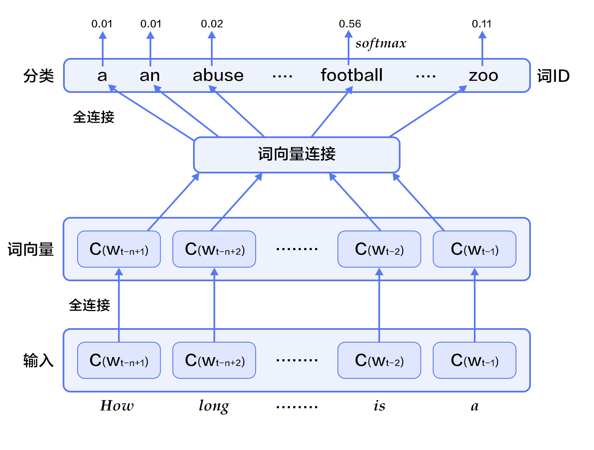

# 词向量

本教程源代码目录在[book/word2vec](https://github.com/PaddlePaddle/book/tree/develop/word2vec)， 初次使用请参考PaddlePaddle[安装教程](http://www.paddlepaddle.org/doc_cn/build_and_install/index.html)。

## 背景介绍

本章我们介绍词的向量表征，也称为word embedding。词向量是自然语言处理中常见的一个操作，是搜索引擎、广告系统、推荐系统等互联网服务背后常见的基础技术。

在这些互联网服务里，我们经常要比较两个词或者两段文本之间的相关性。为了做这样的比较，我们往往先要把词表示成计算机适合处理的方式。最自然的方式恐怕莫过于向量空间模型(vector space model)。 
在这种方式里，每个词被表示成一个实数向量（one-hot vector），其长度为字典大小，每个维度对应一个字典里的每个词，除了这个词对应维度上的值是1，其他元素都是0。

One-hot vector虽然自然，但是用处有限。比如，在互联网广告系统里，如果用户输入的query是“母亲节”，而有一个广告的关键词是“康乃馨”。虽然按照常理，我们知道这两个词之间是有联系的——母亲节通常应该送给母亲一束康乃馨；但是这两个词对应的one-hot vectors之间的距离度量，无论是欧氏距离还是余弦相似度(cosine similarity)，由于其向量正交，都认为这两个词毫无相关性。 得出这种与我们相悖的结论的根本原因是：每个词本身的信息量都太小。所以，仅仅给定两个词，不足以让我们准确判别它们是否相关。要想精确计算相关性，我们还需要更多的信息——从大量数据里通过机器学习方法归纳出来的知识。

在机器学习领域里，各种“知识”被各种模型表示，词向量模型(word embedding model)就是其中的一类。通过词向量模型可将一个 one-hot vector映射到一个维度更低的实数向量（embedding vector），如$embedding(母亲节) = [0.3, 4.2, -1.5, ...], embedding(康乃馨) = [0.2, 5.6, -2.3, ...]$。在这个映射到的实数向量表示中，希望两个语义（或用法）上相似的词对应的词向量“更像”，这样如“母亲节”和“康乃馨”的对应词向量的余弦相似度就不再为零了。

词向量模型可以是概率模型、共生矩阵(co-occurrence matrix)模型或神经元网络模型。在用神经网络求词向量之前，传统做法是统计一个词语的共生矩阵$X$。$X$是一个$|V| \times |V|$ 大小的矩阵，$X_{ij}$表示在所有语料中，词汇表`V`(vocabulary)中第i个词和第j个词同时出现的词数，$|V|$为词汇表的大小。对$X$做矩阵分解（如奇异值分解，Singular Value Decomposition \[[5](#参考文献)\]），得到的$U$即视为所有词的词向量：

$$X = USV^T$$

但这样的传统做法有很多问题：<br/>
1) 由于很多词没有出现，导致矩阵极其稀疏，因此需要对词频做额外处理来达到好的矩阵分解效果；<br/>
2) 矩阵非常大，维度太高(通常达到$10^6*10^6$的数量级)；<br/>
3) 需要手动去掉停用词（如although, a,...），不然这些频繁出现的词也会影响矩阵分解的效果。


基于神经网络的模型不需要计算存储一个在全语料上统计的大表，而是通过学习语义信息得到词向量，因此能很好地解决以上问题。在本章里，我们将展示基于神经网络训练词向量的细节，以及如何用PaddlePaddle训练一个词向量模型。


## 效果展示

本章中，当词向量训练好后，我们可以用数据可视化算法t-SNE\[[4](#参考文献)\]画出词语特征在二维上的投影（如下图所示）。从图中可以看出，语义相关的词语（如a, the, these; big, huge）在投影上距离很近，语意无关的词（如say, business; decision, japan）在投影上的距离很远。

<p align="center">
	<br/>
	图1. 词向量的二维投影
</p>

另一方面，我们知道两个向量的余弦值在$[-1,1]$的区间内：两个完全相同的向量余弦值为1, 两个相互垂直的向量之间余弦值为0，两个方向完全相反的向量余弦值为-1，即相关性和余弦值大小成正比。因此我们还可以计算两个词向量的余弦相似度:
```
similarity: 0.899180685161
please input two words: big huge

please input two words: from company
similarity: -0.0997506977351
```

以上结果可以通过运行`calculate_dis.py`, 加载字典里的单词和对应训练特征结果得到，我们将在[应用模型](#应用模型)中详细描述用法。


## 模型概览

在这里我们介绍三个训练词向量的模型：N-gram模型，CBOW模型和Skip-gram模型，它们的中心思想都是通过上下文得到一个词出现的概率。对于N-gram模型，我们会先介绍语言模型的概念，并在之后的[训练模型](#训练模型)中，带大家用PaddlePaddle实现它。而后两个模型，是近年来最有名的神经元词向量模型，由 Tomas Mikolov 在Google 研发\[[3](#参考文献)\]，虽然它们很浅很简单，但训练效果很好。

### 语言模型

在介绍词向量模型之前，我们先来引入一个概念：语言模型。
语言模型旨在为语句的联合概率函数$P(w_1, ..., w_T)$建模, 其中$w_i$表示句子中的第i个词。语言模型的目标是，希望模型对有意义的句子赋予大概率，对没意义的句子赋予小概率。
这样的模型可以应用于很多领域，如机器翻译、语音识别、信息检索、词性标注、手写识别等，它们都希望能得到一个连续序列的概率。 以信息检索为例，当你在搜索“how long is a football bame”时（bame是一个医学名词），搜索引擎会提示你是否希望搜索"how long is a football game", 这是因为根据语言模型计算出“how long is a football bame”的概率很低，而与bame近似的，可能引起错误的词中，game会使该句生成的概率最大。

对语言模型的目标概率$P(w_1, ..., w_T)$，如果假设文本中每个词都是相互独立的，则整句话的联合概率可以表示为其中所有词语条件概率的乘积，即：

$$P(w_1, ..., w_T) = \prod_{t=1}^TP(w_t)$$

然而我们知道语句中的每个词出现的概率都与其前面的词紧密相关, 所以实际上通常用条件概率表示语言模型：

$$P(w_1, ..., w_T) = \prod_{t=1}^TP(w_t | w_1, ... , w_{t-1})$$


### N-gram neural model 

在计算语言学中，n-gram是一种重要的文本表示方法，表示一个文本中连续的n个项。基于具体的应用场景，每一项可以是一个字母、单词或者音节。 n-gram模型也是统计语言模型中的一种重要方法，用n-gram训练语言模型时，一般用每个n-gram的历史n-1个词语组成的内容来预测第n个词。

Yoshua Bengio等科学家就于2003年在著名论文 Neural Probabilistic Language Models \[[1](#参考文献)\] 中介绍如何学习一个神经元网络表示的词向量模型。文中的神经概率语言模型（Neural Network Language Model，NNLM）通过一个线性映射和一个非线性隐层连接，同时学习了语言模型和词向量，即通过学习大量语料得到词语的向量表达，通过这些向量得到整个句子的概率。用这种方法学习语言模型可以克服维度灾难（curse of dimensionality）,即训练和测试数据不同导致的模型不准。注意：由于“神经概率语言模型”说法较为泛泛，我们在这里不用其NNLM的本名，考虑到其具体做法，本文中称该模型为N-gram neural model。

我们在上文中已经讲到用条件概率建模语言模型，即一句话中第$t$个词的概率和该句话的前$t-1$个词相关。可实际上越远的词语其实对该词的影响越小，那么如果考虑一个n-gram, 每个词都只受其前面`n-1`个词的影响，则有：

$$P(w_1, ..., w_T) = \prod_{t=n}^TP(w_t|w_{t-1}, w_{t-2}, ..., w_{t-n+1})$$

给定一些真实语料，这些语料中都是有意义的句子，N-gram模型的优化目标则是最大化目标函数:

$$\frac{1}{T}\sum_t f(w_t, w_{t-1}, ..., w_{t-n+1};\theta) + R(\theta)$$

其中$f(w_t, w_{t-1}, ..., w_{t-n+1})$表示根据历史n-1个词得到当前词$w_t$的条件概率，$R(\theta)$表示参数正则项。
<p align="center">	
   	<br/>
   	图2. N-gram神经网络模型
</p>

图2展示了N-gram神经网络模型，从下往上看，该模型分为以下几个部分：
 - 对于每个样本，模型输入$w_{t-n+1},...w_{t-1}$, 输出句子第t个词为字典中`|V|`个词的概率。
 
   每个输入词$w_{t-n+1},...w_{t-1}$首先通过映射矩阵映射到词向量$C(w_{t-n+1}),...C(w_{t-1})$。
 
 - 然后所有词语的词向量连接成一个大向量，并经过一个非线性映射得到历史词语的隐层表示：
 
	$$g=Utanh(\theta^Tx + b_1) + Wx + b_2$$
	
    其中，$x$为所有词语的词向量连接成的大向量，表示文本历史特征；$\theta$、$U$、$b_1$、$b_2$和$W$分别为词向量层到隐层连接的参数。$g$表示未经归一化的所有输出单词概率，$g_i$表示未经归一化的字典中第$i$个单词的输出概率。

 - 根据softmax的定义，通过归一化$g_i$, 生成目标词$w_t$的概率为：
 
  $$P(w_t | w_1, ..., w_{t-n+1}) = \frac{e^{g_{w_t}}}{\sum_i^{|V|} e^{g_i}}$$

 - 整个网络的损失值(cost)为多类分类交叉熵，用公式表示为

   $$J(\theta) = -\sum_{i=1}^N\sum_{c=1}^{|V|}y_k^{i}log(softmax(g_k^i))$$ 

   其中$y_k^i$表示第$i$个样本第$k$类的真实标签(0或1)，$softmax(g_k^i)$表示第i个样本第k类softmax输出的概率。
   


### Continuous Bag-of-Words model(CBOW) 

CBOW模型通过一个词的上下文（各N个词）预测当前词。当N=2时，模型如下图所示：
<p align="center">	
	<br/>
	图3. CBOW模型
</p>

具体来说，不考虑上下文的词语输入顺序，CBOW是用上下文词语的词向量的均值来预测当前词。即：

$$context = \frac{x_{t-1} + x_{t-2} + x_{t+1} + x_{t+2}}{4}$$

其中$x_t$为第$t$个词的词向量，分类分数（score）向量 $z=U*context$，最终的分类$y$采用softmax，损失函数采用多类分类交叉熵。

### Skip-gram model 

CBOW的好处是对上下文词语的分布在词向量上进行了平滑，去掉了噪声，因此在小数据集上很有效。而Skip-gram的方法中，用一个词预测其上下文，得到了当前词上下文的很多样本，因此可用于更大的数据集。
<p align="center">	
	<br/>
	图4. Skip-gram模型
</p>
如上图所示，Skip-gram模型的具体做法是，将一个词的词向量映射到$2n$个词的词向量（$2n$表示当前输入词的前后各$n$个词），然后分别通过softmax得到这$2n$个词的分类损失值之和。


## 数据准备
	
### 数据介绍与下载

本教程使用Penn Tree Bank (PTB)数据集。PTB数据集较小，训练速度快，应用于Mikolov的公开语言模型训练工具\[[2](#参考文献)\]中。其统计情况如下：

<p align="center">
<table>
	<tr>
		<td>训练数据</td>
		<td>验证数据</td>
		<td>测试数据</td>
	</tr>
	<tr>
		<td>ptb.train.txt</td>
		<td>ptb.valid.txt</td>
		<td>ptb.test.txt</td>
	</tr>
	<tr>
		<td>42068句</td>
		<td>3370句</td>
		<td>3761句</td>
	</tr>
</table>
</p>

执行以下命令，可下载该数据集，并分别将训练数据和验证数据输入`train.list`和`test.list`文件中，供PaddlePaddle训练时使用。

```bash
./data/getdata.sh
```

	
### 提供数据给PaddlePaddle

1. 使用initializer函数进行dataprovider的初始化，包括字典的建立（build_dict函数中）和PaddlePaddle输入字段的格式定义。注意：这里N为n-gram模型中的`n`, 本章代码中，定义$N=5$, 表示在PaddlePaddle训练时，每条数据的前4个词用来预测第5个词。大家也可以根据自己的数据和需求自行调整N，但调整的同时要在模型配置文件中加入/减少相应输入字段。

    ```python
    from paddle.trainer.PyDataProvider2 import *
    import collections
    import logging
    import pdb
    
    logging.basicConfig(
        format='[%(levelname)s %(asctime)s %(filename)s:%(lineno)s] %(message)s', )
    logger = logging.getLogger('paddle')
    logger.setLevel(logging.INFO)
    
    N = 5  # Ngram
    cutoff = 50  # select words with frequency > cutoff to dictionary
    def build_dict(ftrain, fdict):
    	sentences = []
        with open(ftrain) as fin:
            for line in fin:
                line = ['<s>'] + line.strip().split() + ['<e>']
                sentences += line
        wordfreq = collections.Counter(sentences)
        wordfreq = filter(lambda x: x[1] > cutoff, wordfreq.items())
        dictionary = sorted(wordfreq, key = lambda x: (-x[1], x[0]))
        words, _ = list(zip(*dictionary))
        for word in words:
            print >> fdict, word
        word_idx = dict(zip(words, xrange(len(words))))
        logger.info("Dictionary size=%s" %len(words))
        return word_idx
    
    def initializer(settings, srcText, dictfile, **xargs):
        with open(dictfile, 'w') as fdict:
            settings.dicts = build_dict(srcText, fdict)
        input_types = []
        for i in xrange(N):
            input_types.append(integer_value(len(settings.dicts)))
        settings.input_types = input_types
    ```

2. 使用process函数中将数据逐一提供给PaddlePaddle。具体来说，将每句话前面补上N-1个开始符号 `<s>`, 末尾补上一个结束符号 `<e>`，然后以N为窗口大小，从头到尾每次向右滑动窗口并生成一条数据。

    ```python
    @provider(init_hook=initializer)
    def process(settings, filename):
        UNKID = settings.dicts['<unk>']
        with open(filename) as fin:
            for line in fin:
                line = ['<s>']*(N-1)  + line.strip().split() + ['<e>']
                line = [settings.dicts.get(w, UNKID) for w in line]
                for i in range(N, len(line) + 1):
                    yield line[i-N: i]
    ```
    
    如"I have a dream" 一句提供了5条数据:
    
    > `<s> <s> <s> <s> I `<br/>
    > `<s> <s> <s> I have`<br/>
    > `<s> <s> I have a `<br/>
    > `<s> I have a dream`<br/>
    > `I have a dream <e>`<br/>


## 模型配置说明

### 数据定义

通过`define_py_data_sources2`函数从dataprovider中读入数据，其中args指定了训练文本(srcText)和词汇表(dictfile)。

```python
from paddle.trainer_config_helpers import *
import math

args = {'srcText': 'data/simple-examples/data/ptb.train.txt',
        'dictfile': 'data/vocabulary.txt'}
		
define_py_data_sources2(
    train_list="data/train.list",
    test_list="data/test.list",
    module="dataprovider",
    obj="process",
    args=args)
```

### 算法配置

在这里，我们指定了模型的训练参数, L2正则项系数、学习率和batch size。

```python
settings(
    batch_size=100, regularization=L2Regularization(8e-4), learning_rate=3e-3)
```

### 模型结构

本配置的模型结构如下图所示：

<p align="center">	
	<br/>
	图5. 模型配置中的N-gram神经网络模型
</p>

1. 定义参数维度和和数据输入。

    ```python
    dictsize = 1953 # 字典大小
    embsize = 32 # 词向量维度
    hiddensize = 256 # 隐层维度
    
    firstword = data_layer(name = "firstw", size = dictsize)
    secondword = data_layer(name = "secondw", size = dictsize)
    thirdword = data_layer(name = "thirdw", size = dictsize)
    fourthword = data_layer(name = "fourthw", size = dictsize)
    nextword = data_layer(name = "fifthw", size = dictsize)
    ```

2. 将$w_t$之前的$n-1$个词 $w_{t-n+1},...w_{t-1}$，通过$|V|\times D$的矩阵映射到D维词向量（本例中取D=32）。
	
	```python	
	def wordemb(inlayer):
		wordemb = table_projection(
        input = inlayer,
        size = embsize,
        param_attr=ParamAttr(name = "_proj",
            initial_std=0.001, # 参数初始化标准差
            l2_rate= 0,))      # 词向量不需要稀疏化，因此其l2_rate设为0
    return wordemb

	Efirst = wordemb(firstword)
	Esecond = wordemb(secondword)
	Ethird = wordemb(thirdword)
	Efourth = wordemb(fourthword)
	```

3. 接着，将这n-1个词向量经过concat_layer连接成一个大向量作为历史文本特征。

	```python
	contextemb = concat_layer(input = [Efirst, Esecond, Ethird, Efourth])
	```
4. 然后，将历史文本特征经过一个全连接得到文本隐层特征。

    ```python
	hidden1 = fc_layer(
	        input = contextemb,
	        size = hiddensize,
	        act = SigmoidActivation(),
	        layer_attr = ExtraAttr(drop_rate=0.5),
	        bias_attr = ParamAttr(learning_rate = 2),
	        param_attr = ParamAttr(
	            initial_std = 1./math.sqrt(embsize*8),
	            learning_rate = 1))
    ```
	
5. 最后，将文本隐层特征，再经过一个全连接，映射成一个$|V|$维向量，同时通过softmax归一化得到这`|V|`个词的生成概率。

    ```python
	# use context embedding to predict nextword
	predictword = fc_layer(
	        input = hidden1,
	        size = dictsize,
	        bias_attr = ParamAttr(learning_rate = 2),
	        act = SoftmaxActivation())
	```

6. 网络的损失函数为多分类交叉熵，可直接调用`classification_cost`函数。

	```python
	cost = classification_cost(
	        input = predictword,
	        label = nextword)
	# network input and output
	outputs(cost)
	```
	
##训练模型

模型训练命令为`./train.sh`。脚本内容如下，其中指定了总共需要执行30个pass。

```bash
paddle train \
       --config ngram.py \
       --use_gpu=1 \
       --dot_period=100 \
       --log_period=3000 \
       --test_period=0 \
       --save_dir=model \
       --num_passes=30
```

一个pass的训练日志如下所示：

```text
.............................
I1222 09:27:16.477841 12590 TrainerInternal.cpp:162]  Batch=3000 samples=300000 AvgCost=5.36135 CurrentCost=5.36135 Eval: classification_error_evaluator=0.818653  CurrentEval: class
ification_error_evaluator=0.818653 
.............................
I1222 09:27:22.416700 12590 TrainerInternal.cpp:162]  Batch=6000 samples=600000 AvgCost=5.29301 CurrentCost=5.22467 Eval: classification_error_evaluator=0.814542  CurrentEval: class
ification_error_evaluator=0.81043 
.............................
I1222 09:27:28.343756 12590 TrainerInternal.cpp:162]  Batch=9000 samples=900000 AvgCost=5.22494 CurrentCost=5.08876 Eval: classification_error_evaluator=0.810088  CurrentEval: class
ification_error_evaluator=0.80118 
..I1222 09:27:29.128582 12590 TrainerInternal.cpp:179]  Pass=0 Batch=9296 samples=929600 AvgCost=5.21786 Eval: classification_error_evaluator=0.809647 
I1222 09:27:29.627616 12590 Tester.cpp:111]  Test samples=73760 cost=4.9594 Eval: classification_error_evaluator=0.79676 
I1222 09:27:29.627713 12590 GradientMachine.cpp:112] Saving parameters to model/pass-00000
```
经过30个pass，我们将得到平均错误率为classification_error_evaluator=0.735611。


## 应用模型
训练模型后，我们可以加载模型参数，用训练出来的词向量初始化其他模型，也可以将模型参数从二进制格式转换成文本格式进行后续应用。

### 初始化其他模型

训练好的模型参数可以用来初始化其他模型。具体方法如下：
在PaddlePaddle 训练命令行中，用`--init_model_path` 来定义初始化模型的位置，用`--load_missing_parameter_strategy`指定除了词向量以外的新模型其他参数的初始化策略。注意，新模型需要和原模型共享被初始化参数的参数名。
	
### 查看词向量
PaddlePaddle训练出来的参数为二进制格式，存储在对应训练pass的文件夹下。这里我们提供了文件`format_convert.py`用来互转PaddlePaddle训练结果的二进制文件和文本格式特征文件。

```bash
python format_convert.py --b2t -i INPUT -o OUTPUT -d DIM
```
其中，INPUT是输入的（二进制）词向量模型名称，OUTPUT是输出的文本模型名称，DIM是词向量参数维度。

用法如：

```bash
python format_convert.py --b2t -i model/pass-00029/_proj -o model/pass-00029/_proj.txt -d 32
```
转换后得到的文本文件如下：

```text
0,4,62496
-0.7444070,-0.1846171,-1.5771370,0.7070392,2.1963732,-0.0091410, ......
-0.0721337,-0.2429973,-0.0606297,0.1882059,-0.2072131,-0.7661019, ......
......
```

其中，第一行是PaddlePaddle 输出文件的格式说明，包含3个属性：<br/>
1) PaddlePaddle的版本号，本例中为0;<br/>
2) 浮点数占用的字节数，本例中为4;<br/>
3) 总计的参数个数, 本例中为62496（即1953*32）;<br/>
第二行及之后的每一行都按顺序表示字典里一个词的特征，用逗号分隔。
	
### 修改词向量

我们可以对词向量进行修改，并转换成PaddlePaddle参数二进制格式，方法：	

```bash
python format_convert.py --t2b -i INPUT -o OUTPUT
```

其中，INPUT是输入的输入的文本词向量模型名称，OUTPUT是输出的二进制词向量模型名称

输入的文本格式如下（注意，不包含上面二进制转文本后第一行的格式说明）：

```text
-0.7444070,-0.1846171,-1.5771370,0.7070392,2.1963732,-0.0091410, ......
-0.0721337,-0.2429973,-0.0606297,0.1882059,-0.2072131,-0.7661019, ......
......
```
	
	

### 计算词语之间的余弦距离

两个向量之间的距离可以用余弦值来表示，余弦值在$[-1,1]$的区间内，向量间余弦值越大，其距离越近。这里我们在`calculate_dis.py`中实现不同词语的距离度量。
用法如下：

```bash
python calculate_dis.py VOCABULARY EMBEDDINGLAYER` 
```

其中，`VOCABULARY`是字典，`EMBEDDINGLAYER`是词向量模型，示例如下：

```bash
python calculate_dis.py data/vocabulary.txt model/pass-00029/_proj.txt
```
 
 
## 总结
本章中，我们介绍了词向量、语言模型和词向量的关系、以及如何通过训练神经网络模型获得词向量。在信息检索中，我们可以根据向量间的余弦夹角，来判断query和文档关键词这二者间的相关性。在句法分析和语义分析中，训练好的词向量可以用来初始化模型，以得到更好的效果。在文档分类中，有了词向量之后，可以用聚类的方法将文档中同义词进行分组。希望大家在本章后能够自行运用词向量进行相关领域的研究。


## 参考文献
1. Bengio Y, Ducharme R, Vincent P, et al. [A neural probabilistic language model](http://www.jmlr.org/papers/volume3/bengio03a/bengio03a.pdf)[J]. journal of machine learning research, 2003, 3(Feb): 1137-1155.
2. Mikolov T, Kombrink S, Deoras A, et al. [Rnnlm-recurrent neural network language modeling toolkit](http://www.fit.vutbr.cz/~imikolov/rnnlm/rnnlm-demo.pdf)[C]//Proc. of the 2011 ASRU Workshop. 2011: 196-201.
3. Mikolov T, Chen K, Corrado G, et al. [Efficient estimation of word representations in vector space](https://arxiv.org/pdf/1301.3781.pdf)[J]. arXiv preprint arXiv:1301.3781, 2013.
4. Maaten L, Hinton G. [Visualizing data using t-SNE](https://lvdmaaten.github.io/publications/papers/JMLR_2008.pdf)[J]. Journal of Machine Learning Research, 2008, 9(Nov): 2579-2605.
5. https://en.wikipedia.org/wiki/Singular_value_decomposition

<br/>
<a rel="license" href="http://creativecommons.org/licenses/by-nc-sa/4.0/"></a><br /><span xmlns:dct="http://purl.org/dc/terms/" href="http://purl.org/dc/dcmitype/Text" property="dct:title" rel="dct:type">本教程</span> 由 <a xmlns:cc="http://creativecommons.org/ns#" href="http://book.paddlepaddle.org" property="cc:attributionName" rel="cc:attributionURL">PaddlePaddle</a> 创作，采用 <a rel="license" href="http://creativecommons.org/licenses/by-nc-sa/4.0/">知识共享 署名-非商业性使用-相同方式共享 4.0 国际 许可协议</a>进行许可。
